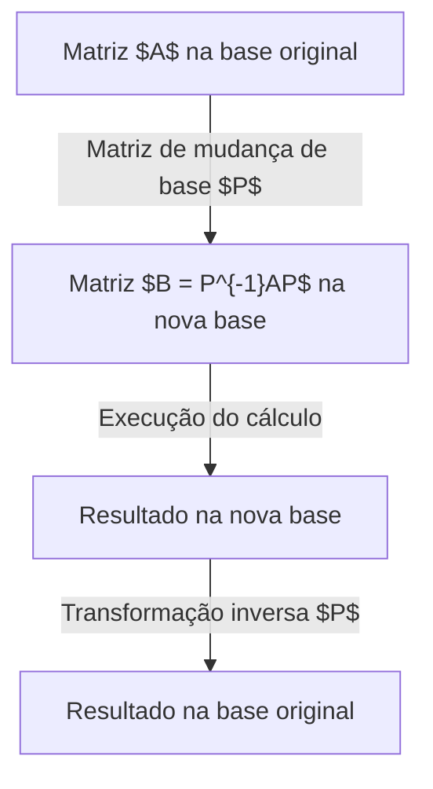

## Introdução

Ao estudar álgebra linear, um dos grandes obstáculos é a **diagonalização** e a **forma canônica de Jordan**. Matrizes são ferramentas poderosas para descrever transformações espaciais, mas entender suas propriedades pode ser difícil. Este artigo explica como simplificar matrizes complexas e o que fazer quando não podem ser diagonalizadas.

## O que é uma Matriz: Uma Perspectiva de Transformação

Uma matriz $A$ representa uma transformação linear, dependendo da "base" escolhida. Ao escolher uma nova base apropriada, a transformação torna-se muito mais simples.



## Conceitos Básicos de Diagonalização

### Entendimento Intuitivo

Uma matriz $A$ é diagonalizável se, em uma nova base, a transformação for apenas "alongamento e compressão" ao longo dos eixos, sem cisalhamento.

### Definição Matemática

Uma matriz $A$ é diagonalizável se existir $P$ invertível tal que:

$$
P^{-1} A P = D
$$

Onde os elementos de $D$ são os **autovalores** $\lambda_i$, e as colunas de $P$ são os **autovetores** $\mathbf{v}_i$.

## Exemplo de Cálculo

### Exemplo de Matriz 3x3

$$
A = \begin{pmatrix}
4 & -1 & 6 \\
2 & 1 & 6 \\
2 & -1 & 8
\end{pmatrix}
$$

**Passo 1: Autovalores**
$\det(A - \lambda I) = 0$ fornece $\lambda = 2$ e $\lambda = 9$.

**Passo 2: Autovetores**
Para $\lambda = 2$:
$$
\mathbf{v}_1 = \begin{pmatrix} 1 \\ 2 \\ 0 \end{pmatrix}, \quad \mathbf{v}_2 = \begin{pmatrix} -3 \\ 0 \\ 1 \end{pmatrix}
$$
Para $\lambda = 9$:
$$
\mathbf{v}_3 = \begin{pmatrix} 1 \\ 1 \\ 1 \end{pmatrix}
$$

**Passo 3: Diagonalização**
$$
P^{-1} A P = \begin{pmatrix}
2 & 0 & 0 \\
0 & 2 & 0 \\
0 & 0 & 9
\end{pmatrix}
$$

## Por que existem matrizes não diagonalizáveis?

A relação matemática entre multiplicidades é:
$$
1 \leq \text{Multiplicidade geométrica} \leq \text{Multiplicidade algébrica}
$$
Se a multiplicidade geométrica for menor, a matriz não possui autovetores suficientes. É chamada de **matriz defectiva**.

## A Forma Canônica de Jordan

Para matrizes defectivas, usamos a **Forma Canônica de Jordan**.

### Blocos de Jordan
$$
J_k(\lambda) = \begin{pmatrix}
\lambda & 1 & 0 & \cdots & 0 \\
0 & \lambda & 1 & \cdots & 0 \\
\vdots & \vdots & \ddots & \ddots & 1 \\
0 & 0 & \cdots & 0 & \lambda
\end{pmatrix}
$$

### Autovetores Generalizados
Um vetor $\mathbf{v}$ que satisfaz:
$$
(A - \lambda I)^k \mathbf{v} = \mathbf{0} \quad \text{e} \quad (A - \lambda I)^{k-1} \mathbf{v} \neq \mathbf{0}
$$
forma uma cadeia de Jordan.

## Aplicações: Equações Diferenciais

A solução de $\frac{d\mathbf{x}}{dt} = A \mathbf{x}$ é $\mathbf{x}(t) = e^{At} \mathbf{x}(0)$.
$$
e^{At} = P e^{Dt} P^{-1}
$$
Para blocos de Jordan, temos termos como $t e^{\lambda t}$, que explicam fenômenos de ressonância na física.

## Teorema de Cayley-Hamilton e Polinômio Mínimo

Toda matriz zera seu polinômio característico ($p(A)=0$).
O **polinômio mínimo** $m(\lambda)$ tem raízes que determinam a diagonalização (se não houver raízes múltiplas, é diagonalizável).

## Diferença da Decomposição em Valores Singulares (SVD)

A SVD ($A = U \Sigma V^*$) aplica-se a matrizes $m \times n$. Diagonalização só a quadradas para iterações.


## Mecânica Quântica e Controle

Na quântica, diagonalizar o Hamiltoniano encontra os estados de energia. No controle, separa os modos para analisar **Controlabilidade** e **Observabilidade**.

## Programação

Em Python:
```python
import numpy as np
from scipy.linalg import schur, eigvals

A = np.array([[5, 4, 2, 1],
              [0, 1, -1, -1],
              [-1, -1, 3, 0],
              [1, 1, -1, 2]])

# Autovalores
eigenvalues = eigvals(A)
print("Autovalores:", eigenvalues)

# Decomposição de Schur
T, Z = schur(A, output='complex')
print("Matriz T:")
print(np.round(T, 4))
```

## Conclusão

Entender esses métodos permite analisar o comportamento assintótico de sistemas dinâmicos e cadeias de Markov no mundo real.
