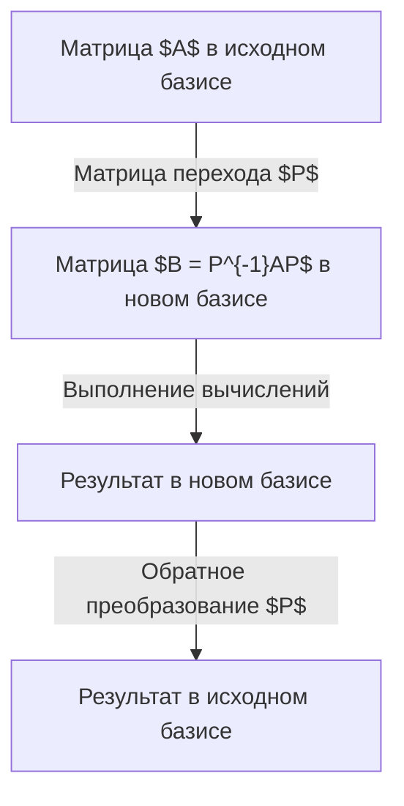

## Введение

При изучении линейной алгебры одним из главных препятствий для многих становится **диагонализация** и **жорданова нормальная форма**. Матрицы — это мощный инструмент для описания пространственных деформаций (линейных преобразований), но зачастую трудно определить их свойства напрямую из их исходного вида. В этой статье подробно объясняется диагонализация как мощный метод максимального упрощения матриц, а также жорданова нормальная форма для матриц, которые невозможно диагонализовать.

## Что такое матрица: взгляд с точки зрения преобразования

Матрица $n \times n$ представляет собой линейное преобразование. Однако это представление зависит от выбранного «базиса». Выбрав новый базис, матричное представление того же самого преобразования может стать значительно проще.



## Основные понятия диагонализации

### Интуитивное понимание

Диагонализуемость матрицы $A$ означает, что при подходящем базисе преобразование сводится к «простому растяжению и сжатию вдоль каждой из осей координат».

### Математическое определение

Матрица $A$ размера $n \times n$ диагонализуема, если существует обратимая матрица $P$, такая что:

$$
P^{-1} A P = D
$$

где $D$ — диагональная матрица. Диагональные элементы $D$ — это **собственные значения** $\lambda_i$, а столбцы $P$ — это **собственные векторы** $\mathbf{v}_i$.

## Пример вычисления диагонализации

### Пример матрицы 3x3

Дана матрица $A$:
$$
A = \begin{pmatrix}
4 & -1 & 6 \\
2 & 1 & 6 \\
2 & -1 & 8
\end{pmatrix}
$$

**Шаг 1: Вычисление собственных значений**
Из уравнения $\det(A - \lambda I) = 0$ получаем $\lambda = 2$ и $\lambda = 9$.

**Шаг 2: Вычисление собственных векторов**
Для $\lambda = 2$:
$$
\mathbf{v}_1 = \begin{pmatrix} 1 \\ 2 \\ 0 \end{pmatrix}, \quad \mathbf{v}_2 = \begin{pmatrix} -3 \\ 0 \\ 1 \end{pmatrix}
$$
Для $\lambda = 9$:
$$
\mathbf{v}_3 = \begin{pmatrix} 1 \\ 1 \\ 1 \end{pmatrix}
$$

**Шаг 3: Диагонализация**
Если $P = (\mathbf{v}_1 \ \mathbf{v}_2 \ \mathbf{v}_3)$, то:
$$
P^{-1} A P = \begin{pmatrix}
2 & 0 & 0 \\
0 & 2 & 0 \\
0 & 0 & 9
\end{pmatrix}
$$

## Почему существуют недиагонализуемые матрицы?

Необходимым условием является наличие $n$ линейно независимых собственных векторов.
$$
1 \leq \text{Геометрическая кратность} \leq \text{Алгебраическая кратность}
$$
Если геометрическая кратность строго меньше алгебраической, матрица называется **дефектной** и не может быть диагонализована.

## Теория жордановой нормальной формы

**Жорданова нормальная форма** спасает ситуацию для недиагонализуемых матриц.

### Жордановы клетки
Матрица состоит из блоков:
$$
J_k(\lambda) = \begin{pmatrix}
\lambda & 1 & 0 & \cdots & 0 \\
0 & \lambda & 1 & \cdots & 0 \\
\vdots & \vdots & \ddots & \ddots & 1 \\
0 & 0 & \cdots & 0 & \lambda
\end{pmatrix}
$$

### Присоединённые векторы (Обобщенные собственные векторы)
Вектор $\mathbf{v}$ называется обобщенным собственным вектором, если:
$$
(A - \lambda I)^k \mathbf{v} = \mathbf{0} \quad \text{и} \quad (A - \lambda I)^{k-1} \mathbf{v} \neq \mathbf{0}
$$

## Применение: Дифференциальные уравнения

Решением $\frac{d\mathbf{x}}{dt} = A \mathbf{x}$ является $\mathbf{x}(t) = e^{At} \mathbf{x}(0)$.
При помощи диагонализации:
$$
e^{At} = P e^{Dt} P^{-1}
$$
Для жордановой клетки:
$$
e^{J_k(\lambda)t} = e^{\lambda t} \begin{pmatrix}
1 & t & \cdots & \frac{t^{k-1}}{(k-1)!} \\
0 & 1 & \cdots & \frac{t^{k-2}}{(k-2)!} \\
\vdots & \vdots & \ddots & \vdots \\
0 & 0 & \cdots & 1
\end{pmatrix}
$$
Это объясняет появление секулярных членов $te^{\lambda t}$ при резонансе.

## Теорема Кэли-Гамильтона и минимальный многочлен

Любая матрица удовлетворяет своему характеристическому уравнению $p(A) = 0$.
**Минимальный многочлен** $m(\lambda)$ — многочлен наименьшей степени, аннулирующий матрицу. Матрица диагонализуема тогда и только тогда, когда $m(\lambda)$ не имеет кратных корней.

## Отличие от сингулярного разложения (SVD)

SVD $A = U \Sigma V^*$ применимо к любым матрицам $m \times n$. Диагонализация применяется только к квадратным и нужна для возведения в степень.


## Квантовая механика и теория управления

В квантовой механике диагонализация гамильтониана дает собственные состояния энергии. В теории управления она позволяет разделить систему на моды для оценки **управляемости** и **наблюдаемости**.

## Численные методы в программировании

Пример на Python:
```python
import numpy as np
from scipy.linalg import schur, eigvals

A = np.array([[5, 4, 2, 1],
              [0, 1, -1, -1],
              [-1, -1, 3, 0],
              [1, 1, -1, 2]])

# Собственные значения
eigenvalues = eigvals(A)
print("Собственные значения:", eigenvalues)

# Разложение Шура
T, Z = schur(A, output='complex')
print("Верхнетреугольная матрица T:")
print(np.round(T, 4))
```

## Заключение

Диагонализация и жорданова нормальная форма — это ключ к пониманию сложных систем в математике, физике и инженерии.
