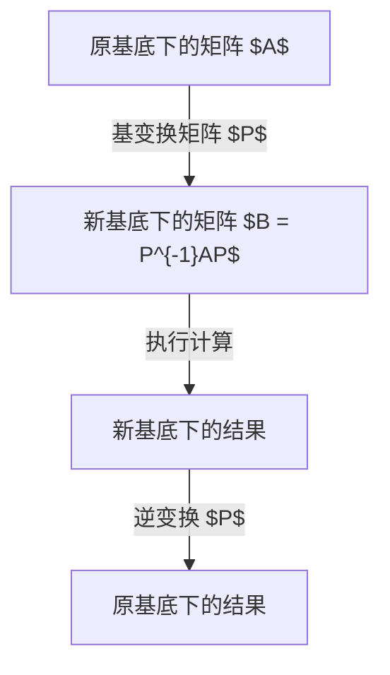
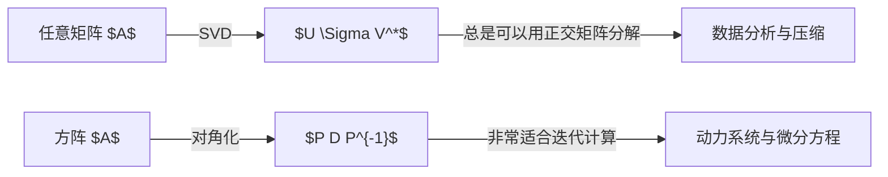

## 引言

在学习线性代数的过程中，许多人面临的一大障碍就是 **对角化** 和 **若尔当标准型**。矩阵是描述空间变形（线性变换）的强大工具，但如果不加处理，通常很难直接看出其性质。本文将极其详细地介绍对角化这一将复杂矩阵极致简化的强大方法，以及用来拯救无法对角化的矩阵的若尔当标准型，内容涵盖其背后的直观含义、严格的数学定义，直到在物理学和工程学中的应用。

本文面向了解向量空间和基变换等线性代数基础概念的读者，但也包含丰富的具体计算示例，初学者也能一步步理解。让我们一起踏入矩阵深邃的世界吧。

## 什么是矩阵：作为变换的视角

直观理解对角化的第一步，是不要将矩阵仅仅看作“数字的排列”，而是将其理解为“如何扭曲空间”的几何变换规则。

$n$ 阶方阵 $A$ 表示 $n$ 维向量空间中的线性变换。然而，这种变换只是依赖于我们当前采用的“基”（坐标轴的集合）的一种表示。通过重新选择合适的基，即使是完全相同的变换，其矩阵表示也可能变得极其简单。这就是“相似变换”的基本动机。



## 对角化的基本概念

### 直观理解

矩阵 $A$ 可对角化意味着，从合适的视角（新基）来看，该矩阵表示的变换不过是“沿着各个坐标轴单纯地拉伸和收缩”。倾斜方向上复杂的偏移（错切）消失了，处于一种纯粹只用缩放就能描述空间变形的状态。

### 数学定义与定理

$n \times n$ 矩阵 $A$ 可对角化，是指存在一个可逆矩阵 $P$，使得可以构造出一个对角矩阵 $D$，满足：

$$
P^{-1} A P = D
$$

在这里，$D$ 的对角元素是 $A$ 的 **特征值** $\lambda_i$，而 $P$ 的各个列向量是对应的 **特征向量** $\mathbf{v}_i$。

**可对角化的充要条件：**
$n$ 阶方阵 $A$ 可对角化的充要条件是，$A$ 拥有 $n$ 个线性无关的特征向量。

## 对角化的具体计算示例

### 3阶方阵示例

让我们来对角化以下矩阵 $A$：

$$
A = \begin{pmatrix}
4 & -1 & 6 \\
2 & 1 & 6 \\
2 & -1 & 8
\end{pmatrix}
$$

**步骤1：计算特征值**
解特征方程 $\det(A - \lambda I) = 0$。

$$
\det \begin{pmatrix}
4-\lambda & -1 & 6 \\
2 & 1-\lambda & 6 \\
2 & -1 & 8-\lambda
\end{pmatrix} = -(\lambda-2)^2 (\lambda-9) = 0
$$

因此，特征值为 $\lambda = 2$ (代数重数为2) 和 $\lambda = 9$。

**步骤2：计算特征向量**
当 $\lambda = 2$ 时，解 $(A - 2I)\mathbf{x} = \mathbf{0}$，得到2个线性无关的特征向量：

$$
\mathbf{v}_1 = \begin{pmatrix} 1 \\ 2 \\ 0 \end{pmatrix}, \quad \mathbf{v}_2 = \begin{pmatrix} -3 \\ 0 \\ 1 \end{pmatrix}
$$

当 $\lambda = 9$ 时，解 $(A - 9I)\mathbf{x} = \mathbf{0}$，得到：

$$
\mathbf{v}_3 = \begin{pmatrix} 1 \\ 1 \\ 1 \end{pmatrix}
$$

**步骤3：执行对角化**
令矩阵 $P$ 为 $P = (\mathbf{v}_1 \ \mathbf{v}_2 \ \mathbf{v}_3)$，则有：

$$
P^{-1} A P = \begin{pmatrix}
2 & 0 & 0 \\
0 & 2 & 0 \\
0 & 0 & 9
\end{pmatrix}
$$

至此对角化完成。

## 为什么存在无法对角化的矩阵？

并非所有的矩阵都能被对角化。对角化的条件是“拥有 $n$ 个线性无关的特征向量”。

作为特征方程之解的特征值，具有 **代数重数** （作为方程解的重根数量）和 **几何重数** （对应特征空间的维数，即线性无关特征向量的数量）。在数学上，以下关系总是成立：

$$
1 \leq \text{几何重数} \leq \text{代数重数}
$$

如果几何重数严格小于代数重数，该矩阵就不会有足够数量的特征向量，从而无法被对角化。这样的矩阵被称为 **亏损矩阵**。

### 无法对角化的具体示例

$$
B = \begin{pmatrix}
1 & 1 \\
0 & 1
\end{pmatrix}
$$

这个矩阵的特征值是 $\lambda = 1$ (代数重数为2)，但在求特征空间时：

$$
(B - I)\mathbf{x} = \begin{pmatrix} 0 & 1 \\ 0 & 0 \end{pmatrix} \begin{pmatrix} x_1 \\ x_2 \end{pmatrix} = \begin{pmatrix} 0 \\ 0 \end{pmatrix}
$$

由此得到 $x_2 = 0$，特征向量仅仅是 $\mathbf{v} = \begin{pmatrix} 1 \\ 0 \end{pmatrix}$ 的常数倍。也就是说，几何重数为1，无法对角化。

## 若尔当标准型的理论

对于无法对角化的矩阵，为了回应尽量将其变形为简单形式的需求，**若尔当标准型 (Jordan Normal Form)** 应运而生。

### 若尔当块的定义

若尔当标准型是由在对角线上排列的、被称为 **若尔当块** 的矩阵块所组成，其对角线上是特征值，而正上方的一个元素是 $1$。

$$
J_k(\lambda) = \begin{pmatrix}
\lambda & 1 & 0 & \cdots & 0 \\
0 & \lambda & 1 & \cdots & 0 \\
0 & 0 & \lambda & \ddots & \vdots \\
\vdots & \vdots & \ddots & \ddots & 1 \\
0 & 0 & \cdots & 0 & \lambda
\end{pmatrix}
$$

### 广义特征向量与链

为了构造若尔当标准型，仅仅依靠普通的特征向量是不够的，因此引入了 **广义特征向量**。

满足：

$$
(A - \lambda I)^k \mathbf{v} = \mathbf{0} \quad \text{以及} \quad (A - \lambda I)^{k-1} \mathbf{v} \neq \mathbf{0}
$$

的向量 $\mathbf{v}$ 被称为秩为 $k$ 的广义特征向量。它们形成了一种链状结构（若尔当链）：

$$
(A - \lambda I)\mathbf{v}_k = \mathbf{v}_{k-1}, \quad (A - \lambda I)\mathbf{v}_{k-1} = \mathbf{v}_{k-2}, \quad \dots, \quad (A - \lambda I)\mathbf{v}_2 = \mathbf{v}_1
$$

这里 $\mathbf{v}_1$ 是普通的特征向量。

## 若尔当标准型的推导示例

考虑刚才那个无法对角化的矩阵 $B$。

$$
B = \begin{pmatrix} 1 & 1 \\ 0 & 1 \end{pmatrix}
$$

特征向量为 $\mathbf{v}_1 = \begin{pmatrix} 1 \\ 0 \end{pmatrix}$。为了求得广义特征向量 $\mathbf{v}_2$，解方程 $(B - I)\mathbf{v}_2 = \mathbf{v}_1$。

$$
\begin{pmatrix} 0 & 1 \\ 0 & 0 \end{pmatrix} \begin{pmatrix} x \\ y \end{pmatrix} = \begin{pmatrix} 1 \\ 0 \end{pmatrix}
$$

由此得到 $y = 1$，$x$ 可以是任意值。如果选择 $x = 0$，则 $\mathbf{v}_2 = \begin{pmatrix} 0 \\ 1 \end{pmatrix}$。
若令矩阵 $P = (\mathbf{v}_1 \ \mathbf{v}_2) = \begin{pmatrix} 1 & 0 \\ 0 & 1 \end{pmatrix} = I$，则 $P^{-1}BP = B$，这表明矩阵 $B$ 已经是由一个若尔当块组成的若尔当标准型。

## 应用：联立线性微分方程与矩阵指数函数

若尔当标准型不仅停留在纯粹的数学理论中，还是物理学和工程学中极其实用的工具。尤其是在求解联立线性微分方程时展现出巨大威力。

### 矩阵指数函数 $e^{At}$ 的定义

系统 $\frac{d\mathbf{x}}{dt} = A \mathbf{x}$ 的解由 $\mathbf{x}(t) = e^{At} \mathbf{x}(0)$ 给出。矩阵指数函数通过以下泰勒展开定义：

$$
e^{At} = I + At + \frac{1}{2!}(At)^2 + \frac{1}{3!}(At)^3 + \cdots
$$

### 使用若尔当标准型计算 $e^{At}$

直接对 $A$ 求幂非常困难，但如果可以对角化，使得 $A = PDP^{-1}$，那么 $A^k = P D^k P^{-1}$，可以很容易地计算出：

$$
e^{At} = P e^{Dt} P^{-1}
$$

即使不能对角化，利用若尔当标准型 $A = PJP^{-1}$，也可以将问题转化为计算若尔当块的指数函数。若尔当块 $J_k(\lambda)$ 的指数函数如下：

$$
e^{J_k(\lambda)t} = e^{\lambda t} \begin{pmatrix}
1 & t & \frac{t^2}{2!} & \cdots & \frac{t^{k-1}}{(k-1)!} \\
0 & 1 & t & \cdots & \frac{t^{k-2}}{(k-2)!} \\
\vdots & \vdots & \ddots & \ddots & \vdots \\
0 & 0 & \cdots & 1 & t \\
0 & 0 & \cdots & 0 & 1
\end{pmatrix}
$$

这个结果清晰地展示了 $te^{\lambda t}$ 和 $t^2e^{\lambda t}$ 这样的项（长期项）在微分方程解中出现的机制。这为控制系统中的共振现象和临界阻尼等物理现象提供了数学依据。

## 凯莱-哈密顿定理与最小多项式

为了更深入地理解若尔当标准型，不可避免地要探讨矩阵的多项式。所有的 $n$ 阶方阵 $A$ 都会满足其自身的特征多项式 $p(\lambda) = \det(\lambda I - A)$。也就是说，$p(A) = 0$ （零矩阵）。这被称为 **凯莱-哈密顿定理 (Cayley-Hamilton Theorem)**。

然而，能让矩阵 $A$ 变成零矩阵的多项式不仅有特征多项式。在能让 $A$ 变为零矩阵的首一多项式（最高次项系数为1的多项式）中，次数最小的被称为 **最小多项式 (Minimal Polynomial)**。设最小多项式为 $m(\lambda)$，若尔当标准型和最小多项式之间有着密切的关系。

如果最小多项式 $m(\lambda)$ 可以分解为一次式的乘积，并且没有重根，也就是说可以表示为：
$$
m(\lambda) = (\lambda - \lambda_1)(\lambda - \lambda_2)\cdots(\lambda - \lambda_k)
$$
那么该矩阵 $A$ 即可对角化。反之，如果具有重根则无法对角化，重根的最高次数与最大的若尔当块的大小一致。这样，最小多项式就成了判断矩阵是否可对角化的有力工具。

## 对角化与奇异值分解 (SVD) 的区别

与对角化非常相似的一种矩阵分解方法是 **奇异值分解 (Singular Value Decomposition: SVD)**。这两种方法在目的和适用范围上有所不同。

对角化 $A = PDP^{-1}$ 仅适用于方阵，在计算矩阵的“重复应用（求幂）”或“指数函数”时极为有用。

另一方面，奇异值分解 $A = U \Sigma V^*$ 可应用于任意的 $m \times n$ 矩阵。这里，$U$ 和 $V$ 都是酉矩阵，$\Sigma$ 则是对角线上排列着非负实数（奇异值）的矩阵。奇异值分解将矩阵所表示的变换分解为“旋转”、“缩放”、“旋转”三个步骤，广泛用于数据压缩和伪逆矩阵的计算。



## 在动力系统与马尔可夫链中的应用

对角化强大的应用实例包括离散动力系统和马尔可夫链。

假设某系统第 $k$ 步的状态向量为 $\mathbf{x}_k$，状态转移用 $\mathbf{x}_{k+1} = A \mathbf{x}_k$ 描述。此时，$k$ 步之后的状态就是 $\mathbf{x}_k = A^k \mathbf{x}_0$。

如果矩阵 $A$ 可对角化，能表示为 $A = P D P^{-1}$，那么：
$$
A^k = P D^k P^{-1}
$$
在这里，$D^k$ 只需将对角元素简单求 $k$ 次方即可计算。通过这种计算，可以很容易地分析系统经过长时间后的状态，即在 $k \to \infty$ 时的渐进行为。

例如，作为谷歌PageRank算法基础的转移概率矩阵研究等，在分析现实世界复杂的网络和随机过程时，矩阵特征值和对角化的概念是不可或缺的。

## 在量子力学中对角化的意义

在物理学，尤其是量子力学中，矩阵的对角化与“观测”的概念密切相关。在量子力学中，物理量（例如能量、动量等）表现为埃尔米特矩阵。埃尔米特矩阵的一个重要性质是：“必定拥有实数特征值，并且可通过酉矩阵对角化”。

将埃尔米特矩阵对角化，无非就是为该物理量找到一组“具有确定值的状态（本征态）”作为基的作业。例如，将哈密顿量（代表能量的算符）对角化，就是要找出系统的能量本征态，这在量子化学和固体物理学中是最核心的计算任务。

## 现代控制理论中的可控性与可观测性

在工程学领域，特别是现代控制理论中，对角化和若尔当标准型也起着核心作用。线性时不变系统（LTI系统）使用状态空间表示如下：

$$
\frac{d\mathbf{x}}{dt} = A\mathbf{x} + B\mathbf{u}
$$
$$
\mathbf{y} = C\mathbf{x} + D\mathbf{u}
$$

通过将这个系统矩阵 $A$ 对角化，或者转化为若尔当标准型，系统整体复杂的联立方程就被分解成一组相互独立的简单一阶惯性系统。通过进行这种变换（模态展开），就能直观且定量地评估哪个输入影响哪个模态（**可控性**），以及哪个模态可以从输出中观测到（**可观测性**）。

## 数值计算与编程方法

在现代，使用计算机进行这些计算是很普遍的。以下是一个使用 Python 计算矩阵特征值和正交变换的示例。

```python
import numpy as np
from scipy.linalg import schur, eigvals

# 定义一个复杂的矩阵
A = np.array([[5, 4, 2, 1],
              [0, 1, -1, -1],
              [-1, -1, 3, 0],
              [1, 1, -1, 2]])

# 计算特征值
# 确认是否存在有重数的特征值
eigenvalues = eigvals(A)
print("特征值:", eigenvalues)

# 使用 SciPy 执行舒尔分解
# 在数值计算中，比起不稳定的若尔当标准型，
# 往往更倾向于使用正交矩阵的舒尔分解
T, Z = schur(A, output='complex')
print("上三角矩阵 T (对角线上排列着特征值):")
print(np.round(T, 4))
```

## 总结

对角化是将矩阵极致简化的方法，而若尔当标准型则是其终极推广。通过理解这些概念，就能清晰地掌握复杂系统的行为。这些线性代数的高级课题活跃在各个领域，从量子力学到现代控制理论，甚至机器学习背后的数学基础。希望通过本文，您能掌握解读矩阵真实面貌的直觉与计算能力。
