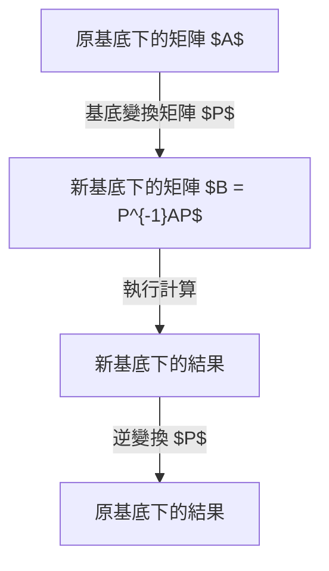
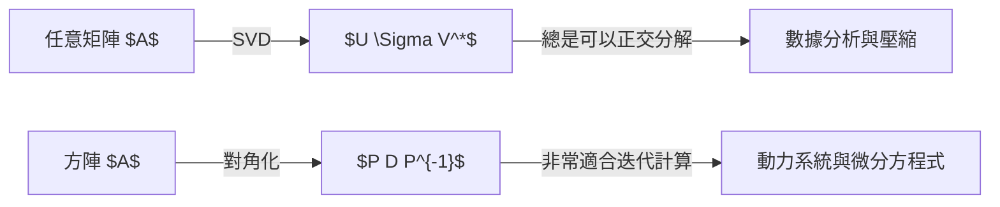

## 引言

在學習線性代數的過程中，許多人面臨的一大障礙就是 **對角化** 和 **喬丹標準型**。矩陣是描述空間變形（線性變換）的強大工具，但如果不加處理，通常很難直接看出其性質。本文將極其詳細地介紹對角化這一將複雜矩陣極致簡化的強大方法，以及用來拯救無法對角化的矩陣的喬丹標準型，內容涵蓋其背後的直觀含義、嚴格的數學定義，直到在物理學和工程學中的應用。

## 什麼是矩陣：作為變換的視角

直觀理解對角化的第一步，是不要將矩陣僅僅看作「數字的排列」，而是將其理解為「如何扭曲空間」的幾何變換規則。透過重新選擇合適的基底，即使是完全相同的變換，其矩陣表示也可能變得極其簡單。



## 對角化的基本概念

### 直觀理解

矩陣 $A$ 可對角化意味著，從合適的視角（新基底）來看，該矩陣表示的變換不過是「沿著各個座標軸單純地拉伸和收縮」。

### 數學定義與定理

$n \times n$ 矩陣 $A$ 可對角化，是指存在一個可逆矩陣 $P$，使得可以構造出一個對角矩陣 $D$，滿足：

$$
P^{-1} A P = D
$$

在這裡，$D$ 的對角元素是 $A$ 的 **特徵值** $\lambda_i$，而 $P$ 的各個行向量是對應的 **特徵向量** $\mathbf{v}_i$。

## 對角化的具體計算示例

### 3階方陣示例

$$
A = \begin{pmatrix}
4 & -1 & 6 \\
2 & 1 & 6 \\
2 & -1 & 8
\end{pmatrix}
$$

**步驟1：計算特徵值**
解特徵方程式 $\det(A - \lambda I) = 0$。得到特徵值為 $\lambda = 2$ 和 $\lambda = 9$。

**步驟2：計算特徵向量**
當 $\lambda = 2$ 時：
$$
\mathbf{v}_1 = \begin{pmatrix} 1 \\ 2 \\ 0 \end{pmatrix}, \quad \mathbf{v}_2 = \begin{pmatrix} -3 \\ 0 \\ 1 \end{pmatrix}
$$
當 $\lambda = 9$ 時：
$$
\mathbf{v}_3 = \begin{pmatrix} 1 \\ 1 \\ 1 \end{pmatrix}
$$

**步驟3：執行對角化**
令 $P = (\mathbf{v}_1 \ \mathbf{v}_2 \ \mathbf{v}_3)$，則：
$$
P^{-1} A P = \begin{pmatrix}
2 & 0 & 0 \\
0 & 2 & 0 \\
0 & 0 & 9
\end{pmatrix}
$$

## 為什麼存在無法對角化的矩陣？

必須滿足：
$$
1 \leq \text{幾何重數} \leq \text{代數重數}
$$
如果幾何重數嚴格小於代數重數，該矩陣就不會有足夠數量的特徵向量，從而無法被對角化。

## 喬丹標準型的理論

### 喬丹區塊的定義

喬丹標準型是由 **喬丹區塊** 所組成：
$$
J_k(\lambda) = \begin{pmatrix}
\lambda & 1 & 0 & \cdots & 0 \\
0 & \lambda & 1 & \cdots & 0 \\
\vdots & \vdots & \ddots & \ddots & 1 \\
0 & 0 & \cdots & 0 & \lambda
\end{pmatrix}
$$

### 廣義特徵向量
為了構造喬丹標準型，引入了 **廣義特徵向量**：
$$
(A - \lambda I)^k \mathbf{v} = \mathbf{0} \quad \text{以及} \quad (A - \lambda I)^{k-1} \mathbf{v} \neq \mathbf{0}
$$

## 應用：微分方程式與矩陣指數函數

系統 $\frac{d\mathbf{x}}{dt} = A \mathbf{x}$ 的解為 $\mathbf{x}(t) = e^{At} \mathbf{x}(0)$。
透過對角化：
$$
e^{At} = P e^{Dt} P^{-1}
$$
對於喬丹區塊，這清晰地展示了 $te^{\lambda t}$ 這類長期項在微分方程式解中出現的機制。

## 凱萊-哈密頓定理與最小多項式

所有的方陣 $A$ 都會滿足其自身的特徵多項式 $p(A) = 0$。**最小多項式** 是判斷矩陣是否可對角化的有力工具。

## 對角化與奇異值分解 (SVD) 的區別



## 在量子力學與控制理論中的意義

在量子力學中，將矩陣對角化無非就是尋找系統的能量本徵態。在控制理論中，這能直觀評估系統的 **可控性** 與 **可觀測性**。

## 數值計算與程式設計

Python 範例：
```python
import numpy as np
from scipy.linalg import schur, eigvals

A = np.array([[5, 4, 2, 1],
              [0, 1, -1, -1],
              [-1, -1, 3, 0],
              [1, 1, -1, 2]])

# 特徵值
eigenvalues = eigvals(A)
print("特徵值:", eigenvalues)

# 舒爾分解
T, Z = schur(A, output='complex')
print("上三角矩陣 T:")
print(np.round(T, 4))
```

## 總結
對角化是將矩陣極致簡化的方法，而喬丹標準型則是其終極推廣。掌握這些工具可以幫助你解開矩陣的真實面貌。
