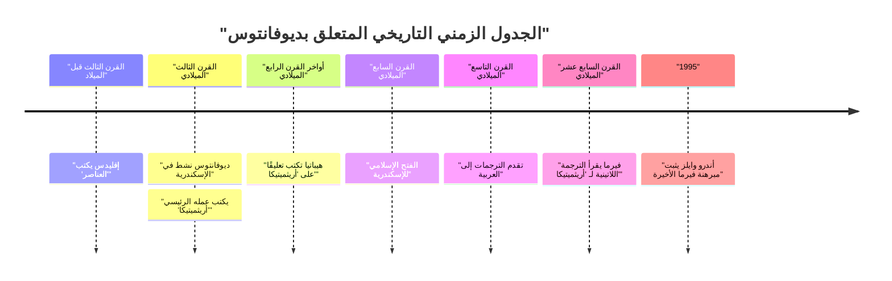
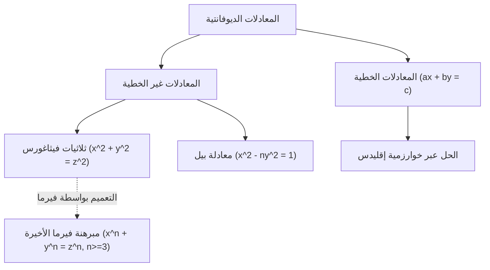

## 1. مقدمة

في تاريخ الرياضيات، هناك شخصية تُعرف باسم "أبو الجبر". هذه الشخصية هي **[ديوفانتوس](https://kenji.blog/ar/p/diophantus/)** (ديوفانتوس الإسكندري)، الذي كان نشطًا في الإسكندرية القديمة. كان لعمله الرئيسي، *أريثميتيكا* (الحساب)، تأثير عميق على علماء الرياضيات اللاحقين في العالم الإسلامي وعلماء الرياضيات في أوروبا في عصر النهضة. على وجه الخصوص، "[مبرهنة فيرما الأخيرة](/ar/p/fermats-last-theorem/)"، التي كتبها [بيير دي فيرما](https://kenji.blog/ar/p/fermat/) في هوامش *أريثميتيكا*، مشهورة للغاية.

في هذه المقالة، سنتعمق في حياة [ديوفانتوس](https://kenji.blog/ar/p/diophantus/)، وإنجازاته الرياضية، وتفاصيل رائعته *أريثميتيكا*، و"المعادلات الديوفانتية" التي تحمل اسمه. علاوة على ذلك، سنكشف أيضًا عن لغز "نقش ضريحه"، والذي يمكن من خلاله استنتاج عمره.

## 2. حياة [ديوفانتوس](https://kenji.blog/ar/p/diophantus/) والخلفية التاريخية

### 2.1 حياة تكتنفها الألغاز

لا توجد تقريبًا أي سجلات دقيقة متبقية بشأن متى وُلد [ديوفانتوس](https://kenji.blog/ar/p/diophantus/) أو متى توفي. بشكل عام، يُعتقد أنه كان نشطًا في الإسكندرية، بمصر في حوالي القرن الثالث الميلادي (بين 200 و 284 م). من تواريخ الشخصيات التي يذكرها (مثل هيبسيكلس)، نعلم أن ذلك كان بعد 150 قبل الميلاد، وبما أن ثيون الإسكندري (القرن الرابع الميلادي) يذكر [ديوفانتوس](https://kenji.blog/ar/p/diophantus/)، فمن المؤكد أنه كان قبل 364 م. يقدر المؤرخون المعاصرون أنه ازدهر حوالي عام 250 م.

### 2.2 الثقافة الهلنستية والإسكندرية

في ذلك الوقت، كانت الإسكندرية مركز الثقافة والتعلم الهلنستي، حيث كانت تفتخر بمكتبة ضخمة (مكتبة الإسكندرية) وتعمل كملتقى للمعرفة حيث يجتمع العديد من العلماء. في هذه المدينة التي تتقاطع فيها المعرفة من اليونان ومصر وبابل وحتى الهند، يُعتقد أن [ديوفانتوس](https://kenji.blog/ar/p/diophantus/) كان لديه إمكانية الوصول إلى تراث رياضي واسع من الماضي. على عكس التقليد الهندسي الذي أسسه علماء الرياضيات اليونانيون العظماء مثل [إقليدس](/ar/p/euclid/) وأرخميدس وأبولونيوس، تشير بعض النظريات إلى أن [ديوفانتوس](https://kenji.blog/ar/p/diophantus/) تأثر بشدة بالنهج الجبري لبابل.

## 3. تأثير رائعته *أريثميتيكا*

أعظم إنجاز ل[ديوفانتوس](https://kenji.blog/ar/p/diophantus/) هو كتابه *أريثميتيكا*، والذي يُقال إنه كان يتألف من 13 مجلداً. لسوء الحظ، لم يتبق منها اليوم سوى ستة مجلدات باللغة اليونانية، وتم اكتشاف أربعة مجلدات أخرى في ترجمة عربية.

### 3.1 فجر الجبر الرمزي

الجانب الرائد في *أريثميتيكا* هو استخدام **الرموز** لتمثيل المجاهيل، وقواها (المربعات، المكعبات، إلخ)، والعمليات (الجمع، الطرح، المساواة، إلخ). في الرياضيات اليونانية قبله (كما هو الحال عند [إقليدس](https://kenji.blog/ar/p/euclid/))، تم وصف المشكلات الرياضية بشكل أساسي باستخدام الأشكال الهندسية وتم شرحها بالكلمات (وهذا ما يسمى الجبر البلاغي). ومع ذلك، جعل [ديوفانتوس](https://kenji.blog/ar/p/diophantus/) من الممكن التعامل مع معادلات أكثر تجريدًا وتعقيدًا عن طريق ترميز التعبيرات الرياضية (مرحلة انتقالية تسمى الجبر المختزل).

استخدم رمزًا خاصًا (يعادل $x$ الحديث) لتمثيل المجهول، وأعطى رموزًا فريدة للحدود الثابتة ومقلوبات المجاهيل.

$$
\text{مثال على متعددة حدود [ديوفانتوس](https://kenji.blog/ar/p/diophantus/) (الترميز الحديث):} \\
3x^3 - 2x^2 + 5x - 1 = 0
$$

### 3.2 المشكلات التي تم تناولها والحلول المنطقية

يحتوي كتاب *أريثميتيكا* على حوالي 130 مشكلة تتعلق بأنظمة المعادلات الخطية، والمعادلات التربيعية، وحتى المعادلات ذات الدرجة الأعلى. السمة الرئيسية لهذه المشكلات هي أنه، على عكس علماء الرياضيات المعاصرين الذين يبحثون عن حلول حقيقية أو معقدة، كان يبحث بشكل أساسي عن **حلول منطقية (كسور موجبة أو أعداد صحيحة)**. لم تكن مفاهيم الأرقام السالبة والصفر والأرقام غير النسبية قد تأسست بالكامل في ذلك الوقت، ولم يعترف بها كحلول. بالنسبة له، "الأرقام" تعني أرقامًا منطقية موجبة.

على سبيل المثال، عندما واجه [ديوفانتوس](https://kenji.blog/ar/p/diophantus/) معادلة مثل $4x + 20 = 4$، رفضها باعتبارها "سخيفة" لأن حلها سيكون رقمًا سالبًا ($x = -4$).

## 4. المعادلات الديوفانتية

اليوم، يشير مصطلح "المعادلة الديوفانتية" إلى **معادلة متعددة الحدود ذات معاملات صحيحة يُطلب لها حلول صحيحة فقط**. على الرغم من أن [ديوفانتوس](https://kenji.blog/ar/p/diophantus/) نفسه سعى أيضًا للحصول على حلول منطقية، إلا أن هذا تطور إلى فرع مهم من "نظرية الأعداد" في الرياضيات اللاحقة.

### 4.1 المعادلات الديوفانتية الخطية

أبسط معادلة ديوفانتية هي معادلة خطية ذات متغيرين (معادلة ديوفانتية خطية).

$$
ax + by = c \quad (a, b, c \text{ هي أعداد صحيحة})
$$

الشرط الضروري والكافي لكي يكون لهذه المعادلة حل صحيح $(x, y)$ هو أن القاسم المشترك الأكبر لـ $a$ و $b$، وهو $\gcd(a, b)$، يقسم $c$ (متطابقة بيزو).

**مثال:**
تأمل المعادلة $4x + 6y = 8$.
بما أن $\gcd(4, 6) = 2$، و $2$ يقسم $8$، فهناك حلول صحيحة موجودة.
أحد الحلول هو $x = 2, y = 0$ ($4(2) + 6(0) = 8$).
أيضًا، يمكن التعبير عن الحل العام على أنه $x = 2 + 3k, y = -2k$ (حيث $k$ هو أي عدد صحيح).

### 4.2 ثلاثيات فيثاغورس والمعادلات الديوفانتية غير الخطية

المعادلة المألوفة من [مبرهنة فيثاغورس](/ar/p/diverse-proofs-of-pythagorean-theorem/) هي أيضًا نوع من المعادلات الديوفانتية.

$$
x^2 + y^2 = z^2
$$

تسمى مجموعة الأعداد الصحيحة الموجبة $(x, y, z)$ التي تفي بهذه المعادلة **ثلاثية [فيثاغورس](/ar/p/pythagoras/)**. ومن الأمثلة الشهيرة $(3, 4, 5)$ و $(5, 12, 13)$. في الكتاب الثاني، المشكلة 8 من *أريثميتيكا*، يعالج [ديوفانتوس](https://kenji.blog/ar/p/diophantus/) مشكلة تقسيم عدد مربع معطى إلى مجموع مربعين (على سبيل المثال، إيجاد أرقام منطقية $x, y$ بحيث $16 = x^2 + y^2$).

في الهامش المجاور لهذه المشكلة، ترك [بيير دي فيرما](https://kenji.blog/ar/p/fermat/)، وهو قاض فرنسي في القرن السابع عشر وعالم رياضيات هاوٍ، الملاحظة التالية:

> "من المستحيل فصل المكعب إلى مكعبين، أو القوة الرابعة إلى قوتين رابعتين، أو بشكل عام، أي قوة أعلى من الثانية، إلى قوتين متماثلتين. لقد اكتشفت برهانًا رائعًا حقًا على ذلك، لكن هذا الهامش أضيق من أن يحتويه."

هذه هي **[مبرهنة فيرما الأخيرة](https://kenji.blog/ar/p/fermats-last-theorem/)** الشهيرة (بأن $x^n + y^n = z^n \ (n \ge 3)$ ليس لها حلول صحيحة موجبة). استمرت هذه المبرهنة في رفض تحديات علماء الرياضيات العباقرة في جميع أنحاء العالم لحوالي 350 عامًا بعد اقتراحها، حتى تم إثباتها أخيرًا بواسطة [أندرو وايلز](/ar/p/wiles/) في عام 1995. بدون كتاب [ديوفانتوس](https://kenji.blog/ar/p/diophantus/)، ربما لم تحدث هذه الدراما العظيمة أبدًا.

## 5. نقش ضريح [ديوفانتوس](https://kenji.blog/ar/p/diophantus/)

الدليل الأكثر إثارة للاهتمام، وربما الوحيد المحدد لفهم حياة [ديوفانتوس](https://kenji.blog/ar/p/diophantus/)، هو اللغز الجبري الذي قيل إنه نحت على شاهد قبره. تم تسجيل هذا في *المقتطفات اليونانية* التي جمعها ميترودوروس حوالي القرن الخامس، ويسمح للمرء باستنتاج عمر [ديوفانتوس](https://kenji.blog/ar/p/diophantus/) عن طريق حل معادلة خطية.

### 5.1 محتوى النقش

> هنا يرقد [ديوفانتوس](https://kenji.blog/ar/p/diophantus/). الأرقام تحكي طول حياته.
> لمدة $\frac{1}{6}$ من حياته كان صبيًا.
> بعد $\frac{1}{12}$ أخرى، بدأت لحيته تنمو.
> بعد $\frac{1}{7}$ أخرى، تزوج.
> بعد خمس سنوات من زواجه، ولد ابنه.
> ولكن للأسف، مات الابن في نصف عمر أبيه.
> بعد أربع سنوات من وفاة ابنه، لفظ هو أيضًا أنفاسه الأخيرة في حزن.

### 5.2 الحل عن طريق المعادلة

إذا تركنا $x$ ليكون عمر [ديوفانتوس](https://kenji.blog/ar/p/diophantus/) (السنوات التي عاشها)، يمكن التعبير عن النص أعلاه كالمعادلة التالية:

$$
\frac{x}{6} + \frac{x}{12} + \frac{x}{7} + 5 + \frac{x}{2} + 4 = x
$$

دعونا نحل هذه المعادلة.

أولاً، أوجد المضاعف المشترك الأصغر لمقامات الكسور. المضاعف المشترك الأصغر لـ 6 و 12 و 7 و 2 هو 84.
اضرب كلا الجانبين في 84.

$$
14x + 7x + 12x + 420 + 42x + 336 = 84x
$$

اجمع حدود $x$.

$$
(14 + 7 + 12 + 42)x + (420 + 336) = 84x \\
75x + 756 = 84x
$$

اجمع $x$ على الجانب الأيمن.

$$
756 = 84x - 75x \\
756 = 9x
$$

اقسم كلا الجانبين على 9.

$$
x = 84
$$

لذلك، يمكننا أن نرى أن [ديوفانتوس](https://kenji.blog/ar/p/diophantus/) توفي عن عمر يناهز **84** عامًا. بالنظر إلى متوسط ​​العمر المتوقع في ذلك الوقت، فقد عاش حياة طويلة جدًا. الجدول الزمني لحياته كما يلي:

- الطفولة: $84 \times \frac{1}{6} = 14$ عامًا (الأعمار 0-14)
- الشباب: $84 \times \frac{1}{12} = 7$ سنوات (الأعمار 14-21)
- حتى الزواج: $84 \times \frac{1}{7} = 12$ عامًا (الأعمار 21-33)
- ولادة الابن: بعد 5 سنوات من الزواج (33 + 5 = 38 عامًا)
- عمر الابن: $84 \times \frac{1}{2} = 42$ عامًا
- وفاة الابن: عندما كان [ديوفانتوس](https://kenji.blog/ar/p/diophantus/) يبلغ 80 عامًا (38 + 42 = 80 عامًا)
- وفاة [ديوفانتوس](https://kenji.blog/ar/p/diophantus/): بعد 4 سنوات من وفاة الابن (80 + 4 = 84 عامًا)

## 6. التأثير على الأجيال اللاحقة والإرث

فُقدت أعمال [ديوفانتوس](https://kenji.blog/ar/p/diophantus/) مؤقتًا في عالم أوروبا الغربية مع انحطاط الإمبراطورية الرومانية. ومع ذلك، تم الحفاظ عليها ودراستها بعناية في الإمبراطورية الرومانية الشرقية (البيزنطية) والعالم الإسلامي. في نهاية القرن الرابع، يُقال إن هيباتيا الإسكندرية قد كتبت تعليقًا على *أريثميتيكا*.

على وجه الخصوص، ترجم علماء الرياضيات في بغداد في القرن التاسع *أريثميتيكا* إلى العربية، مما ساهم بشكل كبير في تطوير الجبر الإسلامي. تبنى علماء الرياضيات الإسلاميون مثل الكرجي وطوروا أساليب [ديوفانتوس](https://kenji.blog/ar/p/diophantus/) بشكل أكبر.

في القرن السادس عشر، حيث أعيد اكتشاف الكلاسيكيات اليونانية في أوروبا في عصر النهضة، تمت ترجمة *أريثميتيكا* إلى اللاتينية. قرئت نسخة ثنائية اللغة باللغتين اليونانية واللاتينية نشرها كلود جاسبار باشي دي ميزيرياك في عام 1621 على نطاق واسع. كانت هذه النسخة من باشي لـ *أريثميتيكا* هي التي درسها فيرما بعناية، مما أدى إلى فتح باب جديد في الرياضيات.

درس عمالقة مثل ليونارد أويلر، و[جوزيف لويس لاغرانج](https://kenji.blog/ar/p/lagrange/)، وكارل فريدريش غاوس نظرية المعادلات الديوفانتية بعمق في وقت لاحق. نمت أبحاثهم لتصبح الحقول الرياضية الواسعة الحديثة لـ "النظرية الجبرية للأعداد" و"الهندسة الجبرية". كانت المشكلة العاشرة من بين 23 مشكلة لهيلبرت هي "إيجاد خوارزمية عامة لتحديد ما إذا كانت معادلة ديوفانتية معطاة قابلة للحل"، وفي عام 1970 أثبت يوري ماتياسفيتش أنه "لا توجد مثل هذه الخوارزمية". اسم [ديوفانتوس](https://kenji.blog/ar/p/diophantus/) محفور بعمق في طليعة الرياضيات الحديثة.

## 7. خاتمة

كان [ديوفانتوس](https://kenji.blog/ar/p/diophantus/) رائدًا أرسى أسس الجبر الحديث باستخدام الرموز للتعبيرات الرياضية والتعامل مع المجاهيل. لم تكن *أريثميتيكا* التي تركها وراءه مجرد مجموعة من الألغاز أو مشكلات الحساب، بل تضمنت رؤى عميقة حول خصائص الأرقام. استمرت المشكلات التي قدمها في إبهار علماء الرياضيات عبر آلاف السنين وكانت قوة دافعة حركت تاريخ الرياضيات بشكل كبير.

يعلمنا نقش ضريحه، الذي يروي بهدوء قصة حياة استمرت 84 عامًا من خلال الصيغ، الجمال العالمي للرياضيات والسعي وراء الحقيقة الخالدة. يمكن حقًا تسمية [ديوفانتوس](https://kenji.blog/ar/p/diophantus/) بشخصية عظيمة أرست حجر الأساس الأول لصرح الجبر الرائع.
