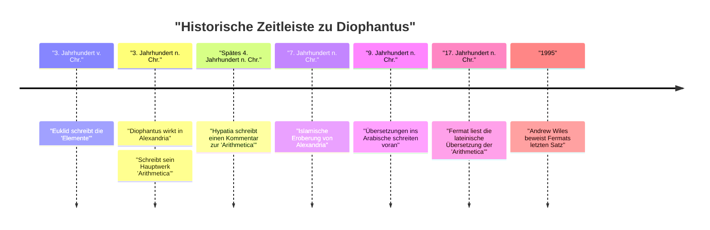
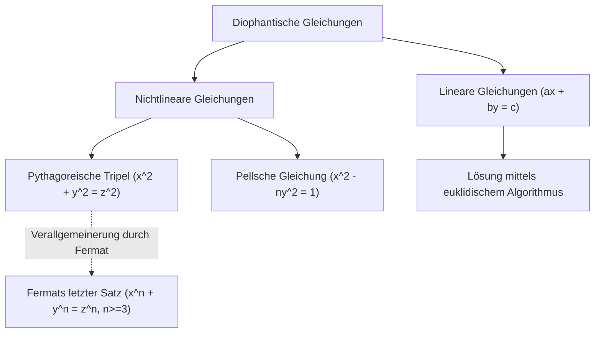

## 1. Einleitung

In der Geschichte der Mathematik gibt es eine Figur, die als "Vater der Algebra" bekannt ist. Diese Figur ist **Diophantus** (Diophantus von Alexandria), der im antiken Alexandria wirkte. Sein Hauptwerk, die *Arithmetica*, hatte einen tiefgreifenden Einfluss auf spätere Mathematiker in der islamischen Welt und Mathematiker im Europa der Renaissance. Insbesondere "Fermats letzter Satz", den Pierre de Fermat an den Rand der *Arithmetica* schrieb, ist äußerst berühmt.

In diesem Artikel werden wir uns eingehend mit dem Leben von Diophantus, seinen mathematischen Errungenschaften, den Details seines Meisterwerks *Arithmetica* und den nach ihm benannten "diophantischen Gleichungen" befassen. Darüber hinaus werden wir auch das Geheimnis seines "Epitaphs" lüften, aus dem sich seine Lebensspanne ableiten lässt.

## 2. Diophantus' Leben und historischer Hintergrund

### 2.1 Ein von Geheimnissen umhülltes Leben

Es gibt fast keine genauen Aufzeichnungen darüber, wann Diophantus geboren wurde oder wann er starb. Im Allgemeinen geht man davon aus, dass er um das 3. Jahrhundert n. Chr. (zwischen 200 und 284 n. Chr.) im ägyptischen Alexandria wirkte. Aus den Daten von Personen, die er erwähnt (wie Hypsikles), wissen wir, dass es nach 150 v. Chr. war, und da Theon von Alexandria (4. Jahrhundert n. Chr.) Diophantus erwähnt, ist es sicher vor 364 n. Chr. Moderne Historiker schätzen, dass seine Blütezeit um das Jahr 250 n. Chr. lag.

### 2.2 Hellenistische Kultur und Alexandria

Zu dieser Zeit war Alexandria das Zentrum der hellenistischen Kultur und Gelehrsamkeit, rühmte sich einer riesigen Bibliothek (der Bibliothek von Alexandria) und diente als Knotenpunkt des Wissens, an dem sich viele Gelehrte versammelten. In dieser Stadt, in der sich das Wissen aus Griechenland, Ägypten, Babylonien und sogar Indien kreuzte, wird angenommen, dass Diophantus Zugang zu einem riesigen mathematischen Erbe der Vergangenheit hatte. Im Gegensatz zur geometrischen Tradition, die von großen griechischen Mathematikern wie Euklid, Archimedes und Apollonius begründet wurde, deuten einige Theorien darauf hin, dass Diophantus stark vom algebraischen Ansatz Babyloniens beeinflusst wurde.

## 3. Die Bedeutung seines Meisterwerks *Arithmetica*

Die größte Leistung von Diophantus ist sein Buch *Arithmetica*, das aus 13 Bänden bestanden haben soll. Leider sind heute nur noch sechs davon auf Griechisch erhalten, und vier weitere wurden in arabischer Übersetzung entdeckt.

### 3.1 Die Anfänge der symbolischen Algebra

Das Bahnbrechende an der *Arithmetica* ist die Verwendung von **Symbolen** zur Darstellung von Unbekannten, ihren Potenzen (Quadrate, Kuben usw.) und Operationen (Addition, Subtraktion, Gleichheit usw.). In der griechischen Mathematik vor ihm (z. B. bei Euklid) wurden mathematische Probleme hauptsächlich anhand geometrischer Figuren beschrieben und mit Worten erklärt (dies wird rhetorische Algebra genannt). Diophantus machte es jedoch möglich, abstraktere und komplexere Gleichungen zu behandeln, indem er mathematische Ausdrücke symbolisierte (eine Übergangsphase, die als synkopierte Algebra bezeichnet wird).

Er verwendete ein spezielles Symbol (entsprechend dem modernen $x$), um eine Unbekannte darzustellen, und gab konstanten Termen und den Kehrwerten von Unbekannten einzigartige Notationen.

$$
\text{Beispiel für das Polynom von Diophantus (moderne Notation):} \\
3x^3 - 2x^2 + 5x - 1 = 0
$$

### 3.2 Behandelte Probleme und rationale Lösungen

Die *Arithmetica* enthält etwa 130 Probleme zu linearen Gleichungssystemen, quadratischen Gleichungen und sogar Gleichungen höheren Grades. Ein Hauptmerkmal dieser Probleme ist, dass er, im Gegensatz zu modernen Mathematikern, die reelle oder komplexe Lösungen suchen, hauptsächlich nach **rationalen Lösungen (positiven Brüchen oder ganzen Zahlen)** suchte. Die Konzepte von negativen Zahlen, der Null und irrationalen Zahlen waren zu dieser Zeit noch nicht vollständig etabliert, und er erkannte sie nicht als Lösungen an. Für ihn bedeuteten "Zahlen" positive rationale Zahlen.

Wenn Diophantus beispielsweise auf eine Gleichung wie $4x + 20 = 4$ stieß, tat er dies als "absurd" ab, da ihre Lösung eine negative Zahl ($x = -4$) wäre.

## 4. Diophantische Gleichungen

Heute bezieht sich der Begriff "diophantische Gleichung" auf eine **Polynomgleichung mit ganzzahligen Koeffizienten, für die nur ganzzahlige Lösungen gesucht werden**. Obwohl Diophantus selbst auch rationale Lösungen suchte, entwickelte sich dies in der späteren Mathematik zu einem wichtigen Zweig der "Zahlentheorie".

### 4.1 Lineare diophantische Gleichungen

Die einfachste diophantische Gleichung ist eine lineare Gleichung mit zwei Variablen (lineare diophantische Gleichung).

$$
ax + by = c \quad (a, b, c \text{ sind ganze Zahlen})
$$

Eine notwendige und hinreichende Bedingung dafür, dass diese Gleichung eine ganzzahlige Lösung $(x, y)$ hat, ist, dass der größte gemeinsame Teiler von $a$ und $b$, $\gcd(a, b)$, ein Teiler von $c$ ist (Lemma von Bézout).

**Beispiel:**
Betrachten wir die Gleichung $4x + 6y = 8$.
Da $\gcd(4, 6) = 2$, und $2$ ein Teiler von $8$ ist, existieren ganzzahlige Lösungen.
Eine Lösung ist $x = 2, y = 0$ ($4(2) + 6(0) = 8$).
Auch die allgemeine Lösung kann als $x = 2 + 3k, y = -2k$ (wobei $k$ eine beliebige ganze Zahl ist) ausgedrückt werden.

### 4.2 Pythagoreische Tripel und nichtlineare diophantische Gleichungen

Die bekannte Gleichung aus dem Satz des Pythagoras ist ebenfalls eine Art diophantische Gleichung.

$$
x^2 + y^2 = z^2
$$

Eine Menge positiver ganzer Zahlen $(x, y, z)$, die diese Gleichung erfüllt, wird als **pythagoreisches Tripel** bezeichnet. Berühmte Beispiele sind $(3, 4, 5)$ und $(5, 12, 13)$. Im Buch II, Problem 8 der *Arithmetica* behandelt Diophantus das Problem, eine gegebene Quadratzahl in die Summe zweier Quadrate zu zerlegen (z. B. das Finden rationaler Zahlen $x, y$, so dass $16 = x^2 + y^2$).

Am Rand neben diesem Problem hinterließ Pierre de Fermat, ein französischer Richter und Amateurmathematiker des 17. Jahrhunderts, folgende Notiz:

> "Es ist unmöglich, einen Kubus in zwei Kuben, oder ein Biquadrat in zwei Biquadrate, oder allgemein jede höhere Potenz als das Quadrat in zwei Potenzen gleichen Grades zu zerlegen. Ich habe hierfür einen wahrhaft wunderbaren Beweis gefunden, für den dieser Rand jedoch zu schmal ist."

Dies ist der berühmte **Fermatsche letzte Satz** (dass $x^n + y^n = z^n \ (n \ge 3)$ keine positiven ganzzahligen Lösungen hat). Dieser Satz wies etwa 350 Jahre lang nach seiner Aufstellung die Herausforderungen von genialen Mathematikern auf der ganzen Welt zurück, bis er schließlich 1995 von Andrew Wiles bewiesen wurde. Ohne das Buch von Diophantus hätte dieses große mathematische Drama vielleicht nie stattgefunden.

## 5. Das Epitaph des Diophantus

Der interessanteste und vielleicht einzige konkrete Hinweis zum Verständnis des Lebens von Diophantus ist das algebraische Rätsel, das angeblich auf seinem Grabstein eingraviert war. Dieses wurde in der *Griechischen Anthologie* aufgezeichnet, die um das 5. Jahrhundert von Metrodorus zusammengestellt wurde, und es ermöglicht die Ableitung der Lebensspanne von Diophantus durch das Lösen einer linearen Gleichung.

### 5.1 Der Inhalt des Epitaphs

> Hier ruht Diophantus. Die Zahlen erzählen die Länge seines Lebens.
> Für $\frac{1}{6}$ seines Lebens war er ein Knabe.
> Nach weiteren $\frac{1}{12}$ begann ihm ein Bart zu wachsen.
> Nach weiteren $\frac{1}{7}$ heiratete er.
> Fünf Jahre nach seiner Heirat wurde ihm ein Sohn geboren.
> Aber ach, der Sohn starb im halben Alter seines Vaters.
> Vier Jahre nach dem Tod seines Sohnes atmete auch er in Trauer sein letztes Mal.

### 5.2 Lösung mittels Gleichung

Wenn wir $x$ als die Lebensspanne von Diophantus (gelebte Jahre) setzen, kann der obige Text als folgende Gleichung ausgedrückt werden:

$$
\frac{x}{6} + \frac{x}{12} + \frac{x}{7} + 5 + \frac{x}{2} + 4 = x
$$

Lassen Sie uns diese Gleichung lösen.

Finden Sie zuerst das kleinste gemeinsame Vielfache der Nenner der Brüche. Das kleinste gemeinsame Vielfache von 6, 12, 7 und 2 ist 84.
Multiplizieren Sie beide Seiten mit 84.

$$
14x + 7x + 12x + 420 + 42x + 336 = 84x
$$

Fassen Sie die $x$-Terme zusammen.

$$
(14 + 7 + 12 + 42)x + (420 + 336) = 84x \\
75x + 756 = 84x
$$

Sammeln Sie $x$ auf der rechten Seite.

$$
756 = 84x - 75x \\
756 = 9x
$$

Teilen Sie beide Seiten durch 9.

$$
x = 84
$$

Daher können wir sehen, dass Diophantus im Alter von **84** Jahren starb. In Anbetracht der damaligen durchschnittlichen Lebenserwartung lebte er ein sehr langes Leben. Die Zeitleiste seines Lebens stellt sich wie folgt dar:

- Knabenalter: $84 \times \frac{1}{6} = 14$ Jahre (Alter 0-14)
- Jugend: $84 \times \frac{1}{12} = 7$ Jahre (Alter 14-21)
- Bis zur Heirat: $84 \times \frac{1}{7} = 12$ Jahre (Alter 21-33)
- Geburt des Sohnes: 5 Jahre nach der Heirat (33 + 5 = 38 Jahre alt)
- Lebensspanne des Sohnes: $84 \times \frac{1}{2} = 42$ Jahre
- Tod des Sohnes: als Diophantus 80 war (38 + 42 = 80 Jahre alt)
- Tod von Diophantus: 4 Jahre nach dem Tod des Sohnes (80 + 4 = 84 Jahre alt)

## 6. Einfluss auf spätere Generationen und Vermächtnis

Die Werke des Diophantus gingen mit dem Niedergang des Römischen Reiches für die westeuropäische Welt vorübergehend verloren. Sie wurden jedoch im oströmischen (byzantinischen) Reich und in der islamischen Welt sorgfältig bewahrt und studiert. Ende des 4. Jahrhunderts soll Hypatia von Alexandria einen Kommentar zur *Arithmetica* geschrieben haben.

Insbesondere Mathematiker in Bagdad im 9. Jahrhundert übersetzten die *Arithmetica* ins Arabische und trugen so maßgeblich zur Entwicklung der islamischen Algebra bei. Islamische Mathematiker wie Al-Karaji übernahmen und entwickelten die Methoden des Diophantus weiter.

Im 16. Jahrhundert, als griechische Klassiker im Europa der Renaissance wiederentdeckt wurden, wurde die *Arithmetica* ins Lateinische übersetzt. Eine zweisprachige griechische und lateinische Ausgabe, die 1621 von Claude Gaspard Bachet de Méziriac herausgegeben wurde, fand große Verbreitung. Es war diese Bachet-Ausgabe der *Arithmetica*, die Fermat sorgfältig studierte, was die Öffnung einer neuen Tür in der Mathematik auslöste.

Die Theorie der diophantischen Gleichungen wurde in der Folge von Giganten wie Leonhard Euler, Joseph-Louis Lagrange und Carl Friedrich Gauß tiefgreifend untersucht. Ihre Forschung wuchs zu den riesigen mathematischen Gebieten der modernen "algebraischen Zahlentheorie" und "algebraischen Geometrie" heran. Das 10. der 23 Hilbertschen Probleme war "die Angabe eines Verfahrens, nach welchem sich mittels einer endlichen Anzahl von Operationen entscheiden lässt, ob die Gleichung in rationalen ganzen Zahlen lösbar ist", und 1970 bewies Juri Matijassewitsch, dass "ein solches Verfahren nicht existiert". Der Name Diophantus ist tief in die Spitzenforschung der modernen Mathematik eingraviert.

## 7. Fazit

Diophantus war ein Pionier, der die Grundlagen der modernen Algebra legte, indem er Symbole für mathematische Ausdrücke verwendete und mit Unbekannten umging. Die *Arithmetica*, die er hinterließ, war nicht nur eine Sammlung von Rätseln oder Rechenaufgaben, sondern enthielt tiefe Einblicke in die Eigenschaften von Zahlen. Die von ihm vorgestellten Probleme haben Mathematiker über Jahrtausende hinweg fasziniert und waren eine treibende Kraft, die die Geschichte der Mathematik maßgeblich bewegte.

Sein Epitaph, das leise durch Formeln die Geschichte eines 84-jährigen Lebens erzählt, lehrt uns die universelle Schönheit der Mathematik und die Suche nach der zeitlosen Wahrheit. Diophantus kann wahrlich als eine große Figur bezeichnet werden, die den ersten Grundstein für das großartige Gebäude der Algebra gelegt hat.
