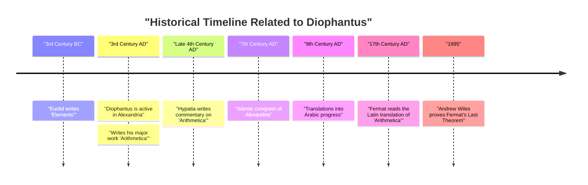
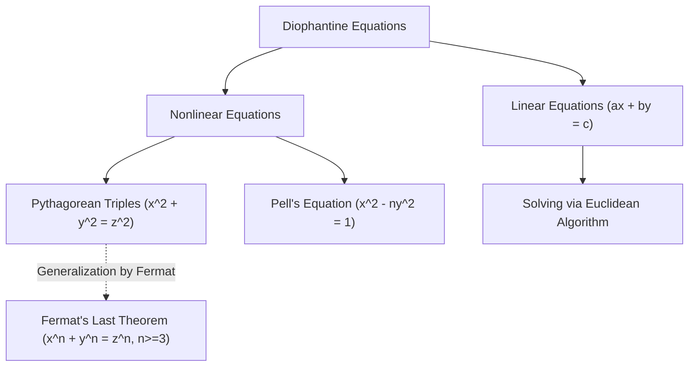

## 1. Introduction

In the history of mathematics, there is a figure known as the "Father of Algebra". That figure is **[Diophantus](https://kenji.blog/en/p/diophantus/)** ([Diophantus](https://kenji.blog/en/p/diophantus/) of Alexandria), who was active in ancient Alexandria. His major work, *Arithmetica*, had a profound influence on later mathematicians in the Islamic world and mathematicians in Renaissance Europe. In particular, "[Fermat's Last Theorem](https://kenji.blog/en/p/fermats-last-theorem/)", which [Pierre de Fermat](https://kenji.blog/en/p/fermat/) wrote in the margins of *Arithmetica*, is extremely famous.

In this article, we will delve into the life of [Diophantus](https://kenji.blog/en/p/diophantus/), his mathematical achievements, the details of his masterpiece *Arithmetica*, and the "Diophantine equations" that bear his name. Furthermore, we will also unravel the mystery of his "epitaph", from which his lifespan can be deduced.

## 2. [Diophantus](https://kenji.blog/en/p/diophantus/)'s Life and Historical Background

### 2.1 A Life Shrouded in Mystery

There are almost no accurate records remaining regarding when [Diophantus](https://kenji.blog/en/p/diophantus/) was born or when he died. Generally, it is believed that he was active in Alexandria, Egypt around the 3rd century AD (between 200 and 284 AD). From the dates of figures he mentions (such as Hypsicles), we know it was after 150 BC, and since Theon of Alexandria (4th century AD) mentions [Diophantus](https://kenji.blog/en/p/diophantus/), it is certain to be before 364 AD. Modern historians estimate that he flourished around the year 250 AD.

### 2.2 Hellenistic Culture and Alexandria

At the time, Alexandria was the center of Hellenistic culture and learning, boasting a massive library (the Library of Alexandria) and serving as a nexus of knowledge where many scholars gathered. In this city where knowledge from Greece, Egypt, Babylonia, and even India intersected, [Diophantus](https://kenji.blog/en/p/diophantus/) is thought to have had access to a vast mathematical heritage of the past. Unlike the geometric tradition established by great Greek mathematicians like [Euclid](https://kenji.blog/en/p/euclid/), [Archimedes](https://kenji.blog/en/p/archimedes/), and Apollonius, some theories suggest that [Diophantus](https://kenji.blog/en/p/diophantus/) was strongly influenced by the algebraic approach of Babylonia.

## 3. The Impact of His Masterpiece *Arithmetica*

[Diophantus](https://kenji.blog/en/p/diophantus/)'s greatest achievement is his book *Arithmetica*, which is said to have consisted of 13 volumes. Unfortunately, only six of them survive in Greek today, and four more have been discovered in Arabic translation.

### 3.1 The Dawn of Symbolic Algebra

The groundbreaking aspect of *Arithmetica* is its use of **symbols** to represent unknowns, their powers (squares, cubes, etc.), and operations (addition, subtraction, equality, etc.). In Greek mathematics before him (such as [Euclid](https://kenji.blog/en/p/euclid/)), mathematical problems were mainly described using geometric figures and explained in words (this is called rhetorical algebra). However, [Diophantus](https://kenji.blog/en/p/diophantus/) made it possible to handle more abstract and complex equations by symbolizing mathematical expressions (a transitional phase called syncopated algebra).

He used a special symbol (equivalent to the modern $x$) to represent an unknown, and gave unique notations to constant terms and the reciprocals of unknowns.

$$
\text{Example of [Diophantus](https://kenji.blog/en/p/diophantus/)'s polynomial (modern notation):} \\
3x^3 - 2x^2 + 5x - 1 = 0
$$

### 3.2 Problems Addressed and Rational Solutions

*Arithmetica* contains about 130 problems concerning systems of linear equations, quadratic equations, and even higher-degree equations. A major feature of these problems is that, unlike modern mathematicians who seek real or complex solutions, he mainly sought **rational solutions (positive fractions or integers)**. The concepts of negative numbers, zero, and irrational numbers were not yet fully established at the time, and he did not recognize them as solutions. To him, "numbers" meant positive rational numbers.

For example, when [Diophantus](https://kenji.blog/en/p/diophantus/) encountered an equation like $4x + 20 = 4$, he dismissed it as "absurd" because its solution would be a negative number ($x = -4$).

## 4. Diophantine Equations

Today, the term "Diophantine equation" refers to a **polynomial equation with integer coefficients for which only integer solutions are sought**. Although [Diophantus](https://kenji.blog/en/p/diophantus/) himself also sought rational solutions, this developed into an important branch of "number theory" in later mathematics.

### 4.1 Linear Diophantine Equations

The simplest Diophantine equation is a linear equation with two variables (linear Diophantine equation).

$$
ax + by = c \quad (a, b, c \text{ are integers})
$$

A necessary and sufficient condition for this equation to have an integer solution $(x, y)$ is that the greatest common divisor of $a$ and $b$, $\gcd(a, b)$, divides $c$ (Bézout's identity).

**Example:**
Consider the equation $4x + 6y = 8$.
Since $\gcd(4, 6) = 2$, and $2$ divides $8$, integer solutions exist.
One solution is $x = 2, y = 0$ ($4(2) + 6(0) = 8$).
Also, the general solution can be expressed as $x = 2 + 3k, y = -2k$ (where $k$ is any integer).

### 4.2 Pythagorean Triples and Nonlinear Diophantine Equations

The familiar equation from the Pythagorean theorem is also a type of Diophantine equation.

$$
x^2 + y^2 = z^2
$$

A set of positive integers $(x, y, z)$ that satisfies this equation is called a **Pythagorean triple**. Famous examples include $(3, 4, 5)$ and $(5, 12, 13)$. In Book II, Problem 8 of *Arithmetica*, [Diophantus](https://kenji.blog/en/p/diophantus/) addresses the problem of dividing a given square number into the sum of two squares (e.g., finding rational numbers $x, y$ such that $16 = x^2 + y^2$).

In the margin next to this problem, [Pierre de Fermat](https://kenji.blog/en/p/fermat/), a 17th-century French judge and amateur mathematician, left the following note:

> "It is impossible to separate a cube into two cubes, or a fourth power into two fourth powers, or in general, any power higher than the second, into two like powers. I have discovered a truly marvelous proof of this, which this margin is too narrow to contain."

This is the famous **[Fermat's Last Theorem](https://kenji.blog/en/p/fermats-last-theorem/)** (that $x^n + y^n = z^n \ (n \ge 3)$ has no positive integer solutions). This theorem continued to reject the challenges of genius mathematicians around the world for about 350 years after it was proposed, until it was finally proved by [Andrew Wiles](https://kenji.blog/en/p/wiles/) in 1995. Without [Diophantus](https://kenji.blog/en/p/diophantus/)'s book, this great drama might never have occurred.

## 5. [Diophantus](https://kenji.blog/en/p/diophantus/)'s Epitaph

The most interesting, and perhaps the only specific clue for understanding [Diophantus](https://kenji.blog/en/p/diophantus/)'s life, is the algebraic puzzle said to have been carved on his tombstone. This was recorded in the *Greek Anthology* compiled by Metrodorus around the 5th century, and it allows one to derive [Diophantus](https://kenji.blog/en/p/diophantus/)'s lifespan by solving a linear equation.

### 5.1 The Content of the Epitaph

> Here lies [Diophantus](https://kenji.blog/en/p/diophantus/). The numbers tell the length of his life.
> For $\frac{1}{6}$ of his life he was a boy.
> After $\frac{1}{12}$ more, his beard began to grow.
> After $\frac{1}{7}$ more, he married.
> Five years after his marriage, his son was born.
> But alas, the son died at half his father's age.
> Four years after his son's death, he too breathed his last in sorrow.

### 5.2 Solution via Equation

If we let $x$ be [Diophantus](https://kenji.blog/en/p/diophantus/)'s lifespan (years lived), the above text can be expressed as the following equation:

$$
\frac{x}{6} + \frac{x}{12} + \frac{x}{7} + 5 + \frac{x}{2} + 4 = x
$$

Let's solve this equation.

First, find the least common multiple of the denominators of the fractions. The least common multiple of 6, 12, 7, and 2 is 84.
Multiply both sides by 84.

$$
14x + 7x + 12x + 420 + 42x + 336 = 84x
$$

Combine the $x$ terms.

$$
(14 + 7 + 12 + 42)x + (420 + 336) = 84x \\
75x + 756 = 84x
$$

Collect $x$ on the right side.

$$
756 = 84x - 75x \\
756 = 9x
$$

Divide both sides by 9.

$$
x = 84
$$

Therefore, we can see that [Diophantus](https://kenji.blog/en/p/diophantus/) died at the age of **84**. Considering the average life expectancy of the time, he lived a very long life. The timeline of his life is as follows:

- Boyhood: $84 \times \frac{1}{6} = 14$ years (ages 0-14)
- Youth: $84 \times \frac{1}{12} = 7$ years (ages 14-21)
- Until marriage: $84 \times \frac{1}{7} = 12$ years (ages 21-33)
- Birth of son: 5 years after marriage (33 + 5 = 38 years old)
- Son's lifespan: $84 \times \frac{1}{2} = 42$ years
- Son's death: when [Diophantus](https://kenji.blog/en/p/diophantus/) was 80 (38 + 42 = 80 years old)
- [Diophantus](https://kenji.blog/en/p/diophantus/)'s death: 4 years after son's death (80 + 4 = 84 years old)

## 6. Influence on Later Generations and Legacy

[Diophantus](https://kenji.blog/en/p/diophantus/)'s works were temporarily lost to the Western European world with the decline of the Roman Empire. However, they were carefully preserved and studied in the Eastern Roman (Byzantine) Empire and the Islamic world. At the end of the 4th century, Hypatia of Alexandria is said to have written a commentary on *Arithmetica*.

In particular, 9th-century mathematicians in Baghdad translated *Arithmetica* into Arabic, greatly contributing to the development of Islamic algebra. Islamic mathematicians like Al-Karaji adopted and further developed [Diophantus](https://kenji.blog/en/p/diophantus/)'s methods.

In the 16th century, as Greek classics were rediscovered in Renaissance Europe, *Arithmetica* was translated into Latin. A bilingual Greek and Latin edition published by [Claude Gaspard Bachet](https://kenji.blog/en/p/bachet/) de Méziriac in 1621 became widely read. It was this [Bachet](https://kenji.blog/en/p/bachet/) edition of *Arithmetica* that [Fermat](https://kenji.blog/en/p/fermat/) studied carefully, which triggered the opening of a new door in mathematics.

The theory of Diophantine equations was subsequently deeply studied by giants such as [Leonhard Euler](https://kenji.blog/en/p/euler/), [Joseph-Louis Lagrange](https://kenji.blog/en/p/lagrange/), and [Carl Friedrich Gauss](https://kenji.blog/en/p/gauss/). Their research grew into the vast mathematical fields of modern "algebraic number theory" and "algebraic geometry". The 10th of [Hilbert](https://kenji.blog/en/p/hilbert/)'s 23 problems was "to find a general algorithm to determine whether a given Diophantine equation is solvable," and in 1970 Yuri Matiyasevich proved that "no such algorithm exists." The name of [Diophantus](https://kenji.blog/en/p/diophantus/) is deeply engraved at the cutting edge of modern mathematics.

## 7. Conclusion

[Diophantus](https://kenji.blog/en/p/diophantus/) was a pioneer who laid the foundations of modern algebra by using symbols for mathematical expressions and dealing with unknowns. The *Arithmetica* he left behind was not merely a collection of puzzles or calculation problems, but contained deep insights into the properties of numbers. The problems he presented have continued to fascinate mathematicians across millennia and have been a driving force that greatly moved the history of mathematics.

His epitaph, which quietly tells the story of an 84-year life through formulas, teaches us the universal beauty of mathematics and the pursuit of timeless truth. [Diophantus](https://kenji.blog/en/p/diophantus/) can truly be called a great figure who laid the first cornerstone of the magnificent edifice of algebra.
