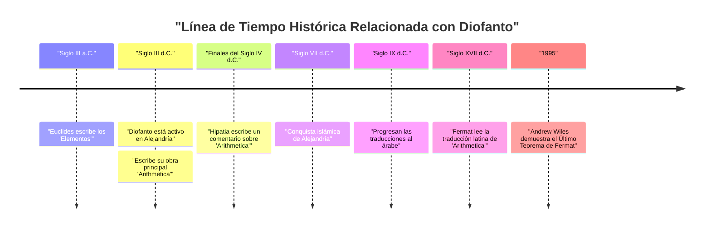
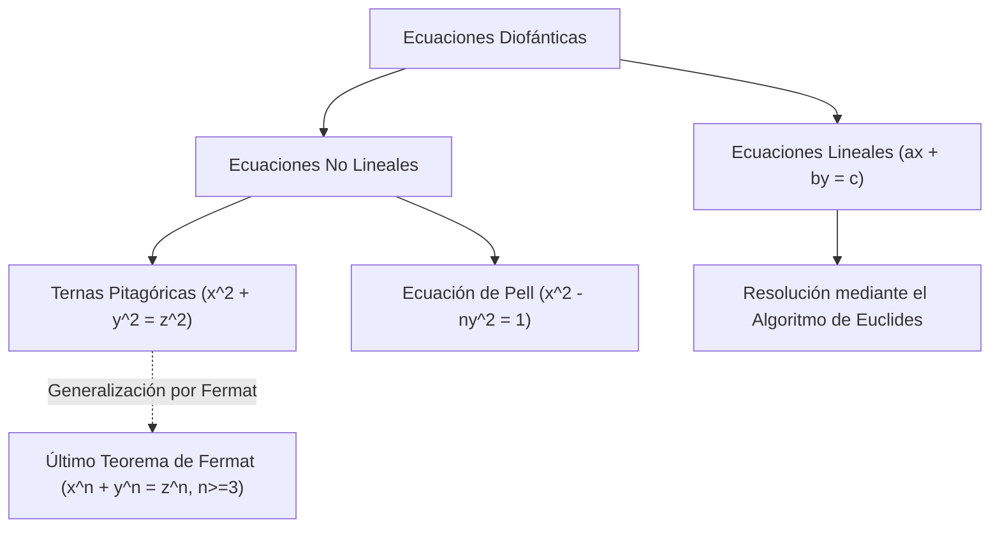

## 1. Introducción

En la historia de las matemáticas, hay una figura conocida como el "Padre del Álgebra". Esa figura es **[Diofanto](https://kenji.blog/es/p/diophantus/)** ([Diofanto](https://kenji.blog/es/p/diophantus/) de Alejandría), quien estuvo activo en la antigua Alejandría. Su obra principal, la *Arithmetica*, tuvo una profunda influencia en los matemáticos posteriores del mundo islámico y en los matemáticos de la Europa del Renacimiento. En particular, el "Último Teorema de [Fermat](https://kenji.blog/es/p/fermat/)", que [Pierre de Fermat](https://kenji.blog/es/p/fermat/) escribió en los márgenes de la *Arithmetica*, es extremadamente famoso.

En este artículo, profundizaremos en la vida de [Diofanto](https://kenji.blog/es/p/diophantus/), sus logros matemáticos, los detalles de su obra maestra *Arithmetica* y las "ecuaciones diofánticas" que llevan su nombre. Además, también desentrañaremos el misterio de su "epitafio", del cual se puede deducir su esperanza de vida.

## 2. La Vida de [Diofanto](https://kenji.blog/es/p/diophantus/) y el Contexto Histórico

### 2.1 Una Vida Envuelta en Misterio

Casi no quedan registros exactos sobre cuándo nació [Diofanto](https://kenji.blog/es/p/diophantus/) o cuándo murió. En general, se cree que estuvo activo en Alejandría, Egipto, alrededor del siglo III d.C. (entre el 200 y el 284 d.C.). Por las fechas de los personajes que menciona (como Hipsicles), sabemos que fue después del 150 a.C., y dado que Teón de Alejandría (siglo IV d.C.) menciona a [Diofanto](https://kenji.blog/es/p/diophantus/), es seguro que fue antes del 364 d.C. Los historiadores modernos estiman que floreció alrededor del año 250 d.C.

### 2.2 La Cultura Helenística y Alejandría

En esa época, Alejandría era el centro de la cultura y el aprendizaje helenísticos, jactándose de una biblioteca masiva (la Biblioteca de Alejandría) y sirviendo como un nexo de conocimiento donde se reunían muchos eruditos. En esta ciudad donde se cruzaban los conocimientos de Grecia, Egipto, Babilonia e incluso la India, se cree que [Diofanto](https://kenji.blog/es/p/diophantus/) tuvo acceso a una vasta herencia matemática del pasado. A diferencia de la tradición geométrica establecida por grandes matemáticos griegos como [Euclides](https://kenji.blog/es/p/euclid/), Arquímedes y Apolonio, algunas teorías sugieren que [Diofanto](https://kenji.blog/es/p/diophantus/) estuvo fuertemente influenciado por el enfoque algebraico de Babilonia.

## 3. El Impacto de Su Obra Maestra *Arithmetica*

El mayor logro de [Diofanto](https://kenji.blog/es/p/diophantus/) es su libro *Arithmetica*, que se dice constaba de 13 volúmenes. Desafortunadamente, solo seis de ellos sobreviven en griego hoy en día, y se han descubierto cuatro más en traducción árabe.

### 3.1 El Amanecer del Álgebra Simbólica

El aspecto innovador de la *Arithmetica* es su uso de **símbolos** para representar incógnitas, sus potencias (cuadrados, cubos, etc.) y operaciones (suma, resta, igualdad, etc.). En las matemáticas griegas anteriores a él (como en el caso de [Euclides](https://kenji.blog/es/p/euclid/)), los problemas matemáticos se describían principalmente mediante figuras geométricas y se explicaban con palabras (esto se llama álgebra retórica). Sin embargo, [Diofanto](https://kenji.blog/es/p/diophantus/) hizo posible manejar ecuaciones más abstractas y complejas simbolizando las expresiones matemáticas (una fase de transición llamada álgebra sincopada).

Usó un símbolo especial (equivalente a la $x$ moderna) para representar una incógnita, y dio notaciones únicas a los términos constantes y los recíprocos de las incógnitas.

$$
\text{Ejemplo del polinomio de [Diofanto](https://kenji.blog/es/p/diophantus/) (notación moderna):} \\
3x^3 - 2x^2 + 5x - 1 = 0
$$

### 3.2 Problemas Abordados y Soluciones Racionales

*Arithmetica* contiene alrededor de 130 problemas relacionados con sistemas de ecuaciones lineales, ecuaciones cuadráticas e incluso ecuaciones de mayor grado. Una característica importante de estos problemas es que, a diferencia de los matemáticos modernos que buscan soluciones reales o complejas, él buscaba principalmente **soluciones racionales (fracciones positivas o números enteros)**. Los conceptos de números negativos, el cero y los números irracionales aún no estaban completamente establecidos en ese momento, y él no los reconocía como soluciones. Para él, los "números" significaban números racionales positivos.

Por ejemplo, cuando [Diofanto](https://kenji.blog/es/p/diophantus/) se encontraba con una ecuación como $4x + 20 = 4$, la descartaba como "absurda" porque su solución sería un número negativo ($x = -4$).

## 4. Ecuaciones Diofánticas

Hoy en día, el término "ecuación diofántica" se refiere a una **ecuación polinómica con coeficientes enteros para la cual solo se buscan soluciones enteras**. Aunque el propio [Diofanto](https://kenji.blog/es/p/diophantus/) también buscaba soluciones racionales, esto se desarrolló en una rama importante de la "teoría de números" en las matemáticas posteriores.

### 4.1 Ecuaciones Diofánticas Lineales

La ecuación diofántica más simple es una ecuación lineal con dos variables (ecuación diofántica lineal).

$$
ax + by = c \quad (a, b, c \text{ son números enteros})
$$

Una condición necesaria y suficiente para que esta ecuación tenga una solución entera $(x, y)$ es que el máximo común divisor de $a$ y $b$, $\gcd(a, b)$, divida a $c$ (Identidad de Bézout).

**Ejemplo:**
Considera la ecuación $4x + 6y = 8$.
Dado que $\gcd(4, 6) = 2$, y $2$ divide a $8$, existen soluciones enteras.
Una solución es $x = 2, y = 0$ ($4(2) + 6(0) = 8$).
Además, la solución general se puede expresar como $x = 2 + 3k, y = -2k$ (donde $k$ es cualquier número entero).

### 4.2 Ternas Pitagóricas y Ecuaciones Diofánticas No Lineales

La ecuación familiar del teorema de Pitágoras también es un tipo de ecuación diofántica.

$$
x^2 + y^2 = z^2
$$

Un conjunto de números enteros positivos $(x, y, z)$ que satisface esta ecuación se llama una **terna pitagórica**. Ejemplos famosos incluyen $(3, 4, 5)$ y $(5, 12, 13)$. En el Libro II, Problema 8 de la *Arithmetica*, [Diofanto](https://kenji.blog/es/p/diophantus/) aborda el problema de dividir un número cuadrado dado en la suma de dos cuadrados (por ejemplo, encontrar números racionales $x, y$ tales que $16 = x^2 + y^2$).

En el margen junto a este problema, [Pierre de Fermat](https://kenji.blog/es/p/fermat/), un juez y matemático aficionado francés del siglo XVII, dejó la siguiente nota:

> "Es imposible separar un cubo en dos cubos, o una cuarta potencia en dos cuartas potencias, o en general, cualquier potencia mayor que la segunda, en dos potencias iguales. He descubierto una demostración verdaderamente maravillosa de esto, que este margen es demasiado estrecho para contener."

Este es el famoso **Último Teorema de [Fermat](https://kenji.blog/es/p/fermat/)** (que $x^n + y^n = z^n \ (n \ge 3)$ no tiene soluciones enteras positivas). Este teorema continuó rechazando los desafíos de matemáticos geniales de todo el mundo durante unos 350 años después de haber sido propuesto, hasta que finalmente fue demostrado por [Andrew Wiles](https://kenji.blog/es/p/wiles/) en 1995. Sin el libro de [Diofanto](https://kenji.blog/es/p/diophantus/), este gran drama podría no haber ocurrido nunca.

## 5. El Epitafio de [Diofanto](https://kenji.blog/es/p/diophantus/)

La pista más interesante, y tal vez la única específica para comprender la vida de [Diofanto](https://kenji.blog/es/p/diophantus/), es el acertijo algebraico que se dice estaba tallado en su lápida. Este fue registrado en la *Antología Griega* compilada por Metrodoro alrededor del siglo V, y permite deducir la duración de la vida de [Diofanto](https://kenji.blog/es/p/diophantus/) resolviendo una ecuación lineal.

### 5.1 El Contenido del Epitafio

> Aquí yace [Diofanto](https://kenji.blog/es/p/diophantus/). Los números cuentan la duración de su vida.
> Durante $\frac{1}{6}$ de su vida fue un niño.
> Después de $\frac{1}{12}$ más, su barba comenzó a crecer.
> Después de $\frac{1}{7}$ más, se casó.
> Cinco años después de su matrimonio, nació su hijo.
> Pero por desgracia, el hijo murió a la mitad de la edad de su padre.
> Cuatro años después de la muerte de su hijo, él también exhaló su último suspiro en dolor.

### 5.2 Solución mediante Ecuación

Si definimos $x$ como la esperanza de vida de [Diofanto](https://kenji.blog/es/p/diophantus/) (años vividos), el texto anterior se puede expresar como la siguiente ecuación:

$$
\frac{x}{6} + \frac{x}{12} + \frac{x}{7} + 5 + \frac{x}{2} + 4 = x
$$

Resolvamos esta ecuación.

Primero, encuentra el mínimo común múltiplo de los denominadores de las fracciones. El mínimo común múltiplo de 6, 12, 7 y 2 es 84.
Multiplica ambos lados por 84.

$$
14x + 7x + 12x + 420 + 42x + 336 = 84x
$$

Combina los términos de $x$.

$$
(14 + 7 + 12 + 42)x + (420 + 336) = 84x \\
75x + 756 = 84x
$$

Reúne las $x$ en el lado derecho.

$$
756 = 84x - 75x \\
756 = 9x
$$

Divide ambos lados por 9.

$$
x = 84
$$

Por lo tanto, podemos ver que [Diofanto](https://kenji.blog/es/p/diophantus/) murió a la edad de **84** años. Teniendo en cuenta la esperanza de vida promedio de la época, vivió una vida muy larga. La línea de tiempo de su vida es la siguiente:

- Niñez: $84 \times \frac{1}{6} = 14$ años (edades 0-14)
- Juventud: $84 \times \frac{1}{12} = 7$ años (edades 14-21)
- Hasta el matrimonio: $84 \times \frac{1}{7} = 12$ años (edades 21-33)
- Nacimiento del hijo: 5 años después del matrimonio (33 + 5 = 38 años)
- Vida útil del hijo: $84 \times \frac{1}{2} = 42$ años
- Muerte del hijo: cuando [Diofanto](https://kenji.blog/es/p/diophantus/) tenía 80 años (38 + 42 = 80 años)
- Muerte de [Diofanto](https://kenji.blog/es/p/diophantus/): 4 años después de la muerte del hijo (80 + 4 = 84 años)

## 6. Influencia en Generaciones Posteriores y Legado

Las obras de [Diofanto](https://kenji.blog/es/p/diophantus/) se perdieron temporalmente para el mundo de Europa Occidental con la caída del Imperio Romano. Sin embargo, fueron cuidadosamente conservadas y estudiadas en el Imperio Romano de Oriente (Bizantino) y en el mundo islámico. A finales del siglo IV, se dice que Hipatia de Alejandría escribió un comentario sobre la *Arithmetica*.

En particular, los matemáticos de Bagdad en el siglo IX tradujeron la *Arithmetica* al árabe, contribuyendo enormemente al desarrollo del álgebra islámica. Los matemáticos islámicos como Al-Karaji adoptaron y desarrollaron aún más los métodos de [Diofanto](https://kenji.blog/es/p/diophantus/).

En el siglo XVI, a medida que se redescubrían los clásicos griegos en la Europa del Renacimiento, la *Arithmetica* se tradujo al latín. Una edición bilingüe en griego y latín publicada por [Claude Gaspard Bachet](https://kenji.blog/es/p/bachet/) de Méziriac en 1621 fue muy leída. Fue esta edición de [Bachet](https://kenji.blog/es/p/bachet/) de la *Arithmetica* la que [Fermat](https://kenji.blog/es/p/fermat/) estudió cuidadosamente, lo que desencadenó la apertura de una nueva puerta en las matemáticas.

La teoría de las ecuaciones diofánticas fue posteriormente profundamente estudiada por gigantes como [Leonhard Euler](https://kenji.blog/es/p/euler/), [Joseph-Louis Lagrange](https://kenji.blog/es/p/lagrange/) y [Carl Friedrich Gauss](https://kenji.blog/es/p/gauss/). Su investigación creció hasta convertirse en los vastos campos matemáticos de la "teoría algebraica de números" y la "geometría algebraica" modernas. El décimo de los 23 problemas de [Hilbert](https://kenji.blog/es/p/hilbert/) fue "encontrar un algoritmo general para determinar si una ecuación diofántica dada es resoluble", y en 1970 Yuri Matiyasevich demostró que "tal algoritmo no existe". El nombre de [Diofanto](https://kenji.blog/es/p/diophantus/) está profundamente grabado en la vanguardia de las matemáticas modernas.

## 7. Conclusión

[Diofanto](https://kenji.blog/es/p/diophantus/) fue un pionero que sentó las bases del álgebra moderna mediante el uso de símbolos para expresiones matemáticas y el tratamiento de las incógnitas. La *Arithmetica* que dejó atrás no era simplemente una colección de rompecabezas o problemas de cálculo, sino que contenía profundos conocimientos sobre las propiedades de los números. Los problemas que presentó han seguido fascinando a los matemáticos a lo largo de milenios y han sido una fuerza impulsora que movió enormemente la historia de las matemáticas.

Su epitafio, que cuenta silenciosamente la historia de una vida de 84 años a través de fórmulas, nos enseña la belleza universal de las matemáticas y la búsqueda de la verdad eterna. Verdaderamente, [Diofanto](https://kenji.blog/es/p/diophantus/) puede ser llamado una gran figura que puso la primera piedra del magnífico edificio del álgebra.
