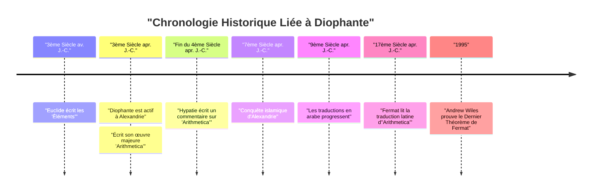
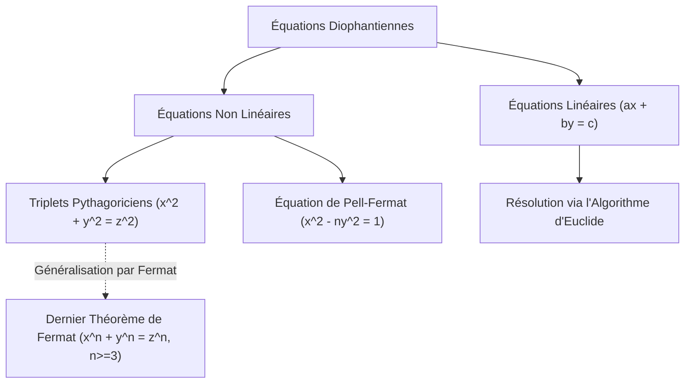

## 1. Introduction

Dans l'histoire des mathématiques, il y a une figure connue sous le nom de « Père de l'Algèbre ». Il s'agit de **[Diophante](https://kenji.blog/fr/p/diophantus/)** (Diophante d'Alexandrie), qui était actif dans l'antique Alexandrie. Son œuvre majeure, *Arithmetica*, a eu une influence profonde sur les mathématiciens ultérieurs du monde islamique et de l'Europe de la Renaissance. En particulier, le « Dernier Théorème de Fermat », que [Pierre de Fermat](https://kenji.blog/fr/p/fermat/) a écrit dans les marges d'*Arithmetica*, est extrêmement célèbre.

Dans cet article, nous plongerons dans la vie de [Diophante](https://kenji.blog/fr/p/diophantus/), ses réalisations mathématiques, les détails de son chef-d'œuvre *Arithmetica*, et les « équations diophantiennes » qui portent son nom. De plus, nous percerons le mystère de son « épitaphe », à partir de laquelle sa durée de vie peut être déduite.

## 2. La Vie de [Diophante](https://kenji.blog/fr/p/diophantus/) et le Contexte Historique

### 2.1 Une Vie Nappée de Mystère

Il ne reste presque aucune trace précise de la naissance ou de la mort de [Diophante](https://kenji.blog/fr/p/diophantus/). Généralement, on pense qu'il était actif à Alexandrie, en Égypte, vers le 3ème siècle après J.-C. (entre 200 et 284 après J.-C.). D'après les dates des personnalités qu'il mentionne (comme Hypsiclès), nous savons que c'était après 150 avant J.-C., et puisque Théon d'Alexandrie (4ème siècle après J.-C.) mentionne [Diophante](https://kenji.blog/fr/p/diophantus/), il est certain que c'était avant 364 après J.-C. Les historiens modernes estiment qu'il a prospéré autour de l'an 250 après J.-C.

### 2.2 La Culture Hellénistique et Alexandrie

À l'époque, Alexandrie était le centre de la culture et du savoir hellénistiques, abritant une immense bibliothèque (la Bibliothèque d'Alexandrie) et servant de nœud de connaissances où de nombreux érudits se réunissaient. Dans cette ville où se croisaient les connaissances de la Grèce, de l'Égypte, de la Babylonie et même de l'Inde, on pense que [Diophante](https://kenji.blog/fr/p/diophantus/) a eu accès à un vaste héritage mathématique du passé. Contrairement à la tradition géométrique établie par les grands mathématiciens grecs comme Euclide, Archimède et Apollonius, certaines théories suggèrent que [Diophante](https://kenji.blog/fr/p/diophantus/) a été fortement influencé par l'approche algébrique babylonienne.

## 3. L'Impact de Son Chef-d'œuvre *Arithmetica*

La plus grande réalisation de [Diophante](https://kenji.blog/fr/p/diophantus/) est son livre *Arithmetica*, qui aurait consisté en 13 volumes. Malheureusement, seuls six d'entre eux survivent en grec aujourd'hui, et quatre autres ont été découverts en traduction arabe.

### 3.1 L'Aube de l'Algèbre Symbolique

L'aspect révolutionnaire d'*Arithmetica* est son utilisation de **symboles** pour représenter des inconnues, leurs puissances (carrés, cubes, etc.), et les opérations (addition, soustraction, égalité, etc.). Dans les mathématiques grecques avant lui (comme chez [Euclide](https://kenji.blog/fr/p/euclid/)), les problèmes mathématiques étaient principalement décrits à l'aide de figures géométriques et expliqués avec des mots (c'est ce qu'on appelle l'algèbre rhétorique). Cependant, [Diophante](https://kenji.blog/fr/p/diophantus/) a rendu possible la manipulation d'équations plus abstraites et complexes en symbolisant les expressions mathématiques (une phase de transition appelée algèbre syncopée).

Il utilisait un symbole spécial (équivalent au $x$ moderne) pour représenter une inconnue, et donnait des notations uniques aux termes constants et aux inverses des inconnues.

$$
\text{Exemple du polynôme de [Diophante](https://kenji.blog/fr/p/diophantus/) (notation moderne) :} \\
3x^3 - 2x^2 + 5x - 1 = 0
$$

### 3.2 Problèmes Traités et Solutions Rationnelles

*Arithmetica* contient environ 130 problèmes concernant des systèmes d'équations linéaires, des équations quadratiques, et même des équations de degré supérieur. Une caractéristique majeure de ces problèmes est que, contrairement aux mathématiciens modernes qui cherchent des solutions réelles ou complexes, il cherchait principalement des **solutions rationnelles (fractions positives ou entiers)**. Les concepts de nombres négatifs, de zéro et de nombres irrationnels n'étaient pas encore complètement établis à l'époque, et il ne les reconnaissait pas comme des solutions. Pour lui, les « nombres » signifiaient des nombres rationnels positifs.

Par exemple, lorsque [Diophante](https://kenji.blog/fr/p/diophantus/) rencontrait une équation comme $4x + 20 = 4$, il la rejetait comme « absurde » car sa solution serait un nombre négatif ($x = -4$).

## 4. Les Équations Diophantiennes

Aujourd'hui, le terme « équation diophantienne » désigne une **équation polynomiale à coefficients entiers pour laquelle on ne cherche que des solutions entières**. Bien que [Diophante](https://kenji.blog/fr/p/diophantus/) lui-même ait également cherché des solutions rationnelles, cela s'est développé en une branche importante de la « théorie des nombres » dans les mathématiques ultérieures.

### 4.1 Équations Diophantiennes Linéaires

L'équation diophantienne la plus simple est une équation linéaire à deux variables (équation diophantienne linéaire).

$$
ax + by = c \quad (a, b, c \text{ sont des entiers})
$$

Une condition nécessaire et suffisante pour que cette équation ait une solution entière $(x, y)$ est que le plus grand commun diviseur de $a$ et $b$, $\gcd(a, b)$, divise $c$ (identité de Bézout).

**Exemple :**
Considérons l'équation $4x + 6y = 8$.
Puisque $\gcd(4, 6) = 2$, et que $2$ divise $8$, des solutions entières existent.
Une solution est $x = 2, y = 0$ ($4(2) + 6(0) = 8$).
De plus, la solution générale peut s'exprimer comme $x = 2 + 3k, y = -2k$ (où $k$ est un entier quelconque).

### 4.2 Triplés Pythagoriciens et Équations Diophantiennes Non Linéaires

L'équation familière du théorème de Pythagore est également un type d'équation diophantienne.

$$
x^2 + y^2 = z^2
$$

Un ensemble d'entiers positifs $(x, y, z)$ qui satisfait à cette équation est appelé un **triplet pythagoricien**. Des exemples célèbres incluent $(3, 4, 5)$ et $(5, 12, 13)$. Dans le Livre II, Problème 8 d'*Arithmetica*, [Diophante](https://kenji.blog/fr/p/diophantus/) aborde le problème de diviser un nombre carré donné en la somme de deux carrés (par exemple, trouver des nombres rationnels $x, y$ tels que $16 = x^2 + y^2$).

Dans la marge à côté de ce problème, [Pierre de Fermat](https://kenji.blog/fr/p/fermat/), juge français du 17ème siècle et mathématicien amateur, a laissé la note suivante :

> « Il est impossible de séparer un cube en deux cubes, ou une puissance quatrième en deux puissances quatrièmes, ou en général, toute puissance supérieure à la seconde, en deux puissances semblables. J'en ai découvert une démonstration véritablement merveilleuse, que cette marge est trop étroite pour contenir. »

C'est le célèbre **Dernier Théorème de [Fermat](https://kenji.blog/fr/p/fermat/)** (que $x^n + y^n = z^n \ (n \ge 3)$ n'a pas de solutions entières positives). Ce théorème a continué de repousser les défis des mathématiciens de génie du monde entier pendant environ 350 ans après avoir été proposé, jusqu'à ce qu'il soit finalement prouvé par Andrew Wiles en 1995. Sans le livre de [Diophante](https://kenji.blog/fr/p/diophantus/), ce grand drame n'aurait peut-être jamais eu lieu.

## 5. L'Épitaphe de [Diophante](https://kenji.blog/fr/p/diophantus/)

L'indice le plus intéressant, et peut-être le seul spécifique pour comprendre la vie de [Diophante](https://kenji.blog/fr/p/diophantus/), est l'énigme algébrique qui aurait été gravée sur sa pierre tombale. Celle-ci a été enregistrée dans l'*Anthologie Grecque* compilée par Métrodore vers le 5ème siècle, et elle permet de déduire la durée de vie de [Diophante](https://kenji.blog/fr/p/diophantus/) en résolvant une équation linéaire.

### 5.1 Le Contenu de l'Épitaphe

> Ci-gît [Diophante](https://kenji.blog/fr/p/diophantus/). Les nombres disent la longueur de sa vie.
> Pendant $\frac{1}{6}$ de sa vie, il fut un garçon.
> Après $\frac{1}{12}$ de plus, sa barbe commença à pousser.
> Après $\frac{1}{7}$ de plus, il se maria.
> Cinq ans après son mariage, son fils naquit.
> Mais hélas, le fils mourut à la moitié de l'âge de son père.
> Quatre ans après la mort de son fils, il rendit lui-même son dernier soupir dans le chagrin.

### 5.2 Solution par Équation

Si nous posons $x$ comme la durée de vie de [Diophante](https://kenji.blog/fr/p/diophantus/) (années vécues), le texte ci-dessus peut s'exprimer par l'équation suivante :

$$
\frac{x}{6} + \frac{x}{12} + \frac{x}{7} + 5 + \frac{x}{2} + 4 = x
$$

Résolvons cette équation.

D'abord, trouvons le plus petit commun multiple des dénominateurs des fractions. Le plus petit commun multiple de 6, 12, 7 et 2 est 84.
Multiplions les deux côtés par 84.

$$
14x + 7x + 12x + 420 + 42x + 336 = 84x
$$

Combinons les termes en $x$.

$$
(14 + 7 + 12 + 42)x + (420 + 336) = 84x \\
75x + 756 = 84x
$$

Rassemblons les $x$ du côté droit.

$$
756 = 84x - 75x \\
756 = 9x
$$

Divisons les deux côtés par 9.

$$
x = 84
$$

Par conséquent, nous pouvons voir que [Diophante](https://kenji.blog/fr/p/diophantus/) est mort à l'âge de **84** ans. Considérant l'espérance de vie moyenne de l'époque, il a vécu une très longue vie. La chronologie de sa vie est la suivante :

- Enfance : $84 \times \frac{1}{6} = 14$ ans (âges 0-14)
- Jeunesse : $84 \times \frac{1}{12} = 7$ ans (âges 14-21)
- Jusqu'au mariage : $84 \times \frac{1}{7} = 12$ ans (âges 21-33)
- Naissance du fils : 5 ans après le mariage (33 + 5 = 38 ans)
- Durée de vie du fils : $84 \times \frac{1}{2} = 42$ ans
- Mort du fils : quand [Diophante](https://kenji.blog/fr/p/diophantus/) avait 80 ans (38 + 42 = 80 ans)
- Mort de [Diophante](https://kenji.blog/fr/p/diophantus/) : 4 ans après la mort du fils (80 + 4 = 84 ans)

## 6. Influence sur les Générations Ultérieures et Héritage

Les œuvres de [Diophante](https://kenji.blog/fr/p/diophantus/) ont été temporairement perdues pour le monde de l'Europe occidentale avec le déclin de l'Empire Romain. Cependant, elles ont été soigneusement préservées et étudiées dans l'Empire Romain d'Orient (Byzantin) et le monde islamique. À la fin du 4ème siècle, Hypatie d'Alexandrie aurait écrit un commentaire sur *Arithmetica*.

En particulier, les mathématiciens de Bagdad du 9ème siècle ont traduit *Arithmetica* en arabe, contribuant grandement au développement de l'algèbre islamique. Les mathématiciens islamiques comme Al-Karaji ont adopté et développé davantage les méthodes de [Diophante](https://kenji.blog/fr/p/diophantus/).

Au 16ème siècle, avec la redécouverte des classiques grecs dans l'Europe de la Renaissance, *Arithmetica* a été traduite en latin. Une édition bilingue grecque et latine publiée par [Claude Gaspard Bachet](https://kenji.blog/fr/p/bachet/) de Méziriac en 1621 a été largement lue. C'est cette édition de Bachet d'*Arithmetica* que [Fermat](https://kenji.blog/fr/p/fermat/) a étudiée avec soin, ce qui a déclenché l'ouverture d'une nouvelle porte en mathématiques.

La théorie des équations diophantiennes a ensuite été profondément étudiée par des géants tels que [Leonhard Euler](https://kenji.blog/fr/p/euler/), Joseph-Louis Lagrange, et Carl Friedrich Gauss. Leurs recherches se sont développées dans les vastes domaines mathématiques modernes de la « théorie algébrique des nombres » et de la « géométrie algébrique ». Le 10ème des 23 problèmes de Hilbert était « de trouver un algorithme général pour déterminer si une équation diophantienne donnée est résoluble », et en 1970 Yuri Matiyasevich a prouvé qu'« aucun algorithme de ce type n'existe ». Le nom de [Diophante](https://kenji.blog/fr/p/diophantus/) est profondément gravé à la pointe des mathématiques modernes.

## 7. Conclusion

[Diophante](https://kenji.blog/fr/p/diophantus/) était un pionnier qui a jeté les bases de l'algèbre moderne en utilisant des symboles pour les expressions mathématiques et en traitant les inconnues. L'*Arithmetica* qu'il a laissée derrière lui n'était pas seulement une collection de puzzles ou de problèmes de calcul, mais contenait des aperçus profonds sur les propriétés des nombres. Les problèmes qu'il a présentés ont continué de fasciner les mathématiciens à travers les millénaires et ont été une force motrice qui a grandement fait avancer l'histoire des mathématiques.

Son épitaphe, qui raconte discrètement l'histoire d'une vie de 84 ans à travers des formules, nous enseigne la beauté universelle des mathématiques et la quête de la vérité intemporelle. [Diophante](https://kenji.blog/fr/p/diophantus/) peut vraiment être qualifié de grand personnage qui a posé la première pierre du magnifique édifice de l'algèbre.
