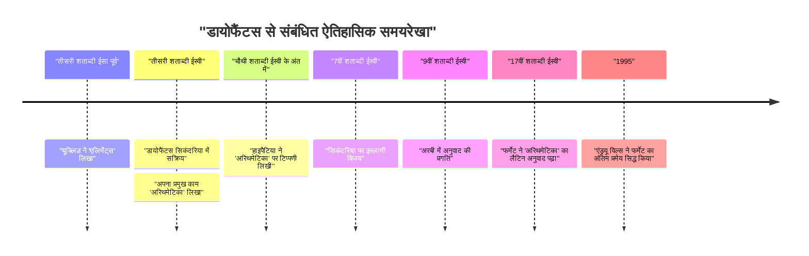
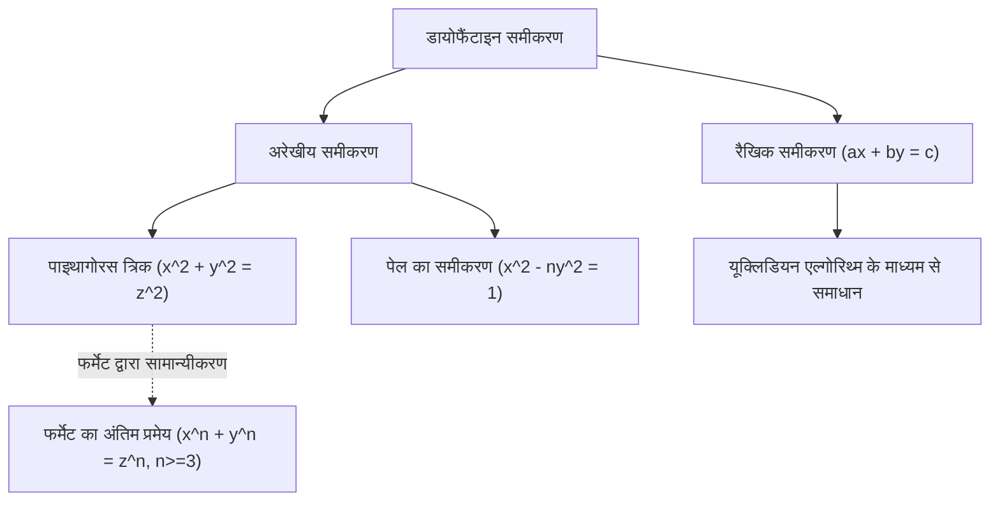

## 1. परिचय

गणित के इतिहास में, एक ऐसी शख्सियत है जिसे "बीजगणित का पिता" कहा जाता है। वह शख्सियत **[डायोफैंटस](https://kenji.blog/hi/p/diophantus/)** (सिकंदरिया के डायोफैंटस) हैं, जो प्राचीन सिकंदरिया में सक्रिय थे। उनके प्रमुख काम, *अरिथमेटिका*, का इस्लामी दुनिया के बाद के गणितज्ञों और पुनर्जागरण यूरोप के गणितज्ञों पर गहरा प्रभाव पड़ा। विशेष रूप से, "[फर्मेट का अंतिम प्रमेय](https://kenji.blog/hi/p/fermats-last-theorem/)", जिसे पियरे डी फर्मेट ने *अरिथमेटिका* के हाशिये में लिखा था, बेहद प्रसिद्ध है।

इस लेख में, हम [डायोफैंटस](https://kenji.blog/hi/p/diophantus/) के जीवन, उनकी गणितीय उपलब्धियों, उनकी उत्कृष्ट कृति *अरिथमेटिका* के विवरण और उनके नाम पर रखे गए "डायोफैंटाइन समीकरणों" पर गहराई से विचार करेंगे। इसके अलावा, हम उनके "समाधि-लेख" (एपिटाफ) के रहस्य को भी सुलझाएंगे, जिससे उनके जीवनकाल का अनुमान लगाया जा सकता है।

## 2. [डायोफैंटस](https://kenji.blog/hi/p/diophantus/) का जीवन और ऐतिहासिक पृष्ठभूमि

### 2.1 रहस्यों से घिरा जीवन

[डायोफैंटस](https://kenji.blog/hi/p/diophantus/) का जन्म कब हुआ था या उनकी मृत्यु कब हुई थी, इसके बारे में लगभग कोई सटीक रिकॉर्ड नहीं बचा है। आमतौर पर, यह माना जाता है कि वह तीसरी शताब्दी ईस्वी (200 और 284 ईस्वी के बीच) के आसपास मिस्र के सिकंदरिया में सक्रिय थे। जिन हस्तियों का वह उल्लेख करते हैं (जैसे हाइप्सिकल्स) उनकी तारीखों से, हम जानते हैं कि यह 150 ईसा पूर्व के बाद था, और चूंकि सिकंदरिया के थियोन (चौथी शताब्दी ईस्वी) [डायोफैंटस](https://kenji.blog/hi/p/diophantus/) का उल्लेख करते हैं, यह निश्चित है कि यह 364 ईस्वी से पहले था। आधुनिक इतिहासकारों का अनुमान है कि वह लगभग 250 ईस्वी के आसपास फले-फूले।

### 2.2 हेलेनिस्टिक संस्कृति और सिकंदरिया

उस समय, सिकंदरिया हेलेनिस्टिक संस्कृति और शिक्षा का केंद्र था, एक विशाल पुस्तकालय (सिकंदरिया का पुस्तकालय) का दावा करता था और ज्ञान के एक गठजोड़ के रूप में काम करता था जहां कई विद्वान इकट्ठा होते थे। इस शहर में जहां ग्रीस, मिस्र, बेबीलोनिया और यहां तक ​​कि भारत का ज्ञान एक-दूसरे से जुड़ता था, माना जाता है कि [डायोफैंटस](https://kenji.blog/hi/p/diophantus/) की अतीत की एक विशाल गणितीय विरासत तक पहुंच थी। महान ग्रीक गणितज्ञों जैसे यूक्लिड, आर्किमिडीज़ और अपोलोनियस द्वारा स्थापित ज्यामितीय परंपरा के विपरीत, कुछ सिद्धांतों का सुझाव है कि [डायोफैंटस](https://kenji.blog/hi/p/diophantus/) बेबीलोनिया के बीजगणितीय दृष्टिकोण से काफी प्रभावित थे।

## 3. उनकी उत्कृष्ट कृति *अरिथमेटिका* का प्रभाव

[डायोफैंटस](https://kenji.blog/hi/p/diophantus/) की सबसे बड़ी उपलब्धि उनकी पुस्तक *अरिथमेटिका* है, जिसके बारे में कहा जाता है कि इसमें 13 खंड थे। दुर्भाग्य से, उनमें से केवल छह आज ग्रीक में बचे हैं, और अरबी अनुवाद में चार और खोजे गए हैं।

### 3.1 प्रतीकात्मक बीजगणित का उदय

*अरिथमेटिका* का ज़मीनी स्तर का पहलू अज्ञातों, उनकी घातों (वर्ग, घन, आदि), और संक्रियाओं (जोड़, घटाव, समानता, आदि) का प्रतिनिधित्व करने के लिए **प्रतीकों** का उपयोग है। उनके पहले के ग्रीक गणित (जैसे [यूक्लिड](https://kenji.blog/hi/p/euclid/) में) में, गणितीय समस्याओं को मुख्य रूप से ज्यामितीय आकृतियों का उपयोग करके वर्णित किया गया था और शब्दों में समझाया गया था (इसे आलंकारिक बीजगणित कहा जाता है)। हालाँकि, [डायोफैंटस](https://kenji.blog/hi/p/diophantus/) ने गणितीय अभिव्यक्तियों (एक संक्रमणकालीन चरण जिसे सिंकोपेटेड बीजगणित कहा जाता है) को प्रतीक बनाकर अधिक अमूर्त और जटिल समीकरणों को संभालना संभव बना दिया।

उन्होंने एक अज्ञात का प्रतिनिधित्व करने के लिए एक विशेष प्रतीक (आधुनिक $x$ के बराबर) का उपयोग किया, और स्थिर पदों और अज्ञात के व्युत्क्रमों को अद्वितीय संकेतन दिया।

$$
\text{[डायोफैंटस](https://kenji.blog/hi/p/diophantus/) के बहुपद का उदाहरण (आधुनिक संकेतन):} \\
3x^3 - 2x^2 + 5x - 1 = 0
$$

### 3.2 संबोधित समस्याएं और परिमेय समाधान

*अरिथमेटिका* में रैखिक समीकरणों के सिस्टम, द्विघात समीकरणों और यहां तक ​​कि उच्च-घात वाले समीकरणों से संबंधित लगभग 130 समस्याएं हैं। इन समस्याओं की एक प्रमुख विशेषता यह है कि, आधुनिक गणितज्ञों के विपरीत जो वास्तविक या सम्मिश्र समाधान चाहते हैं, उन्होंने मुख्य रूप से **परिमेय समाधान (धनात्मक भिन्न या पूर्णांक)** की मांग की। ऋणात्मक संख्याओं, शून्य और अपरिमेय संख्याओं की अवधारणाएं उस समय तक पूरी तरह से स्थापित नहीं हुई थीं, और उन्होंने उन्हें समाधान के रूप में मान्यता नहीं दी। उनके लिए, "संख्याओं" का अर्थ धनात्मक परिमेय संख्याएँ थीं।

उदाहरण के लिए, जब [डायोफैंटस](https://kenji.blog/hi/p/diophantus/) को $4x + 20 = 4$ जैसे समीकरण का सामना करना पड़ा, तो उन्होंने इसे "बेतुका" कहकर खारिज कर दिया क्योंकि इसका समाधान एक ऋणात्मक संख्या ($x = -4$) होगा।

## 4. डायोफैंटाइन समीकरण

आज, "डायोफैंटाइन समीकरण" शब्द एक **पूर्णांक गुणांक वाले बहुपद समीकरण को संदर्भित करता है जिसके लिए केवल पूर्णांक समाधान मांगे जाते हैं**। यद्यपि [डायोफैंटस](https://kenji.blog/hi/p/diophantus/) ने स्वयं भी परिमेय समाधान मांगे थे, लेकिन यह बाद के गणित में "संख्या सिद्धांत" की एक महत्वपूर्ण शाखा के रूप में विकसित हुआ।

### 4.1 रैखिक डायोफैंटाइन समीकरण

सबसे सरल डायोफैंटाइन समीकरण दो चर (रैखिक डायोफैंटाइन समीकरण) वाला एक रैखिक समीकरण है।

$$
ax + by = c \quad (a, b, c \text{ पूर्णांक हैं})
$$

इस समीकरण का पूर्णांक समाधान $(x, y)$ होने के लिए एक आवश्यक और पर्याप्त शर्त यह है कि $a$ और $b$ का महत्तम समापवर्तक (HCF), $\gcd(a, b)$, $c$ को विभाजित करता है (बेज़ाउट की पहचान)।

**उदाहरण:**
समीकरण $4x + 6y = 8$ पर विचार करें।
चूंकि $\gcd(4, 6) = 2$, और $2$ $8$ को विभाजित करता है, पूर्णांक समाधान मौजूद हैं।
एक समाधान $x = 2, y = 0$ ($4(2) + 6(0) = 8$) है।
साथ ही, सामान्य समाधान को $x = 2 + 3k, y = -2k$ के रूप में व्यक्त किया जा सकता है (जहां $k$ कोई भी पूर्णांक है)।

### 4.2 पाइथागोरस त्रिक और अरेखीय डायोफैंटाइन समीकरण

पाइथागोरस प्रमेय से परिचित समीकरण भी एक प्रकार का डायोफैंटाइन समीकरण है।

$$
x^2 + y^2 = z^2
$$

इस समीकरण को संतुष्ट करने वाले धनात्मक पूर्णांकों $(x, y, z)$ के एक सेट को **पाइथागोरस त्रिक** कहा जाता है। प्रसिद्ध उदाहरणों में $(3, 4, 5)$ और $(5, 12, 13)$ शामिल हैं। *अरिथमेटिका* की पुस्तक II, समस्या 8 में, [डायोफैंटस](https://kenji.blog/hi/p/diophantus/) एक दी गई वर्ग संख्या को दो वर्गों के योग में विभाजित करने की समस्या (उदा., परिमेय संख्याएँ $x, y$ ढूँढना ताकि $16 = x^2 + y^2$) को संबोधित करते हैं।

इस समस्या के बगल वाले हाशिये में, 17वीं सदी के फ्रांसीसी न्यायाधीश और शौकिया गणितज्ञ पियरे डी फर्मेट ने निम्नलिखित नोट छोड़ा था:

> "किसी घन को दो घनों में, या किसी चौथी घात को दो चौथी घातों में, या सामान्य रूप से, दूसरी घात से अधिक किसी भी घात को दो समान घातों में अलग करना असंभव है। मैंने इसका वास्तव में एक अद्भुत प्रमाण खोजा है, जिसे समाने के लिए यह हाशिया बहुत संकीर्ण है।"

यह प्रसिद्ध **[फर्मेट का अंतिम प्रमेय](https://kenji.blog/hi/p/fermats-last-theorem/)** है (कि $x^n + y^n = z^n \ (n \ge 3)$ का कोई धनात्मक पूर्णांक समाधान नहीं है)। इस प्रमेय ने प्रस्तावित होने के बाद लगभग 350 वर्षों तक दुनिया भर के प्रतिभाशाली गणितज्ञों की चुनौतियों को खारिज करना जारी रखा, जब तक कि इसे अंततः 1995 में एंड्रयू विल्स द्वारा सिद्ध नहीं कर दिया गया। [डायोफैंटस](https://kenji.blog/hi/p/diophantus/) की पुस्तक के बिना, यह महान नाटक शायद कभी नहीं हुआ होता।

## 5. [डायोफैंटस](https://kenji.blog/hi/p/diophantus/) का समाधि-लेख (एपिटाफ)

[डायोफैंटस](https://kenji.blog/hi/p/diophantus/) के जीवन को समझने के लिए सबसे दिलचस्प और शायद एकमात्र विशिष्ट सुराग बीजगणितीय पहेली है जिसके बारे में कहा जाता है कि वह उनके मकबरे पर उकेरी गई थी। इसे 5वीं शताब्दी के आसपास मेट्रोडोरस द्वारा संकलित *ग्रीक एंथोलॉजी* में दर्ज किया गया था, और यह एक रैखिक समीकरण को हल करके [डायोफैंटस](https://kenji.blog/hi/p/diophantus/) के जीवनकाल का अनुमान लगाने की अनुमति देता है।

### 5.1 समाधि-लेख की सामग्री

> यहाँ [डायोफैंटस](https://kenji.blog/hi/p/diophantus/) लेटा है। संख्याएँ उसके जीवन की लंबाई बताती हैं।
> उसके जीवन के $\frac{1}{6}$ के लिए वह एक लड़का था।
> और $\frac{1}{12}$ के बाद, उसकी दाढ़ी बढ़ने लगी।
> और $\frac{1}{7}$ के बाद, उसने शादी कर ली।
> उसकी शादी के पाँच साल बाद, उसका बेटा पैदा हुआ।
> लेकिन अफसोस, बेटा अपने पिता की आधी उम्र में मर गया।
> अपने बेटे की मृत्यु के चार साल बाद, उसने भी दुख में अपनी अंतिम सांस ली।

### 5.2 समीकरण के माध्यम से समाधान

यदि हम $x$ को [डायोफैंटस](https://kenji.blog/hi/p/diophantus/) का जीवनकाल (जीवित वर्ष) मान लें, तो उपरोक्त पाठ को निम्नलिखित समीकरण के रूप में व्यक्त किया जा सकता है:

$$
\frac{x}{6} + \frac{x}{12} + \frac{x}{7} + 5 + \frac{x}{2} + 4 = x
$$

आइए इस समीकरण को हल करें।

सबसे पहले, भिन्नों के हरों का लघुत्तम समापवर्त्य (LCM) ज्ञात करें। 6, 12, 7 और 2 का लघुत्तम समापवर्त्य 84 है।
दोनों पक्षों को 84 से गुणा करें।

$$
14x + 7x + 12x + 420 + 42x + 336 = 84x
$$

$x$ पदों को मिलाएँ।

$$
(14 + 7 + 12 + 42)x + (420 + 336) = 84x \\
75x + 756 = 84x
$$

$x$ को दाईं ओर इकट्ठा करें।

$$
756 = 84x - 75x \\
756 = 9x
$$

दोनों पक्षों को 9 से विभाजित करें।

$$
x = 84
$$

इसलिए, हम देख सकते हैं कि [डायोफैंटस](https://kenji.blog/hi/p/diophantus/) की मृत्यु **84** वर्ष की आयु में हुई थी। उस समय की औसत जीवन प्रत्याशा को देखते हुए, उन्होंने बहुत लंबा जीवन जीया। उनके जीवन की समयरेखा इस प्रकार है:

- लड़कपन: $84 \times \frac{1}{6} = 14$ वर्ष (आयु 0-14)
- युवावस्था: $84 \times \frac{1}{12} = 7$ वर्ष (आयु 14-21)
- शादी तक: $84 \times \frac{1}{7} = 12$ वर्ष (आयु 21-33)
- बेटे का जन्म: शादी के 5 साल बाद (33 + 5 = 38 साल पुराना)
- बेटे का जीवनकाल: $84 \times \frac{1}{2} = 42$ वर्ष
- बेटे की मृत्यु: जब [डायोफैंटस](https://kenji.blog/hi/p/diophantus/) 80 वर्ष का था (38 + 42 = 80 वर्ष पुराना)
- [डायोफैंटस](https://kenji.blog/hi/p/diophantus/) की मृत्यु: बेटे की मृत्यु के 4 साल बाद (80 + 4 = 84 साल पुराना)

## 6. बाद की पीढ़ियों पर प्रभाव और विरासत

रोमन साम्राज्य के पतन के साथ ही पश्चिमी यूरोपीय दुनिया के लिए [डायोफैंटस](https://kenji.blog/hi/p/diophantus/) की रचनाएँ अस्थायी रूप से खो गई थीं। हालाँकि, पूर्वी रोमन (बीजान्टिन) साम्राज्य और इस्लामी दुनिया में उन्हें सावधानीपूर्वक संरक्षित और अध्ययन किया गया था। चौथी शताब्दी के अंत में, सिकंदरिया की हाइपैटिया ने *अरिथमेटिका* पर एक टिप्पणी लिखी थी।

विशेष रूप से, 9वीं शताब्दी में बगदाद के गणितज्ञों ने *अरिथमेटिका* का अरबी में अनुवाद किया, जिससे इस्लामी बीजगणित के विकास में बहुत योगदान मिला। अल-कराजी जैसे इस्लामी गणितज्ञों ने [डायोफैंटस](https://kenji.blog/hi/p/diophantus/) के तरीकों को अपनाया और आगे विकसित किया।

16वीं शताब्दी में, जैसे-जैसे पुनर्जागरण यूरोप में ग्रीक क्लासिक्स की फिर से खोज की गई, *अरिथमेटिका* का लैटिन में अनुवाद किया गया। 1621 में क्लाउड गैस्पर्ड बाचेट डी मेज़िरियाक द्वारा प्रकाशित द्विभाषी ग्रीक और लैटिन संस्करण को व्यापक रूप से पढ़ा गया था। यह *अरिथमेटिका* का यह बाचेट संस्करण था जिसका फर्मेट ने सावधानीपूर्वक अध्ययन किया था, जिसने गणित में एक नए दरवाजे के खुलने की शुरुआत की।

बाद में [लियोनहार्ड यूलर](https://kenji.blog/hi/p/euler/), जोसेफ-लुई लैग्रेंज और कार्ल फ्रेडरिक गॉस जैसे दिग्गजों द्वारा डायोफैंटाइन समीकरणों के सिद्धांत का गहराई से अध्ययन किया गया। उनका शोध आधुनिक "बीजगणितीय संख्या सिद्धांत" और "बीजगणितीय ज्यामिति" के विशाल गणितीय क्षेत्रों में विकसित हुआ। हिल्बर्ट की 23 समस्याओं में से 10वीं समस्या "यह निर्धारित करने के लिए एक सामान्य एल्गोरिथ्म ढूँढना था कि क्या दिया गया डायोफैंटाइन समीकरण हल करने योग्य है", और 1970 में यूरी मतियासेविच ने साबित कर दिया कि "ऐसा कोई एल्गोरिथ्म मौजूद नहीं है।" [डायोफैंटस](https://kenji.blog/hi/p/diophantus/) का नाम आधुनिक गणित के अत्याधुनिक क्षेत्र में गहराई से उकेरा गया है।

## 7. निष्कर्ष

[डायोफैंटस](https://kenji.blog/hi/p/diophantus/) एक अग्रणी थे जिन्होंने गणितीय अभिव्यक्तियों के लिए प्रतीकों का उपयोग करके और अज्ञात से निपटकर आधुनिक बीजगणित की नींव रखी। उनके द्वारा छोड़ी गई *अरिथमेटिका* न केवल पहेलियों या गणना समस्याओं का एक संग्रह थी, बल्कि इसमें संख्याओं के गुणों के बारे में गहरी अंतर्दृष्टि शामिल थी। उनके द्वारा प्रस्तुत समस्याओं ने सहस्राब्दियों तक गणितज्ञों को मोहित करना जारी रखा है और एक प्रेरक शक्ति रही है जिसने गणित के इतिहास को बहुत आगे बढ़ाया है।

उनका समाधि-लेख, जो चुपचाप सूत्रों के माध्यम से 84 साल के जीवन की कहानी कहता है, हमें गणित की सार्वभौमिक सुंदरता और कालातीत सत्य की खोज सिखाता है। [डायोफैंटस](https://kenji.blog/hi/p/diophantus/) को वास्तव में एक महान व्यक्ति कहा जा सकता है जिसने बीजगणित की शानदार इमारत की पहली आधारशिला रखी।
