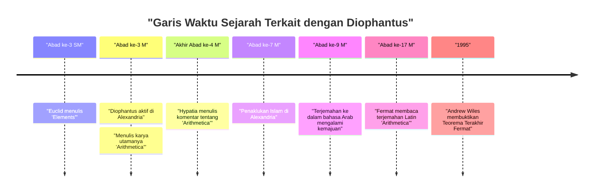
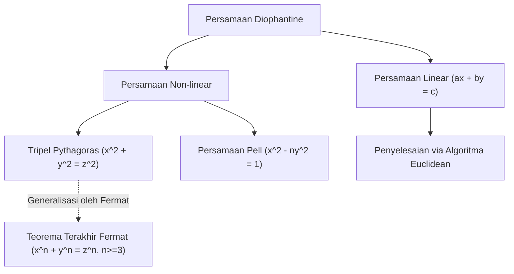

## 1. Pendahuluan

Dalam sejarah matematika, ada sosok yang dikenal sebagai "Bapak Aljabar". Sosok tersebut adalah **[Diophantus](https://kenji.blog/id/p/diophantus/)** (Diophantus dari Alexandria), yang aktif di Alexandria kuno. Karya utamanya, *Arithmetica*, memiliki pengaruh besar pada matematikawan selanjutnya di dunia Islam dan matematikawan di Eropa zaman Renaisans. Khususnya, "Teorema Terakhir Fermat", yang ditulis [Pierre de Fermat](https://kenji.blog/id/p/fermat/) di pinggir halaman *Arithmetica*, sangatlah terkenal.

Dalam artikel ini, kita akan menggali lebih dalam kehidupan [Diophantus](https://kenji.blog/id/p/diophantus/), pencapaian matematikanya, rincian mahakaryanya *Arithmetica*, dan "persamaan Diophantine" yang menyandang namanya. Selain itu, kita juga akan mengungkap misteri "batu nisan" (epitaph) miliknya, yang dari situ umur hidupnya dapat disimpulkan.

## 2. Kehidupan [Diophantus](https://kenji.blog/id/p/diophantus/) dan Latar Belakang Sejarah

### 2.1 Kehidupan yang Diselimuti Misteri

Hampir tidak ada catatan akurat yang tersisa mengenai kapan [Diophantus](https://kenji.blog/id/p/diophantus/) lahir atau kapan ia meninggal. Umumnya, diyakini bahwa ia aktif di Alexandria, Mesir sekitar abad ke-3 M (antara 200 dan 284 M). Dari tanggal tokoh-tokoh yang ia sebutkan (seperti Hypsicles), kita tahu bahwa itu setelah 150 SM, dan karena Theon dari Alexandria (abad ke-4 M) menyebutkan [Diophantus](https://kenji.blog/id/p/diophantus/), sudah pasti sebelum 364 M. Sejarawan modern memperkirakan ia berjaya sekitar tahun 250 M.

### 2.2 Budaya Helenistik dan Alexandria

Pada saat itu, Alexandria adalah pusat budaya dan pembelajaran Helenistik, membanggakan perpustakaan raksasa (Perpustakaan Alexandria) dan berfungsi sebagai pusat pengetahuan tempat banyak sarjana berkumpul. Di kota ini di mana pengetahuan dari Yunani, Mesir, Babilonia, dan bahkan India bersilangan, [Diophantus](https://kenji.blog/id/p/diophantus/) diperkirakan memiliki akses ke warisan matematika masa lalu yang luas. Berbeda dengan tradisi geometris yang dibangun oleh matematikawan besar Yunani seperti Euclid, Archimedes, dan Apollonius, beberapa teori menunjukkan bahwa [Diophantus](https://kenji.blog/id/p/diophantus/) sangat dipengaruhi oleh pendekatan aljabar dari Babilonia.

## 3. Dampak Mahakaryanya *Arithmetica*

Pencapaian terbesar [Diophantus](https://kenji.blog/id/p/diophantus/) adalah bukunya *Arithmetica*, yang dikatakan terdiri dari 13 volume. Sayangnya, hanya enam di antaranya yang bertahan dalam bahasa Yunani hingga saat ini, dan empat lagi telah ditemukan dalam terjemahan bahasa Arab.

### 3.1 Fajar Aljabar Simbolik

Aspek terobosan dari *Arithmetica* adalah penggunaannya akan **simbol-simbol** untuk merepresentasikan sesuatu yang tidak diketahui (variabel), pangkatnya (kuadrat, kubik, dll.), dan operasi (penambahan, pengurangan, persamaan, dll.). Dalam matematika Yunani sebelum dirinya (seperti [Euclid](https://kenji.blog/id/p/euclid/)), masalah matematika sebagian besar digambarkan menggunakan bangun geometri dan dijelaskan dengan kata-kata (ini disebut aljabar retorika). Namun, [Diophantus](https://kenji.blog/id/p/diophantus/) memungkinkan penanganan persamaan yang lebih abstrak dan kompleks dengan menyimbolkan ekspresi matematika (fase transisi yang disebut aljabar sinkopasi).

Ia menggunakan simbol khusus (setara dengan $x$ modern) untuk merepresentasikan variabel, dan memberikan notasi unik pada konstanta dan kebalikan dari variabel.

$$
\text{Contoh polinomial [Diophantus](https://kenji.blog/id/p/diophantus/) (notasi modern):} \\
3x^3 - 2x^2 + 5x - 1 = 0
$$

### 3.2 Masalah yang Ditangani dan Solusi Rasional

*Arithmetica* berisi sekitar 130 masalah mengenai sistem persamaan linear, persamaan kuadrat, dan bahkan persamaan derajat tinggi. Fitur utama dari masalah-masalah ini adalah, tidak seperti matematikawan modern yang mencari solusi bilangan riil atau kompleks, ia terutama mencari **solusi bilangan rasional (pecahan positif atau bilangan bulat)**. Konsep bilangan negatif, nol, dan bilangan irasional belum sepenuhnya terbentuk pada masa itu, dan ia tidak mengakuinya sebagai solusi. Baginya, "angka" berarti bilangan rasional positif.

Misalnya, ketika [Diophantus](https://kenji.blog/id/p/diophantus/) menemukan persamaan seperti $4x + 20 = 4$, ia menganggapnya "absurd" (konyol) karena solusinya akan menjadi bilangan negatif ($x = -4$).

## 4. Persamaan Diophantine

Saat ini, istilah "Persamaan Diophantine" merujuk pada **persamaan polinomial dengan koefisien bilangan bulat yang mana hanya solusi bilangan bulat yang dicari**. Meskipun [Diophantus](https://kenji.blog/id/p/diophantus/) sendiri juga mencari solusi bilangan rasional, hal ini berkembang menjadi cabang penting dari "teori bilangan" dalam matematika selanjutnya.

### 4.1 Persamaan Diophantine Linear

Persamaan Diophantine yang paling sederhana adalah persamaan linear dengan dua variabel (Persamaan Diophantine Linear).

$$
ax + by = c \quad (a, b, c \text{ adalah bilangan bulat})
$$

Kondisi yang diperlukan dan cukup agar persamaan ini memiliki solusi bilangan bulat $(x, y)$ adalah bahwa faktor persekutuan terbesar (FPB) dari $a$ dan $b$, $\gcd(a, b)$, membagi habis $c$ (Identitas Bézout).

**Contoh:**
Perhatikan persamaan $4x + 6y = 8$.
Karena $\gcd(4, 6) = 2$, dan $2$ membagi habis $8$, maka solusi bilangan bulat ada.
Salah satu solusinya adalah $x = 2, y = 0$ ($4(2) + 6(0) = 8$).
Selain itu, solusi umum dapat dinyatakan sebagai $x = 2 + 3k, y = -2k$ (di mana $k$ adalah sembarang bilangan bulat).

### 4.2 Tripel [Pythagoras](https://kenji.blog/id/p/pythagoras/) dan Persamaan Diophantine Non-linear

Persamaan yang tidak asing dari teorema [Pythagoras](https://kenji.blog/id/p/pythagoras/) juga merupakan jenis persamaan Diophantine.

$$
x^2 + y^2 = z^2
$$

Himpunan bilangan bulat positif $(x, y, z)$ yang memenuhi persamaan ini disebut **Tripel [Pythagoras](https://kenji.blog/id/p/pythagoras/)**. Contoh terkenal antara lain $(3, 4, 5)$ dan $(5, 12, 13)$. Dalam Buku II, Masalah 8 dari *Arithmetica*, [Diophantus](https://kenji.blog/id/p/diophantus/) membahas masalah pembagian suatu bilangan kuadrat menjadi jumlah dari dua bilangan kuadrat (misalnya, mencari bilangan rasional $x, y$ sehingga $16 = x^2 + y^2$).

Di bagian pinggir di sebelah masalah ini, [Pierre de Fermat](https://kenji.blog/id/p/fermat/), seorang hakim Prancis abad ke-17 dan matematikawan amatir, meninggalkan catatan berikut:

> "Tidak mungkin untuk memisahkan bilangan pangkat tiga menjadi dua bilangan pangkat tiga, atau pangkat empat menjadi dua bilangan pangkat empat, atau secara umum, setiap pangkat yang lebih tinggi dari pangkat dua, menjadi dua pangkat yang sama. Saya telah menemukan bukti yang benar-benar menakjubkan dari hal ini, yang mana pinggir halaman ini terlalu sempit untuk memuatnya."

Ini adalah **[Teorema Terakhir Fermat](https://kenji.blog/id/p/fermats-last-theorem/)** yang terkenal (bahwa $x^n + y^n = z^n \ (n \ge 3)$ tidak memiliki solusi bilangan bulat positif). Teorema ini terus menolak tantangan matematikawan jenius di seluruh dunia selama sekitar 350 tahun setelah diajukan, sampai akhirnya dibuktikan oleh Andrew Wiles pada tahun 1995. Tanpa buku [Diophantus](https://kenji.blog/id/p/diophantus/), drama besar ini mungkin tidak akan pernah terjadi.

## 5. Batu Nisan (Epitaph) [Diophantus](https://kenji.blog/id/p/diophantus/)

Petunjuk yang paling menarik, dan mungkin satu-satunya yang spesifik untuk memahami kehidupan [Diophantus](https://kenji.blog/id/p/diophantus/), adalah teka-teki aljabar yang konon diukir di batu nisannya. Ini dicatat dalam *Greek Anthology* yang disusun oleh Metrodorus sekitar abad ke-5, dan memungkinkan seseorang untuk menyimpulkan umur [Diophantus](https://kenji.blog/id/p/diophantus/) dengan memecahkan persamaan linear.

### 5.1 Isi Batu Nisan

> Di sini terbaring [Diophantus](https://kenji.blog/id/p/diophantus/). Angka-angka menceritakan panjang hidupnya.
> Selama $\frac{1}{6}$ dari hidupnya ia adalah seorang anak laki-laki.
> Setelah $\frac{1}{12}$ lagi, janggutnya mulai tumbuh.
> Setelah $\frac{1}{7}$ lagi, ia menikah.
> Lima tahun setelah pernikahannya, putranya lahir.
> Namun sayang, sang putra meninggal pada separuh usia ayahnya.
> Empat tahun setelah kematian putranya, ia pun menghembuskan napas terakhirnya dalam kesedihan.

### 5.2 Penyelesaian dengan Persamaan

Jika kita memisalkan $x$ sebagai umur [Diophantus](https://kenji.blog/id/p/diophantus/) (tahun-tahun ia hidup), teks di atas dapat dinyatakan sebagai persamaan berikut:

$$
\frac{x}{6} + \frac{x}{12} + \frac{x}{7} + 5 + \frac{x}{2} + 4 = x
$$

Mari kita selesaikan persamaan ini.

Pertama, carilah kelipatan persekutuan terkecil (KPK) dari penyebut pecahan tersebut. KPK dari 6, 12, 7, dan 2 adalah 84.
Kalikan kedua ruas dengan 84.

$$
14x + 7x + 12x + 420 + 42x + 336 = 84x
$$

Gabungkan suku-suku $x$.

$$
(14 + 7 + 12 + 42)x + (420 + 336) = 84x \\
75x + 756 = 84x
$$

Kumpulkan $x$ di ruas kanan.

$$
756 = 84x - 75x \\
756 = 9x
$$

Bagi kedua ruas dengan 9.

$$
x = 84
$$

Oleh karena itu, kita dapat melihat bahwa [Diophantus](https://kenji.blog/id/p/diophantus/) meninggal pada usia **84** tahun. Mengingat angka harapan hidup rata-rata pada masa itu, ia berumur sangat panjang. Garis waktu kehidupannya adalah sebagai berikut:

- Masa kecil: $84 \times \frac{1}{6} = 14$ tahun (usia 0-14)
- Masa muda: $84 \times \frac{1}{12} = 7$ tahun (usia 14-21)
- Sampai menikah: $84 \times \frac{1}{7} = 12$ tahun (usia 21-33)
- Kelahiran putra: 5 tahun setelah menikah (33 + 5 = 38 tahun)
- Umur putra: $84 \times \frac{1}{2} = 42$ tahun
- Kematian putra: saat [Diophantus](https://kenji.blog/id/p/diophantus/) berusia 80 tahun (38 + 42 = 80 tahun)
- Kematian [Diophantus](https://kenji.blog/id/p/diophantus/): 4 tahun setelah kematian putra (80 + 4 = 84 tahun)

## 6. Pengaruh pada Generasi Selanjutnya dan Warisan

Karya-karya [Diophantus](https://kenji.blog/id/p/diophantus/) sempat hilang di dunia Eropa Barat bersama dengan kemunduran Kekaisaran Romawi. Namun, karya-karya tersebut dilestarikan dan dipelajari dengan cermat di Kekaisaran Romawi Timur (Bizantium) dan dunia Islam. Pada akhir abad ke-4, Hypatia dari Alexandria konon telah menulis komentar tentang *Arithmetica*.

Secara khusus, matematikawan di Bagdad pada abad ke-9 menerjemahkan *Arithmetica* ke dalam bahasa Arab, yang sangat berkontribusi pada perkembangan aljabar Islam. Matematikawan Islam seperti Al-Karaji mengadopsi dan mengembangkan metode [Diophantus](https://kenji.blog/id/p/diophantus/) lebih lanjut.

Pada abad ke-16, ketika karya klasik Yunani ditemukan kembali di Eropa zaman Renaisans, *Arithmetica* diterjemahkan ke dalam bahasa Latin. Edisi dwibahasa Yunani dan Latin yang diterbitkan oleh [Claude Gaspard Bachet](https://kenji.blog/id/p/bachet/) de Méziriac pada tahun 1621 dibaca secara luas. Edisi Bachet dari *Arithmetica* inilah yang dipelajari [Fermat](https://kenji.blog/id/p/fermat/) dengan saksama, yang memicu terbukanya pintu baru dalam matematika.

Teori persamaan Diophantine kemudian dipelajari secara mendalam oleh para raksasa seperti [Leonhard Euler](https://kenji.blog/id/p/euler/), Joseph-Louis Lagrange, dan Carl Friedrich Gauss. Penelitian mereka berkembang menjadi bidang matematika modern yang luas, yaitu "teori bilangan aljabar" dan "geometri aljabar". Masalah ke-10 dari 23 masalah Hilbert adalah "menemukan algoritma umum untuk menentukan apakah persamaan Diophantine tertentu dapat diselesaikan", dan pada tahun 1970 Yuri Matiyasevich membuktikan bahwa "algoritma semacam itu tidak ada". Nama [Diophantus](https://kenji.blog/id/p/diophantus/) terukir dalam-dalam di garda terdepan matematika modern.

## 7. Kesimpulan

[Diophantus](https://kenji.blog/id/p/diophantus/) adalah seorang pelopor yang meletakkan dasar-dasar aljabar modern dengan menggunakan simbol untuk ekspresi matematika dan menangani variabel (sesuatu yang tidak diketahui). *Arithmetica* yang ia tinggalkan bukan sekadar kumpulan teka-teki atau masalah perhitungan, tetapi berisi wawasan mendalam tentang sifat-sifat angka. Masalah yang ia sajikan terus memesona matematikawan selama ribuan tahun dan telah menjadi kekuatan pendorong yang sangat menggerakkan sejarah matematika.

Batu nisannya, yang secara diam-diam menceritakan kisah hidup 84 tahun melalui rumus-rumus, mengajarkan kepada kita keindahan universal matematika dan pengejaran kebenaran abadi. [Diophantus](https://kenji.blog/id/p/diophantus/) benar-benar dapat disebut sebagai tokoh besar yang meletakkan landasan pertama dari bangunan agung aljabar.
