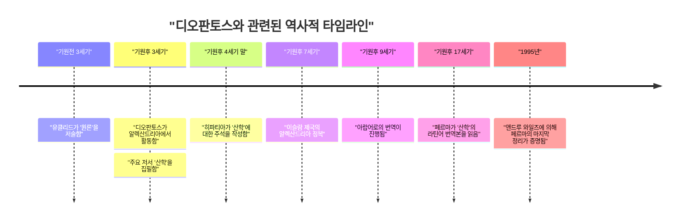
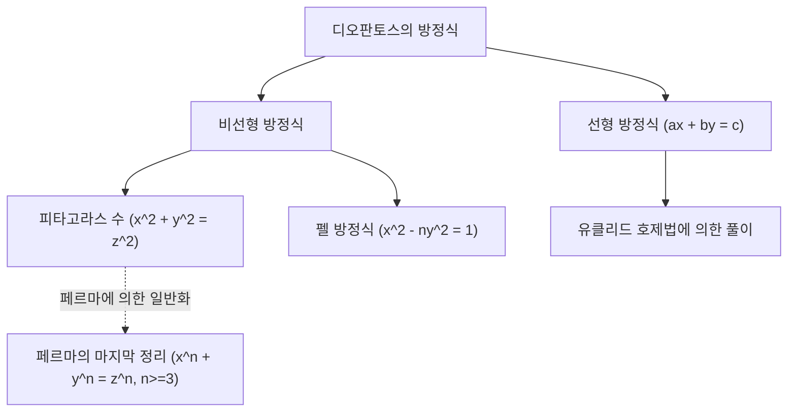

## 1. 서론

수학의 역사에서 "대수학의 아버지"라고 불리는 인물이 있습니다. 그가 바로 고대 알렉산드리아에서 활약했던 **[디오판토스](https://kenji.blog/p/diophantus/)** ([Diophantus](https://kenji.blog/p/diophantus/) of Alexandria)입니다. 그의 저서 『산학』(Arithmetica)은 훗날 이슬람 세계의 수학자들과 르네상스 시대 유럽의 수학자들에게 지대한 영향을 미쳤습니다. 특히, [피에르 드 페르마](https://kenji.blog/p/fermat/)([Pierre de Fermat](https://kenji.blog/p/fermat/))가 『산학』의 여백에 남긴 "[페르마의 마지막 정리](https://kenji.blog/p/fermats-last-theorem/)"는 너무나도 유명합니다.

본 기사에서는 [디오판토스](https://kenji.blog/p/diophantus/)의 생애, 그의 수학적 업적, 주요 저서 『산학』의 세부 내용, 그리고 그의 이름이 붙은 "[디오판토스](https://kenji.blog/p/diophantus/) 방정식"에 대해 깊이 파헤쳐 보겠습니다. 나아가, 그의 나이를 도출할 수 있는 "묘비명(에피타프)"의 수수께끼도 풀어볼 것입니다.

## 2. [디오판토스](https://kenji.blog/p/diophantus/)의 생애와 시대적 배경

### 2.1 수수께끼에 싸인 생애

[디오판토스](https://kenji.blog/p/diophantus/)가 언제 태어나 언제 사망했는지에 대한 정확한 기록은 거의 남아있지 않습니다. 일반적으로 그는 기원후 3세기 무렵(서기 200년에서 284년 사이) 이집트의 알렉산드리아에서 활동했을 것으로 여겨집니다. 그가 언급하고 있는 인물(힙시클레스 등)의 연대를 통해 기원전 150년 이후임을 알 수 있으며, 또한 알렉산드리아의 테온(기원후 4세기)이 [디오판토스](https://kenji.blog/p/diophantus/)를 언급하고 있기 때문에 기원후 364년 이전임은 확실합니다. 현대의 역사가들은 서기 250년경을 중심으로 그가 활약했다고 추정하고 있습니다.

### 2.2 헬레니즘 문화와 알렉산드리아

당시 알렉산드리아는 헬레니즘 문화와 학문의 중심지였으며, 거대한 도서관(알렉산드리아 도서관)을 보유하고 많은 학자가 모여드는 지식의 교차로였습니다. 그리스, 이집트, 바빌로니아, 심지어 인도로부터의 지식이 교차하는 이 도시에서 [디오판토스](https://kenji.blog/p/diophantus/)는 과거의 방대한 수학적 유산에 접근할 수 있었을 것으로 생각됩니다. [유클리드](https://kenji.blog/p/euclid/), 아르키메데스, 아폴로니우스 등 위대한 그리스 수학자들이 이룩한 기하학적 전통과는 달리, [디오판토스](https://kenji.blog/p/diophantus/)는 바빌로니아의 대수적인 접근 방식에 강한 영향을 받았다는 설도 있습니다.

## 3. 주요 저서 『산학』(Arithmetica)의 충격

[디오판토스](https://kenji.blog/p/diophantus/)의 가장 큰 업적은 총 13권으로 이루어진 것으로 알려진 저서 『산학』(Arithmetica)입니다. 안타깝게도 현재까지 그리스어 원본 그대로 남아있는 것은 그중 6권뿐이며, 아랍어 번역본으로 4권 분량이 추가로 발견되었습니다.

### 3.1 기호 대수학의 여명

『산학』의 획기적인 점은 미지수나 그 거듭제곱(제곱, 세제곱 등), 더 나아가 연산(덧셈, 뺄셈, 등호 등)을 나타내기 위해 **기호** 를 사용했다는 것입니다. 그 이전의 그리스 수학(예를 들어 [유클리드](https://kenji.blog/p/euclid/))에서는 수학적인 문제가 주로 기하학적인 도형을 사용하여 기술되고 말로 설명되었습니다(이를 수사적 대수라고 부릅니다). 그러나 [디오판토스](https://kenji.blog/p/diophantus/)는 수식을 기호화(생략 대수라고 불리는 과도기)함으로써 더 추상적이고 복잡한 방정식을 다루는 것을 가능하게 했습니다.

그는 미지수를 나타내기 위해 특별한 기호(현재의 $x$에 해당)를 사용했으며, 상수항이나 미지수의 역수 등에도 독자적인 표기법을 부여했습니다.

$$
\text{[디오판토스](https://kenji.blog/p/diophantus/) 다항식의 예 (현대적 표기):} \\
3x^3 - 2x^2 + 5x - 1 = 0
$$

### 3.2 다루어진 문제와 유리수 해

『산학』에는 연립일차방정식이나 이차방정식, 더 나아가 고차 방정식에 관한 약 130개의 문제가 수록되어 있습니다. 이 문제들의 가장 큰 특징은, 현대의 우리가 실수나 복소수의 해를 구하는 것과는 달리, 주로 **유리수(양의 분수 또는 정수)의 해** 를 구하고 있다는 점입니다. 음수나 0, 무리수의 개념은 당시 아직 완전히 확립되지 않았으며, 그는 이것들을 해로 인정하지 않았습니다. 그에게 "수"란 양의 유리수를 의미했습니다.

예를 들어, [디오판토스](https://kenji.blog/p/diophantus/)는 $4x + 20 = 4$ 와 같은 방정식과 마주쳤을 때, 이것의 해는 음수($x = -4$)가 되기 때문에 이를 "터무니없다"고 하며 배척했습니다.

## 4. [디오판토스](https://kenji.blog/p/diophantus/) 방정식

오늘날 "[디오판토스](https://kenji.blog/p/diophantus/) 방정식(Diophantine equation)"이라는 용어는 **정수 계수를 가지며 정수 해만을 구하는 다항식 방정식** 을 의미합니다. [디오판토스](https://kenji.blog/p/diophantus/) 자신은 유리수 해도 구했지만, 후세의 수학에서는 "정수론"의 중요한 분야로 발전했습니다.

### 4.1 선형 [디오판토스](https://kenji.blog/p/diophantus/) 방정식

가장 단순한 [디오판토스](https://kenji.blog/p/diophantus/) 방정식은 2변수의 일차 방정식(선형 [디오판토스](https://kenji.blog/p/diophantus/) 방정식)입니다.

$$
ax + by = c \quad (a, b, c \text{ 는 정수})
$$

이 방정식이 정수 해 $(x, y)$ 를 갖기 위한 필요충분조건은, $a$와 $b$의 최대공약수 $\gcd(a, b)$가 $c$를 나누어떨어지게 하는 것입니다(베주의 항등식).

**예시:**
방정식 $4x + 6y = 8$ 을 생각해 봅시다.
$\gcd(4, 6) = 2$ 이고, $2$는 $8$을 나누어떨어지게 하므로 정수 해가 존재합니다.
하나의 해는 $x = 2, y = 0$ 입니다 ($4(2) + 6(0) = 8$).
또한, 일반적인 해는 $x = 2 + 3k, y = -2k$ ($k$는 임의의 정수) 로 표현됩니다.

### 4.2 피타고라스 수와 비선형 [디오판토스](https://kenji.blog/p/diophantus/) 방정식

피타고라스의 정리로 친숙한 방정식도 [디오판토스](https://kenji.blog/p/diophantus/) 방정식의 일종입니다.

$$
x^2 + y^2 = z^2
$$

이 방정식을 만족하는 양의 정수 $(x, y, z)$ 의 쌍을 **피타고라스 수** 라고 부릅니다. $(3, 4, 5)$ 나 $(5, 12, 13)$ 등이 유명합니다. [디오판토스](https://kenji.blog/p/diophantus/)는 『산학』의 제II권 제8번 문제에서, 주어진 제곱수를 두 제곱수의 합으로 나누는 문제(예를 들어 $16 = x^2 + y^2$ 를 만족하는 유리수 $x, y$ 를 찾는 것)를 다루고 있습니다.

이 문제의 여백에, 17세기 프랑스의 판사이자 아마추어 수학자였던 [피에르 드 페르마](https://kenji.blog/p/fermat/)는 다음과 같은 메모를 남겼습니다.

> "세제곱수를 두 개의 세제곱수로, 네제곱수를 두 개의 네제곱수로, 혹은 일반적으로 제곱보다 큰 거듭제곱수를 같은 거듭제곱수 두 개의 합으로 나누는 것은 불가능하다. 나는 이 명제에 대한 경이로운 증명을 발견했지만, 이 여백은 그것을 적기에는 너무 좁다."

이것이 유명한 **[페르마의 마지막 정리](https://kenji.blog/p/fermats-last-theorem/)** ( $x^n + y^n = z^n \ (n \ge 3)$ 은 양의 정수 해를 갖지 않는다) 입니다. 이 정리는 제기된 이후 약 350년 동안 전 세계 천재 수학자들의 도전을 물리치다가, 1995년에 [앤드루 와일즈](https://kenji.blog/p/wiles/)에 의해 마침내 증명되었습니다. [디오판토스](https://kenji.blog/p/diophantus/)의 저서가 없었다면 이 위대한 드라마는 탄생하지 않았을지도 모릅니다.

## 5. [디오판토스](https://kenji.blog/p/diophantus/)의 묘비명(에피타프)

[디오판토스](https://kenji.blog/p/diophantus/)의 생애를 아는 데 있어, 가장 흥미롭고 또 유일한 구체적인 단서로 여겨지는 것이 그의 묘비에 새겨져 있었다고 전해지는 대수학 퍼즐입니다. 이것은 5세기경에 메트로도로스에 의해 편찬된 『그리스 명시선』(Greek Anthology)에 수록되어 있으며, 일차방정식을 풂으로써 [디오판토스](https://kenji.blog/p/diophantus/)의 수명을 도출해낼 수 있도록 되어 있습니다.

### 5.1 묘비명의 내용

> 여기에 [디오판토스](https://kenji.blog/p/diophantus/) 잠들다. 그의 생애의 길이를, 숫자가 말해준다.
> 그의 생애의 $\frac{1}{6}$ 은 소년기였다.
> 그 후 $\frac{1}{12}$ 의 기간이 지나, 그의 뺨에는 수염이 자라기 시작했다.
> 다시 $\frac{1}{7}$ 의 기간이 지나서, 그는 결혼했다.
> 결혼 후 5년 뒤, 그에게 아들이 태어났다.
> 그러나 슬프게도, 그 아들은 아버지의 절반의 나이로 세상을 떠나고 말았다.
> 아들의 죽음으로부터 4년 뒤, 그도 또한 슬픔 속에서 숨을 거두었다.

### 5.2 방정식에 의한 풀이

[디오판토스](https://kenji.blog/p/diophantus/)의 수명(살았던 햇수)을 $x$라고 두면, 위의 문장은 다음의 방정식으로 나타낼 수 있습니다.

$$
\frac{x}{6} + \frac{x}{12} + \frac{x}{7} + 5 + \frac{x}{2} + 4 = x
$$

이 방정식을 풀어봅시다.

먼저, 분수 부분의 분모의 최소공배수를 구합니다. 6, 12, 7, 2의 최소공배수는 84입니다.
양변에 84를 곱합니다.

$$
14x + 7x + 12x + 420 + 42x + 336 = 84x
$$

$x$의 항을 묶습니다.

$$
(14 + 7 + 12 + 42)x + (420 + 336) = 84x \\
75x + 756 = 84x
$$

우변으로 $x$를 모읍니다.

$$
756 = 84x - 75x \\
756 = 9x
$$

양변을 9로 나눕니다.

$$
x = 84
$$

따라서, [디오판토스](https://kenji.blog/p/diophantus/)는 **84세** 에 사망했음을 알 수 있습니다. 당시의 평균 수명을 고려하면 매우 장수했다고 할 수 있습니다. 그의 인생의 타임라인은 다음과 같습니다.

- 소년기: $84 \times \frac{1}{6} = 14$ 년간 (0~14세)
- 청년기: $84 \times \frac{1}{12} = 7$ 년간 (14~21세)
- 결혼까지: $84 \times \frac{1}{7} = 12$ 년간 (21~33세)
- 아들의 탄생: 결혼 후 5년 뒤 (33 + 5 = 38세)
- 아들의 수명: $84 \times \frac{1}{2} = 42$ 년간
- 아들의 죽음: [디오판토스](https://kenji.blog/p/diophantus/)가 80세일 때 (38 + 42 = 80세)
- [디오판토스](https://kenji.blog/p/diophantus/)의 죽음: 아들의 죽음으로부터 4년 뒤 (80 + 4 = 84세)

## 6. 후세에 미친 영향과 유산

[디오판토스](https://kenji.blog/p/diophantus/)의 저작은 로마 제국의 쇠퇴와 함께 서유럽 세계에서 일시적으로 소실되었습니다. 그러나 동로마(비잔티움) 제국이나 이슬람 세계에서 소중히 보존되고 연구되었습니다. 4세기 말에는 알렉산드리아의 히파티아가 『산학』에 대한 주석을 썼다고 전해집니다.

특히 9세기의 바그다드의 수학자들이 『산학』을 아랍어로 번역하여, 이슬람 대수학의 발전에 크게 기여했습니다. 알 카라지 등의 이슬람 수학자들은 [디오판토스](https://kenji.blog/p/diophantus/)의 방식을 도입하고 더욱 발전시켰습니다.

16세기에 들어서 르네상스 시대 유럽에서 그리스어 고전이 재발견되면서, 『산학』도 라틴어로 번역되었습니다. 1621년에 클로드 가스파르 바셰([Claude Gaspard Bachet](https://kenji.blog/p/bachet/) de Méziriac)가 출판한 그리스어와 라틴어 대조본이 널리 읽히게 됩니다. 이 바셰 판 『산학』이야말로, 페르마가 숙독하고 새로운 수학의 문을 여는 계기가 된 것입니다.

[디오판토스](https://kenji.blog/p/diophantus/) 방정식의 이론은 그 후 [레온하르트 오일러](https://kenji.blog/p/euler/)([Leonhard Euler](https://kenji.blog/p/euler/)), 조제프 루이 라그랑주([Joseph-Louis Lagrange](https://kenji.blog/p/lagrange/)), [카를 프리드리히 가우스](https://kenji.blog/p/gauss/)([Carl Friedrich Gauss](https://kenji.blog/p/gauss/)) 등의 거장들에 의해 깊이 연구되었습니다. 그들의 연구는 현대의 "대수적 정수론"이나 "대수기하학"이라는 거대한 수학 분야로 성장했습니다. 힐베르트의 23가지 문제 중 제10문제는 "임의의 [디오판토스](https://kenji.blog/p/diophantus/) 방정식이 풀이 가능한지 여부를 판정하는 일반적인 알고리즘을 찾는 것"이었으며, 1970년에 유리 마티야세비치에 의해 "그러한 알고리즘은 존재하지 않는다"고 증명되었습니다. [디오판토스](https://kenji.blog/p/diophantus/)의 이름은 현대 수학의 최첨단에도 깊이 새겨져 있습니다.

## 7. 결론

[디오판토스](https://kenji.blog/p/diophantus/)는 수식을 기호화하고 미지수를 다루는 현대 대수학의 기초를 다진 선구자였습니다. 그가 남긴 『산학』은 단순한 퍼즐이나 계산 문제의 모음이 아니라, 수의 성질에 대한 깊은 통찰을 포함하고 있었습니다. 그가 제시한 문제는 수천 년이라는 시간을 넘어 수학자들을 매료시켜 왔으며, 수학의 역사를 크게 움직인 원동력이 되었습니다.

84년이라는 인생을 조용히 수식으로 이야기하는 그의 묘비명은 수학이 가진 보편적인 아름다움과 시대를 초월한 진리의 탐구를 우리에게 가르쳐 줍니다. [디오판토스](https://kenji.blog/p/diophantus/)는 진정으로, 대수학이라는 장대한 건축물의 첫 주춧돌을 놓은 위인이라고 할 수 있을 것입니다.
