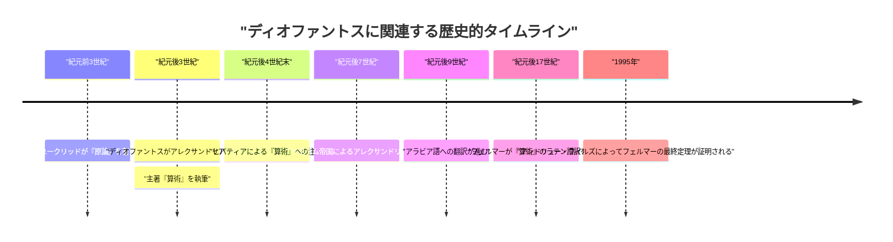
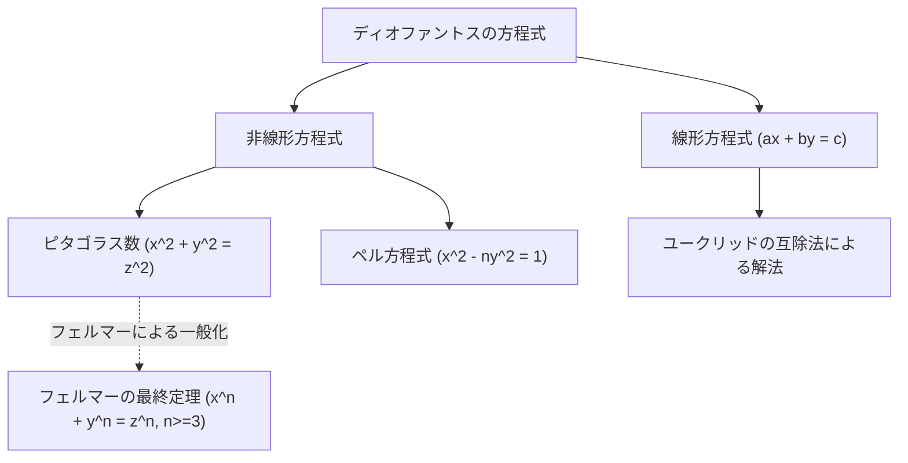

## 1. はじめに

数学の歴史において、「代数学の父」と称される人物がいます。それが、古代アレクサンドリアで活躍した **[ディオファントス](https://kenji.blog/p/diophantus/)** （Diophantus of Alexandria）です。彼の著作『算術』（Arithmetica）は、後のイスラム世界の数学者や、ルネサンス期のヨーロッパの数学者たちに多大な影響を与えました。特に、[ピエール・ド・フェルマー](/p/fermat/)（Pierre de Fermat）が『算術』の余白に書き込んだ「[フェルマーの最終定理](https://kenji.blog/p/fermats-last-theorem/)」はあまりにも有名です。

本記事では、[ディオファントス](https://kenji.blog/p/diophantus/)の生涯、彼の数学的業績、主著『算術』の詳細、そして彼の名が冠された「[ディオファントス](https://kenji.blog/p/diophantus/)方程式」について深く掘り下げていきます。さらには、彼の年齢を導き出すことができる「墓碑銘（エピタフ）」の謎解きも行います。

## 2. [ディオファントス](https://kenji.blog/p/diophantus/)の生涯と時代背景

### 2.1 謎に包まれた生涯

[ディオファントス](https://kenji.blog/p/diophantus/)がいつ生まれ、いつ没したかについては、正確な記録がほとんど残っていません。一般的には、紀元後3世紀頃（西暦200年から284年頃の間）にエジプトのアレクサンドリアで活動していたと考えられています。彼が言及している人物（ヒプシクレスなど）の年代から紀元前150年以降であることがわかり、また、アレクサンドリアのテオン（紀元後4世紀）が[ディオファントス](https://kenji.blog/p/diophantus/)に言及していることから、紀元後364年より前であることは確実です。現代の歴史家たちは、西暦250年頃を中心とする時期に彼が活躍したと推定しています。

### 2.2 ヘレニズム文化とアレクサンドリア

アレクサンドリアは当時、ヘレニズム文化と学問の中心地であり、巨大な図書館（アレクサンドリア図書館）を擁し、多くの学者が集う知の結節点でした。ギリシャ、エジプト、バビロニア、さらにはインドからの知識が交差するこの都市で、[ディオファントス](https://kenji.blog/p/diophantus/)は過去の膨大な数学的遺産にアクセスできたと考えられます。[ユークリッド](/p/euclid/)（エウクレイデス）やアルキメデス、アポロニウスといった偉大なギリシャの数学者たちが築き上げた幾何学の伝統とは異なり、[ディオファントス](https://kenji.blog/p/diophantus/)はバビロニアの代数的なアプローチに強く影響を受けているという説もあります。

## 3. 主著『算術』（Arithmetica）の衝撃

[ディオファントス](https://kenji.blog/p/diophantus/)の最大の業績は、全13巻からなるとされる著書『算術』（Arithmetica）です。残念ながら、現在までギリシャ語のままで残っているのはそのうちの6巻のみであり、さらにアラビア語の翻訳として4巻分が発見されています。

### 3.1 記号代数の黎明

『算術』の画期的な点は、未知数やその冪乗（平方、立方など）、さらには演算（加算、減算、等号など）を表すために **記号** を用いたことです。それまでのギリシャ数学（例えば[ユークリッド](https://kenji.blog/p/euclid/)）では、数学的な問題は主に幾何学的な図形を用いて記述され、言葉で説明されていました（これを修辞的代数と呼びます）。しかし[ディオファントス](https://kenji.blog/p/diophantus/)は、数式を記号化（シンコペート代数と呼ばれる移行期）することで、より抽象的で複雑な方程式を扱うことを可能にしました。

彼は未知数を表すために特別な記号（現在の $x$ に相当）を用い、定数項や未知数の逆数などにも独自の表記を与えました。

$$
\text{[ディオファントス](https://kenji.blog/p/diophantus/)の多項式の例（現代的表記）:} \\
3x^3 - 2x^2 + 5x - 1 = 0
$$

### 3.2 扱われた問題と有理数解

『算術』には、連立一次方程式や二次方程式、さらには高次の方程式に関する約130の問題が収録されています。これらの問題の大きな特徴は、現代の私たちが実数や複素数の解を求めるのとは異なり、主に **有理数（正の分数または整数）の解** を求めていることです。負の数やゼロ、無理数の概念は当時まだ完全に確立されておらず、彼はこれらを解として認めませんでした。彼にとって、「数」とは正の有理数を意味していました。

例えば、[ディオファントス](https://kenji.blog/p/diophantus/)は $4x + 20 = 4$ のような方程式に遭遇した場合、これを「不条理である」として退けました。なぜなら、これの解は負の数 ($x = -4$) になるからです。

## 4. [ディオファントス](https://kenji.blog/p/diophantus/)方程式

今日、「[ディオファントス](https://kenji.blog/p/diophantus/)方程式（Diophantine equation）」という用語は、**整数係数を持ち、整数の解のみを求める多項式方程式** のことを指します。[ディオファントス](https://kenji.blog/p/diophantus/)自身は有理数解も求めていましたが、後世の数学において「整数論」の重要な分野として発展しました。

### 4.1 線形[ディオファントス](https://kenji.blog/p/diophantus/)方程式

最も単純な[ディオファントス](https://kenji.blog/p/diophantus/)方程式は、2変数の一次方程式（線形[ディオファントス](https://kenji.blog/p/diophantus/)方程式）です。

$$
ax + by = c \quad (a, b, c \text{ は整数})
$$

この方程式が整数解 $(x, y)$ を持つための必要十分条件は、$a$ と $b$ の最大公約数 $\gcd(a, b)$ が $c$ を割り切ることです（ベズーの等式）。

**例:**
方程式 $4x + 6y = 8$ を考えます。
$\gcd(4, 6) = 2$ であり、$2$ は $8$ を割り切るので、整数解が存在します。
一つの解は $x = 2, y = 0$ です（$4(2) + 6(0) = 8$）。
また、一般的な解は $x = 2 + 3k, y = -2k$ ($k$ は任意の整数) として表されます。

### 4.2 [ピタゴラス](https://kenji.blog/p/pythagoras/)数と非線形[ディオファントス](https://kenji.blog/p/diophantus/)方程式

[ピタゴラス](https://kenji.blog/p/pythagoras/)の定理でおなじみの方程式も、[ディオファントス](https://kenji.blog/p/diophantus/)方程式の一種です。

$$
x^2 + y^2 = z^2
$$

この方程式を満たす正の整数 $(x, y, z)$ の組を **[ピタゴラス](https://kenji.blog/p/pythagoras/)数** と呼びます。$(3, 4, 5)$ や $(5, 12, 13)$ などが有名です。[ディオファントス](https://kenji.blog/p/diophantus/)は『算術』の第II巻第8問において、与えられた平方数を2つの平方数の和に分ける問題（例えば $16 = x^2 + y^2$ を満たす有理数 $x, y$ を見つける）を扱っています。

この問題の余白に、17世紀のフランスの裁判官でありアマチュア数学者であった[ピエール・ド・フェルマー](https://kenji.blog/p/fermat/)は次のようなメモを残しました。

> "立方数を2つの立方数の和に分けることはできない。4乗数を2つの4乗数の和に分けることはできない。一般に、平方より大きい冪の数を、同じ冪の2つの数の和に分けることはできない。私はこの命題の真に驚くべき証明を見つけたが、この余白はそれを書くには狭すぎる。"

これが有名な **[フェルマーの最終定理](https://kenji.blog/p/fermats-last-theorem/)** （ $x^n + y^n = z^n \ (n \ge 3)$ は正の整数解を持たない）です。この定理は、提起されてから約350年もの間、世界中の天才数学者たちの挑戦を退け続けましたが、1995年に[アンドリュー・ワイルズ](/p/wiles/)によってついに証明されました。[ディオファントス](https://kenji.blog/p/diophantus/)の著書がなければ、この偉大なドラマは生まれなかったかもしれません。

## 5. [ディオファントス](https://kenji.blog/p/diophantus/)の墓碑銘（エピタフ）

[ディオファントス](https://kenji.blog/p/diophantus/)の生涯を知る上で、最も興味深く、かつ唯一の具体的な手がかりとされるのが、彼の墓碑に刻まれていたと言われる代数のパズルです。これは5世紀頃にメトロドロスによって編纂された『ギリシャ詞華集』（Greek Anthology）に収められており、一次方程式を解くことで[ディオファントス](https://kenji.blog/p/diophantus/)の寿命を導き出せるようになっています。

### 5.1 墓碑銘の内容

> ここに[ディオファントス](https://kenji.blog/p/diophantus/)眠る。彼の生涯の長さを、数字は語る。
> 彼の生涯の $\frac{1}{6}$ は少年時代であった。
> その後 $\frac{1}{12}$ の期間が経ち、彼の頬には髭が生え始めた。
> さらに $\frac{1}{7}$ の期間が過ぎてから、彼は結婚した。
> 結婚から 5 年後、彼に息子が生まれた。
> しかし悲しいことに、その息子は父親の半分の年齢でこの世を去ってしまった。
> 息子の死から 4 年後、彼もまた悲しみの中で息を引き取った。

### 5.2 方程式による解法

[ディオファントス](https://kenji.blog/p/diophantus/)の寿命（生きた年数）を $x$ と置くと、上記の文章は次の方程式として表すことができます。

$$
\frac{x}{6} + \frac{x}{12} + \frac{x}{7} + 5 + \frac{x}{2} + 4 = x
$$

この方程式を解いてみましょう。

まず、分数の部分の分母の最小公倍数を求めます。6, 12, 7, 2 の最小公倍数は 84 です。
両辺に 84 を掛けます。

$$
14x + 7x + 12x + 420 + 42x + 336 = 84x
$$

$x$ の項をまとめます。

$$
(14 + 7 + 12 + 42)x + (420 + 336) = 84x \\
75x + 756 = 84x
$$

右辺に $x$ を集めます。

$$
756 = 84x - 75x \\
756 = 9x
$$

両辺を 9 で割ります。

$$
x = 84
$$

したがって、[ディオファントス](https://kenji.blog/p/diophantus/)は **84 歳** で亡くなったことがわかります。当時の平均寿命を考えると、非常に長寿であったと言えます。彼の人生のタイムラインは以下のようになります。

- 少年時代: $84 \times \frac{1}{6} = 14$ 年間（0～14歳）
- 青年時代: $84 \times \frac{1}{12} = 7$ 年間（14～21歳）
- 結婚まで: $84 \times \frac{1}{7} = 12$ 年間（21～33歳）
- 息子の誕生: 結婚から5年後（33 + 5 = 38歳）
- 息子の寿命: $84 \times \frac{1}{2} = 42$ 年間
- 息子の死: [ディオファントス](https://kenji.blog/p/diophantus/)が80歳の時（38 + 42 = 80歳）
- [ディオファントス](https://kenji.blog/p/diophantus/)の死: 息子の死から4年後（80 + 4 = 84歳）

## 6. 後世への影響と遺産

[ディオファントス](https://kenji.blog/p/diophantus/)の著作は、ローマ帝国の衰退とともに西欧世界から一時失われました。しかし、東ローマ（ビザンツ）帝国やイスラム世界で大切に保存され、研究されました。4世紀末にはアレクサンドリアのヒパティアが『算術』への注釈を書いたとされています。

特に、9世紀のバグダードの数学者たちが『算術』をアラビア語に翻訳し、イスラムの代数学の発展に大きく寄与しました。アル＝カラジーなどのイスラム数学者は、[ディオファントス](https://kenji.blog/p/diophantus/)の手法を取り入れ、さらに発展させました。

16世紀に入り、ルネサンス期のヨーロッパにおいてギリシャ語の古典が再発見されると、『算術』もラテン語に翻訳されました。1621年にクロード・[バシェ](https://kenji.blog/p/bachet/)（[Claude Gaspard Bachet](/p/bachet/) de Méziriac）が出版したギリシャ語とラテン語の対訳本が、広く読まれることになります。このバシェ版『算術』こそが、[フェルマー](https://kenji.blog/p/fermat/)が熟読し、新たな数学の扉を開くきっかけとなったのです。

[ディオファントス](https://kenji.blog/p/diophantus/)方程式の理論は、その後、[レオンハルト・オイラー](/p/euler/)（Leonhard Euler）、[ジョゼフ＝ルイ・ラグランジュ](/p/lagrange/)（Joseph-Louis Lagrange）、[カール・フリードリヒ・ガウス](/p/gauss/)（Carl Friedrich Gauss）といった巨匠たちによって深く研究されました。彼らの研究は、現代の「代数的整数論」や「代数幾何学」という巨大な数学の分野へと成長しました。ヒルベルトの23の問題のうち、第10問題は「任意のディオファントス方程式が可解であるかどうかを判定する一般的なアルゴリズムを見つけること」であり、1970年にユーリ・マチヤセヴィッチによって「そのようなアルゴリズムは存在しない」と証明されました。[ディオファントス](https://kenji.blog/p/diophantus/)の名は、現代数学の最先端にも深く刻まれています。

## 7. まとめ

[ディオファントス](https://kenji.blog/p/diophantus/)は、数式を記号化し、未知数を扱うという現代の代数学の基礎を築いた先駆者でした。彼が残した『算術』は、単なるパズルや計算問題の集まりではなく、数の性質に対する深い洞察を含んでいました。彼が提示した問題は、数千年という時を超えて数学者たちを魅了し続け、数学の歴史を大きく動かす原動力となりました。

84年という人生を静かに数式で語り継ぐ彼の墓碑銘は、数学が持つ普遍的な美しさと、時代を超越した真理の探究を私たちに教えてくれます。[ディオファントス](https://kenji.blog/p/diophantus/)はまさに、代数学という壮大な建築物の最初の礎を築いた偉人と言えるでしょう。
