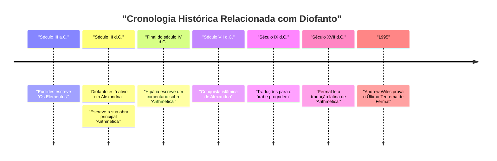
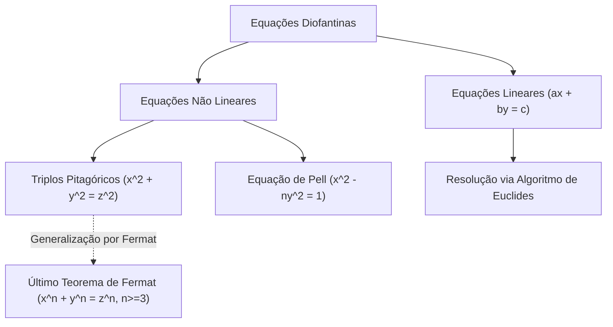

## 1. Introdução

Na história da matemática, existe uma figura conhecida como o "Pai da Álgebra". Essa figura é **[Diofanto](https://kenji.blog/pt/p/diophantus/)** (Diofanto de Alexandria), que esteve ativo na antiga Alexandria. A sua obra principal, *Arithmetica*, teve uma influência profunda nos matemáticos posteriores no mundo islâmico e nos matemáticos na Europa renascentista. Em particular, o "Último Teorema de Fermat", que [Pierre de Fermat](https://kenji.blog/pt/p/fermat/) escreveu nas margens de *Arithmetica*, é extremamente famoso.

Neste artigo, vamos aprofundar a vida de [Diofanto](https://kenji.blog/pt/p/diophantus/), as suas conquistas matemáticas, os detalhes da sua obra-prima *Arithmetica* e as "equações diofantinas" que têm o seu nome. Além disso, também desvendaremos o mistério do seu "epitáfio", a partir do qual se pode deduzir o seu tempo de vida.

## 2. A Vida de [Diofanto](https://kenji.blog/pt/p/diophantus/) e o Contexto Histórico

### 2.1 Uma Vida Envolta em Mistério

Quase não existem registos precisos sobre quando [Diofanto](https://kenji.blog/pt/p/diophantus/) nasceu ou quando morreu. Geralmente, acredita-se que ele esteve ativo em Alexandria, no Egito, por volta do século III d.C. (entre 200 e 284 d.C.). Pelas datas das figuras que ele menciona (como Hípsicles), sabemos que foi depois de 150 a.C., e como Téon de Alexandria (século IV d.C.) menciona [Diofanto](https://kenji.blog/pt/p/diophantus/), é certo que foi antes de 364 d.C. Historiadores modernos estimam que ele floresceu por volta do ano 250 d.C.

### 2.2 A Cultura Helenística e Alexandria

Naquela época, Alexandria era o centro da cultura e da aprendizagem helenísticas, ostentando uma enorme biblioteca (a Biblioteca de Alexandria) e servindo como um nexo de conhecimento onde muitos estudiosos se reuniam. Nesta cidade onde se cruzavam os conhecimentos da Grécia, do Egito, da Babilónia e até da Índia, acredita-se que [Diofanto](https://kenji.blog/pt/p/diophantus/) teve acesso a uma vasta herança matemática do passado. Ao contrário da tradição geométrica estabelecida por grandes matemáticos gregos como Euclides, Arquimedes e Apolónio, algumas teorias sugerem que [Diofanto](https://kenji.blog/pt/p/diophantus/) foi fortemente influenciado pela abordagem algébrica da Babilónia.

## 3. O Impacto da Sua Obra-prima *Arithmetica*

A maior conquista de [Diofanto](https://kenji.blog/pt/p/diophantus/) é o seu livro *Arithmetica*, que dizem ter consistido em 13 volumes. Infelizmente, apenas seis deles sobrevivem em grego hoje em dia, e mais quatro foram descobertos em tradução árabe.

### 3.1 O Amanhecer da Álgebra Simbólica

O aspeto inovador de *Arithmetica* é o uso de **símbolos** para representar incógnitas, as suas potências (quadrados, cubos, etc.) e operações (adição, subtração, igualdade, etc.). Na matemática grega antes dele (como em [Euclides](https://kenji.blog/pt/p/euclid/)), os problemas matemáticos eram descritos principalmente usando figuras geométricas e explicados com palavras (isto é chamado de álgebra retórica). No entanto, [Diofanto](https://kenji.blog/pt/p/diophantus/) tornou possível lidar com equações mais abstratas e complexas simbolizando expressões matemáticas (uma fase de transição chamada álgebra sincopada).

Ele usou um símbolo especial (equivalente ao $x$ moderno) para representar uma incógnita e deu notações únicas aos termos constantes e aos recíprocos das incógnitas.

$$
\text{Exemplo do polinómio de [Diofanto](https://kenji.blog/pt/p/diophantus/) (notação moderna):} \\
3x^3 - 2x^2 + 5x - 1 = 0
$$

### 3.2 Problemas Abordados e Soluções Racionais

*Arithmetica* contém cerca de 130 problemas sobre sistemas de equações lineares, equações quadráticas e até equações de grau superior. Uma característica importante desses problemas é que, ao contrário dos matemáticos modernos que procuram soluções reais ou complexas, ele procurou principalmente **soluções racionais (frações positivas ou números inteiros)**. Os conceitos de números negativos, do zero e de números irracionais ainda não estavam totalmente estabelecidos na altura, e ele não os reconhecia como soluções. Para ele, "números" significavam números racionais positivos.

Por exemplo, quando [Diofanto](https://kenji.blog/pt/p/diophantus/) encontrou uma equação como $4x + 20 = 4$, descartou-a como "absurda" porque a sua solução seria um número negativo ($x = -4$).

## 4. Equações Diofantinas

Hoje, o termo "equação diofantina" refere-se a uma **equação polinomial com coeficientes inteiros para a qual se procuram apenas soluções inteiras**. Embora o próprio [Diofanto](https://kenji.blog/pt/p/diophantus/) também procurasse soluções racionais, isso desenvolveu-se num ramo importante da "teoria dos números" na matemática posterior.

### 4.1 Equações Diofantinas Lineares

A equação diofantina mais simples é uma equação linear com duas variáveis (equação diofantina linear).

$$
ax + by = c \quad (a, b, c \text{ são números inteiros})
$$

Uma condição necessária e suficiente para que esta equação tenha uma solução inteira $(x, y)$ é que o máximo divisor comum de $a$ e $b$, $\gcd(a, b)$, divida $c$ (Identidade de Bézout).

**Exemplo:**
Considere a equação $4x + 6y = 8$.
Como $\gcd(4, 6) = 2$ e $2$ divide $8$, existem soluções inteiras.
Uma solução é $x = 2, y = 0$ ($4(2) + 6(0) = 8$).
Além disso, a solução geral pode ser expressa como $x = 2 + 3k, y = -2k$ (onde $k$ é qualquer número inteiro).

### 4.2 Triplos Pitagóricos e Equações Diofantinas Não Lineares

A equação familiar do teorema de Pitágoras também é um tipo de equação diofantina.

$$
x^2 + y^2 = z^2
$$

Um conjunto de números inteiros positivos $(x, y, z)$ que satisfaz esta equação é chamado de **triplo pitagórico**. Exemplos famosos incluem $(3, 4, 5)$ e $(5, 12, 13)$. No Livro II, Problema 8 de *Arithmetica*, [Diofanto](https://kenji.blog/pt/p/diophantus/) aborda o problema de dividir um número quadrado dado na soma de dois quadrados (por exemplo, encontrar números racionais $x, y$ tais que $16 = x^2 + y^2$).

Na margem ao lado deste problema, [Pierre de Fermat](https://kenji.blog/pt/p/fermat/), juiz e matemático amador francês do século XVII, deixou a seguinte nota:

> "É impossível separar um cubo em dois cubos, ou uma quarta potência em duas quartas potências, ou em geral, qualquer potência maior que a segunda, em duas potências iguais. Descobri uma demonstração verdadeiramente maravilhosa disto, mas esta margem é demasiado estreita para a conter."

Este é o famoso **Último Teorema de [Fermat](https://kenji.blog/pt/p/fermat/)** (que $x^n + y^n = z^n \ (n \ge 3)$ não tem soluções inteiras positivas). Este teorema continuou a rejeitar os desafios de matemáticos geniais de todo o mundo durante cerca de 350 anos depois de ter sido proposto, até que foi finalmente provado por Andrew Wiles em 1995. Sem o livro de [Diofanto](https://kenji.blog/pt/p/diophantus/), este grande drama poderia nunca ter ocorrido.

## 5. O Epitáfio de [Diofanto](https://kenji.blog/pt/p/diophantus/)

A pista mais interessante e talvez a única específica para compreender a vida de [Diofanto](https://kenji.blog/pt/p/diophantus/) é o enigma algébrico que se diz ter sido esculpido na sua lápide. Este foi registado na *Antologia Grega* compilada por Metrodoro por volta do século V, e permite deduzir o tempo de vida de [Diofanto](https://kenji.blog/pt/p/diophantus/) resolvendo uma equação linear.

### 5.1 O Conteúdo do Epitáfio

> Aqui jaz [Diofanto](https://kenji.blog/pt/p/diophantus/). Os números dizem a duração da sua vida.
> Durante $\frac{1}{6}$ da sua vida foi um menino.
> Depois de mais $\frac{1}{12}$, a sua barba começou a crescer.
> Depois de mais $\frac{1}{7}$, casou-se.
> Cinco anos após o casamento, nasceu o seu filho.
> Mas, infelizmente, o filho morreu com metade da idade do pai.
> Quatro anos após a morte do filho, ele também exalou o seu último suspiro de tristeza.

### 5.2 Solução via Equação

Se definirmos $x$ como a expectativa de vida de [Diofanto](https://kenji.blog/pt/p/diophantus/) (anos vividos), o texto acima pode ser expresso como a seguinte equação:

$$
\frac{x}{6} + \frac{x}{12} + \frac{x}{7} + 5 + \frac{x}{2} + 4 = x
$$

Vamos resolver esta equação.

Primeiro, encontre o mínimo múltiplo comum dos denominadores das frações. O mínimo múltiplo comum de 6, 12, 7 e 2 é 84.
Multiplique ambos os lados por 84.

$$
14x + 7x + 12x + 420 + 42x + 336 = 84x
$$

Combine os termos em $x$.

$$
(14 + 7 + 12 + 42)x + (420 + 336) = 84x \\
75x + 756 = 84x
$$

Reúna os $x$ do lado direito.

$$
756 = 84x - 75x \\
756 = 9x
$$

Divida ambos os lados por 9.

$$
x = 84
$$

Portanto, podemos ver que [Diofanto](https://kenji.blog/pt/p/diophantus/) morreu aos **84** anos. Considerando a expectativa de vida média da época, ele viveu uma vida muito longa. A linha do tempo da sua vida é a seguinte:

- Infância: $84 \times \frac{1}{6} = 14$ anos (idades 0-14)
- Juventude: $84 \times \frac{1}{12} = 7$ anos (idades 14-21)
- Até ao casamento: $84 \times \frac{1}{7} = 12$ anos (idades 21-33)
- Nascimento do filho: 5 anos após o casamento (33 + 5 = 38 anos)
- Vida útil do filho: $84 \times \frac{1}{2} = 42$ anos
- Morte do filho: quando [Diofanto](https://kenji.blog/pt/p/diophantus/) tinha 80 anos (38 + 42 = 80 anos)
- Morte de [Diofanto](https://kenji.blog/pt/p/diophantus/): 4 anos após a morte do filho (80 + 4 = 84 anos)

## 6. Influência nas Gerações Posteriores e Legado

As obras de [Diofanto](https://kenji.blog/pt/p/diophantus/) perderam-se temporariamente para o mundo da Europa Ocidental com o declínio do Império Romano. No entanto, foram cuidadosamente preservadas e estudadas no Império Romano do Oriente (Bizantino) e no mundo islâmico. No final do século IV, diz-se que Hipátia de Alexandria escreveu um comentário sobre *Arithmetica*.

Em particular, matemáticos em Bagdade no século IX traduziram *Arithmetica* para o árabe, contribuindo muito para o desenvolvimento da álgebra islâmica. Matemáticos islâmicos como Al-Karaji adotaram e desenvolveram ainda mais os métodos de [Diofanto](https://kenji.blog/pt/p/diophantus/).

No século XVI, à medida que os clássicos gregos foram redescobertos na Europa renascentista, *Arithmetica* foi traduzida para o latim. Uma edição bilíngue em grego e latim publicada por [Claude Gaspard Bachet](https://kenji.blog/pt/p/bachet/) de Méziriac em 1621 foi muito lida. Foi esta edição de Bachet de *Arithmetica* que [Fermat](https://kenji.blog/pt/p/fermat/) estudou cuidadosamente, o que desencadeou a abertura de uma nova porta na matemática.

A teoria das equações diofantinas foi subsequentemente profundamente estudada por gigantes como [Leonhard Euler](https://kenji.blog/pt/p/euler/), Joseph-Louis Lagrange e Carl Friedrich Gauss. A sua pesquisa transformou-se nos vastos campos matemáticos modernos da "teoria algébrica dos números" e da "geometria algébrica". O 10º dos 23 problemas de Hilbert foi "encontrar um algoritmo geral para determinar se uma dada equação diofantina é solucionável", e em 1970 Yuri Matiyasevich provou que "nenhum algoritmo desse tipo existe". O nome de [Diofanto](https://kenji.blog/pt/p/diophantus/) está profundamente gravado na vanguarda da matemática moderna.

## 7. Conclusão

[Diofanto](https://kenji.blog/pt/p/diophantus/) foi um pioneiro que lançou as bases da álgebra moderna ao usar símbolos para expressões matemáticas e lidar com incógnitas. A *Arithmetica* que deixou para trás não era apenas uma coleção de quebra-cabeças ou problemas de cálculo, mas continha insights profundos sobre as propriedades dos números. Os problemas que ele apresentou continuaram a fascinar os matemáticos ao longo de milénios e foram uma força motriz que moveu grandemente a história da matemática.

O seu epitáfio, que conta silenciosamente a história de uma vida de 84 anos através de fórmulas, ensina-nos a beleza universal da matemática e a busca da verdade intemporal. Verdadeiramente, [Diofanto](https://kenji.blog/pt/p/diophantus/) pode ser chamado de uma grande figura que lançou a primeira pedra angular do magnífico edifício da álgebra.
