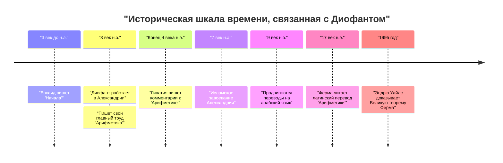
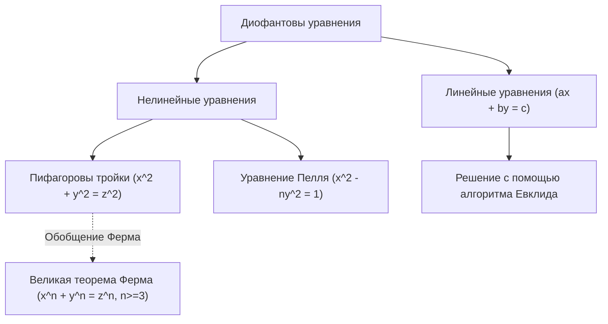

## 1. Введение

В истории математики есть фигура, известная как «Отец алгебры». Это **[Диофант](https://kenji.blog/ru/p/diophantus/)** ([Диофант](https://kenji.blog/ru/p/diophantus/) Александрийский), который жил и работал в древней Александрии. Его главный труд, «Арифметика», оказал глубокое влияние на более поздних математиков исламского мира и Европы эпохи Возрождения. В частности, всемирно известна «[Великая теорема Ферма](https://kenji.blog/ru/p/fermats-last-theorem/)», которую [Пьер де Ферма](https://kenji.blog/ru/p/fermat/) записал на полях «Арифметики».

В этой статье мы подробно рассмотрим жизнь [Диофант](https://kenji.blog/ru/p/diophantus/)а, его математические достижения, особенности его шедевра «Арифметика» и «диофантовы уравнения», названные в его честь. Кроме того, мы разгадаем тайну его «эпитафии», по которой можно вычислить продолжительность его жизни.

## 2. Жизнь [Диофант](https://kenji.blog/ru/p/diophantus/)а и исторический контекст

### 2.1 Жизнь, окутанная тайной

Почти не осталось точных записей о том, когда родился и когда умер [Диофант](https://kenji.blog/ru/p/diophantus/). В целом считается, что он работал в Александрии, Египет, примерно в 3 веке нашей эры (между 200 и 284 годами н.э.). По датам жизни упоминаемых им людей (например, Гипсикла) мы знаем, что это было после 150 г. до н.э., а поскольку Теон Александрийский (4 век н.э.) упоминает [Диофант](https://kenji.blog/ru/p/diophantus/)а, несомненно, что это было до 364 г. н.э. Современные историки полагают, что период его расцвета пришелся примерно на 250 год н.э.

### 2.2 Эллинистическая культура и Александрия

В то время Александрия была центром эллинистической культуры и науки, могла похвастаться огромной библиотекой (Александрийской библиотекой) и служила узлом знаний, где собиралось множество ученых. Считается, что в этом городе, где пересекались знания Греции, Египта, Вавилона и даже Индии, [Диофант](https://kenji.blog/ru/p/diophantus/) имел доступ к огромному математическому наследию прошлого. В отличие от геометрической традиции, заложенной такими великими греческими математиками, как [Евклид](https://kenji.blog/ru/p/euclid/), Архимед и Аполлоний, некоторые теории предполагают, что на [Диофант](https://kenji.blog/ru/p/diophantus/)а сильно повлиял алгебраический подход Вавилона.

## 3. Влияние его шедевра «Арифметика»

Величайшим достижением [Диофант](https://kenji.blog/ru/p/diophantus/)а является его книга «Арифметика», которая, как говорят, состояла из 13 томов. К сожалению, до наших дней сохранилось только шесть из них на греческом языке, и еще четыре были обнаружены в арабском переводе.

### 3.1 Рассвет символической алгебры

Новаторским аспектом «Арифметики» является использование **символов** для обозначения неизвестных, их степеней (квадратов, кубов и т. д.) и операций (сложение, вычитание, равенство и т. д.). В греческой математике до него (например, у [Евклид](https://kenji.blog/ru/p/euclid/)а) математические задачи в основном описывались с использованием геометрических фигур и объяснялись словами (это называется риторической алгеброй). Однако [Диофант](https://kenji.blog/ru/p/diophantus/) сделал возможным работу с более абстрактными и сложными уравнениями путем символизации математических выражений (переходный этап, называемый синкопированной алгеброй).

Он использовал специальный символ (эквивалент современного $x$) для представления неизвестного и дал уникальные обозначения константам и обратным величинам неизвестных.

$$
\text{Пример полинома [Диофант](https://kenji.blog/ru/p/diophantus/)а (современная запись):} \\
3x^3 - 2x^2 + 5x - 1 = 0
$$

### 3.2 Рассматриваемые задачи и рациональные решения

«Арифметика» содержит около 130 задач, касающихся систем линейных уравнений, квадратных уравнений и даже уравнений высших степеней. Главной особенностью этих задач является то, что в отличие от современных математиков, которые ищут действительные или комплексные решения, он в основном искал **рациональные решения (положительные дроби или целые числа)**. Понятия отрицательных чисел, нуля и иррациональных чисел в то время еще не были полностью сформированы, и он не признавал их в качестве решений. Для него «числа» означали положительные рациональные числа.

Например, когда [Диофант](https://kenji.blog/ru/p/diophantus/) сталкивался с уравнением вида $4x + 20 = 4$, он отвергал его как «абсурдное», поскольку его решением было бы отрицательное число ($x = -4$).

## 4. [Диофант](https://kenji.blog/ru/p/diophantus/)овы уравнения

Сегодня термин «диофантово уравнение» относится к **полиномиальному уравнению с целыми коэффициентами, для которого ищутся только целые решения**. Хотя сам [Диофант](https://kenji.blog/ru/p/diophantus/) также искал рациональные решения, в более поздней математике это превратилось в важную ветвь «теории чисел».

### 4.1 Линейные диофантовы уравнения

Простейшим диофантовым уравнением является линейное уравнение с двумя переменными (линейное диофантово уравнение).

$$
ax + by = c \quad (a, b, c \text{ — целые числа})
$$

Необходимым и достаточным условием того, чтобы это уравнение имело целое решение $(x, y)$, является то, чтобы наибольший общий делитель $a$ и $b$, $\gcd(a, b)$, делил $c$ (соотношение Безу).

**Пример:**
Рассмотрим уравнение $4x + 6y = 8$.
Поскольку $\gcd(4, 6) = 2$, а $2$ делит $8$, целые решения существуют.
Одним из решений является $x = 2, y = 0$ ($4(2) + 6(0) = 8$).
Также общее решение можно выразить как $x = 2 + 3k, y = -2k$ (где $k$ — любое целое число).

### 4.2 Пифагоровы тройки и нелинейные диофантовы уравнения

Знакомое уравнение из теоремы Пифагора также является разновидностью диофантова уравнения.

$$
x^2 + y^2 = z^2
$$

Набор целых положительных чисел $(x, y, z)$, удовлетворяющих этому уравнению, называется **пифагоровой тройкой**. Известные примеры: $(3, 4, 5)$ и $(5, 12, 13)$. В Книге II, Задаче 8 «Арифметики» [Диофант](https://kenji.blog/ru/p/diophantus/) рассматривает задачу разделения заданного квадрата на сумму двух квадратов (например, поиск рациональных чисел $x, y$ таких, что $16 = x^2 + y^2$).

На полях рядом с этой задачей [Пьер де Ферма](https://kenji.blog/ru/p/fermat/), французский судья и математик-любитель 17 века, оставил следующую запись:

> «Невозможно разложить куб на два куба, или биквадрат на два биквадрата, или вообще какую-либо степень, большую квадрата, на две степени с тем же показателем. Я нашел этому поистине чудесное доказательство, но эти поля слишком узки, чтобы его вместить».

Это знаменитая **[Великая теорема Ферма](https://kenji.blog/ru/p/fermats-last-theorem/)** (о том, что уравнение $x^n + y^n = z^n \ (n \ge 3)$ не имеет целых положительных решений). Эта теорема отвергала вызовы гениальных математиков всего мира на протяжении около 350 лет после ее выдвижения, пока в 1995 году ее окончательно не доказал [Эндрю Уайлс](https://kenji.blog/ru/p/wiles/). Без книги [Диофант](https://kenji.blog/ru/p/diophantus/)а эта великая математическая драма могла бы никогда не состояться.

## 5. Эпитафия [Диофант](https://kenji.blog/ru/p/diophantus/)а

Самой интересной и, пожалуй, единственной конкретной подсказкой для понимания жизни [Диофант](https://kenji.blog/ru/p/diophantus/)а является алгебраическая головоломка, которая, как говорят, была высечена на его надгробном камне. Она была записана в «Греческой антологии», составленной Метродором примерно в 5 веке, и позволяет вычислить продолжительность жизни [Диофант](https://kenji.blog/ru/p/diophantus/)а путем решения линейного уравнения.

### 5.1 Текст эпитафии

> Прах [Диофант](https://kenji.blog/ru/p/diophantus/)а гробница покоит; дивись ей — и камень
> Мудрым искусством его скажет почившего век.
> Волей богов шестую часть жизни он был мальчуганом,
> Двенадцатую — юношей, пока не покрылся пушком подбородок.
> Седьмую — с бездетной провел он супругой.
> Прошло пятилетье — и он стал счастлив рожденьем первенца сына.
> Коему рок половину лишь жизни прекрасной и светлой
> Дал на земле по сравненью с отцом.
> И в печали глубокой старец земного удела конец воспринял,
> Переживши года четыре с тех пор, как сына лишился.

### 5.2 Решение с помощью уравнения

Если мы обозначим $x$ как продолжительность жизни [Диофант](https://kenji.blog/ru/p/diophantus/)а (прожитые годы), приведенный выше текст можно выразить следующим уравнением:

$$
\frac{x}{6} + \frac{x}{12} + \frac{x}{7} + 5 + \frac{x}{2} + 4 = x
$$

Давайте решим это уравнение.

Сначала найдем наименьшее общее кратное знаменателей дробей. Наименьшее общее кратное 6, 12, 7 и 2 равно 84.
Умножим обе части на 84.

$$
14x + 7x + 12x + 420 + 42x + 336 = 84x
$$

Сгруппируем слагаемые с $x$.

$$
(14 + 7 + 12 + 42)x + (420 + 336) = 84x \\
75x + 756 = 84x
$$

Соберем $x$ в правой части.

$$
756 = 84x - 75x \\
756 = 9x
$$

Разделим обе части на 9.

$$
x = 84
$$

Таким образом, мы видим, что [Диофант](https://kenji.blog/ru/p/diophantus/) умер в возрасте **84** лет. Учитывая среднюю продолжительность жизни того времени, он прожил очень долгую жизнь. Хронология его жизни выглядит следующим образом:

- Детство: $84 \times \frac{1}{6} = 14$ лет (от 0 до 14 лет)
- Юность: $84 \times \frac{1}{12} = 7$ лет (от 14 до 21 года)
- До женитьбы: $84 \times \frac{1}{7} = 12$ лет (от 21 до 33 лет)
- Рождение сына: через 5 лет после свадьбы (33 + 5 = 38 лет)
- Продолжительность жизни сына: $84 \times \frac{1}{2} = 42$ года
- Смерть сына: когда [Диофант](https://kenji.blog/ru/p/diophantus/)у было 80 лет (38 + 42 = 80 лет)
- Смерть [Диофант](https://kenji.blog/ru/p/diophantus/)а: через 4 года после смерти сына (80 + 4 = 84 года)

## 6. Влияние на последующие поколения и наследие

Труды [Диофант](https://kenji.blog/ru/p/diophantus/)а были на время утеряны для западноевропейского мира с упадком Римской империи. Однако они бережно хранились и изучались в Восточной Римской (Византийской) империи и исламском мире. Считается, что в конце 4 века Гипатия Александрийская написала комментарии к «Арифметике».

В частности, математики в Багдаде в 9 веке перевели «Арифметику» на арабский язык, внеся огромный вклад в развитие исламской алгебры. Исламские математики, такие как Аль-Караджи, переняли и в дальнейшем развили методы [Диофант](https://kenji.blog/ru/p/diophantus/)а.

В 16 веке, когда классические греческие труды были заново открыты в Европе эпохи Возрождения, «Арифметика» была переведена на латынь. Двуязычное греко-латинское издание, опубликованное Клодом Гаспаром Баше де Мезириаком в 1621 году, получило широкую известность. Именно это издание Баше «Арифметики» тщательно изучал Ферма, что послужило толчком к открытию новых горизонтов в математике.

Теория диофантовых уравнений впоследствии глубоко изучалась такими гигантами, как [Леонард Эйлер](https://kenji.blog/ru/p/euler/), [Жозеф-Луи Лагранж](https://kenji.blog/ru/p/lagrange/) и [Карл Фридрих Гаусс](https://kenji.blog/ru/p/gauss/). Их исследования переросли в обширные математические области современной «алгебраической теории чисел» и «алгебраической геометрии». Десятой из 23 проблем Гильберта была «задача нахождения общего алгоритма для определения того, имеет ли заданное диофантово уравнение решение», и в 1970 году Юрий Матиясевич доказал, что «такого алгоритма не существует». Имя [Диофант](https://kenji.blog/ru/p/diophantus/)а глубоко выгравировано на переднем крае современной математики.

## 7. Заключение

[Диофант](https://kenji.blog/ru/p/diophantus/) был пионером, заложившим основы современной алгебры благодаря использованию символов для математических выражений и работе с неизвестными. Оставленная им «Арифметика» была не просто сборником головоломок или задач для вычислений, она содержала глубокое понимание свойств чисел. Задачи, которые он представил, продолжали очаровывать математиков на протяжении тысячелетий и были движущей силой, в значительной мере направлявшей историю математики.

Его эпитафия, которая тихо рассказывает историю 84-летней жизни через формулы, учит нас универсальной красоте математики и стремлению к вечной истине. Поистине, [Диофант](https://kenji.blog/ru/p/diophantus/)а можно назвать великим человеком, заложившим первый краеугольный камень в великолепное здание алгебры.
