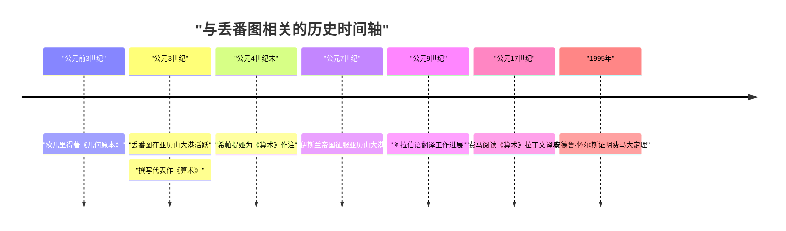
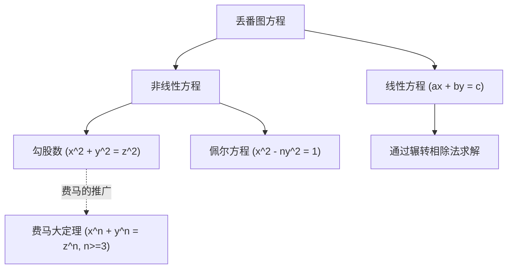

## 1. 引言

在数学史上，有一位被尊称为“代数之父”的人物。他就是活跃于古亚历山大港的 **[丢番图](https://kenji.blog/zh-cn/p/diophantus/)**（Diophantus of Alexandria）。他的著作《算术》（Arithmetica）对后世伊斯兰世界的数学家以及文艺复兴时期欧洲的数学家产生了深远的影响。特别是皮埃尔·德·费马（Pierre de Fermat）写在《算术》空白处的“[费马大定理](https://kenji.blog/zh-cn/p/fermats-last-theorem/)”，更是名垂千古。

本文将深入探讨[丢番图](https://kenji.blog/zh-cn/p/diophantus/)的生平、他的数学成就、代表作《算术》的详细内容，以及以他名字命名的“[丢番图](https://kenji.blog/zh-cn/p/diophantus/)方程”。此外，我们还将解开能够推算出他寿命的“墓志铭”之谜。

## 2. [丢番图](https://kenji.blog/zh-cn/p/diophantus/)的生平与时代背景

### 2.1 充满谜团的生平

关于[丢番图](https://kenji.blog/zh-cn/p/diophantus/)的出生和去世时间，几乎没有准确的记录留存下来。人们通常认为，他大约在公元3世纪左右（公元200年至284年之间）活跃于埃及的亚历山大港。从他提到的数学家（如希普西克勒斯）的年代可以推断，他生活在公元前150年之后；而亚历山大的塞翁（公元4世纪）曾提到过[丢番图](https://kenji.blog/zh-cn/p/diophantus/)，因此他必定生活在公元364年之前。现代历史学家估计他的鼎盛时期大约在公元250年左右。

### 2.2 希腊化文化与亚历山大港

当时的亚历山大港是希腊化文化和学术的中心，拥有庞大的图书馆（亚历山大图书馆），是众多学者聚集的智慧枢纽。在这个汇聚了希腊、埃及、巴比伦甚至印度知识的城市里，[丢番图](https://kenji.blog/zh-cn/p/diophantus/)能够接触到大量过去的数学遗产。与欧几里得（Euclid）、阿基米德（Archimedes）、阿波罗尼奥斯（Apollonius）等伟大希腊数学家建立的几何学传统不同，有理论认为[丢番图](https://kenji.blog/zh-cn/p/diophantus/)受到了巴比伦代数方法的强烈影响。

## 3. 代表作《算术》（Arithmetica）的冲击

[丢番图](https://kenji.blog/zh-cn/p/diophantus/)最大的成就是著有全13卷的《算术》（Arithmetica）。遗憾的是，至今保留下来的希腊文原版只有6卷，另有4卷以阿拉伯语译本的形式被发现。

### 3.1 符号代数的黎明

《算术》的划时代之处在于，它使用了 **符号** 来表示未知数及其幂（平方、立方等），以及运算（加法、减法、等号等）。在他之前的希腊数学（如[欧几里得](https://kenji.blog/zh-cn/p/euclid/)）中，数学问题主要使用几何图形并用语言进行描述（这被称为修辞代数）。然而，[丢番图](https://kenji.blog/zh-cn/p/diophantus/)通过将数学表达式符号化（这一过渡期被称为切分代数），使得处理更加抽象和复杂的方程成为可能。

他使用了一个特殊的符号（相当于现在的 $x$）来表示未知数，并为常数项和未知数的倒数等赋予了独特的符号。

$$
\text{[丢番图](https://kenji.blog/zh-cn/p/diophantus/)的多项式示例（现代符号）：} \\
3x^3 - 2x^2 + 5x - 1 = 0
$$

### 3.2 探讨的问题与有理数解

《算术》中收录了大约130个涉及联立一次方程、二次方程甚至高次方程的问题。这些问题的一个主要特点是，与现代我们寻求实数或复数解不同，他主要寻求 **有理数（正分数或整数）解**。当时负数、零和无理数的概念尚未完全建立，他拒绝接受这些作为解。对他来说，“数”意味着正有理数。

例如，当[丢番图](https://kenji.blog/zh-cn/p/diophantus/)遇到像 $4x + 20 = 4$ 这样的方程时，他认为这是“荒谬的”并将其驳回，因为它的解会是一个负数 ($x = -4$)。

## 4. [丢番图](https://kenji.blog/zh-cn/p/diophantus/)方程

今天，“[丢番图](https://kenji.blog/zh-cn/p/diophantus/)方程（Diophantine equation）”一词指的是 **系数为整数且仅求整数解的多项式方程**。虽然[丢番图](https://kenji.blog/zh-cn/p/diophantus/)本人也寻求有理数解，但这在后世数学中发展成为“数论”的一个重要分支。

### 4.1 线性[丢番图](https://kenji.blog/zh-cn/p/diophantus/)方程

最简单的[丢番图](https://kenji.blog/zh-cn/p/diophantus/)方程是两变量的一次方程（线性[丢番图](https://kenji.blog/zh-cn/p/diophantus/)方程）。

$$
ax + by = c \quad (a, b, c \text{ 为整数})
$$

这个方程有整数解 $(x, y)$ 的充要条件是，$a$ 和 $b$ 的最大公约数 $\gcd(a, b)$ 能整除 $c$（裴蜀定理）。

**示例：**
考虑方程 $4x + 6y = 8$。
因为 $\gcd(4, 6) = 2$，且 $2$ 能整除 $8$，所以存在整数解。
其中一个解是 $x = 2, y = 0$（$4(2) + 6(0) = 8$）。
此外，一般解可以表示为 $x = 2 + 3k, y = -2k$（$k$ 为任意整数）。

### 4.2 勾股数与非线性[丢番图](https://kenji.blog/zh-cn/p/diophantus/)方程

我们熟知的勾股定理（毕达哥拉斯定理）方程也是一种[丢番图](https://kenji.blog/zh-cn/p/diophantus/)方程。

$$
x^2 + y^2 = z^2
$$

满足这个方程的正整数 $(x, y, z)$ 组合被称为 **勾股数（毕达哥拉斯三元组）**。著名的有 $(3, 4, 5)$ 和 $(5, 12, 13)$ 等。[丢番图](https://kenji.blog/zh-cn/p/diophantus/)在《算术》第II卷第8题中，探讨了将一个给定的平方数分为两个平方数之和的问题（例如寻找有理数 $x, y$ 使得 $16 = x^2 + y^2$）。

在这个问题的空白处，17世纪的法国法官兼业余数学家[皮埃尔·德·费马](https://kenji.blog/zh-cn/p/fermat/)留下了如下笔记：

> “将一个立方数分为两个立方数之和，或一个四次幂分为两个四次幂之和，或者一般地，将一个高于二次的幂分为两个同次幂之和，这是不可能的。对此，我确信已发现了一个美妙的证法，可惜这里的空白处太小，写不下。”

这就是著名的 **[费马大定理](https://kenji.blog/zh-cn/p/fermats-last-theorem/)**（即 $x^n + y^n = z^n \ (n \ge 3)$ 没有正整数解）。这个定理自提出以来，在约350年的时间里击退了全世界天才数学家们的挑战，直到1995年才被安德鲁·怀尔斯最终证明。如果没有[丢番图](https://kenji.blog/zh-cn/p/diophantus/)的著作，这场伟大的数学剧也许就不会发生。

## 5. [丢番图](https://kenji.blog/zh-cn/p/diophantus/)的墓志铭（Epitaph）

要了解[丢番图](https://kenji.blog/zh-cn/p/diophantus/)的生平，最有趣且被认为是唯一具体线索的，是据说刻在他墓碑上的代数谜题。它被收录在公元5世纪左右由梅特罗多鲁斯编纂的《希腊诗集》（Greek Anthology）中，通过解一个一次方程，就可以推算出[丢番图](https://kenji.blog/zh-cn/p/diophantus/)的寿命。

### 5.1 墓志铭的内容

> [丢番图](https://kenji.blog/zh-cn/p/diophantus/)长眠于此。数字诉说着他一生的长短。
> 他生命的 $\frac{1}{6}$ 是童年。
> 又过了生命的 $\frac{1}{12}$，他长出了胡须。
> 再过了 $\frac{1}{7}$ 的岁月后，他结婚了。
> 婚后 5 年，他有了一个儿子。
> 可悲的是，这个儿子在活到父亲寿命一半的时候便离开了人世。
> 儿子死后 4 年，他在悲痛中也结束了自己的一生。

### 5.2 方程求解

如果我们将[丢番图](https://kenji.blog/zh-cn/p/diophantus/)的寿命（活的年数）设为 $x$，上述文字可以表示为以下方程：

$$
\frac{x}{6} + \frac{x}{12} + \frac{x}{7} + 5 + \frac{x}{2} + 4 = x
$$

让我们来解这个方程。

首先，求分数分母的最小公倍数。6、12、7、2 的最小公倍数是 84。
两边同乘 84。

$$
14x + 7x + 12x + 420 + 42x + 336 = 84x
$$

合并 $x$ 的项。

$$
(14 + 7 + 12 + 42)x + (420 + 336) = 84x \\
75x + 756 = 84x
$$

将 $x$ 移到右边。

$$
756 = 84x - 75x \\
756 = 9x
$$

两边同除以 9。

$$
x = 84
$$

因此，我们可以得知[丢番图](https://kenji.blog/zh-cn/p/diophantus/)是在 **84 岁** 时去世的。考虑到当时的平均寿命，他可以说是非常长寿的。他的人生时间轴如下：

- 童年时期：$84 \times \frac{1}{6} = 14$ 年（0～14岁）
- 青年时期：$84 \times \frac{1}{12} = 7$ 年（14～21岁）
- 结婚前：$84 \times \frac{1}{7} = 12$ 年（21～33岁）
- 儿子出生：婚后5年（33 + 5 = 38岁）
- 儿子的寿命：$84 \times \frac{1}{2} = 42$ 年
- 儿子去世：[丢番图](https://kenji.blog/zh-cn/p/diophantus/)80岁时（38 + 42 = 80岁）
- [丢番图](https://kenji.blog/zh-cn/p/diophantus/)去世：儿子死后4年（80 + 4 = 84岁）

## 6. 对后世的影响与遗产

随着罗马帝国的衰落，[丢番图](https://kenji.blog/zh-cn/p/diophantus/)的著作一度在西欧世界失传。然而，它们在东罗马（拜占庭）帝国和伊斯兰世界得到了妥善保存和研究。据说在4世纪末，亚历山大的希帕提娅曾为《算术》撰写过注释。

特别是，9世纪巴格达的数学家们将《算术》翻译成了阿拉伯语，为伊斯兰代数学的发展做出了巨大贡献。阿尔·卡拉吉等伊斯兰数学家吸收了[丢番图](https://kenji.blog/zh-cn/p/diophantus/)的方法，并将其进一步发展。

进入16世纪，随着文艺复兴时期欧洲对希腊古典著作的重新发现，《算术》也被翻译成了拉丁语。1621年由克劳德·加斯帕尔·巴谢（[Claude Gaspard Bachet](https://kenji.blog/zh-cn/p/bachet/) de Méziriac）出版的希腊语和拉丁语对照本被广泛阅读。正是这本巴谢版的《算术》，被费马仔细研读，从而成为了开启新数学大门的契机。

此后，[丢番图](https://kenji.blog/zh-cn/p/diophantus/)方程的理论被莱昂哈德·欧拉（Leonhard Euler）、约瑟夫·路易·拉格朗日（Joseph-Louis Lagrange）、卡尔·弗里德里希·高斯（Carl Friedrich Gauss）等巨匠深入研究。他们的研究成长为现代“代数数论”和“代数几何学”等庞大的数学领域。希尔伯特23个问题中的第10个问题是“寻找一个通用的算法来判定任意丢番图方程是否可解”，1970年尤里·马季亚谢维奇证明了“这样的算法不存在”。[丢番图](https://kenji.blog/zh-cn/p/diophantus/)的名字，深深镌刻在现代数学的最前沿。

## 7. 结语

[丢番图](https://kenji.blog/zh-cn/p/diophantus/)是将数学表达式符号化、处理未知数的现代代数学基础的奠基人先驱。他留下的《算术》不仅仅是谜题或计算题的集合，更包含了对数性质的深刻洞察。他提出的问题跨越数千年的时光，继续令数学家们着迷，成为了极大推动数学历史发展的原动力。

他那用公式静静诉说84年人生的墓志铭，向我们展示了数学所具有的普遍美感，以及超越时代的对真理的探索。[丢番图](https://kenji.blog/zh-cn/p/diophantus/)，确切无疑地可以被称为是在代数学这座宏伟建筑上奠定第一块基石的伟人。
