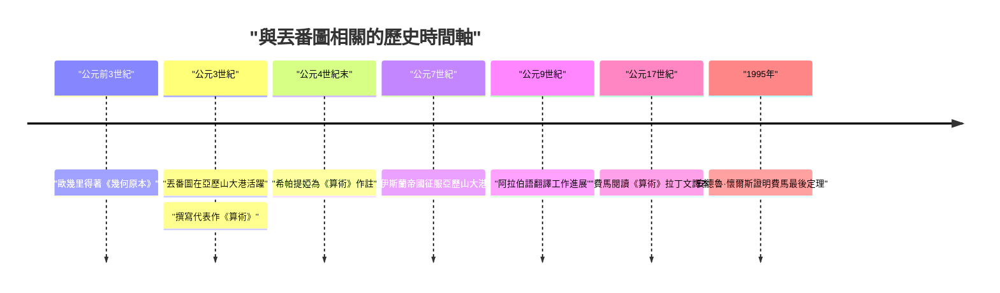
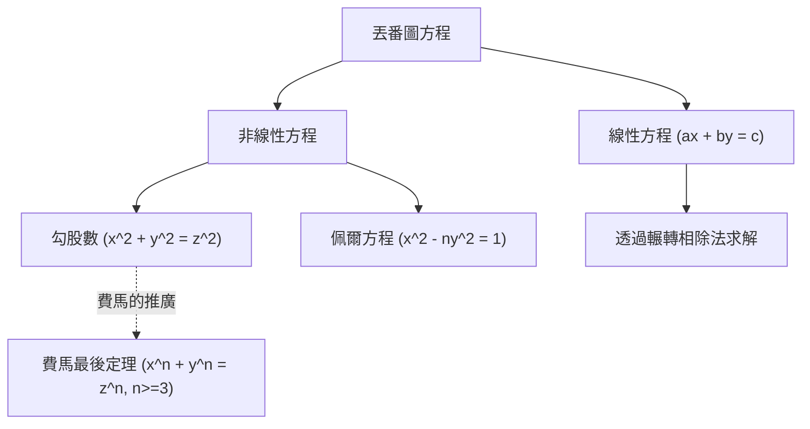

## 1. 引言

在數學史上，有一位被尊稱為「代數之父」的人物。他就是活躍於古亞歷山大港的 **[丟番圖](https://kenji.blog/zh-tw/p/diophantus/)**（[Diophantus](https://kenji.blog/zh-tw/p/diophantus/) of Alexandria）。他的著作《算術》（Arithmetica）對後世伊斯蘭世界的數學家以及文藝復興時期歐洲的數學家產生了深遠的影響。特別是[皮埃爾·德·費馬](https://kenji.blog/zh-tw/p/fermat/)（[Pierre de Fermat](https://kenji.blog/zh-tw/p/fermat/)）寫在《算術》空白處的「[費馬最後定理](https://kenji.blog/zh-tw/p/fermats-last-theorem/)」，更是名垂千古。

本文將深入探討[丟番圖](https://kenji.blog/zh-tw/p/diophantus/)的生平、他的數學成就、代表作《算術》的詳細內容，以及以他名字命名的「[丟番圖](https://kenji.blog/zh-tw/p/diophantus/)方程」。此外，我們還將解開能夠推算出他壽命的「墓誌銘」之謎。

## 2. [丟番圖](https://kenji.blog/zh-tw/p/diophantus/)的生平與時代背景

### 2.1 充滿謎團的生平

關於[丟番圖](https://kenji.blog/zh-tw/p/diophantus/)的出生和去世時間，幾乎沒有準確的記錄留存下來。人們通常認為，他大約在公元3世紀左右（公元200年至284年之間）活躍於埃及的亞歷山大港。從他提到的數學家（如希普西克勒斯）的年代可以推斷，他生活在公元前150年之後；而亞歷山大的塞翁（公元4世紀）曾提到過[丟番圖](https://kenji.blog/zh-tw/p/diophantus/)，因此他必定生活在公元364年之前。現代歷史學家估計他的鼎盛時期大約在公元250年左右。

### 2.2 希臘化文化與亞歷山大港

當時的亞歷山大港是希臘化文化和學術的中心，擁有龐大的圖書館（亞歷山大圖書館），是眾多學者聚集的智慧樞紐。在這個匯聚了希臘、埃及、巴比倫甚至印度知識的城市裡，[丟番圖](https://kenji.blog/zh-tw/p/diophantus/)能夠接觸到大量過去的數學遺產。與[歐幾里得](https://kenji.blog/zh-tw/p/euclid/)（[Euclid](https://kenji.blog/zh-tw/p/euclid/)）、阿基米德（[Archimedes](https://kenji.blog/zh-tw/p/archimedes/)）、阿波羅尼奧斯（Apollonius）等偉大希臘數學家建立的幾何學傳統不同，有理論認為[丟番圖](https://kenji.blog/zh-tw/p/diophantus/)受到了巴比倫代數方法的強烈影響。

## 3. 代表作《算術》（Arithmetica）的衝擊

[丟番圖](https://kenji.blog/zh-tw/p/diophantus/)最大的成就是著有全13卷的《算術》（Arithmetica）。遺憾的是，至今保留下來的希臘文原版只有6卷，另有4卷以阿拉伯語譯本的形式被發現。

### 3.1 符號代數的黎明

《算術》的劃時代之處在於，它使用了 **符號** 來表示未知數及其冪（平方、立方等），以及運算（加法、減法、等號等）。在他之前的希臘數學（如[歐幾里得](https://kenji.blog/zh-tw/p/euclid/)）中，數學問題主要使用幾何圖形並用語音進行描述（這被稱為修辭代數）。然而，[丟番圖](https://kenji.blog/zh-tw/p/diophantus/)通過將數學表達式符號化（這一過渡期被稱為切分代數），使得處理更加抽象和複雜的方程成為可能。

他使用了一個特殊的符號（相當於現在的 $x$）來表示未知數，並為常數項和未知數的倒數等賦予了獨特的符號。

$$
\text{[丟番圖](https://kenji.blog/zh-tw/p/diophantus/)的多項式示例（現代符號）：} \\
3x^3 - 2x^2 + 5x - 1 = 0
$$

### 3.2 探討的問題與有理數解

《算術》中收錄了大約130個涉及聯立一次方程、二次方程甚至高次方程的問題。這些問題的一個主要特點是，與現代我們尋求實數或複數解不同，他主要尋求 **有理數（正分數或整數）解**。當時負數、零和無理數的概念尚未完全建立，他拒絕接受這些作為解。對他來說，「數」意味著正有理數。

例如，當[丟番圖](https://kenji.blog/zh-tw/p/diophantus/)遇到像 $4x + 20 = 4$ 這樣的方程時，他認為這是「荒謬的」並將其駁回，因為它的解會是一個負數 ($x = -4$)。

## 4. [丟番圖](https://kenji.blog/zh-tw/p/diophantus/)方程

今天，「[丟番圖](https://kenji.blog/zh-tw/p/diophantus/)方程（Diophantine equation）」一詞指的是 **係數為整數且僅求整數解的多項式方程**。雖然[丟番圖](https://kenji.blog/zh-tw/p/diophantus/)本人也尋求有理數解，但這在後世數學中發展成為「數論」的一個重要分支。

### 4.1 線性[丟番圖](https://kenji.blog/zh-tw/p/diophantus/)方程

最簡單的[丟番圖](https://kenji.blog/zh-tw/p/diophantus/)方程是兩變量的一次方程（線性[丟番圖](https://kenji.blog/zh-tw/p/diophantus/)方程）。

$$
ax + by = c \quad (a, b, c \text{ 為整數})
$$

這個方程有整數解 $(x, y)$ 的充要條件是，$a$ 和 $b$ 的最大公因數 $\gcd(a, b)$ 能整除 $c$（裴蜀定理）。

**示例：**
考慮方程 $4x + 6y = 8$。
因為 $\gcd(4, 6) = 2$，且 $2$ 能整除 $8$，所以存在整數解。
其中一個解是 $x = 2, y = 0$（$4(2) + 6(0) = 8$）。
此外，一般解可以表示為 $x = 2 + 3k, y = -2k$（$k$ 為任意整數）。

### 4.2 勾股數與非線性[丟番圖](https://kenji.blog/zh-tw/p/diophantus/)方程

我們熟知的勾股定理（畢達哥拉斯定理）方程也是一種[丟番圖](https://kenji.blog/zh-tw/p/diophantus/)方程。

$$
x^2 + y^2 = z^2
$$

滿足這個方程的正整數 $(x, y, z)$ 組合被稱為 **勾股數（畢達哥拉斯三元組）**。著名的有 $(3, 4, 5)$ 和 $(5, 12, 13)$ 等。[丟番圖](https://kenji.blog/zh-tw/p/diophantus/)在《算術》第II卷第8題中，探討了將一個給定的平方數分為兩個平方數之和的問題（例如尋找有理數 $x, y$ 使得 $16 = x^2 + y^2$）。

在這個問題的空白處，17世紀的法國法官兼業餘數學家[皮埃爾·德·費馬](https://kenji.blog/zh-tw/p/fermat/)留下了如下筆記：

> 「將一個立方數分為兩個立方數之和，或一個四次冪分為兩個四次冪之和，或者一般地，將一個高於二次的冪分為兩個同次冪之和，這是不可能的。對此，我確信已發現了一個美妙的證法，可惜這裡的空白處太小，寫不下。」

這就是著名的 **[費馬最後定理](https://kenji.blog/zh-tw/p/fermats-last-theorem/)**（即 $x^n + y^n = z^n \ (n \ge 3)$ 沒有正整數解）。這個定理自提出以來，在約350年的時間裡擊退了全世界天才數學家們的挑戰，直到1995年才被[安德魯·懷爾斯](https://kenji.blog/zh-tw/p/wiles/)最終證明。如果沒有[丟番圖](https://kenji.blog/zh-tw/p/diophantus/)的著作，這場偉大的數學劇也許就不會發生。

## 5. [丟番圖](https://kenji.blog/zh-tw/p/diophantus/)的墓誌銘（Epitaph）

要了解[丟番圖](https://kenji.blog/zh-tw/p/diophantus/)的生平，最有趣且被認為是唯一具體線索的，是據說刻在他墓碑上的代數謎題。它被收錄在公元5世紀左右由梅特羅多魯斯編纂的《希臘詩集》（Greek Anthology）中，透過解一個一次方程，就可以推算出[丟番圖](https://kenji.blog/zh-tw/p/diophantus/)的壽命。

### 5.1 墓誌銘的內容

> [丟番圖](https://kenji.blog/zh-tw/p/diophantus/)長眠於此。數字訴說著他一生的長短。
> 他生命的 $\frac{1}{6}$ 是童年。
> 又過了生命的 $\frac{1}{12}$，他長出了鬍鬚。
> 再過了 $\frac{1}{7}$ 的歲月後，他結婚了。
> 婚後 5 年，他有了一個兒子。
> 可悲的是，這個兒子在活到父親壽命一半的時候便離開了人世。
> 兒子死後 4 年，他在悲痛中也結束了自己的一生。

### 5.2 方程求解

如果我們將[丟番圖](https://kenji.blog/zh-tw/p/diophantus/)的壽命（活的年數）設為 $x$，上述文字可以表示為以下方程：

$$
\frac{x}{6} + \frac{x}{12} + \frac{x}{7} + 5 + \frac{x}{2} + 4 = x
$$

讓我們來解這個方程。

首先，求分數分母的最小公倍數。6、12、7、2 的最小公倍數是 84。
兩邊同乘 84。

$$
14x + 7x + 12x + 420 + 42x + 336 = 84x
$$

合併 $x$ 的項。

$$
(14 + 7 + 12 + 42)x + (420 + 336) = 84x \\
75x + 756 = 84x
$$

將 $x$ 移到右邊。

$$
756 = 84x - 75x \\
756 = 9x
$$

兩邊同除以 9。

$$
x = 84
$$

因此，我們可以得知[丟番圖](https://kenji.blog/zh-tw/p/diophantus/)是在 **84 歲** 時去世的。考慮到當時的平均壽命，他可以說是非常長壽的。他的人生時間軸如下：

- 童年時期：$84 \times \frac{1}{6} = 14$ 年（0～14歲）
- 青年時期：$84 \times \frac{1}{12} = 7$ 年（14～21歲）
- 結婚前：$84 \times \frac{1}{7} = 12$ 年（21～33歲）
- 兒子出生：婚後5年（33 + 5 = 38歲）
- 兒子的壽命：$84 \times \frac{1}{2} = 42$ 年
- 兒子去世：[丟番圖](https://kenji.blog/zh-tw/p/diophantus/)80歲時（38 + 42 = 80歲）
- [丟番圖](https://kenji.blog/zh-tw/p/diophantus/)去世：兒子死後4年（80 + 4 = 84歲）

## 6. 對後世的影響與遺產

隨著羅馬帝國的衰落，[丟番圖](https://kenji.blog/zh-tw/p/diophantus/)的著作一度在西歐世界失傳。然而，它們在東羅馬（拜占庭）帝國和伊斯蘭世界得到了妥善保存和研究。據說在4世紀末，亞歷山大的希帕提婭曾為《算術》撰寫過註釋。

特別是，9世紀巴格達的數學家們將《算術》翻譯成了阿拉伯語，為伊斯蘭代數學的發展做出了巨大貢獻。阿爾·卡拉吉等伊斯蘭數學家吸收了[丟番圖](https://kenji.blog/zh-tw/p/diophantus/)的方法，並將其進一步發展。

進入16世紀，隨著文藝復興時期歐洲對希臘古典著作的重新發現，《算術》也被翻譯成了拉丁語。1621年由克勞德·加斯帕爾·巴謝（[Claude Gaspard Bachet](https://kenji.blog/zh-tw/p/bachet/) de Méziriac）出版的希臘語和拉丁語對照本被廣泛閱讀。正是這本巴謝版的《算術》，被費馬仔細研讀，從而成為了開啟新數學大門的契機。

此後，[丟番圖](https://kenji.blog/zh-tw/p/diophantus/)方程的理論被萊昂哈德·歐拉（[Leonhard Euler](https://kenji.blog/zh-tw/p/euler/)）、[約瑟夫·路易·拉格朗日](https://kenji.blog/zh-tw/p/lagrange/)（[Joseph-Louis Lagrange](https://kenji.blog/zh-tw/p/lagrange/)）、[卡爾·弗里德里希·高斯](https://kenji.blog/zh-tw/p/gauss/)（[Carl Friedrich Gauss](https://kenji.blog/zh-tw/p/gauss/)）等巨匠深入研究。他們的研究成長為現代「代數數論」和「代數幾何學」等龐大的數學領域。希爾伯特23個問題中的第10個問題是「尋找一個通用的算法來判定任意[丟番圖](https://kenji.blog/zh-tw/p/diophantus/)方程是否可解」，1970年尤里·馬季亞謝維奇證明了「這樣的算法不存在」。[丟番圖](https://kenji.blog/zh-tw/p/diophantus/)的名字，深深鐫刻在現代數學的最前沿。

## 7. 結語

[丟番圖](https://kenji.blog/zh-tw/p/diophantus/)是將數學表達式符號化、處理未知數的現代代數學基礎的奠基人先驅。他留下的《算術》不僅僅是謎題或計算題的集合，更包含了對數性質的深刻洞察。他提出的問題跨越數千年的時光，繼續令數學家們著迷，成為了極大推動數學歷史發展的原動力。

他那用公式靜靜訴說84年人生的墓誌銘，向我們展示了數學所具有的普遍美感，以及超越時代的對真理的探索。[丟番圖](https://kenji.blog/zh-tw/p/diophantus/)，確切無疑地可以被稱為是在代數學這座宏偉建築上奠定第一塊基石的偉人。
