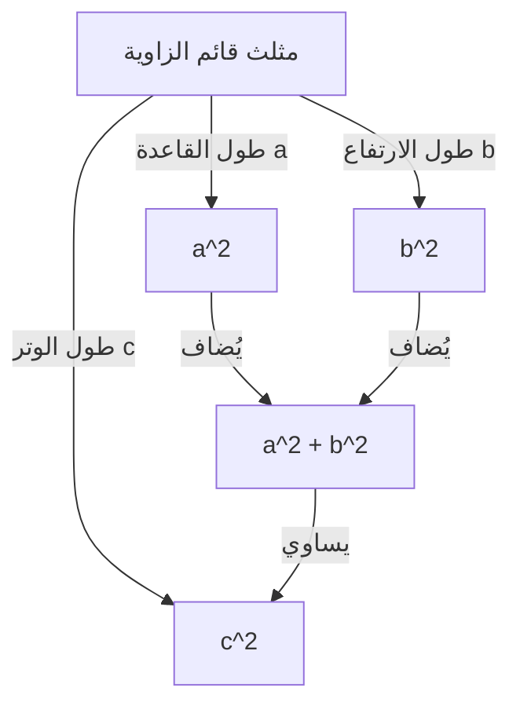

## مقدمة

من أشهر المبرهنات في الرياضيات، والتي تمتلك أكبر عدد من البراهين، هي **مبرهنة [فيثاغورس](/ar/p/pythagoras/)**. هذه المبرهنة، التي تصف العلاقة بين أضلاع المثلث القائم الزاوية الثلاثة، سُميت على اسم الفيلسوف اليوناني القديم [فيثاغورس](/ar/p/pythagoras/)، رغم أنها كانت معروفة في بابل والصين وأماكن أخرى قبل عصره بكثير.

تأكيد المبرهنة بسيط للغاية. عندما يكون طول وتر المثلث القائم الزاوية $c$، وطول الضلعين الآخرين $a$ و $b$، تتحقق العلاقة التالية:

$$ a^2 + b^2 = c^2 $$

من المثير للدهشة أن هناك مئات الطرق المختلفة لإثبات هذه الصيغة الرياضية التي تبدو بسيطة. في هذا المقال، سنستكشف أعماق هذه المبرهنة من وجهات نظر متنوعة، بدءًا من البراهين الهندسية الكلاسيكية والمناهج الجبرية، وصولاً إلى برهان من قِبل رئيس أمريكي وبرهان بديهي للشاب ألبرت أينشتاين.

---

## 1. البرهان الهندسي بناءً على كتاب "العناصر" ل[إقليدس](https://kenji.blog/ar/p/euclid/)

قدم عالم الرياضيات اليوناني القديم [إقليدس](https://kenji.blog/ar/p/euclid/) برهانًا بصريًا وصارمًا في كتابه "العناصر" (الكتاب الأول، الاقتراح 47)، والذي يُشار إليه أحيانًا باسم **برهان الطاحونة الهوائية**.

### فكرة البرهان

ارسم ثلاثة مربعات، بحيث يستخدم كل منها أحد أضلاع المثلث القائم الزاوية كضلع له. يستخدم البرهان تطابق المثلثات وتكافؤ المساحات لإظهار أن مساحة المربع الأكبر (الموجود على الوتر $c$) تساوي مجموع مساحتي المربعين الآخرين (على الضلعين $a$ و $b$).

1. أسقط عمودًا من رأس الزاوية القائمة إلى الوتر، مما يقسم المربع الموجود على الوتر إلى مستطيلين.
2. أثبت أن مساحة المربع الصغير $a^2$ تساوي مساحة أحد المستطيلين المقسمين باستخدام تحويلات القص (تحويلات تحافظ على المساحة).
3. وبالمثل، بيّن أن مساحة المربع المتوسط $b^2$ تساوي مساحة المستطيل الآخر.
4. ونتيجة لذلك، فإن $a^2 + b^2$ يطابق تمامًا مساحة المربع الكبير $c^2$.

رغم أن هذه الطريقة تبدو معقدة بسبب خطوط المساعدة العديدة، إلا أنها برهان في غاية الجمال يكتمل تمامًا من خلال الهندسة البحتة.

---

## 2. البرهان الجبري باستخدام المثلثات المتشابهة

بعد ذلك، نقدم برهانًا يستخدم نسبة التشابه للمثلثات. تتطلب هذه الطريقة حدًا أدنى من العمليات الحسابية وتتميز بتسلسل منطقي أنيق للغاية.

### خطوات البرهان

في المثلث القائم الزاوية $ABC$، ارسم خطًا عموديًا $CD$ من رأس الزاوية القائمة $C$ إلى الوتر $AB$. يؤدي هذا إلى تقسيم المثلث الكبير الأصلي إلى مثلثين قائمي الزاوية أصغر حجمًا.

في هذه المرحلة، تكون جميع المثلثات الثلاثة (المثلث الأصلي والمثلثين الأصغر المقسمين) متشابهة مع بعضها البعض.

- $\triangle ABC \sim \triangle ACD$
- $\triangle ABC \sim \triangle CBD$

نظرًا لأن نسبة الأضلاع المتناظرة في المثلثات المتشابهة متساوية، فإن العلاقات التالية تتحقق:

1. بالنسبة لـ $\triangle ABC$ و $\triangle ACD$:
   $$ \frac{c}{b} = \frac{b}{AD} \implies b^2 = c \cdot AD $$

2. بالنسبة لـ $\triangle ABC$ و $\triangle CBD$:
   $$ \frac{c}{a} = \frac{a}{DB} \implies a^2 = c \cdot DB $$

اجمع هاتين المعادلتين معًا:

$$ a^2 + b^2 = c \cdot DB + c \cdot AD = c \cdot (DB + AD) $$

هنا، نظرًا لأن $DB + AD = c$ (الطول الإجمالي للوتر)،

$$ a^2 + b^2 = c \cdot c = c^2 $$

وهكذا، تم إثبات المبرهنة. يوضح هذا النهج ببراعة اندماج **الجبر** و **الهندسة**.

---

## 3. برهان الرئيس جيمس أ. غارفيلد

من المثير للدهشة أن جيمس أ. غارفيلد، الرئيس العشرين للولايات المتحدة، أثبت هذه المبرهنة باستخدام نهجه الفريد في عام 1876. لقد استخدم **مساحة شبه المنحرف**.

### النهج باستخدام شبه المنحرف

ضع مثلثين قائمي الزاوية متطابقين (بأطوال أضلاع $a، b، c$) في خط مستقيم على طول محور واحد، وقم بتوصيل رؤوسهما لتشكيل شبه منحرف.

يمكن حساب مساحة شبه المنحرف بطريقتين مختلفتين.

**الطريقة 1: باستخدام صيغة شبه المنحرف**
أطوال الضلعين المتوازيين هما $a$ و $b$، والارتفاع هو $a + b$.
$$ \text{المساحة} = \frac{1}{2} \cdot (a + b) \cdot (a + b) = \frac{1}{2} (a^2 + 2ab + b^2) $$

**الطريقة 2: كمجموع مساحات ثلاثة مثلثات**
يوجد داخل شبه المنحرف المثلثان القائما الزاوية الأصليان ومثلث قائم الزاوية متساوي الساقين له ضلعان طول كل منهما $c$.
$$ \text{المساحة} = \left( \frac{1}{2} ab \right) + \left( \frac{1}{2} ab \right) + \left( \frac{1}{2} c^2 \right) = ab + \frac{1}{2} c^2 $$

نظرًا لأن هاتين المساحتين متساويتان، يمكننا إعداد معادلة:

$$ \frac{1}{2} (a^2 + 2ab + b^2) = ab + \frac{1}{2} c^2 $$

بضرب كلا الجانبين في 2 وتوسيع المعادلة ينتج:

$$ a^2 + 2ab + b^2 = 2ab + c^2 $$

بطرح $2ab$ من كلا الجانبين يتم استنتاج **مبرهنة [فيثاغورس](/ar/p/pythagoras/)** ببراعة:

$$ a^2 + b^2 = c^2 $$

يتميز برهان غارفيلد، الذي ابتكره شخص كان سياسيًا وموهبة رياضية في الوقت نفسه، بالبساطة وسهولة الفهم الشديدة.

---

## 4. برهان ألبرت أينشتاين عن طريق التحليل البعدي

يُقال إن ألبرت أينشتاين، أعظم فيزيائي في القرن العشرين، أثبت أيضًا مبرهنة [فيثاغورس](/ar/p/pythagoras/) بطريقته الخاصة خلال طفولته. استخدم نهجه مفهوم **التحليل البعدي**، وهو طريقة بديهية للغاية مميزة للفيزيائيين.

### فكرة التحليل البعدي

تتناسب المساحة $E$ لأي مثلث قائم الزاوية مع مربع طول وتره $c$. وذلك لأن المساحة لها بُعد "الطول المربع"، وبمجرد تحديد شكل (زوايا) المثلث، يتم تحديد حجمه بشكل فريد بواسطة مربع معامل طول واحد (هنا، الوتر).

لذلك، يمكن التعبير عن المساحة $E$ باستخدام ثابت تناسب غير معروف $m$ على النحو التالي:

$$ E = m \cdot c^2 $$

الآن، بشكل مشابه للبرهان الذي يستخدم التشابه المذكور سابقًا، أسقط عمودًا من رأس الزاوية القائمة إلى الوتر لتقسيم المثلث الأصلي إلى مثلثين قائمي الزاوية أصغر حجمًا. لأن هذه المثلثات الصغيرة تشبه المثلث الأصلي، فإن أوتارها هي $a$ و $b$ على التوالي.

وبالتالي، يمكن أيضًا التعبير عن المساحتين $E_a$ و $E_b$ لهذين المثلثين الأصغر باستخدام نفس ثابت التناسب $m$:

$$ E_a = m \cdot a^2 $$
$$ E_b = m \cdot b^2 $$

بما أن مساحة المثلث الكبير الأصلي تساوي مجموع مساحتي المثلثين الأصغر حجمًا:

$$ E = E_a + E_b $$

بالتعويض بالمعادلات السابقة في هذه المعادلة ينتج:

$$ m \cdot c^2 = m \cdot a^2 + m \cdot b^2 $$

بقسمة كلا الجانبين على الثابت المشترك $m$ نحصل على العلاقة:

$$ c^2 = a^2 + b^2 $$

لم يتم استنتاج هذا البرهان عن طريق التلاعب بالصيغ، ولكن من خلال **حدس الأبعاد الفيزيائية**، مما يقدم لمحة عن عبقرية أينشتاين الاستثنائية.

---

## الخاتمة

مبرهنة [فيثاغورس](/ar/p/pythagoras/) ليست مجرد صيغة رياضية يجب حفظها. إنها مثال رائع لجوهر الرياضيات، والذي يمكن تناوله من **وجهات نظر مختلفة**، بما في ذلك الألغاز الهندسية، والتلاعب بالمعادلات الجبرية، وحتى المفهوم الفيزيائي للأبعاد.

علاوة على البراهين الأربعة المقدمة هنا، هناك عدد لا يحصى من المناهج حول العالم، مثل برهان ليوناردو دافنشي والبراهين التي تستخدم الأوريغامي. بكل الوسائل، حاول استكشاف طرق إثبات جديدة بنفسك. عالم الرياضيات مليء دائمًا بالاكتشافات الجديدة.
