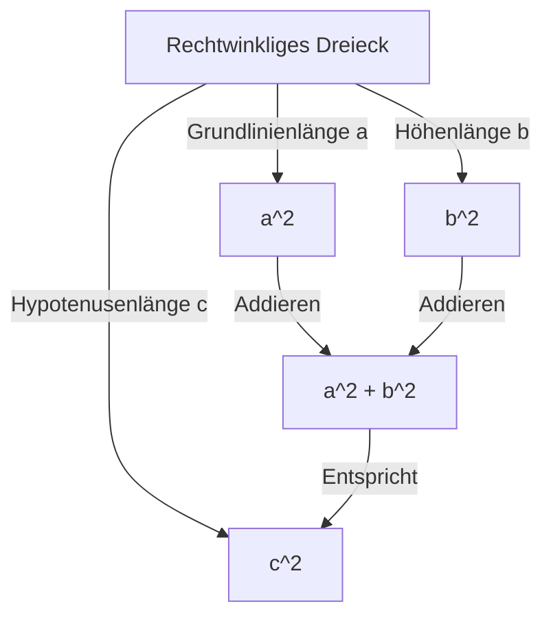

## Einleitung

Einer der berühmtesten Sätze der Mathematik, für den es auch die meisten Beweise gibt, ist der **Satz des Pythagoras**. Dieser Satz, der die Beziehung zwischen den drei Seiten eines rechtwinkligen Dreiecks beschreibt, ist nach dem antiken griechischen Philosophen Pythagoras benannt, obwohl er schon lange vor seiner Zeit in Babylonien, China und anderswo bekannt war.

Die Aussage des Satzes ist sehr einfach. Wenn die Länge der Hypotenuse eines rechtwinkligen Dreiecks $c$ ist und die Längen der anderen beiden Seiten $a$ und $b$ sind, gilt die folgende Beziehung:

$$ a^2 + b^2 = c^2 $$

Erstaunlicherweise gibt es Hunderte von verschiedenen Möglichkeiten, diese scheinbar einfache mathematische Formel zu beweisen. In diesem Artikel werden wir die Tiefen dieses Satzes aus verschiedenen Perspektiven erforschen, angefangen bei klassischen geometrischen Beweisen über algebraische Ansätze bis hin zu einem Beweis durch einen amerikanischen Präsidenten und einem intuitiven Beweis des jungen Albert Einstein.

---

## 1. Geometrischer Beweis basierend auf Euklids "Elementen"

Der antike griechische Mathematiker Euklid lieferte in seinem Buch "Elemente" (Buch I, Proposition 47) einen visuellen und strengen Beweis, der manchmal auch als **Windmühlenbeweis** bezeichnet wird.

### Beweisidee

Zeichnen Sie drei Quadrate, die jeweils eine der Seiten des rechtwinkligen Dreiecks als Seite haben. Der Beweis nutzt die Kongruenz von Dreiecken und die Äquivalenz von Flächen, um zu zeigen, dass die Fläche des größten Quadrats (das an der Hypotenuse $c$) gleich der Summe der Flächen der beiden anderen Quadrate (an den Seiten $a$ und $b$) ist.

1. Fällen Sie ein Lot vom rechtwinkligen Scheitelpunkt auf die Hypotenuse, wodurch das Quadrat auf der Hypotenuse in zwei Rechtecke geteilt wird.
2. Beweisen Sie mit Hilfe von Scherungen (flächentreuen Transformationen), dass die Fläche des kleinen Quadrats $a^2$ gleich der Fläche eines der geteilten Rechtecke ist.
3. Zeigen Sie auf ähnliche Weise, dass die Fläche des mittleren Quadrats $b^2$ gleich der Fläche des anderen Rechtecks ist.
4. Als Ergebnis entspricht $a^2 + b^2$ genau der Fläche des großen Quadrats $c^2$.

Obwohl diese Methode aufgrund der vielen Hilfslinien komplex aussieht, ist sie ein zutiefst schöner Beweis, der vollständig durch reine Geometrie erbracht wird.

---

## 2. Algebraischer Beweis mit ähnlichen Dreiecken

Als Nächstes stellen wir einen Beweis vor, der das Ähnlichkeitsverhältnis von Dreiecken nutzt. Diese Methode erfordert nur minimale Berechnungen und zeichnet sich durch einen sehr eleganten logischen Aufbau aus.

### Beweisschritte

Ziehen Sie in einem rechtwinkligen Dreieck $ABC$ eine senkrechte Linie $CD$ vom rechtwinkligen Scheitelpunkt $C$ zur Hypotenuse $AB$. Dadurch wird das ursprüngliche große Dreieck in zwei kleinere rechtwinklige Dreiecke geteilt.

Zu diesem Zeitpunkt sind alle drei Dreiecke (das ursprüngliche Dreieck und die beiden geteilten kleineren) einander ähnlich.

- $\triangle ABC \sim \triangle ACD$
- $\triangle ABC \sim \triangle CBD$

Da das Verhältnis entsprechender Seiten in ähnlichen Dreiecken gleich ist, gelten die folgenden Beziehungen:

1. Für $\triangle ABC$ und $\triangle ACD$:
   $$ \frac{c}{b} = \frac{b}{AD} \implies b^2 = c \cdot AD $$

2. Für $\triangle ABC$ und $\triangle CBD$:
   $$ \frac{c}{a} = \frac{a}{DB} \implies a^2 = c \cdot DB $$

Addieren Sie diese beiden Gleichungen:

$$ a^2 + b^2 = c \cdot DB + c \cdot AD = c \cdot (DB + AD) $$

Da hier $DB + AD = c$ (die Gesamtlänge der Hypotenuse), gilt:

$$ a^2 + b^2 = c \cdot c = c^2 $$

Damit ist der Satz bewiesen. Dieser Ansatz demonstriert auf brillante Weise die Verschmelzung von **Algebra** und **Geometrie**.

---

## 3. Der Beweis von Präsident James A. Garfield

Erstaunlicherweise hat James A. Garfield, der 20. Präsident der Vereinigten Staaten, diesen Satz 1876 mit seinem eigenen, einzigartigen Ansatz bewiesen. Er nutzte die **Fläche eines Trapezes**.

### Ansatz mit einem Trapez

Legen Sie zwei kongruente rechtwinklige Dreiecke (mit den Seitenlängen $a, b, c$) in einer geraden Linie auf eine Achse und verbinden Sie ihre Eckpunkte zu einem Trapez.

Die Fläche des Trapezes kann auf zwei verschiedene Arten berechnet werden.

**Methode 1: Verwendung der Trapezformel**
Die Längen der beiden parallelen Seiten sind $a$ und $b$, und die Höhe ist $a + b$.
$$ \text{Fläche} = \frac{1}{2} \cdot (a + b) \cdot (a + b) = \frac{1}{2} (a^2 + 2ab + b^2) $$

**Methode 2: Als Summe der Flächen von drei Dreiecken**
Innerhalb des Trapezes befinden sich die beiden ursprünglichen rechtwinkligen Dreiecke und ein gleichschenkliges rechtwinkliges Dreieck mit zwei Seiten der Länge $c$.
$$ \text{Fläche} = \left( \frac{1}{2} ab \right) + \left( \frac{1}{2} ab \right) + \left( \frac{1}{2} c^2 \right) = ab + \frac{1}{2} c^2 $$

Da diese beiden Flächen gleich sind, können wir eine Gleichung aufstellen:

$$ \frac{1}{2} (a^2 + 2ab + b^2) = ab + \frac{1}{2} c^2 $$

Multipliziert man beide Seiten mit 2 und multipliziert aus, erhält man:

$$ a^2 + 2ab + b^2 = 2ab + c^2 $$

Zieht man von beiden Seiten $2ab$ ab, lässt sich der **Satz des Pythagoras** auf brillante Weise ableiten:

$$ a^2 + b^2 = c^2 $$

Garfields Beweis, der von jemandem stammt, der sowohl Politiker als auch mathematisches Talent war, zeichnet sich durch seine Einfachheit und extreme Verständlichkeit aus.

---

## 4. Albert Einsteins Beweis durch Dimensionsanalyse

Albert Einstein, der größte Physiker des 20. Jahrhunderts, soll den Satz des Pythagoras in seiner Kindheit ebenfalls auf seine eigene Art bewiesen haben. Sein Ansatz nutzte das Konzept der **Dimensionsanalyse**, eine sehr intuitive, für einen Physiker charakteristische Methode.

### Idee der Dimensionsanalyse

Die Fläche $E$ eines beliebigen rechtwinkligen Dreiecks ist proportional zum Quadrat seiner Hypotenusenlänge $c$. Das liegt daran, dass die Fläche die Dimension "Länge im Quadrat" hat, und sobald die Form (Winkel) des Dreiecks bestimmt ist, wird seine Größe eindeutig durch das Quadrat eines einzigen Längenparameters (hier der Hypotenuse) definiert.

Daher kann die Fläche $E$ mit einer unbekannten Proportionalitätskonstante $m$ wie folgt ausgedrückt werden:

$$ E = m \cdot c^2 $$

Fällen Sie nun, ähnlich wie bei dem zuvor erwähnten Ähnlichkeitsbeweis, ein Lot vom rechtwinkligen Scheitelpunkt auf die Hypotenuse, um das ursprüngliche Dreieck in zwei kleinere rechtwinklige Dreiecke zu unterteilen. Da diese kleineren Dreiecke dem ursprünglichen ähnlich sind, sind ihre Hypotenusen $a$ bzw. $b$.

Somit können auch die Flächen $E_a$ und $E_b$ dieser beiden kleineren Dreiecke mit derselben Proportionalitätskonstante $m$ ausgedrückt werden:

$$ E_a = m \cdot a^2 $$
$$ E_b = m \cdot b^2 $$

Da die Fläche des ursprünglichen großen Dreiecks gleich der Summe der Flächen der beiden kleineren Dreiecke ist:

$$ E = E_a + E_b $$

Setzt man die vorherigen Gleichungen in diese ein, ergibt sich:

$$ m \cdot c^2 = m \cdot a^2 + m \cdot b^2 $$

Teilt man beide Seiten durch die gemeinsame Konstante $m$, erhält man die Beziehung:

$$ c^2 = a^2 + b^2 $$

Dieser Beweis wurde nicht durch das Herumspielen mit Formeln abgeleitet, sondern aus einer **Intuition der physikalischen Dimensionen**, was einen Einblick in Einsteins außergewöhnliches Genie bietet.

---

## Fazit

Der Satz des Pythagoras ist nicht bloß eine auswendig zu lernende mathematische Formel. Er ist ein wunderbares Beispiel für das Wesen der Mathematik, dem man sich aus **verschiedenen Perspektiven** nähern kann, einschließlich geometrischer Rätsel, der Manipulation algebraischer Gleichungen und sogar dem physikalischen Konzept der Dimensionen.

Neben den vier hier vorgestellten Beweisen gibt es weltweit unzählige weitere Ansätze, etwa einen Beweis von Leonardo da Vinci und Beweise mittels Origami. Versuchen Sie auf jeden Fall, selbst neue Beweismethoden zu erforschen. Die Welt der Mathematik ist immer voller neuer Entdeckungen.
