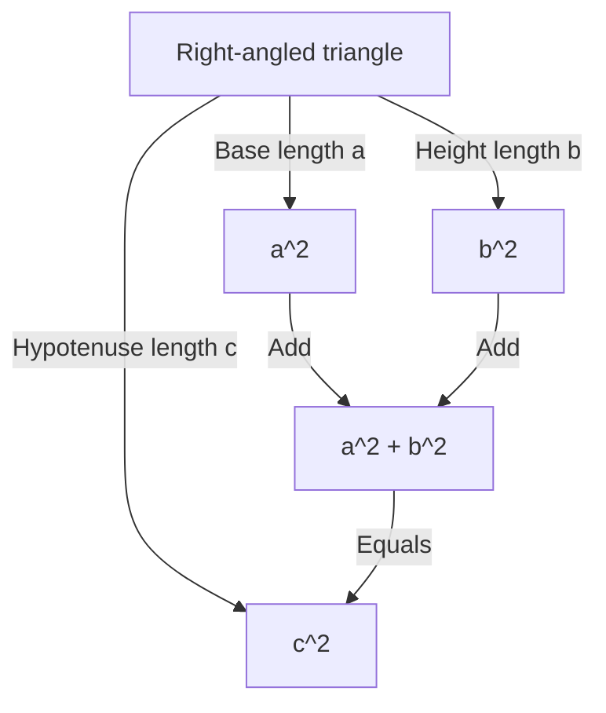
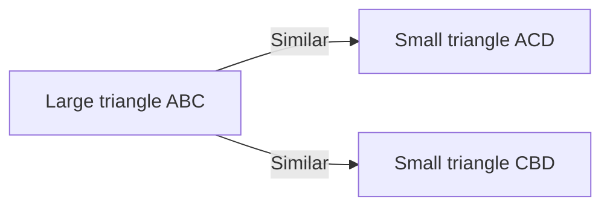

## Introduction

One of the most famous theorems in mathematics, and one with the most numerous proofs, is the **Pythagorean Theorem**. This theorem, which describes the relationship between the three sides of a right-angled triangle, is named after the ancient Greek philosopher Pythagoras, although it was known in Babylon, China, and elsewhere well before his time.

The assertion of the theorem is very simple. When the length of the hypotenuse of a right-angled triangle is $c$, and the lengths of the other two sides are $a$ and $b$, the following relationship holds:

$$ a^2 + b^2 = c^2 $$

Surprisingly, there are hundreds of different ways to prove this seemingly simple mathematical formula. In this article, we will explore the depths of this theorem from diverse perspectives, ranging from classical geometrical proofs and algebraic approaches to a proof by an American president and an intuitive proof by a young Albert Einstein.

---

## 1. Geometrical Proof Based on Euclid's "Elements"

The ancient Greek mathematician Euclid provided a visual and rigorous proof in his book "Elements" (Book I, Proposition 47), which is sometimes referred to as the **Windmill proof**.

### Proof Idea

Draw three squares, each using one of the sides of the right-angled triangle as a side. The proof uses the congruence of triangles and the equivalence of areas to show that the area of the largest square (the one on the hypotenuse $c$) is equal to the sum of the areas of the other two squares (on sides $a$ and $b$).

1. Drop a perpendicular from the right-angled vertex to the hypotenuse, dividing the square on the hypotenuse into two rectangles.
2. Prove that the area of the small square $a^2$ is equal to the area of one of the divided rectangles using shear mapping (area-preserving transformations).
3. Similarly, show that the area of the medium square $b^2$ is equal to the area of the other rectangle.
4. As a result, $a^2 + b^2$ exactly matches the area of the large square $c^2$.

Although this method looks complex due to the numerous auxiliary lines, it is a profoundly beautiful proof completed entirely through pure geometry.

---

## 2. Algebraic Proof Using Similar Triangles

Next, we introduce a proof that utilizes the similarity ratio of triangles. This method requires minimal calculation and features a highly elegant logical progression.

### Proof Steps

In a right-angled triangle $ABC$, draw a perpendicular line $CD$ from the right-angled vertex $C$ to the hypotenuse $AB$. This divides the original large triangle into two smaller right-angled triangles.

At this point, all three triangles (the original triangle and the two divided smaller ones) are similar to one another.

- $\triangle ABC \sim \triangle ACD$
- $\triangle ABC \sim \triangle CBD$

Because the ratio of corresponding sides in similar triangles is equal, the following relationships hold:

1. For $\triangle ABC$ and $\triangle ACD$:
   $$ \frac{c}{b} = \frac{b}{AD} \implies b^2 = c \cdot AD $$

2. For $\triangle ABC$ and $\triangle CBD$:
   $$ \frac{c}{a} = \frac{a}{DB} \implies a^2 = c \cdot DB $$

Add these two equations together:

$$ a^2 + b^2 = c \cdot DB + c \cdot AD = c \cdot (DB + AD) $$

Here, since $DB + AD = c$ (the total length of the hypotenuse),

$$ a^2 + b^2 = c \cdot c = c^2 $$

Thus, the theorem is proven. This approach brilliantly demonstrates the fusion of **algebra** and **geometry**.

---

## 3. President James A. Garfield's Proof

Surprisingly, James A. Garfield, the 20th President of the United States, proved this theorem using his own unique approach in 1876. He utilized the **area of a trapezoid**.

### Approach Using a Trapezoid

Place two congruent right-angled triangles (with side lengths $a, b, c$) in a straight line along a single axis, and connect their vertices to form a trapezoid.

The area of the trapezoid can be calculated in two different ways.

**Method 1: Using the trapezoid formula**
The lengths of the two parallel sides are $a$ and $b$, and the height is $a + b$.
$$ \text{Area} = \frac{1}{2} \cdot (a + b) \cdot (a + b) = \frac{1}{2} (a^2 + 2ab + b^2) $$

**Method 2: As the sum of the areas of three triangles**
Inside the trapezoid, there are the two original right-angled triangles and one isosceles right-angled triangle with two sides of length $c$.
$$ \text{Area} = \left( \frac{1}{2} ab \right) + \left( \frac{1}{2} ab \right) + \left( \frac{1}{2} c^2 \right) = ab + \frac{1}{2} c^2 $$

Since these two areas are equal, we can set up an equation:

$$ \frac{1}{2} (a^2 + 2ab + b^2) = ab + \frac{1}{2} c^2 $$

Multiplying both sides by 2 and expanding yields:

$$ a^2 + 2ab + b^2 = 2ab + c^2 $$

Subtracting $2ab$ from both sides brilliantly derives the **Pythagorean Theorem**:

$$ a^2 + b^2 = c^2 $$

Garfield's proof, created by someone who was both a politician and a mathematical talent, is characterized by its simplicity and extreme ease of understanding.

---

## 4. Albert Einstein's Proof by Dimensional Analysis

Albert Einstein, the greatest physicist of the 20th century, is also said to have proven the Pythagorean theorem in his own way during his childhood. His approach used the concept of **dimensional analysis**, a highly intuitive method characteristic of a physicist.

### Idea of Dimensional Analysis

The area $E$ of any right-angled triangle is proportional to the square of its hypotenuse length $c$. This is because area has the dimension of "length squared," and once the shape (angles) of the triangle is determined, its size is uniquely defined by the square of a single length parameter (here, the hypotenuse).

Therefore, the area $E$ can be expressed using an unknown proportionality constant $m$ as follows:

$$ E = m \cdot c^2 $$

Now, similar to the proof using similarity mentioned earlier, drop a perpendicular from the right-angled vertex to the hypotenuse to divide the original triangle into two smaller right-angled triangles. Because these smaller triangles are similar to the original one, their hypotenuses are $a$ and $b$ respectively.

Thus, the areas $E_a$ and $E_b$ of these two smaller triangles can also be expressed using the same proportionality constant $m$:

$$ E_a = m \cdot a^2 $$
$$ E_b = m \cdot b^2 $$

Since the area of the original large triangle is equal to the sum of the areas of the two smaller triangles:

$$ E = E_a + E_b $$

Substituting the previous equations into this gives:

$$ m \cdot c^2 = m \cdot a^2 + m \cdot b^2 $$

Dividing both sides by the common constant $m$ yields the relationship:

$$ c^2 = a^2 + b^2 $$

This proof was not derived by playing around with formulas, but from an **intuition of physical dimensions**, offering a glimpse into Einstein's extraordinary genius.

---

## Conclusion

The Pythagorean theorem is not merely a mathematical formula to be memorized. It is a wonderful example of the essence of mathematics, which can be approached from **various perspectives**, including geometrical puzzles, the manipulation of algebraic equations, and even the physical concept of dimensions.

Beyond the four proofs introduced here, there are countless approaches around the world, such as a proof by Leonardo da Vinci and proofs using origami. By all means, try exploring new methods of proof on your own. The world of mathematics is always full of new discoveries.
