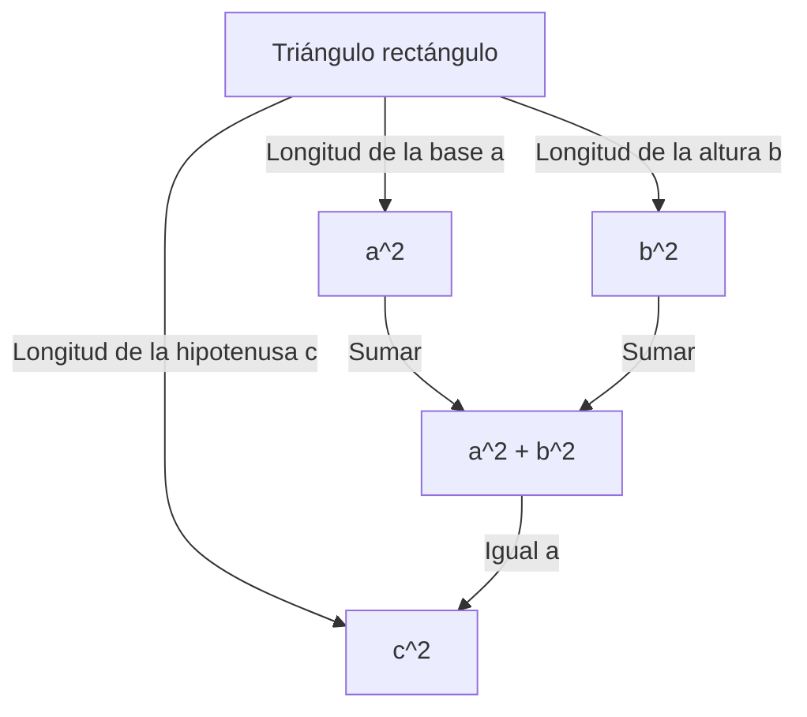

## Introducción

Uno de los teoremas más famosos de las matemáticas, y uno de los que cuenta con mayor número de demostraciones, es el **Teorema de Pitágoras**. Este teorema, que describe la relación entre los tres lados de un triángulo rectángulo, lleva el nombre del antiguo filósofo griego Pitágoras, aunque ya se conocía en Babilonia, China y otros lugares mucho antes de su época.

La afirmación del teorema es muy simple. Cuando la longitud de la hipotenusa de un triángulo rectángulo es $c$, y las longitudes de los otros dos catetos son $a$ y $b$, se cumple la siguiente relación:

$$ a^2 + b^2 = c^2 $$

Sorprendentemente, existen cientos de formas diferentes de demostrar esta fórmula matemática aparentemente simple. En este artículo, exploraremos las profundidades de este teorema desde diversas perspectivas, que van desde las demostraciones geométricas clásicas y los enfoques algebraicos hasta una demostración de un presidente estadounidense y una demostración intuitiva del joven Albert Einstein.

---

## 1. Demostración geométrica basada en los "Elementos" de [Euclides](https://kenji.blog/p/euclid/)

El antiguo matemático griego [Euclides](https://kenji.blog/p/euclid/) proporcionó una demostración visual y rigurosa en su libro "Elementos" (Libro I, Proposición 47), a la que a veces se hace referencia como la **demostración del molino de viento**.

### Idea de la demostración

Dibuje tres cuadrados, cada uno utilizando uno de los lados del triángulo rectángulo como lado. La demostración utiliza la congruencia de los triángulos y la equivalencia de áreas para mostrar que el área del cuadrado más grande (el de la hipotenusa $c$) es igual a la suma de las áreas de los otros dos cuadrados (en los catetos $a$ y $b$).

1. Trace una perpendicular desde el vértice del ángulo recto a la hipotenusa, dividiendo el cuadrado de la hipotenusa en dos rectángulos.
2. Demuestre que el área del cuadrado pequeño $a^2$ es igual al área de uno de los rectángulos divididos utilizando transformaciones de cizalladura (transformaciones que conservan el área).
3. De forma similar, demuestre que el área del cuadrado mediano $b^2$ es igual al área del otro rectángulo.
4. Como resultado, $a^2 + b^2$ coincide exactamente con el área del cuadrado grande $c^2$.

Aunque este método parece complejo debido a las numerosas líneas auxiliares, es una demostración profundamente bella que se completa enteramente mediante geometría pura.

---

## 2. Demostración algebraica con triángulos semejantes

A continuación, presentamos una demostración que utiliza la razón de semejanza de los triángulos. Este método requiere cálculos mínimos y presenta una progresión lógica muy elegante.

### Pasos de la demostración

En un triángulo rectángulo $ABC$, trace una línea perpendicular $CD$ desde el vértice del ángulo recto $C$ hasta la hipotenusa $AB$. Esto divide el gran triángulo original en dos triángulos rectángulos más pequeños.

En este punto, los tres triángulos (el triángulo original y los dos más pequeños divididos) son semejantes entre sí.

- $\triangle ABC \sim \triangle ACD$
- $\triangle ABC \sim \triangle CBD$

Debido a que la razón de los lados correspondientes en triángulos semejantes es igual, se cumplen las siguientes relaciones:

1. Para $\triangle ABC$ y $\triangle ACD$:
   $$ \frac{c}{b} = \frac{b}{AD} \implies b^2 = c \cdot AD $$

2. Para $\triangle ABC$ y $\triangle CBD$:
   $$ \frac{c}{a} = \frac{a}{DB} \implies a^2 = c \cdot DB $$

Sumando estas dos ecuaciones:

$$ a^2 + b^2 = c \cdot DB + c \cdot AD = c \cdot (DB + AD) $$

Aquí, dado que $DB + AD = c$ (la longitud total de la hipotenusa),

$$ a^2 + b^2 = c \cdot c = c^2 $$

Por lo tanto, el teorema queda demostrado. Este enfoque demuestra de manera brillante la fusión del **álgebra** y la **geometría**.

---

## 3. Demostración del presidente James A. Garfield

Sorprendentemente, James A. Garfield, el vigésimo presidente de los Estados Unidos, demostró este teorema utilizando su propio enfoque único en 1876. Utilizó el **área de un trapecio**.

### Enfoque utilizando un trapecio

Coloque dos triángulos rectángulos congruentes (con longitudes de lado $a, b, c$) en línea recta a lo largo de un solo eje y conecte sus vértices para formar un trapecio.

El área del trapecio se puede calcular de dos formas diferentes.

**Método 1: Usando la fórmula del trapecio**
Las longitudes de los dos lados paralelos son $a$ y $b$, y la altura es $a + b$.
$$ \text{Área} = \frac{1}{2} \cdot (a + b) \cdot (a + b) = \frac{1}{2} (a^2 + 2ab + b^2) $$

**Método 2: Como la suma de las áreas de tres triángulos**
Dentro del trapecio, se encuentran los dos triángulos rectángulos originales y un triángulo rectángulo isósceles con dos lados de longitud $c$.
$$ \text{Área} = \left( \frac{1}{2} ab \right) + \left( \frac{1}{2} ab \right) + \left( \frac{1}{2} c^2 \right) = ab + \frac{1}{2} c^2 $$

Dado que estas dos áreas son iguales, podemos establecer una ecuación:

$$ \frac{1}{2} (a^2 + 2ab + b^2) = ab + \frac{1}{2} c^2 $$

Multiplicando ambos lados por 2 y expandiendo se obtiene:

$$ a^2 + 2ab + b^2 = 2ab + c^2 $$

Al restar $2ab$ de ambos lados se deduce de forma brillante el **Teorema de Pitágoras**:

$$ a^2 + b^2 = c^2 $$

La demostración de Garfield, creada por alguien que era a la vez político y un talento matemático, se caracteriza por su simplicidad y su extrema facilidad de comprensión.

---

## 4. Demostración de Albert Einstein mediante análisis dimensional

Se dice que Albert Einstein, el mayor físico del siglo XX, también demostró el teorema de Pitágoras a su manera durante su infancia. Su enfoque utilizó el concepto de **análisis dimensional**, un método altamente intuitivo característico de un físico.

### Idea del análisis dimensional

El área $E$ de cualquier triángulo rectángulo es proporcional al cuadrado de la longitud de su hipotenusa $c$. Esto se debe a que el área tiene la dimensión de "longitud al cuadrado" y una vez que se determina la forma (ángulos) del triángulo, su tamaño queda definido unívocamente por el cuadrado de un único parámetro de longitud (en este caso, la hipotenusa).

Por lo tanto, el área $E$ se puede expresar utilizando una constante de proporcionalidad desconocida $m$ de la siguiente manera:

$$ E = m \cdot c^2 $$

Ahora, de manera similar a la demostración que utiliza la semejanza mencionada anteriormente, trace una perpendicular desde el vértice del ángulo recto a la hipotenusa para dividir el triángulo original en dos triángulos rectángulos más pequeños. Como estos triángulos más pequeños son semejantes al original, sus hipotenusas son $a$ y $b$ respectivamente.

Por lo tanto, las áreas $E_a$ y $E_b$ de estos dos triángulos más pequeños también se pueden expresar utilizando la misma constante de proporcionalidad $m$:

$$ E_a = m \cdot a^2 $$
$$ E_b = m \cdot b^2 $$

Dado que el área del triángulo grande original es igual a la suma de las áreas de los dos triángulos más pequeños:

$$ E = E_a + E_b $$

Sustituyendo las ecuaciones anteriores en esto se obtiene:

$$ m \cdot c^2 = m \cdot a^2 + m \cdot b^2 $$

Dividiendo ambos lados por la constante común $m$ se obtiene la relación:

$$ c^2 = a^2 + b^2 $$

Esta demostración no se dedujo jugando con fórmulas, sino a partir de una **intuición de dimensiones físicas**, lo que ofrece un vistazo al extraordinario genio de Einstein.

---

## Conclusión

El teorema de Pitágoras no es simplemente una fórmula matemática que deba memorizarse. Es un maravilloso ejemplo de la esencia de las matemáticas, que se puede abordar desde **diversas perspectivas**, que incluyen rompecabezas geométricos, la manipulación de ecuaciones algebraicas e incluso el concepto físico de dimensiones.

Más allá de las cuatro demostraciones presentadas aquí, existen innumerables enfoques en todo el mundo, como una demostración de Leonardo da Vinci y demostraciones que utilizan origami. Por supuesto, intente explorar nuevos métodos de demostración por su cuenta. El mundo de las matemáticas siempre está lleno de nuevos descubrimientos.
