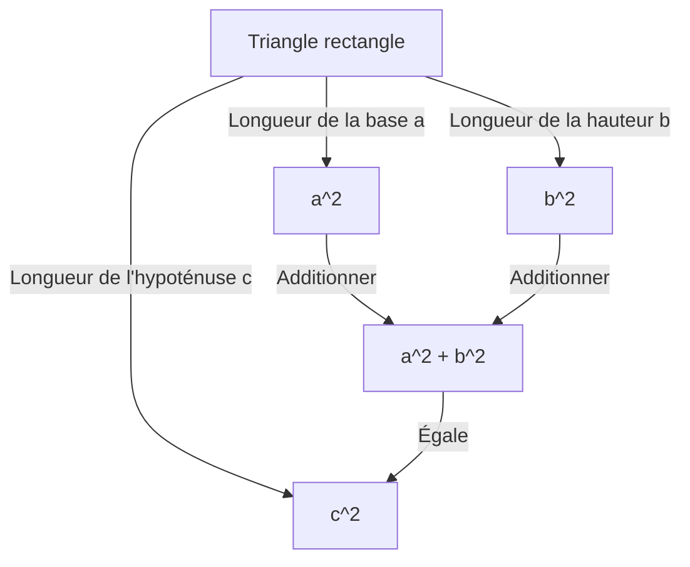
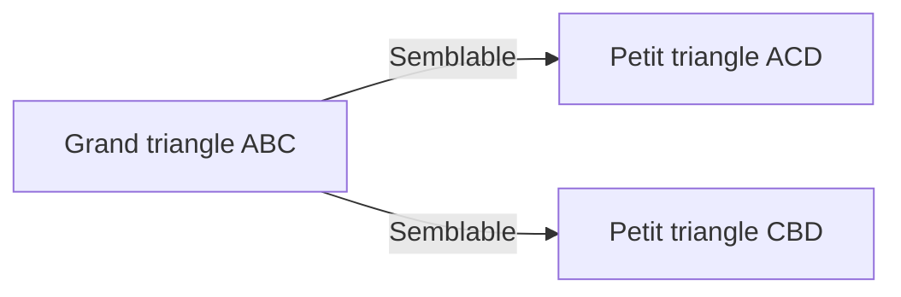

## Introduction

L'un des théorèmes les plus célèbres des mathématiques, et l'un de ceux pour lesquels il existe le plus grand nombre de preuves, est le **théorème de [Pythagore](/fr/p/pythagoras/)**. Ce théorème, qui décrit la relation entre les trois côtés d'un triangle rectangle, porte le nom de l'ancien philosophe grec [Pythagore](/fr/p/pythagoras/), bien qu'il ait été connu à Babylone, en Chine et ailleurs bien avant son époque.

L'affirmation de ce théorème est très simple. Lorsque la longueur de l'hypoténuse d'un triangle rectangle est $c$, et que les longueurs des deux autres côtés sont $a$ et $b$, la relation suivante est vérifiée :

$$ a^2 + b^2 = c^2 $$

Étonnamment, il existe des centaines de façons différentes de prouver cette formule mathématique d'apparence simple. Dans cet article, nous explorerons les profondeurs de ce théorème sous diverses perspectives, allant des preuves géométriques classiques et des approches algébriques à une preuve par un président américain et une preuve intuitive par un jeune Albert Einstein.

---

## 1. Preuve géométrique basée sur les "Éléments" d'[Euclide](https://kenji.blog/fr/p/euclid/)

L'ancien mathématicien grec [Euclide](https://kenji.blog/fr/p/euclid/) a fourni une preuve visuelle et rigoureuse dans son livre "Éléments" (Livre I, Proposition 47), parfois appelée **la preuve du moulin à vent**.

### Idée de la preuve

Tracez trois carrés, chacun utilisant l'un des côtés du triangle rectangle comme côté. La preuve utilise la congruence des triangles et l'équivalence des aires pour montrer que l'aire du plus grand carré (celui sur l'hypoténuse $c$) est égale à la somme des aires des deux autres carrés (sur les côtés $a$ et $b$).

1. Tracez une perpendiculaire du sommet de l'angle droit vers l'hypoténuse, divisant le carré sur l'hypoténuse en deux rectangles.
2. Prouvez que l'aire du petit carré $a^2$ est égale à l'aire de l'un des rectangles divisés en utilisant des transformations de cisaillement (transformations préservant l'aire).
3. De même, montrez que l'aire du carré moyen $b^2$ est égale à l'aire de l'autre rectangle.
4. En conséquence, $a^2 + b^2$ correspond exactement à l'aire du grand carré $c^2$.

Bien que cette méthode paraisse complexe en raison des nombreuses lignes auxiliares, c'est une preuve profondément magnifique réalisée entièrement par la géométrie pure.

---

## 2. Preuve algébrique utilisant des triangles semblables

Ensuite, nous présentons une preuve qui utilise le rapport de similitude des triangles. Cette méthode nécessite un minimum de calculs et présente une progression logique très élégante.

### Étapes de la preuve

Dans un triangle rectangle $ABC$, tracez une ligne perpendiculaire $CD$ depuis le sommet de l'angle droit $C$ vers l'hypoténuse $AB$. Cela divise le grand triangle d'origine en deux triangles rectangles plus petits.

À ce stade, les trois triangles (le triangle d'origine et les deux plus petits divisés) sont tous semblables les uns aux autres.

- $\triangle ABC \sim \triangle ACD$
- $\triangle ABC \sim \triangle CBD$

Étant donné que le rapport des côtés correspondants dans les triangles semblables est égal, les relations suivantes sont vérifiées :

1. Pour $\triangle ABC$ et $\triangle ACD$ :
   $$ \frac{c}{b} = \frac{b}{AD} \implies b^2 = c \cdot AD $$

2. Pour $\triangle ABC$ et $\triangle CBD$ :
   $$ \frac{c}{a} = \frac{a}{DB} \implies a^2 = c \cdot DB $$

Ajoutez ces deux équations ensemble :

$$ a^2 + b^2 = c \cdot DB + c \cdot AD = c \cdot (DB + AD) $$

Ici, puisque $DB + AD = c$ (la longueur totale de l'hypoténuse),

$$ a^2 + b^2 = c \cdot c = c^2 $$

Ainsi, le théorème est prouvé. Cette approche démontre brillamment la fusion de **l'algèbre** et de la **géométrie**.

---

## 3. La preuve du président James A. Garfield

Étonnamment, James A. Garfield, le 20e président des États-Unis, a prouvé ce théorème en utilisant sa propre approche unique en 1876. Il a utilisé **l'aire d'un trapèze**.

### Approche utilisant un trapèze

Placez deux triangles rectangles congruents (avec des longueurs de côté $a, b, c$) en ligne droite le long d'un seul axe, et connectez leurs sommets pour former un trapèze.

L'aire du trapèze peut être calculée de deux manières différentes.

**Méthode 1 : Utilisation de la formule du trapèze**
Les longueurs des deux côtés parallèles sont $a$ et $b$, et la hauteur est $a + b$.
$$ \text{Aire} = \frac{1}{2} \cdot (a + b) \cdot (a + b) = \frac{1}{2} (a^2 + 2ab + b^2) $$

**Méthode 2 : Comme somme des aires de trois triangles**
À l'intérieur du trapèze se trouvent les deux triangles rectangles d'origine et un triangle rectangle isocèle dont deux côtés sont de longueur $c$.
$$ \text{Aire} = \left( \frac{1}{2} ab \right) + \left( \frac{1}{2} ab \right) + \left( \frac{1}{2} c^2 \right) = ab + \frac{1}{2} c^2 $$

Puisque ces deux aires sont égales, nous pouvons établir une équation :

$$ \frac{1}{2} (a^2 + 2ab + b^2) = ab + \frac{1}{2} c^2 $$

Multiplier les deux côtés par 2 et développer donne :

$$ a^2 + 2ab + b^2 = 2ab + c^2 $$

Soustraire $2ab$ des deux côtés permet de déduire brillamment le **théorème de [Pythagore](/fr/p/pythagoras/)** :

$$ a^2 + b^2 = c^2 $$

La preuve de Garfield, créée par quelqu'un qui était à la fois un politicien et un talent mathématique, se caractérise par sa simplicité et sa facilité de compréhension extrême.

---

## 4. Preuve d'Albert Einstein par analyse dimensionnelle

Albert Einstein, le plus grand physicien du 20e siècle, aurait également prouvé le théorème de [Pythagore](/fr/p/pythagoras/) à sa manière pendant son enfance. Son approche utilisait le concept **d'analyse dimensionnelle**, une méthode très intuitive caractéristique d'un physicien.

### Idée de l'analyse dimensionnelle

L'aire $E$ de tout triangle rectangle est proportionnelle au carré de la longueur de son hypoténuse $c$. C'est parce que l'aire a la dimension d'une "longueur au carré", et une fois que la forme (les angles) du triangle est déterminée, sa taille est définie de manière unique par le carré d'un seul paramètre de longueur (ici, l'hypoténuse).

Par conséquent, l'aire $E$ peut être exprimée en utilisant une constante de proportionnalité inconnue $m$ comme suit :

$$ E = m \cdot c^2 $$

Maintenant, de manière similaire à la preuve utilisant la similitude mentionnée précédemment, tracez une perpendiculaire du sommet de l'angle droit vers l'hypoténuse pour diviser le triangle d'origine en deux triangles rectangles plus petits. Parce que ces petits triangles sont semblables à l'original, leurs hypoténuses sont respectivement $a$ et $b$.

Ainsi, les aires $E_a$ et $E_b$ de ces deux triangles plus petits peuvent également être exprimées en utilisant la même constante de proportionnalité $m$ :

$$ E_a = m \cdot a^2 $$
$$ E_b = m \cdot b^2 $$

Puisque l'aire du grand triangle d'origine est égale à la somme des aires des deux triangles plus petits :

$$ E = E_a + E_b $$

En substituant les équations précédentes dans celle-ci, on obtient :

$$ m \cdot c^2 = m \cdot a^2 + m \cdot b^2 $$

Diviser les deux côtés par la constante commune $m$ donne la relation :

$$ c^2 = a^2 + b^2 $$

Cette preuve n'a pas été déduite en jouant avec des formules, mais à partir d'une **intuition des dimensions physiques**, offrant un aperçu du génie extraordinaire d'Einstein.

---

## Conclusion

Le théorème de [Pythagore](/fr/p/pythagoras/) n'est pas simplement une formule mathématique à mémoriser. C'est un merveilleux exemple de l'essence des mathématiques, qui peut être abordée sous **différentes perspectives**, y compris des énigmes géométriques, la manipulation d'équations algébriques, et même le concept physique des dimensions.

Au-delà des quatre preuves présentées ici, il existe d'innombrables approches à travers le monde, telles qu'une preuve par Léonard de Vinci et des preuves utilisant l'origami. N'hésitez pas à essayer d'explorer de nouvelles méthodes de preuve par vous-même. Le monde des mathématiques est toujours plein de nouvelles découvertes.
