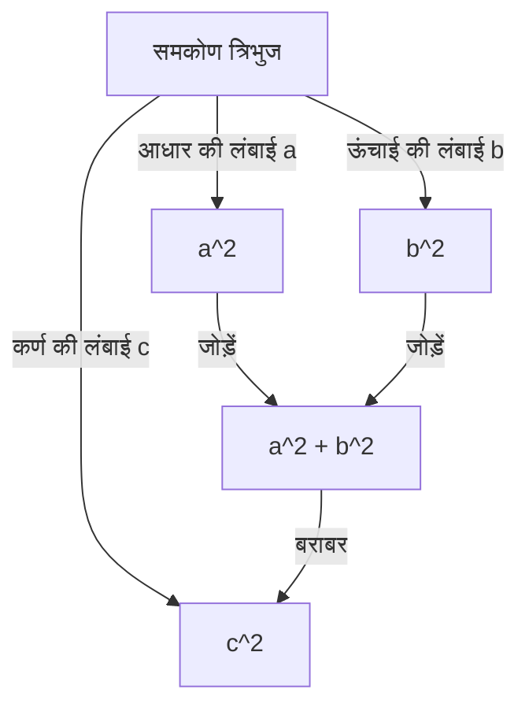
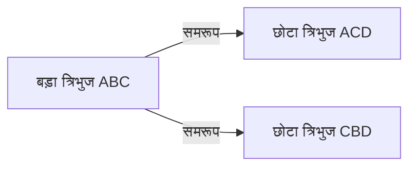

## प्रस्तावना

गणित में सबसे प्रसिद्ध और सबसे अधिक प्रमाणों वाले प्रमेयों में से एक **पाइथागोरस प्रमेय** है। यह प्रमेय, जो एक समकोण त्रिभुज की तीनों भुजाओं के बीच संबंध का वर्णन करता है, का नाम प्राचीन यूनानी दार्शनिक पाइथागोरस के नाम पर रखा गया है, हालाँकि यह उनके समय से बहुत पहले बेबीलोन, चीन और अन्य स्थानों पर ज्ञात था।

प्रमेय का कथन बहुत सरल है। जब एक समकोण त्रिभुज के कर्ण की लंबाई $c$ होती है, और अन्य दो भुजाओं की लंबाई $a$ और $b$ होती है, तो निम्नलिखित संबंध लागू होता है:

$$ a^2 + b^2 = c^2 $$

आश्चर्यजनक रूप से, इस प्रतीत होने वाले सरल गणितीय सूत्र को सिद्ध करने के सैकड़ों अलग-अलग तरीके हैं। इस लेख में, हम शास्त्रीय ज्यामितीय प्रमाणों और बीजगणितीय दृष्टिकोणों से लेकर एक अमेरिकी राष्ट्रपति द्वारा दिए गए प्रमाण और युवा अल्बर्ट आइंस्टीन द्वारा दिए गए एक सहज प्रमाण तक, विविध दृष्टिकोणों से इस प्रमेय की गहराई का पता लगाएंगे।

---

## 1. यूक्लिड के "एलिमेंट्स" पर आधारित ज्यामितीय प्रमाण

प्राचीन यूनानी गणितज्ञ यूक्लिड ने अपनी पुस्तक "एलिमेंट्स" (पुस्तक I, प्रस्ताव 47) में एक दृश्य और कठोर प्रमाण प्रदान किया, जिसे कभी-कभी **विंडमिल प्रमाण** (पवनचक्की प्रमाण) भी कहा जाता है।

### प्रमाण का विचार

तीन वर्ग बनाएं, जिनमें से प्रत्येक समकोण त्रिभुज की एक भुजा को अपनी भुजा के रूप में उपयोग करता हो। प्रमाण त्रिभुजों की सर्वांगसमता और क्षेत्रफलों की तुल्यता का उपयोग यह दिखाने के लिए करता है कि सबसे बड़े वर्ग (कर्ण $c$ पर) का क्षेत्रफल अन्य दो वर्गों (भुजाओं $a$ और $b$ पर) के क्षेत्रफलों के योग के बराबर है।

1. समकोण वाले शीर्ष से कर्ण पर एक लंब डालें, जो कर्ण पर स्थित वर्ग को दो आयतों में विभाजित करता है।
2. सिद्ध करें कि छोटे वर्ग $a^2$ का क्षेत्रफल अपरूपण मानचित्रण (क्षेत्रफल-संरक्षण परिवर्तन) का उपयोग करके विभाजित आयतों में से एक के क्षेत्रफल के बराबर है।
3. इसी तरह, दिखाएं कि मध्यम वर्ग $b^2$ का क्षेत्रफल दूसरे आयत के क्षेत्रफल के बराबर है।
4. परिणामस्वरूप, $a^2 + b^2$ बिल्कुल बड़े वर्ग $c^2$ के क्षेत्रफल के समान है।

यद्यपि यह विधि कई सहायक रेखाओं के कारण जटिल दिखती है, यह पूरी तरह से शुद्ध ज्यामिति के माध्यम से पूरा किया गया एक अत्यंत सुंदर प्रमाण है।

---

## 2. समरूप त्रिभुजों का उपयोग करके बीजगणितीय प्रमाण

इसके बाद, हम एक ऐसा प्रमाण प्रस्तुत करते हैं जो त्रिभुजों के समरूपता अनुपात का उपयोग करता है। इस विधि में न्यूनतम गणना की आवश्यकता होती है और इसमें अत्यधिक सुरुचिपूर्ण तार्किक प्रगति होती है।

### प्रमाण के चरण

एक समकोण त्रिभुज $ABC$ में, समकोण वाले शीर्ष $C$ से कर्ण $AB$ पर एक लंब रेखा $CD$ खींचें। यह मूल बड़े त्रिभुज को दो छोटे समकोण त्रिभुजों में विभाजित करता है।

इस बिंदु पर, तीनों त्रिभुज (मूल त्रिभुज और विभाजित दो छोटे त्रिभुज) एक-दूसरे के समरूप होते हैं।

- $\triangle ABC \sim \triangle ACD$
- $\triangle ABC \sim \triangle CBD$

चूँकि समरूप त्रिभुजों में संगत भुजाओं का अनुपात समान होता है, इसलिए निम्नलिखित संबंध लागू होते हैं:

1. $\triangle ABC$ और $\triangle ACD$ के लिए:
   $$ \frac{c}{b} = \frac{b}{AD} \implies b^2 = c \cdot AD $$

2. $\triangle ABC$ और $\triangle CBD$ के लिए:
   $$ \frac{c}{a} = \frac{a}{DB} \implies a^2 = c \cdot DB $$

इन दोनों समीकरणों को एक साथ जोड़ें:

$$ a^2 + b^2 = c \cdot DB + c \cdot AD = c \cdot (DB + AD) $$

यहाँ, चूँकि $DB + AD = c$ (कर्ण की कुल लंबाई) है,

$$ a^2 + b^2 = c \cdot c = c^2 $$

इस प्रकार, प्रमेय सिद्ध होता है। यह दृष्टिकोण **बीजगणित** और **ज्यामिति** के संलयन को शानदार ढंग से प्रदर्शित करता है।

---

## 3. राष्ट्रपति जेम्स ए. गारफील्ड का प्रमाण

आश्चर्यजनक रूप से, संयुक्त राज्य अमेरिका के 20वें राष्ट्रपति जेम्स ए. गारफील्ड ने 1876 में अपने स्वयं के अनूठे दृष्टिकोण का उपयोग करके इस प्रमेय को सिद्ध किया। उन्होंने **समलंब (ट्रेपेज़ॉइड) के क्षेत्रफल** का उपयोग किया।

### समलंब का उपयोग करके दृष्टिकोण

दो सर्वांगसम समकोण त्रिभुजों (भुजाओं की लंबाई $a, b, c$ के साथ) को एक ही अक्ष के अनुदिश एक सीधी रेखा में रखें, और एक समलंब बनाने के लिए उनके शीर्षों को जोड़ दें।

समलंब के क्षेत्रफल की गणना दो अलग-अलग तरीकों से की जा सकती है।

**विधि 1: समलंब सूत्र का उपयोग करना**
दो समानांतर भुजाओं की लंबाई $a$ और $b$ है, और ऊंचाई $a + b$ है।
$$ \text{क्षेत्रफल} = \frac{1}{2} \cdot (a + b) \cdot (a + b) = \frac{1}{2} (a^2 + 2ab + b^2) $$

**विधि 2: तीन त्रिभुजों के क्षेत्रफलों के योग के रूप में**
समलंब के अंदर, दो मूल समकोण त्रिभुज और $c$ लंबाई वाली दो भुजाओं वाला एक समद्विबाहु समकोण त्रिभुज है।
$$ \text{क्षेत्रफल} = \left( \frac{1}{2} ab \right) + \left( \frac{1}{2} ab \right) + \left( \frac{1}{2} c^2 \right) = ab + \frac{1}{2} c^2 $$

चूँकि ये दोनों क्षेत्रफल बराबर हैं, इसलिए हम एक समीकरण स्थापित कर सकते हैं:

$$ \frac{1}{2} (a^2 + 2ab + b^2) = ab + \frac{1}{2} c^2 $$

दोनों पक्षों को 2 से गुणा करने और विस्तारित करने पर प्राप्त होता है:

$$ a^2 + 2ab + b^2 = 2ab + c^2 $$

दोनों पक्षों से $2ab$ घटाने पर **पाइथागोरस प्रमेय** शानदार ढंग से व्युत्पन्न होता है:

$$ a^2 + b^2 = c^2 $$

गारफील्ड का प्रमाण, जो एक ऐसे व्यक्ति द्वारा बनाया गया था जो एक राजनेता होने के साथ-साथ एक गणितीय प्रतिभा भी था, अपनी सादगी और समझने में अत्यधिक आसानी की विशेषता है।

---

## 4. विमीय विश्लेषण द्वारा अल्बर्ट आइंस्टीन का प्रमाण

कहा जाता है कि 20वीं सदी के सबसे महान भौतिक विज्ञानी अल्बर्ट आइंस्टीन ने भी अपने बचपन के दौरान पाइथागोरस प्रमेय को अपने तरीके से सिद्ध किया था। उनके दृष्टिकोण में **विमीय विश्लेषण** (डायमेंशनल एनालिसिस) की अवधारणा का उपयोग किया गया था, जो एक भौतिक विज्ञानी की विशेषता वाली अत्यधिक सहज विधि है।

### विमीय विश्लेषण का विचार

किसी भी समकोण त्रिभुज का क्षेत्रफल $E$ उसके कर्ण की लंबाई $c$ के वर्ग के समानुपाती होता है। ऐसा इसलिए है क्योंकि क्षेत्रफल की विमा "लंबाई का वर्ग" होती है, और एक बार त्रिभुज का आकार (कोण) निर्धारित हो जाने के बाद, इसका आकार विशिष्ट रूप से एक एकल लंबाई पैरामीटर (यहाँ, कर्ण) के वर्ग द्वारा परिभाषित होता है।

इसलिए, क्षेत्रफल $E$ को अज्ञात आनुपातिकता स्थिरांक $m$ का उपयोग करके निम्नानुसार व्यक्त किया जा सकता है:

$$ E = m \cdot c^2 $$

अब, पहले बताए गए समरूपता का उपयोग करने वाले प्रमाण के समान, मूल त्रिभुज को दो छोटे समकोण त्रिभुजों में विभाजित करने के लिए समकोण वाले शीर्ष से कर्ण पर एक लंब डालें। चूँकि ये छोटे त्रिभुज मूल त्रिभुज के समरूप हैं, इसलिए उनके कर्ण क्रमशः $a$ और $b$ हैं।

इस प्रकार, इन दो छोटे त्रिभुजों के क्षेत्रफल $E_a$ और $E_b$ को भी समान आनुपातिकता स्थिरांक $m$ का उपयोग करके व्यक्त किया जा सकता है:

$$ E_a = m \cdot a^2 $$
$$ E_b = m \cdot b^2 $$

चूँकि मूल बड़े त्रिभुज का क्षेत्रफल दो छोटे त्रिभुजों के क्षेत्रफलों के योग के बराबर होता है:

$$ E = E_a + E_b $$

पिछले समीकरणों को इसमें प्रतिस्थापित करने पर प्राप्त होता है:

$$ m \cdot c^2 = m \cdot a^2 + m \cdot b^2 $$

दोनों पक्षों को सामान्य स्थिरांक $m$ से विभाजित करने पर यह संबंध प्राप्त होता है:

$$ c^2 = a^2 + b^2 $$

यह प्रमाण सूत्रों के साथ खेलने से नहीं, बल्कि **भौतिक विमाओं के अंतर्ज्ञान** से प्राप्त किया गया था, जो आइंस्टीन की असाधारण प्रतिभा की एक झलक प्रस्तुत करता है।

---

## निष्कर्ष

पाइथागोरस प्रमेय केवल याद रखने के लिए एक गणितीय सूत्र नहीं है। यह गणित के सार का एक अद्भुत उदाहरण है, जिसे ज्यामितीय पहेलियों, बीजगणितीय समीकरणों के हेरफेर, और यहाँ तक कि विमाओं की भौतिक अवधारणा सहित **विभिन्न दृष्टिकोणों** से संपर्क किया जा सकता है।

यहाँ प्रस्तुत किए गए चार प्रमाणों के अलावा, दुनिया भर में अनगिनत दृष्टिकोण हैं, जैसे लियोनार्डो दा विंची का प्रमाण और ओरिगेमी का उपयोग करने वाले प्रमाण। हर तरह से, स्वयं प्रमाण के नए तरीकों की खोज करने का प्रयास करें। गणित की दुनिया हमेशा नई खोजों से भरी रहती है।
