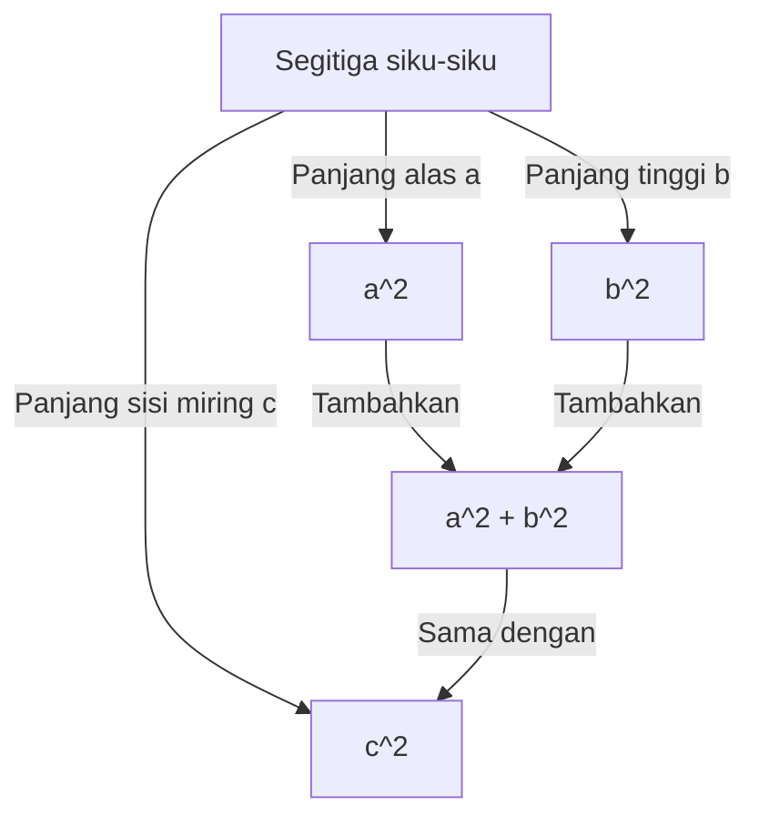
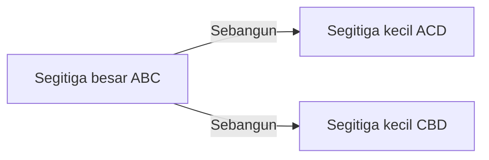

## Pengantar

Salah satu teorema paling terkenal dalam matematika, dan yang memiliki jumlah bukti terbanyak, adalah **Teorema Pythagoras**. Teorema ini, yang menjelaskan hubungan antara ketiga sisi segitiga siku-siku, dinamai dari filsuf Yunani kuno Pythagoras, meskipun hal ini telah dikenal di Babilonia, Tiongkok, dan tempat lain jauh sebelum masanya.

Pernyataan dari teorema ini sangat sederhana. Ketika panjang sisi miring dari sebuah segitiga siku-siku adalah $c$, dan panjang dari dua sisi lainnya adalah $a$ dan $b$, hubungan berikut ini berlaku:

$$ a^2 + b^2 = c^2 $$

Secara mengejutkan, ada ratusan cara berbeda untuk membuktikan rumus matematika yang tampaknya sederhana ini. Dalam artikel ini, kita akan menjelajahi kedalaman teorema ini dari berbagai perspektif, mulai dari bukti geometris klasik dan pendekatan aljabar hingga bukti oleh seorang presiden Amerika dan bukti intuitif oleh Albert Einstein muda.

---

## 1. Bukti Geometris Berdasarkan "Elements" karya [Euclid](https://kenji.blog/p/euclid/)

Matematikawan Yunani kuno [Euclid](https://kenji.blog/p/euclid/) memberikan bukti visual dan teliti dalam bukunya "Elements" (Buku I, Proposisi 47), yang terkadang disebut sebagai **bukti Kincir Angin**.

### Ide Bukti

Gambarlah tiga persegi, masing-masing menggunakan salah satu sisi dari segitiga siku-siku sebagai sebuah sisi. Bukti ini menggunakan kekongruenan segitiga dan ekuivalensi luas untuk menunjukkan bahwa luas dari persegi terbesar (yang berada pada sisi miring $c$) sama dengan jumlah luas dari dua persegi lainnya (pada sisi $a$ dan $b$).

1. Tarik garis tegak lurus dari titik sudut siku-siku ke sisi miring, membagi persegi pada sisi miring menjadi dua persegi panjang.
2. Buktikan bahwa luas persegi kecil $a^2$ sama dengan luas salah satu persegi panjang yang terbagi dengan menggunakan pemetaan geser (transformasi yang mempertahankan luas).
3. Demikian pula, tunjukkan bahwa luas persegi menengah $b^2$ sama dengan luas persegi panjang lainnya.
4. Hasilnya, $a^2 + b^2$ sama persis dengan luas persegi besar $c^2$.

Meskipun metode ini terlihat rumit karena banyaknya garis bantu, ini adalah bukti yang sangat indah yang diselesaikan sepenuhnya melalui geometri murni.

---

## 2. Bukti Aljabar Menggunakan Segitiga Sebangun

Selanjutnya, kita memperkenalkan sebuah bukti yang menggunakan rasio kesebangunan dari segitiga. Metode ini membutuhkan perhitungan minimal dan menampilkan progresi logis yang sangat elegan.

### Langkah-langkah Bukti

Pada sebuah segitiga siku-siku $ABC$, tarik garis tegak lurus $CD$ dari titik sudut siku-siku $C$ ke sisi miring $AB$. Ini membagi segitiga besar asli menjadi dua segitiga siku-siku yang lebih kecil.

Pada titik ini, ketiga segitiga tersebut (segitiga asli dan dua segitiga yang lebih kecil yang telah dibagi) sebangun satu sama lain.

- $\triangle ABC \sim \triangle ACD$
- $\triangle ABC \sim \triangle CBD$

Karena rasio sisi-sisi yang bersesuaian dalam segitiga sebangun adalah sama, maka berlaku hubungan berikut:

1. Untuk $\triangle ABC$ dan $\triangle ACD$:
   $$ \frac{c}{b} = \frac{b}{AD} \implies b^2 = c \cdot AD $$

2. Untuk $\triangle ABC$ dan $\triangle CBD$:
   $$ \frac{c}{a} = \frac{a}{DB} \implies a^2 = c \cdot DB $$

Tambahkan kedua persamaan ini secara bersamaan:

$$ a^2 + b^2 = c \cdot DB + c \cdot AD = c \cdot (DB + AD) $$

Di sini, karena $DB + AD = c$ (panjang total dari sisi miring),

$$ a^2 + b^2 = c \cdot c = c^2 $$

Dengan demikian, teorema tersebut terbukti. Pendekatan ini secara brilian menunjukkan perpaduan antara **aljabar** dan **geometri**.

---

## 3. Bukti Presiden James A. Garfield

Secara mengejutkan, James A. Garfield, Presiden ke-20 Amerika Serikat, membuktikan teorema ini dengan menggunakan pendekatannya sendiri yang unik pada tahun 1876. Ia memanfaatkan **luas sebuah trapesium**.

### Pendekatan Menggunakan Trapesium

Tempatkan dua segitiga siku-siku yang kongruen (dengan panjang sisi $a, b, c$) dalam garis lurus sepanjang sumbu tunggal, dan hubungkan titik-titik sudutnya untuk membentuk sebuah trapesium.

Luas trapesium dapat dihitung dengan dua cara yang berbeda.

**Metode 1: Menggunakan rumus trapesium**
Panjang dari dua sisi sejajar adalah $a$ dan $b$, dan tingginya adalah $a + b$.
$$ \text{Luas} = \frac{1}{2} \cdot (a + b) \cdot (a + b) = \frac{1}{2} (a^2 + 2ab + b^2) $$

**Metode 2: Sebagai jumlah luas tiga segitiga**
Di dalam trapesium, terdapat dua segitiga siku-siku asli dan satu segitiga siku-siku sama kaki dengan dua sisi yang panjangnya $c$.
$$ \text{Luas} = \left( \frac{1}{2} ab \right) + \left( \frac{1}{2} ab \right) + \left( \frac{1}{2} c^2 \right) = ab + \frac{1}{2} c^2 $$

Karena kedua luas ini sama, kita dapat membuat sebuah persamaan:

$$ \frac{1}{2} (a^2 + 2ab + b^2) = ab + \frac{1}{2} c^2 $$

Mengalikan kedua ruas dengan 2 dan menjabarkannya akan menghasilkan:

$$ a^2 + 2ab + b^2 = 2ab + c^2 $$

Mengurangkan $2ab$ dari kedua ruas secara brilian akan menurunkan **Teorema Pythagoras**:

$$ a^2 + b^2 = c^2 $$

Bukti Garfield, yang diciptakan oleh seseorang yang merupakan seorang politikus sekaligus orang yang berbakat dalam matematika, ditandai dengan kesederhanaannya dan sangat mudah untuk dipahami.

---

## 4. Bukti Albert Einstein melalui Analisis Dimensional

Albert Einstein, fisikawan terbesar di abad ke-20, juga dikatakan telah membuktikan teorema Pythagoras dengan caranya sendiri semasa kecil. Pendekatannya menggunakan konsep **analisis dimensional**, sebuah metode yang sangat intuitif khas dari seorang fisikawan.

### Ide Analisis Dimensional

Luas $E$ dari sembarang segitiga siku-siku sebanding dengan kuadrat dari panjang sisi miringnya $c$. Hal ini karena luas memiliki dimensi "kuadrat panjang," dan begitu bentuk (sudut-sudut) segitiga ditentukan, ukurannya secara unik ditentukan oleh kuadrat dari satu parameter panjang (di sini, sisi miring).

Oleh karena itu, luas $E$ dapat dinyatakan dengan menggunakan suatu konstanta proporsionalitas yang tidak diketahui $m$ sebagai berikut:

$$ E = m \cdot c^2 $$

Sekarang, mirip dengan bukti yang menggunakan kesebangunan yang telah disebutkan sebelumnya, tarik garis tegak lurus dari titik sudut siku-siku ke sisi miring untuk membagi segitiga aslinya menjadi dua segitiga siku-siku yang lebih kecil. Karena segitiga-segitiga yang lebih kecil ini sebangun dengan aslinya, maka sisi-sisi miringnya masing-masing adalah $a$ dan $b$.

Dengan demikian, luas $E_a$ dan $E_b$ dari kedua segitiga yang lebih kecil ini juga dapat dinyatakan dengan menggunakan konstanta proporsionalitas $m$ yang sama:

$$ E_a = m \cdot a^2 $$
$$ E_b = m \cdot b^2 $$

Karena luas segitiga besar yang asli sama dengan jumlah luas kedua segitiga yang lebih kecil:

$$ E = E_a + E_b $$

Mensubstitusikan persamaan-persamaan sebelumnya ke dalam persamaan ini memberikan:

$$ m \cdot c^2 = m \cdot a^2 + m \cdot b^2 $$

Membagi kedua ruas dengan konstanta yang sama $m$ menghasilkan hubungan:

$$ c^2 = a^2 + b^2 $$

Bukti ini tidak diturunkan dengan bermain-main menggunakan rumus, tetapi dari sebuah **intuisi dimensi fisik**, menawarkan gambaran sekilas mengenai kejeniusan Einstein yang luar biasa.

---

## Kesimpulan

Teorema Pythagoras bukan sekadar rumus matematika yang harus dihafal. Ini adalah sebuah contoh yang luar biasa dari esensi matematika, yang dapat didekati dari **berbagai perspektif**, termasuk teka-teki geometris, manipulasi persamaan aljabar, dan bahkan konsep fisik tentang dimensi.

Selain keempat bukti yang diperkenalkan di sini, ada banyak sekali pendekatan lain di seluruh dunia, seperti bukti oleh Leonardo da Vinci dan bukti-bukti yang menggunakan origami. Tentu saja, cobalah untuk mengeksplorasi metode-metode pembuktian baru dengan kemampuan Anda sendiri. Dunia matematika selalu penuh dengan penemuan-penemuan baru.
