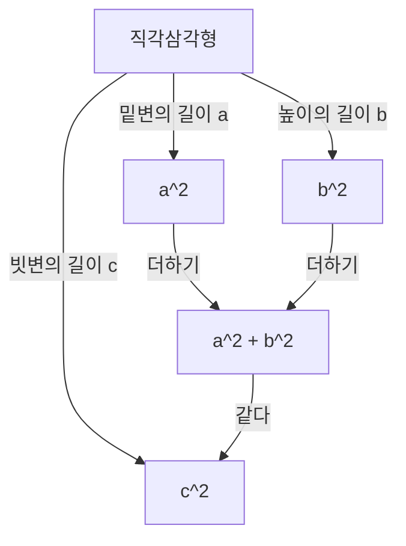

## 서론

수학에서 가장 유명하고 가장 많은 증명 방법을 가진 정리 중 하나가 바로 **[피타고라스](/ko/p/pythagoras/) 정리** 입니다. 직각삼각형의 세 변의 길이 사이의 관계를 나타내는 이 정리는 고대 그리스의 철학자 [피타고라스](/ko/p/pythagoras/)의 이름을 따서 명명되었지만, 그보다 앞서 바빌로니아, 중국 등지에서 이미 알려져 있었습니다.

정리의 주장은 매우 단순합니다. 직각삼각형의 빗변의 길이를 $c$ 라고 하고, 나머지 두 변의 길이를 각각 $a$ 와 $b$ 라고 할 때, 다음과 같은 관계가 성립합니다.

$$ a^2 + b^2 = c^2 $$

놀랍게도 겉보기에 단순해 보이는 이 수학 공식에는 수백 가지의 서로 다른 증명 방법이 존재합니다. 본 기사에서는 고전적인 기하학적 증명부터 대수적 접근, 미국 대통령에 의한 증명, 그리고 젊은 시절 알베르트 아인슈타인의 직관적인 증명까지 다양한 관점에서 이 정리의 심오함을 탐구해 보겠습니다.

---

## 1. [유클리드](https://kenji.blog/ko/p/euclid/) 『원론』에 바탕을 둔 기하학적 증명

고대 그리스의 수학자 [유클리드](https://kenji.blog/ko/p/euclid/)는 자신의 저서 『원론』(제1권 명제 47)에서 시각적이고 엄밀한 증명을 제시했는데, 이는 **풍차 증명** 이라고도 불립니다.

### 증명 아이디어

직각삼각형의 각 변을 한 변으로 하는 정사각형 세 개를 그립니다. 이 증명은 삼각형의 합동과 넓이의 동치성을 이용하여 가장 큰 정사각형(빗변 $c$ 위에 있는 것)의 넓이가 나머지 두 정사각형(변 $a$ 와 $b$ 위에 있는 것)의 넓이의 합과 같음을 보여줍니다.

1. 직각의 꼭짓점에서 빗변으로 수선을 내려 빗변 위의 정사각형을 두 개의 직사각형으로 나눕니다.
2. 등적 변형을 이용하여 작은 정사각형 $a^2$ 의 넓이가 나누어진 직사각형 중 하나의 넓이와 같음을 증명합니다.
3. 마찬가지로 중간 크기의 정사각형 $b^2$ 의 넓이가 다른 직사각형의 넓이와 같음을 보여줍니다.
4. 결과적으로 $a^2 + b^2$ 가 큰 정사각형의 넓이 $c^2$ 과 정확히 일치하게 됩니다.

이 방법은 보조선을 많이 사용하여 복잡해 보이지만, 순수 기하학만으로 완성되는 매우 아름다운 증명입니다.

---

## 2. 닮은 삼각형을 이용한 대수적 증명

다음으로 소개할 것은 삼각형의 닮음비를 이용한 증명입니다. 이 방법은 계산이 거의 필요 없으며 논리 전개가 매우 세련된 것이 특징입니다.

### 증명 단계

직각삼각형 $ABC$ 에서 직각인 꼭짓점 $C$ 로부터 빗변 $AB$ 를 향해 수선 $CD$ 를 긋습니다. 이로 인해 원래의 큰 삼각형은 두 개의 작은 직각삼각형으로 나뉘게 됩니다.

이때 세 개의 삼각형(원래의 삼각형과 나누어진 두 개의 작은 삼각형)은 모두 서로 닮은꼴이 됩니다.

- $\triangle ABC \sim \triangle ACD$
- $\triangle ABC \sim \triangle CBD$

닮은 삼각형의 대응하는 변의 길이의 비는 같으므로 다음 관계가 성립합니다.

1. $\triangle ABC$ 와 $\triangle ACD$ 에 대하여:
   $$ \frac{c}{b} = \frac{b}{AD} \implies b^2 = c \cdot AD $$

2. $\triangle ABC$ 와 $\triangle CBD$ 에 대하여:
   $$ \frac{c}{a} = \frac{a}{DB} \implies a^2 = c \cdot DB $$

이 두 방정식을 더합니다.

$$ a^2 + b^2 = c \cdot DB + c \cdot AD = c \cdot (DB + AD) $$

여기서 $DB + AD = c$ (빗변의 전체 길이)이므로,

$$ a^2 + b^2 = c \cdot c = c^2 $$

이로써 정리가 증명되었습니다. 이 접근법은 **대수학** 과 **기하학** 의 융합을 훌륭하게 보여줍니다.

---

## 3. 제임스 가필드 대통령의 증명

놀랍게도 미국 제20대 대통령인 제임스 A. 가필드도 1876년에 자신만의 독창적인 방법으로 이 정리를 증명했습니다. 그는 **사다리꼴의 넓이** 를 활용했습니다.

### 사다리꼴을 이용한 접근법

두 개의 합동인 직각삼각형(변의 길이가 각각 $a, b, c$ )을 일직선상에 배치하고, 그 꼭짓점들을 연결하여 사다리꼴을 만듭니다.

사다리꼴의 넓이는 두 가지 다른 방법으로 계산할 수 있습니다.

**방법 1: 사다리꼴 공식 사용**
평행한 두 변의 길이는 $a$ 와 $b$ 이고 높이는 $a + b$ 입니다.
$$ \text{넓이} = \frac{1}{2} \cdot (a + b) \cdot (a + b) = \frac{1}{2} (a^2 + 2ab + b^2) $$

**방법 2: 세 삼각형의 넓이의 합으로 구하기**
사다리꼴 내부에는 원래의 두 직각삼각형과 길이가 $c$ 인 두 변을 가진 직각이등변삼각형 하나가 있습니다.
$$ \text{넓이} = \left( \frac{1}{2} ab \right) + \left( \frac{1}{2} ab \right) + \left( \frac{1}{2} c^2 \right) = ab + \frac{1}{2} c^2 $$

이 두 넓이는 같으므로 방정식을 세울 수 있습니다.

$$ \frac{1}{2} (a^2 + 2ab + b^2) = ab + \frac{1}{2} c^2 $$

양변에 2를 곱하고 전개하면:

$$ a^2 + 2ab + b^2 = 2ab + c^2 $$

양변에서 $2ab$ 를 빼면 훌륭하게 **[피타고라스](/ko/p/pythagoras/) 정리** 가 도출됩니다.

$$ a^2 + b^2 = c^2 $$

정치가이면서 수학적 재능도 겸비했던 가필드의 증명은 그 단순함과 극도의 이해 용이성이 특징입니다.

---

## 4. 알베르트 아인슈타인의 차원 분석에 의한 증명

20세기 최고의 물리학자인 알베르트 아인슈타인 역시 어린 시절 자신만의 방법으로 [피타고라스](/ko/p/pythagoras/) 정리를 증명했다고 합니다. 그의 접근법은 **차원 분석** 이라는 개념을 사용한, 물리학자다운 매우 직관적인 방법이었습니다.

### 차원 분석 아이디어

임의의 직각삼각형의 넓이 $E$ 는 빗변의 길이 $c$ 의 제곱에 비례합니다. 넓이는 "길이의 제곱"이라는 차원을 가지며, 삼각형의 모양(각도)이 결정되면 그 크기는 단일 길이 매개변수(여기서는 빗변)의 제곱에 의해 유일하게 결정되기 때문입니다.

따라서 넓이 $E$ 는 미지의 비례 상수 $m$ 을 사용하여 다음과 같이 나타낼 수 있습니다.

$$ E = m \cdot c^2 $$

이제 앞서 언급한 닮음을 이용한 증명과 유사하게 직각의 꼭짓점에서 빗변으로 수선을 내려 원래의 삼각형을 두 개의 작은 직각삼각형으로 나눕니다. 이 작은 삼각형들은 원래 삼각형과 닮았으므로 각각의 빗변은 $a$ 와 $b$ 가 됩니다.

따라서 이 두 작은 삼각형의 넓이 $E_a$ 와 $E_b$ 도 동일한 비례 상수 $m$ 을 사용하여 나타낼 수 있습니다.

$$ E_a = m \cdot a^2 $$
$$ E_b = m \cdot b^2 $$

원래 큰 삼각형의 넓이는 두 작은 삼각형의 넓이의 합과 같으므로:

$$ E = E_a + E_b $$

앞의 방정식들을 여기에 대입하면:

$$ m \cdot c^2 = m \cdot a^2 + m \cdot b^2 $$

양변을 공통 상수 $m$ 으로 나누면 다음 관계를 얻게 됩니다.

$$ c^2 = a^2 + b^2 $$

이 증명은 수식을 이리저리 굴려 도출한 것이 아니라 **물리적 차원에 대한 직관** 에서 비롯된 것으로, 아인슈타인의 비범한 천재성을 엿볼 수 있게 해줍니다.

---

## 결론

[피타고라스](/ko/p/pythagoras/) 정리는 단순히 암기해야 할 수학 공식이 아닙니다. 기하학적 퍼즐, 대수적 방정식의 조작, 심지어 물리적 차원 개념 등 **다양한 관점** 에서 접근할 수 있는 수학의 정수를 보여주는 훌륭한 예입니다.

여기서 소개한 4가지 증명 외에도 레오나르도 다빈치의 증명이나 종이접기를 이용한 증명 등 전 세계에는 무수히 많은 접근법이 존재합니다. 여러분 스스로 새로운 증명 방법을 탐구해 보시길 바랍니다. 수학의 세계는 항상 새로운 발견으로 가득 차 있습니다.
