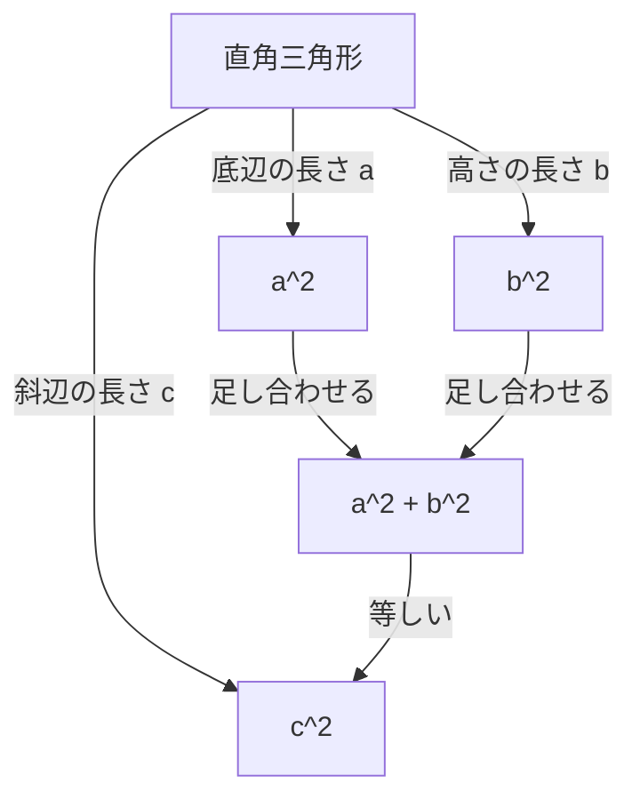

## はじめに

数学において最も有名で、かつ最も多くの証明が存在する定理の一つが **[ピタゴラス](https://kenji.blog/p/pythagoras/)の定理** （三平方の定理）です。直角三角形の3つの辺の長さの関係を示すこの定理は、紀元前の古代ギリシャの哲学者[ピタゴラス](https://kenji.blog/p/pythagoras/)にちなんで名付けられましたが、彼よりも前からバビロニアや中国などで知られていたとされています。

定理の主張は非常にシンプルです。直角三角形の斜辺の長さを $c$、他の2辺の長さを $a$ および $b$ としたとき、以下の関係が成り立ちます。

$$ a^2 + b^2 = c^2 $$

この一見単純な数式には、驚くべきことに何百もの異なる証明方法が存在します。本記事では、古典的な幾何学による証明から、代数的なアプローチ、アメリカ大統領による証明、そして若き日のアルベルト・アインシュタインによる直観的な証明まで、多様な視点からこの定理の深淵を探ります。

---

## 1. [ユークリッド](https://kenji.blog/p/euclid/)の『原論』に基づく幾何学的証明

古代ギリシャの数学者[ユークリッド](https://kenji.blog/p/euclid/)は、その著書『原論』（第1巻命題47）において、 **風車（ふうしゃ）の証明** とも呼ばれる視覚的かつ厳密な証明を行いました。

### 証明のアイデア

直角三角形の各辺を一辺とする正方形を3つ描きます。最大の正方形（斜辺 $c$ を一辺とするもの）の面積が、他の2つの正方形（辺 $a$ と $b$ を一辺とするもの）の面積の和に等しいことを、三角形の合同と面積の等価性を用いて示します。

1. 直角の頂点から斜辺に向かって垂線を下ろし、斜辺上の正方形を2つの長方形に分割します。
2. 小さい正方形 $a^2$ と、分割された一方の長方形の面積が等しいことを、等積変形を用いて証明します。
3. 同様に、中くらいの正方形 $b^2$ と、もう一方の長方形の面積が等しいことを示します。
4. 結果として、 $a^2 + b^2$ が大きな正方形の面積 $c^2$ と一致します。

この方法は補助線を多く用いるため複雑に見えますが、純粋な幾何学のみで完結する非常に美しい証明です。

---

## 2. 相似な三角形を用いた代数的証明

次に紹介するのは、三角形の相似比を利用した証明です。この方法は計算が少なく、論理展開が非常に洗練されています。

### 証明のステップ

直角三角形 $ABC$ において、直角である頂点 $C$ から斜辺 $AB$ に向かって垂線 $CD$ を引きます。これにより、元の大きな三角形は2つの小さな直角三角形に分割されます。

このとき、3つの三角形（元の三角形と、分割された2つの小さな三角形）はすべて相似になります。

- $\triangle ABC \sim \triangle ACD$
- $\triangle ABC \sim \triangle CBD$

相似な三角形の対応する辺の比は等しいため、以下の関係が成り立ちます。

1. $\triangle ABC$ と $\triangle ACD$ について：
   $$ \frac{c}{b} = \frac{b}{AD} \implies b^2 = c \cdot AD $$

2. $\triangle ABC$ と $\triangle CBD$ について：
   $$ \frac{c}{a} = \frac{a}{DB} \implies a^2 = c \cdot DB $$

これら2つの式を足し合わせます。

$$ a^2 + b^2 = c \cdot DB + c \cdot AD = c \cdot (DB + AD) $$

ここで、$DB + AD = c$ （斜辺の全長）であるため、

$$ a^2 + b^2 = c \cdot c = c^2 $$

となり、定理が証明されました。このアプローチは、 **代数** と **幾何** の融合を見事に示しています。

---

## 3. ジェームズ・ガーフィールド大統領の証明

驚くべきことに、アメリカ合衆国第20代大統領であるジェームズ・A・ガーフィールドも、1876年に独自のアプローチでこの定理を証明しています。彼は **台形の面積** を利用しました。

### 台形を用いたアプローチ

2つの合同な直角三角形（辺の長さが $a, b, c$ ）を、直線上において一直線になるように配置し、それらの頂点を結んで台形を作成します。

台形の面積は2つの異なる方法で計算できます。

**方法1：台形の公式を用いる**
平行な2辺の長さは $a$ と $b$、高さは $a + b$ です。
$$ \text{面積} = \frac{1}{2} \cdot (a + b) \cdot (a + b) = \frac{1}{2} (a^2 + 2ab + b^2) $$

**方法2：3つの三角形の面積の和として求める**
台形の中には、元の2つの直角三角形と、斜辺 $c$ を2辺とする直角二等辺三角形が含まれています。
$$ \text{面積} = \left( \frac{1}{2} ab \right) + \left( \frac{1}{2} ab \right) + \left( \frac{1}{2} c^2 \right) = ab + \frac{1}{2} c^2 $$

これら2つの面積は等しいため、方程式を立てます。

$$ \frac{1}{2} (a^2 + 2ab + b^2) = ab + \frac{1}{2} c^2 $$

両辺を2倍して展開すると、

$$ a^2 + 2ab + b^2 = 2ab + c^2 $$

両辺から $2ab$ を引くと、見事に **[ピタゴラス](https://kenji.blog/p/pythagoras/)の定理** が導かれます。

$$ a^2 + b^2 = c^2 $$

政治家でありながら数学の才能も持ち合わせていたガーフィールドの証明は、シンプルで非常に理解しやすいのが特徴です。

---

## 4. アルベルト・アインシュタインの次元解析による証明

20世紀最高の物理学者アルベルト・アインシュタインも、幼少期に独自の方法で[ピタゴラス](https://kenji.blog/p/pythagoras/)の定理を証明したと言われています。彼のアプローチは **次元解析** の概念を用いた、物理学者らしい直観的なものでした。

### 次元解析のアイデア

任意の直角三角形の面積 $E$ は、斜辺の長さ $c$ の2乗に比例します。なぜなら、面積は「長さの2乗」という次元を持ち、三角形の形状（角度）が決まれば、大きさは一つの長さパラメータ（ここでは斜辺）の2乗で一意に定まるからです。

したがって、面積 $E$ は未知の比例定数 $m$ を用いて次のように表せます。

$$ E = m \cdot c^2 $$

ここで、前述の相似を用いた証明と同様に、直角頂点から斜辺に垂線を下ろして、元の三角形を2つの小さな直角三角形に分割します。これらの小さな三角形は元の三角形と相似であるため、それぞれの斜辺は $a$ と $b$ になります。

したがって、これら2つの小さな三角形の面積 $E_a$ と $E_b$ も、同じ比例定数 $m$ を用いて表すことができます。

$$ E_a = m \cdot a^2 $$
$$ E_b = m \cdot b^2 $$

元の大きな三角形の面積は、2つの小さな三角形の面積の和に等しいので、

$$ E = E_a + E_b $$

これに先ほどの式を代入します。

$$ m \cdot c^2 = m \cdot a^2 + m \cdot b^2 $$

全ての項に共通する定数 $m$ で両辺を割ると、

$$ c^2 = a^2 + b^2 $$

という関係が導かれます。この証明は数式をこねくり回すのではなく、 **物理的な次元の直観** から導かれたものであり、アインシュタインの非凡な才能を垣間見ることができます。

---

## 結論

[ピタゴラス](https://kenji.blog/p/pythagoras/)の定理は、単なる暗記すべき数式ではありません。幾何学的なパズル、代数的な方程式の操作、さらには物理学的な次元の概念など、 **様々な視点** からアプローチできる数学の真髄を示す素晴らしい例です。

今回紹介した4つの証明以外にも、レオナルド・ダ・ヴィンチによる証明や、折り紙を使った証明など、世界中には無数のアプローチが存在します。ぜひ、あなた自身でも新しい証明方法を探求してみてください。数学の世界は、いつでも新しい発見に満ちています。
