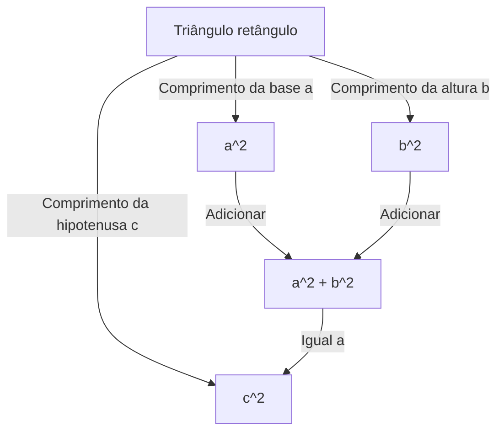
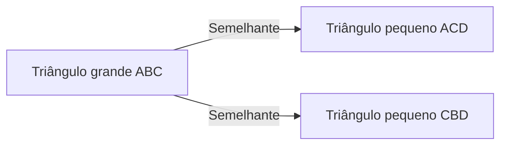

## Introdução

Um dos teoremas mais famosos da matemática, e um dos que tem mais provas numerosas, é o **Teorema de Pitágoras**. Este teorema, que descreve a relação entre os três lados de um triângulo retângulo, leva o nome do antigo filósofo grego Pitágoras, embora fosse conhecido na Babilônia, na China e em outros lugares muito antes de sua época.

A afirmação do teorema é muito simples. Quando o comprimento da hipotenusa de um triângulo retângulo é $c$, e os comprimentos dos outros dois lados são $a$ e $b$, a seguinte relação é válida:

$$ a^2 + b^2 = c^2 $$

Surpreendentemente, existem centenas de maneiras diferentes de provar essa fórmula matemática aparentemente simples. Neste artigo, exploraremos as profundezas deste teorema de diversas perspectivas, variando de provas geométricas clássicas e abordagens algébricas a uma prova de um presidente americano e uma prova intuitiva de um jovem Albert Einstein.

---

## 1. Prova Geométrica baseada nos "Elementos" de [Euclides](https://kenji.blog/pt/p/euclid/)

O antigo matemático grego [Euclides](https://kenji.blog/pt/p/euclid/) forneceu uma prova visual e rigorosa em seu livro "Elementos" (Livro I, Proposição 47), que às vezes é referida como a **prova do moinho de vento**.

### Ideia da Prova

Desenhe três quadrados, cada um usando um dos lados do triângulo retângulo como lado. A prova usa a congruência de triângulos e a equivalência de áreas para mostrar que a área do quadrado maior (aquele na hipotenusa $c$) é igual à soma das áreas dos outros dois quadrados (nos lados $a$ e $b$).

1. Trace uma perpendicular do vértice do ângulo reto até a hipotenusa, dividindo o quadrado na hipotenusa em dois retângulos.
2. Prove que a área do quadrado pequeno $a^2$ é igual à área de um dos retângulos divididos usando mapeamento de cisalhamento (transformações que preservam a área).
3. Da mesma forma, mostre que a área do quadrado médio $b^2$ é igual à área do outro retângulo.
4. Como resultado, $a^2 + b^2$ corresponde exatamente à área do quadrado grande $c^2$.

Embora este método pareça complexo devido às numerosas linhas auxiliares, é uma prova profundamente bela concluída inteiramente através da geometria pura.

---

## 2. Prova Algébrica Usando [Tri](https://kenji.blog/pt/p/sorting-algorithms/)ângulos Semelhantes

A seguir, apresentamos uma prova que utiliza a razão de semelhança dos triângulos. Este método requer cálculo mínimo e apresenta uma progressão lógica altamente elegante.

### Passos da Prova

Em um triângulo retângulo $ABC$, trace uma linha perpendicular $CD$ do vértice do ângulo reto $C$ até a hipotenusa $AB$. Isso divide o grande triângulo original em dois triângulos retângulos menores.

Neste ponto, todos os três triângulos (o triângulo original e os dois menores divididos) são semelhantes entre si.

- $\triangle ABC \sim \triangle ACD$
- $\triangle ABC \sim \triangle CBD$

Como a razão dos lados correspondentes em triângulos semelhantes é igual, as seguintes relações são válidas:

1. Para $\triangle ABC$ e $\triangle ACD$:
   $$ \frac{c}{b} = \frac{b}{AD} \implies b^2 = c \cdot AD $$

2. Para $\triangle ABC$ e $\triangle CBD$:
   $$ \frac{c}{a} = \frac{a}{DB} \implies a^2 = c \cdot DB $$

Adicione essas duas equações juntas:

$$ a^2 + b^2 = c \cdot DB + c \cdot AD = c \cdot (DB + AD) $$

Aqui, como $DB + AD = c$ (o comprimento total da hipotenusa),

$$ a^2 + b^2 = c \cdot c = c^2 $$

Assim, o teorema está provado. Esta abordagem demonstra brilhantemente a fusão da **álgebra** e da **geometria**.

---

## 3. A Prova do Presidente James A. Garfield

Surpreendentemente, James A. Garfield, o 20º Presidente dos Estados Unidos, provou este teorema usando sua própria abordagem única em 1876. Ele utilizou a **área de um trapézio**.

### Abordagem Usando um Trapézio

Coloque dois triângulos retângulos congruentes (com comprimentos de lado $a, b, c$) em uma linha reta ao longo de um único eixo e conecte seus vértices para formar um trapézio.

A área do trapézio pode ser calculada de duas maneiras diferentes.

**Método 1: Usando a fórmula do trapézio**
Os comprimentos dos dois lados paralelos são $a$ e $b$, e a altura é $a + b$.
$$ \text{Área} = \frac{1}{2} \cdot (a + b) \cdot (a + b) = \frac{1}{2} (a^2 + 2ab + b^2) $$

**Método 2: Como a soma das áreas de três triângulos**
Dentro do trapézio, há os dois triângulos retângulos originais e um triângulo retângulo isósceles com dois lados de comprimento $c$.
$$ \text{Área} = \left( \frac{1}{2} ab \right) + \left( \frac{1}{2} ab \right) + \left( \frac{1}{2} c^2 \right) = ab + \frac{1}{2} c^2 $$

Como essas duas áreas são iguais, podemos estabelecer uma equação:

$$ \frac{1}{2} (a^2 + 2ab + b^2) = ab + \frac{1}{2} c^2 $$

Multiplicando ambos os lados por 2 e expandindo, obtemos:

$$ a^2 + 2ab + b^2 = 2ab + c^2 $$

Subtrair $2ab$ de ambos os lados deriva brilhantemente o **Teorema de Pitágoras**:

$$ a^2 + b^2 = c^2 $$

A prova de Garfield, criada por alguém que era tanto um político quanto um talento matemático, é caracterizada por sua simplicidade e extrema facilidade de compreensão.

---

## 4. A Prova de Albert Einstein por Análise Dimensional

Diz-se que Albert Einstein, o maior físico do século 20, também provou o teorema de Pitágoras à sua própria maneira durante a infância. Sua abordagem usou o conceito de **análise dimensional**, um método altamente intuitivo característico de um físico.

### Ideia da Análise Dimensional

A área $E$ de qualquer triângulo retângulo é proporcional ao quadrado do comprimento da sua hipotenusa $c$. Isso ocorre porque a área tem a dimensão de "comprimento ao quadrado" e, uma vez determinada a forma (ângulos) do triângulo, seu tamanho é exclusivamente definido pelo quadrado de um único parâmetro de comprimento (aqui, a hipotenusa).

Portanto, a área $E$ pode ser expressa usando uma constante de proporcionalidade desconhecida $m$ da seguinte forma:

$$ E = m \cdot c^2 $$

Agora, semelhante à prova usando semelhança mencionada anteriormente, trace uma perpendicular do vértice do ângulo reto até a hipotenusa para dividir o triângulo original em dois triângulos retângulos menores. Como esses triângulos menores são semelhantes ao original, suas hipotenusas são $a$ e $b$ respectivamente.

Assim, as áreas $E_a$ e $E_b$ desses dois triângulos menores também podem ser expressas usando a mesma constante de proporcionalidade $m$:

$$ E_a = m \cdot a^2 $$
$$ E_b = m \cdot b^2 $$

Como a área do grande triângulo original é igual à soma das áreas dos dois triângulos menores:

$$ E = E_a + E_b $$

Substituindo as equações anteriores nisso, obtemos:

$$ m \cdot c^2 = m \cdot a^2 + m \cdot b^2 $$

Dividindo ambos os lados pela constante comum $m$, obtemos a relação:

$$ c^2 = a^2 + b^2 $$

Essa prova não foi derivada brincando com fórmulas, mas a partir de uma **intuição de dimensões físicas**, oferecendo um vislumbre do extraordinário gênio de Einstein.

---

## Conclusão

O teorema de Pitágoras não é meramente uma fórmula matemática a ser memorizada. É um exemplo maravilhoso da essência da matemática, que pode ser abordada de **várias perspectivas**, incluindo quebra-cabeças geométricos, a manipulação de equações algébricas e até mesmo o conceito físico de dimensões.

Além das quatro provas apresentadas aqui, existem incontáveis abordagens em todo o mundo, como uma prova de Leonardo da Vinci e provas usando origami. De qualquer forma, tente explorar novos métodos de prova por conta própria. O mundo da matemática está sempre cheio de novas descobertas.
