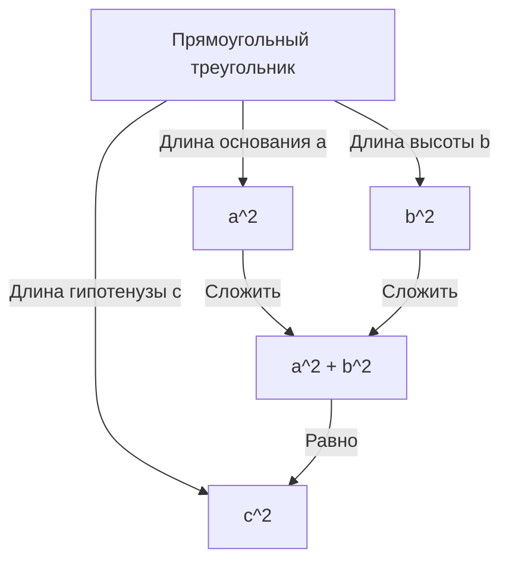

## Введение

Одной из самых известных теорем в математике, для которой существует наибольшее количество доказательств, является **теорема Пифагора**. Эта теорема, описывающая соотношение между тремя сторонами прямоугольного треугольника, названа в честь древнегреческого философа Пифагора, хотя она была известна в Вавилоне, Китае и других местах задолго до его времени.

Утверждение теоремы очень простое. Если длина гипотенузы прямоугольного треугольника равна $c$, а длины двух других сторон (катетов) равны $a$ и $b$, выполняется следующее соотношение:

$$ a^2 + b^2 = c^2 $$

Удивительно, но существуют сотни различных способов доказать эту на первый взгляд простую математическую формулу. В этой статье мы исследуем глубины этой теоремы с различных точек зрения, начиная от классических геометрических доказательств и алгебраических подходов и заканчивая доказательством американского президента и интуитивным доказательством юного Альберта Эйнштейна.

---

## 1. Геометрическое доказательство, основанное на «Началах» [Евклид](https://kenji.blog/ru/p/euclid/)а

Древнегреческий математик [Евклид](https://kenji.blog/ru/p/euclid/) привел наглядное и строгое доказательство в своей книге «Начала» (Книга I, Предложение 47), которое иногда называют **доказательством «Мельницы»**.

### Идея доказательства

Нарисуйте три квадрата, каждый из которых построен на одной из сторон прямоугольного треугольника. Доказательство использует конгруэнтность (равенство) треугольников и равновеликость площадей, чтобы показать, что площадь самого большого квадрата (построенного на гипотенузе $c$) равна сумме площадей двух других квадратов (на катетах $a$ и $b$).

1. Опустите перпендикуляр из вершины прямого угла на гипотенузу, разделив квадрат на гипотенузе на два прямоугольника.
2. Докажите, что площадь малого квадрата $a^2$ равна площади одного из разделенных прямоугольников, используя преобразования сдвига (сохраняющие площадь преобразования).
3. Аналогично, покажите, что площадь среднего квадрата $b^2$ равна площади другого прямоугольника.
4. В результате сумма площадей $a^2 + b^2$ точно совпадает с площадью большого квадрата $c^2$.

Хотя этот метод кажется сложным из-за многочисленных вспомогательных линий, это глубоко красивое доказательство, выполненное исключительно с помощью чистой геометрии.

---

## 2. Алгебраическое доказательство с использованием подобных треугольников

Далее мы представляем доказательство, использующее коэффициент подобия треугольников. Этот метод требует минимальных вычислений и отличается весьма элегантным логическим развитием.

### Шаги доказательства

В прямоугольном треугольнике $ABC$ проведите перпендикулярную линию $CD$ из вершины прямого угла $C$ к гипотенузе $AB$. Это разделит исходный большой треугольник на два меньших прямоугольных треугольника.

В этот момент все три треугольника (исходный треугольник и два разделенных меньших) подобны друг другу.

- $\triangle ABC \sim \triangle ACD$
- $\triangle ABC \sim \triangle CBD$

Поскольку отношение соответствующих сторон в подобных треугольниках равно, выполняются следующие соотношения:

1. Для $\triangle ABC$ и $\triangle ACD$:
   $$ \frac{c}{b} = \frac{b}{AD} \implies b^2 = c \cdot AD $$

2. Для $\triangle ABC$ и $\triangle CBD$:
   $$ \frac{c}{a} = \frac{a}{DB} \implies a^2 = c \cdot DB $$

Сложите эти два уравнения вместе:

$$ a^2 + b^2 = c \cdot DB + c \cdot AD = c \cdot (DB + AD) $$

Здесь, поскольку $DB + AD = c$ (общая длина гипотенузы),

$$ a^2 + b^2 = c \cdot c = c^2 $$

Таким образом, теорема доказана. Этот подход блестяще демонстрирует слияние **алгебры** и **геометрии**.

---

## 3. Доказательство президента Джеймса А. Гарфилда

Удивительно, но Джеймс А. Гарфилд, 20-й президент Соединенных Штатов, доказал эту теорему, используя свой собственный уникальный подход в 1876 году. Он использовал **площадь трапеции**.

### Подход с использованием трапеции

Поместите два конгруэнтных прямоугольных треугольника (с длинами сторон $a, b, c$) на одной прямой вдоль одной оси и соедините их вершины, чтобы образовать трапецию.

Площадь трапеции можно вычислить двумя различными способами.

**Метод 1: Использование формулы трапеции**
Длины двух параллельных сторон равны $a$ и $b$, а высота равна $a + b$.
$$ \text{Площадь} = \frac{1}{2} \cdot (a + b) \cdot (a + b) = \frac{1}{2} (a^2 + 2ab + b^2) $$

**Метод 2: Как сумма площадей трех треугольников**
Внутри трапеции находятся два исходных прямоугольных треугольника и один равнобедренный прямоугольный треугольник с двумя сторонами длиной $c$.
$$ \text{Площадь} = \left( \frac{1}{2} ab \right) + \left( \frac{1}{2} ab \right) + \left( \frac{1}{2} c^2 \right) = ab + \frac{1}{2} c^2 $$

Поскольку эти две площади равны, мы можем составить уравнение:

$$ \frac{1}{2} (a^2 + 2ab + b^2) = ab + \frac{1}{2} c^2 $$

Умножение обеих частей на 2 и раскрытие скобок дает:

$$ a^2 + 2ab + b^2 = 2ab + c^2 $$

Вычитание $2ab$ из обеих частей блестяще выводит **теорему Пифагора**:

$$ a^2 + b^2 = c^2 $$

Доказательство Гарфилда, созданное человеком, который был одновременно политиком и математическим талантом, характеризуется своей простотой и исключительной легкостью понимания.

---

## 4. Доказательство Альберта Эйнштейна посредством размерного анализа

Говорят, что Альберт Эйнштейн, величайший физик 20-го века, также доказал теорему Пифагора по-своему в детстве. В его подходе использовалась концепция **размерного анализа** — интуитивно понятный метод, характерный для физика.

### Идея размерного анализа

Площадь $E$ любого прямоугольного треугольника пропорциональна квадрату длины его гипотенузы $c$. Это связано с тем, что площадь имеет размерность «длина в квадрате», и как только форма (углы) треугольника определена, его размер однозначно задается квадратом одного параметра длины (здесь — гипотенузы).

Поэтому площадь $E$ можно выразить с использованием неизвестной константы пропорциональности $m$ следующим образом:

$$ E = m \cdot c^2 $$

Теперь, аналогично доказательству с использованием подобия, упомянутому ранее, опустите перпендикуляр из вершины прямого угла на гипотенузу, чтобы разделить исходный треугольник на два меньших прямоугольных треугольника. Поскольку эти меньшие треугольники подобны исходному, их гипотенузы равны $a$ и $b$ соответственно.

Таким образом, площади $E_a$ и $E_b$ этих двух меньших треугольников также могут быть выражены с использованием той же константы пропорциональности $m$:

$$ E_a = m \cdot a^2 $$
$$ E_b = m \cdot b^2 $$

Поскольку площадь исходного большого треугольника равна сумме площадей двух меньших треугольников:

$$ E = E_a + E_b $$

Подставляя предыдущие уравнения в это, получаем:

$$ m \cdot c^2 = m \cdot a^2 + m \cdot b^2 $$

Разделение обеих частей на общую константу $m$ дает соотношение:

$$ c^2 = a^2 + b^2 $$

Это доказательство было получено не путем манипулирования формулами, а на основе **интуиции физических размерностей**, что позволяет заглянуть в необычайный гений Эйнштейна.

---

## Заключение

Теорема Пифагора — это не просто математическая формула для запоминания. Это прекрасный пример сути математики, к которой можно подойти с **различных точек зрения**, включая геометрические головоломки, манипулирование алгебраическими уравнениями и даже физическую концепцию размерностей.

Помимо четырех представленных здесь доказательств, в мире существуют бесчисленные подходы, такие как доказательство Леонардо да Винчи и доказательства с использованием оригами. Непременно попробуйте самостоятельно исследовать новые методы доказательства. Мир математики всегда полон новых открытий.
