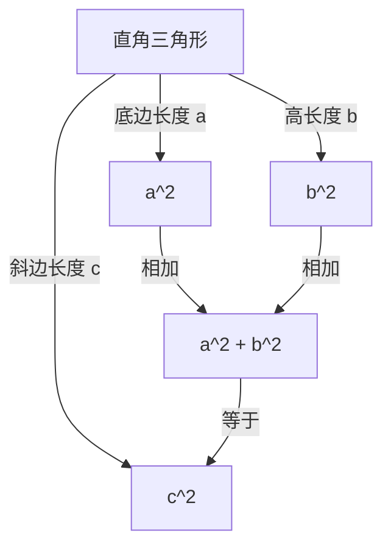

## 引言

在数学中最著名、且拥有最多证明方法的定理之一就是 **勾股定理** （毕达哥拉斯定理）。这一定理描述了直角三角形三条边之间的关系。虽然它以古希腊哲学家毕达哥拉斯的名字命名，但在他所处的时代之前，巴比伦、中国等地的人们就已经知晓了这一定理。

定理的主张非常简单。当直角三角形的斜边长度为 $c$ ，其他两条边的长度分别为 $a$ 和 $b$ 时，以下关系成立：

$$ a^2 + b^2 = c^2 $$

令人惊讶的是，这个看似简单的数学公式竟有数百种不同的证明方法。在本文中，我们将从不同的视角深入探讨这一定理，从经典的几何学证明、代数方法，到美国总统的证明，再到年轻的阿尔伯特·爱因斯坦基于直觉的证明。

---

## 1. 基于[欧几里得](https://kenji.blog/zh-cn/p/euclid/)《几何原本》的几何证明

古希腊数学家[欧几里得](https://kenji.blog/zh-cn/p/euclid/)在其著作《几何原本》（第1卷命题47）中提供了一个直观且严密的证明，有时也被称为 **风车证明** 。

### 证明思路

画三个正方形，分别以直角三角形的三条边作为正方形的边。该证明利用三角形的全等和面积的等价性来表明，最大正方形（位于斜边 $c$ 上）的面积等于其他两个正方形（位于边 $a$ 和 $b$ 上）的面积之和。

1. 从直角顶点向斜边作垂线，将斜边上的大正方形分割为两个矩形。
2. 利用等积变形，证明小正方形 $a^2$ 的面积等于其中一个被分割出的矩形的面积。
3. 同样地，证明中等大小的正方形 $b^2$ 的面积等于另一个矩形的面积。
4. 结果表明， $a^2 + b^2$ 完全等于大正方形的面积 $c^2$ 。

尽管由于添加了多条辅助线，这种方法看起来有些复杂，但它是一个完全通过纯粹的几何学完成的极其优美的证明。

---

## 2. 使用相似三角形的代数证明

接下来我们介绍一种利用三角形相似比的证明方法。该方法只需极少的计算，并且展现出了非常优雅的逻辑推导。

### 证明步骤

在直角三角形 $ABC$ 中，从直角顶点 $C$ 向斜边 $AB$ 作一条垂线 $CD$ 。这会将原来的大三角形分割成两个较小的直角三角形。

此时，所有的三个三角形（原来的三角形和分割出的两个小三角形）都互为相似三角形。

- $\triangle ABC \sim \triangle ACD$
- $\triangle ABC \sim \triangle CBD$

由于相似三角形的对应边比例相等，因此以下关系成立：

1. 对于 $\triangle ABC$ 和 $\triangle ACD$ ：
   $$ \frac{c}{b} = \frac{b}{AD} \implies b^2 = c \cdot AD $$

2. 对于 $\triangle ABC$ 和 $\triangle CBD$ ：
   $$ \frac{c}{a} = \frac{a}{DB} \implies a^2 = c \cdot DB $$

将这两个方程式相加：

$$ a^2 + b^2 = c \cdot DB + c \cdot AD = c \cdot (DB + AD) $$

这里，由于 $DB + AD = c$ （斜边的总长度），

$$ a^2 + b^2 = c \cdot c = c^2 $$

至此，定理得证。这种方法巧妙地展示了 **代数** 与 **几何** 的完美融合。

---

## 3. 詹姆斯·加菲尔德总统的证明

令人惊讶的是，美国第20任总统詹姆斯·A·加菲尔德在1876年用他自己独特的方法证明了这一定理。他利用了 **梯形的面积** 。

### 利用梯形的方法

将两个全等的直角三角形（边长分别为 $a, b, c$ ）沿同一直线放置，并连接它们的顶点以形成一个梯形。

梯形的面积可以用两种不同的方法来计算。

**方法1：使用梯形公式**
两条平行边的长度分别为 $a$ 和 $b$ ，高为 $a + b$ 。
$$ \text{面积} = \frac{1}{2} \cdot (a + b) \cdot (a + b) = \frac{1}{2} (a^2 + 2ab + b^2) $$

**方法2：作为三个三角形面积之和**
在梯形内部，有原来的两个直角三角形以及一个两条边长均为 $c$ 的等腰直角三角形。
$$ \text{面积} = \left( \frac{1}{2} ab \right) + \left( \frac{1}{2} ab \right) + \left( \frac{1}{2} c^2 \right) = ab + \frac{1}{2} c^2 $$

由于这两种面积是相等的，我们可以建立一个等式：

$$ \frac{1}{2} (a^2 + 2ab + b^2) = ab + \frac{1}{2} c^2 $$

两边同乘2并展开后得到：

$$ a^2 + 2ab + b^2 = 2ab + c^2 $$

从等式两边减去 $2ab$ ，就能巧妙地推导出 **勾股定理** ：

$$ a^2 + b^2 = c^2 $$

加菲尔德的证明出自一位既是政治家又具有数学天赋的人之手，其特点是简单明了，极易理解。

---

## 4. 阿尔伯特·爱因斯坦的量纲分析证明

20世纪最伟大的物理学家阿尔伯特·爱因斯坦，据说在童年时期也用自己的方式证明了勾股定理。他的方法使用了 **量纲分析** 的概念，这是一种极具物理学家特征的直观方法。

### 量纲分析的思路

任何直角三角形的面积 $E$ 都与其斜边长度 $c$ 的平方成正比。这是因为面积具有“长度的平方”这一量纲，而且一旦确定了三角形的形状（角度），其大小就唯一地由单个长度参数（这里是斜边）的平方所决定。

因此，面积 $E$ 可以使用一个未知的比例常数 $m$ 来表示如下：

$$ E = m \cdot c^2 $$

现在，类似于前面提到的利用相似性的证明，从直角顶点向斜边作垂线，将原三角形分割为两个较小的直角三角形。由于这些较小的三角形与原三角形相似，它们的斜边分别为 $a$ 和 $b$ 。

因此，这两个较小三角形的面积 $E_a$ 和 $E_b$ 同样可以使用相同的比例常数 $m$ 来表示：

$$ E_a = m \cdot a^2 $$
$$ E_b = m \cdot b^2 $$

因为原来大三角形的面积等于两个小三角形面积之和：

$$ E = E_a + E_b $$

将前面的方程式代入其中，可以得到：

$$ m \cdot c^2 = m \cdot a^2 + m \cdot b^2 $$

等式两边除以共同的常数 $m$ ，得出关系：

$$ c^2 = a^2 + b^2 $$

这一证明并非通过玩弄公式推导得出，而是源自对 **物理量纲的直觉** ，让我们得以一窥爱因斯坦非凡的天才。

---

## 结论

勾股定理不仅仅是一个需要死记硬背的数学公式。它是数学精髓的一个绝佳例证，可以通过 **多种视角** 来探索，包括几何拼图、代数方程的推导，甚至是物理学中的量纲概念。

除了本文介绍的四种证明之外，世界上还有无数种不同的方法，例如列奥纳多·达·芬奇的证明以及使用折纸的证明。请务必尝试自己去探索新的证明方法。数学的世界总是充满了新的发现。
