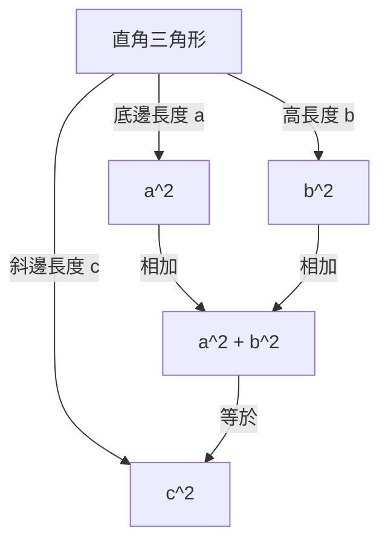

## 引言

在數學中最著名、且擁有最多證明方法的定理之一就是 **畢氏定理** （勾股定理）。這一定理描述了直角三角形三條邊之間的關係。雖然它以古希臘哲學家畢達哥拉斯的名字命名，但在他所處的時代之前，巴比倫、中國等地的人們就已經知曉了這一定理。

定理的主張非常簡單。當直角三角形的斜邊長度為 $c$ ，其他兩條邊的長度分別為 $a$ 和 $b$ 時，以下關係成立：

$$ a^2 + b^2 = c^2 $$

令人驚訝的是，這個看似簡單的數學公式竟有數百種不同的證明方法。在本文中，我們將從不同的視角深入探討這一定理，從經典的幾何學證明、代數方法，到美國總統的證明，再到年輕的阿爾伯特·愛因斯坦基於直覺的證明。

---

## 1. 基於[歐幾里得](https://kenji.blog/zh-tw/p/euclid/)《幾何原本》的幾何證明

古希臘數學家[歐幾里得](https://kenji.blog/zh-tw/p/euclid/)在其著作《幾何原本》（第1卷命題47）中提供了一個直觀且嚴密的證明，有時也被稱為 **風車證明** 。

### 證明思路

畫三個正方形，分別以直角三角形的三條邊作為正方形的邊。該證明利用三角形的全等和面積的等價性來表明，最大正方形（位於斜邊 $c$ 上）的面積等於其他兩個正方形（位於邊 $a$ 和 $b$ 上）的面積之和。

1. 從直角頂點向斜邊作垂線，將斜邊上的大正方形分割為兩個矩形。
2. 利用等積變形，證明小正方形 $a^2$ 的面積等於其中一個被分割出的矩形的面積。
3. 同樣地，證明中等大小的正方形 $b^2$ 的面積等於另一個矩形的面積。
4. 結果表明， $a^2 + b^2$ 完全等於大正方形的面積 $c^2$ 。

儘管由於添加了多條輔助線，這種方法看起來有些複雜，但它是一個完全通過純粹的幾何學完成的極其優美的證明。

---

## 2. 使用相似三角形的代數證明

接下來我們介紹一種利用三角形相似比的證明方法。該方法只需極少的計算，並且展現出了非常優雅的邏輯推導。

### 證明步驟

在直角三角形 $ABC$ 中，從直角頂點 $C$ 向斜邊 $AB$ 作一條垂線 $CD$ 。這會將原來的大三角形分割成兩個較小的直角三角形。

此時，所有的三個三角形（原來的三角形和分割出的兩個小三角形）都互為相似三角形。

- $\triangle ABC \sim \triangle ACD$
- $\triangle ABC \sim \triangle CBD$

由於相似三角形的對應邊比例相等，因此以下關係成立：

1. 對於 $\triangle ABC$ 和 $\triangle ACD$ ：
   $$ \frac{c}{b} = \frac{b}{AD} \implies b^2 = c \cdot AD $$

2. 對於 $\triangle ABC$ 和 $\triangle CBD$ ：
   $$ \frac{c}{a} = \frac{a}{DB} \implies a^2 = c \cdot DB $$

將這兩個方程式相加：

$$ a^2 + b^2 = c \cdot DB + c \cdot AD = c \cdot (DB + AD) $$

這裡，由於 $DB + AD = c$ （斜邊的總長度），

$$ a^2 + b^2 = c \cdot c = c^2 $$

至此，定理得證。這種方法巧妙地展示了 **代數** 與 **幾何** 的完美融合。

---

## 3. 詹姆斯·加菲爾德總統的證明

令人驚訝的是，美國第20任總統詹姆斯·A·加菲爾德在1876年用他自己獨特的方法證明了這一定理。他利用了 **梯形的面積** 。

### 利用梯形的方法

將兩個全等的直角三角形（邊長分別為 $a, b, c$ ）沿同一直線放置，並連接它們的頂點以形成一個梯形。

梯形的面積可以用兩種不同的方法來計算。

**方法1：使用梯形公式**
兩條平行邊的長度分別為 $a$ 和 $b$ ，高為 $a + b$ 。
$$ \text{面積} = \frac{1}{2} \cdot (a + b) \cdot (a + b) = \frac{1}{2} (a^2 + 2ab + b^2) $$

**方法2：作為三個三角形面積之和**
在梯形內部，有原來的兩個直角三角形以及一個兩條邊長均為 $c$ 的等腰直角三角形。
$$ \text{面積} = \left( \frac{1}{2} ab \right) + \left( \frac{1}{2} ab \right) + \left( \frac{1}{2} c^2 \right) = ab + \frac{1}{2} c^2 $$

由於這兩種面積是相等的，我們可以建立一個等式：

$$ \frac{1}{2} (a^2 + 2ab + b^2) = ab + \frac{1}{2} c^2 $$

兩邊同乘2並展開後得到：

$$ a^2 + 2ab + b^2 = 2ab + c^2 $$

從等式兩邊減去 $2ab$ ，就能巧妙地推導出 **畢氏定理** ：

$$ a^2 + b^2 = c^2 $$

加菲爾德的證明出自一位既是政治家又具有數學天賦的人之手，其特點是簡單明了，極易理解。

---

## 4. 阿爾伯特·愛因斯坦的因次分析證明

20世紀最偉大的物理學家阿爾伯特·愛因斯坦，據說在童年時期也用自己的方式證明了畢氏定理。他的方法使用了 **因次分析** 的概念，這是一種極具物理學家特徵的直觀方法。

### 因次分析的思路

任何直角三角形的面積 $E$ 都與其斜邊長度 $c$ 的平方成正比。這是因為面積具有「長度的平方」這一因次，而且一旦確定了三角形的形狀（角度），其大小就唯一地由單個長度參數（這裡是斜邊）的平方所決定。

因此，面積 $E$ 可以使用一個未知的比例常數 $m$ 來表示如下：

$$ E = m \cdot c^2 $$

現在，類似於前面提到的利用相似性的證明，從直角頂點向斜邊作垂線，將原三角形分割為兩個較小的直角三角形。由於這些較小的三角形與原三角形相似，它們的斜邊分別為 $a$ 和 $b$ 。

因此，這兩個較小三角形的面積 $E_a$ 和 $E_b$ 同樣可以使用相同的比例常數 $m$ 來表示：

$$ E_a = m \cdot a^2 $$
$$ E_b = m \cdot b^2 $$

因為原來大三角形的面積等於兩個小三角形面積之和：

$$ E = E_a + E_b $$

將前面的方程式代入其中，可以得到：

$$ m \cdot c^2 = m \cdot a^2 + m \cdot b^2 $$

等式兩邊除以共同的常數 $m$ ，得出關係：

$$ c^2 = a^2 + b^2 $$

這一證明並非通過玩弄公式推導得出，而是源自對 **物理因次的直覺** ，讓我們得以一窺愛因斯坦非凡的天才。

---

## 結論

畢氏定理不僅僅是一個需要死記硬背的數學公式。它是數學精髓的一個絕佳例證，可以通過 **多種視角** 來探索，包括幾何拼圖、代數方程的推導，甚至是物理學中的因次概念。

除了本文介紹的四種證明之外，世界上還有無數種不同的方法，例如李奧納多·達·文西的證明以及使用摺紙的證明。請務必嘗試自己去探索新的證明方法。數學的世界總是充滿了新的發現。
