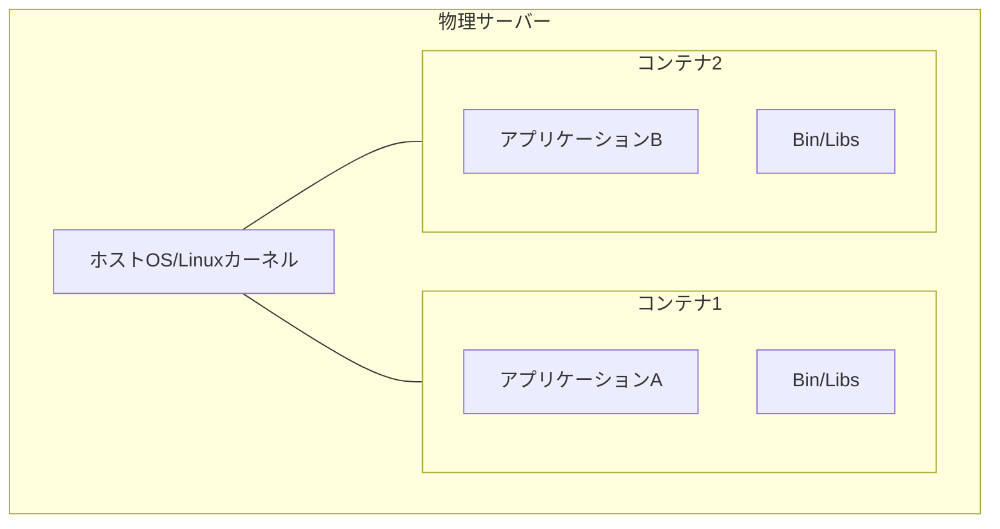
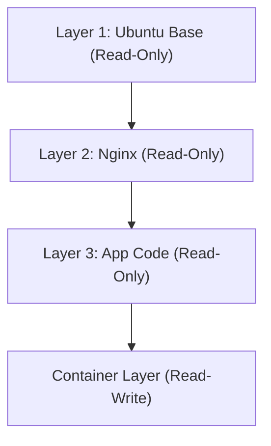

## 1. مقدمة: ثورة النقل في العالم المادي وحاويات البرمجيات

في عالم تطوير البرمجيات، أصبحت كلمة "حاوية" (Container) راسخة منذ فترة طويلة، ولكن لفهم تأثيرها الحقيقي، يجب علينا أولاً إلقاء نظرة على تاريخ العالم المادي. في خمسينيات القرن الماضي، أحدث "الحاوية متعددة الوسائط" (حاوية الشحن البحري)، التي اخترعها رجل الأعمال الأمريكي مالكولم ماكلين، ثورة جذرية في الخدمات اللوجستية العالمية، وبالتالي في الاقتصاد العالمي نفسه.

حتى ذلك الحين، كان نقل البضائع يتم عن طريق عمال الموانئ الذين يقومون بتحميل البضائع ذات الأشكال والأحجام المختلفة يدوياً في السفن، مثل البراميل، والأكياس، والصناديق الخشبية. كان يُعرف هذا باسم شحن البضائع العامة (Breakbulk)، وكان غير فعال للغاية، ولم يكن من النادر أن تستغرق عمليات الشحن والتفريغ عدة أسابيع. بالإضافة إلى ذلك، كانت مخاطر التلف والسرقة عالية، وكانت تكاليف النقل باهظة.

اخترع ماكلين "الحاوية"، وهي صندوق حديدي موحد المعايير، وأنشأ نظاماً يسمح بنقل البضائع كما هي بين السفن، والشاحنات، والسكك الحديدية دون الحاجة إلى إعادة تعبئتها. ونتيجة لذلك، تم تقليص وقت الشحن والتفريغ بشكل كبير، وانخفضت تكاليف النقل إلى جزء بسيط مما كانت عليه. هذه الثورة اللوجستية جعلت من الممكن بناء سلاسل التوريد العالمية، ووضعت الأساس للاقتصاد الرأسمالي المتقدم اليوم.

إن ظهور دوكر (Docker) في عالم البرمجيات (عام 2013) يمتلك نفس هذا النمط تماماً. في الماضي، كان نشر البرمجيات يتطلب بناء بيئات تطوير، واختبار، وإنتاج بأنظمة تشغيل، ومكتبات، وتبعيات مختلفة يدوياً، ثم نشر التطبيق فيها. تماماً مثل شحن البضائع العامة في العالم المادي، أدى ذلك إلى عدم توافق بين البيئات (مشكلة "لكنه يعمل على جهازي")، وتطلب النشر الكثير من الوقت والجهد.

قدم دوكر آلية لتجميع كل ما هو ضروري لتشغيل التطبيق، بما في ذلك التعليمات البرمجية، ووقت التشغيل، وأدوات النظام، ومكتبات النظام، وملفات التكوين، في "صورة حاوية" (Container Image) واحدة موحدة المعايير. هذا جعل من الممكن تشغيل التطبيقات بشكل موثوق في نفس البيئة تماماً، سواء كان ذلك على جهاز كمبيوتر المطور، أو خوادم محلية، أو على سحابة عامة. لم يكن هذا مجرد تقدم تقني، بل كان ثورة أساسية في "توزيع" البرمجيات.

## 2. نظرية تطور تقنية المحاكاة الافتراضية: من الأجهزة الظاهرية (VM) إلى الحاويات

لفهم كيفية عمل تقنية الحاويات بعمق، دعونا نوضح الاختلافات بينها وبين الأجهزة الظاهرية (Virtual Machine: VM) التقليدية. ينبع هذا الاختلاف من التباين في فلسفة "التجريد" (Abstraction) و"عزل الموارد" (Resource Isolation) في هندسة المعلومات.

### التجريد على مستوى الأجهزة في الأجهزة الظاهرية
تستخدم الأجهزة الظاهرية طبقة برمجية تسمى "المراقب الظاهري" (Hypervisor) (مثل VMware ESXi، Hyper-V، KVM) لمحاكاة موارد الأجهزة (وحدة المعالجة المركزية، الذاكرة، التخزين، واجهة الشبكة) للخادم الفعلي، وإنشاء أجهزة ظاهرية منطقية متعددة. فوق كل جهاز ظاهري، يتم تثبيت نظام تشغيل ضيف (Guest OS) كامل (مثل لينكس أو ويندوز)، وتعمل التطبيقات عليه.

الميزة الكبرى لهذا النهج هي "العزل القوي" (Isolation). نظراً لأن المحاكاة تتم على مستوى الأجهزة، فحتى في حالة حدوث ذعر النواة (Kernel Panic) في جهاز ظاهري واحد، فإنه لن يؤثر على الأجهزة الظاهرية الأخرى. من الممكن أيضاً تشغيل أنظمة تشغيل مختلفة (مثل لينكس وويندوز) في نفس الوقت على نفس الخادم الفعلي.

ومع ذلك، من منظور "الإنتروبيا" في الفيزياء، هناك هدر كبير في بنية الأجهزة الظاهرية. وذلك لأن نظام التشغيل الضيف نفسه يجب أن يتمهيد، ويدير الذاكرة، ويقوم بجدولة العمليات، وهو عبء (Overhead) لا يمكن تجنبه. يتم استهلاك نسبة لا يستهان بها من موارد الحوسبة في النظام بأكمله ليس في تشغيل التطبيقات، بل في الحفاظ على "نظام تشغيل لتشغيل نظام تشغيل" (المراقب الظاهري).

### التجريد على مستوى نظام التشغيل وعزل العمليات في الحاويات
من ناحية أخرى، تقوم تقنية الحاويات الممثلة بـ Docker بإجراء المحاكاة الافتراضية (العزل) على "مستوى نظام التشغيل" بدلاً من مستوى الأجهزة. لا تمتلك الحاويات نظام تشغيل ضيف. تشترك جميع الحاويات في نظام تشغيل مضيف (Host OS) واحد فقط (نواة لينكس) يعمل على الخادم الفعلي (أو الجهاز الظاهري).

في جوهرها، الحاوية ليست سوى "عملية لينكس معزولة للغاية". ما يجعل ذلك ممكناً هو ميزات نواة لينكس `namespaces` (مساحات الأسماء) و `cgroups` (مجموعات التحكم).

## 3. سحر العزل: Namespaces و Cgroups

عند تشريح تقنية الحاويات من الناحية الفنية، يتضح أنها ليست سحراً، بل مزيج ذكي من الميزات التي تراكمت في نواة لينكس على مدار سنوات عديدة.

### "فصل الخطوط الزمنية" بواسطة Namespaces
تماماً كما هو الحال في الفيزياء حيث الأبعاد المختلفة أو العوالم الموازية لا تتداخل مع بعضها البعض، تقوم `namespaces` في لينكس بتقييد "مجال رؤية موارد النظام" الذي تتعرف عليه العملية، مما يخلق بيئة نظام افتراضية مستقلة. تشمل مساحات الأسماء الرئيسية ما يلي:

1. **PID namespace**: تقوم بعزل مساحة معرف العملية (Process ID). تتوهم العملية داخل الحاوية أنها ذات PID 1 (أول عملية في النظام)، ولكن من نظام التشغيل المضيف تظهر كعملية عادية (على سبيل المثال PID 14532).
2. **Mount (mnt) namespace**: تقوم بعزل نقاط تركيب نظام الملفات (Mount points). تمتلك الحاوية دليل الجذر الخاص بها `/` ، ولا يمكنها التلصص على نظام ملفات المضيف أو أنظمة ملفات الحاويات الأخرى. يمكن القول إن هذا تطور حديث لأمر `chroot` في نظام UNIX الذي ظهر في عام 1979.
3. **Network (net) namespace**: تقوم بعزل واجهات الشبكة، وعناوين IP، وجداول التوجيه. يتم تخصيص جهاز شبكة افتراضي مستقل `veth` لكل حاوية.
4. **UTS namespace**: تقوم بعزل اسم المضيف (hostname) واسم النطاق (domain name).
5. **IPC namespace**: تقوم بعزل الاتصالات بين العمليات (مثل الذاكرة المشتركة).
6. **User namespace**: تقوم بعزل مساحة معرف المستخدم ومعرف المجموعة. يؤدي تعيين مستخدم الجذر (UID 0) داخل الحاوية إلى مستخدم غير مميز على المضيف إلى تحسين الأمان بشكل كبير.

### "التقييد المادي للموارد" بواسطة Cgroups
إذا كانت namespaces هي "عزل مجال الرؤية"، فإن `cgroups` (مجموعات التحكم) هي "تقييد القوانين الفيزيائية". هي ميزة في النواة تضع حدوداً عليا لاستخدام موارد النظام (وقت المعالج، استخدام الذاكرة، النطاق الترددي لعمليات الإدخال والإخراج للقرص، النطاق الترددي للشبكة، وما إلى ذلك)، وتقوم بقياسها والتحكم فيها.

هذه الميزة، التي بدأ تطويرها في عام 2006 من قبل مهندسي جوجل (بشكل رئيسي Paul Menage و Rohit Seth)، تمنع حاوية واحدة من استهلاك كافة موارد النظام (مشكلة الجار المزعج Noisy Neighbor). ونتيجة لذلك، خلقت ميزة اقتصادية تتمثل في إمكانية حشد عدد كبير من الحاويات بكثافة عالية (زيادة معدل التجميع) على خادم مادي محدود.

## 4. نظام الملفات الموحد وهيكل طبقات الصور

من بين الابتكارات التي قدمها دوكر، كان أكثر ما جذب المهندسين هو "آلية بناء وتوزيع صور الحاويات". هنا، يعد مفهوم "نظام الملفات الموحد" (Union File System)، مثل OverlayFS و Aufs، المفتاح.

### جمالية الحتمية وإدارة الاختلافات
صورة الحاوية ليست ملفاً واحداً ضخماً، بل تمتلك بنية تتكون من "طبقات للقراءة فقط" (Read-Only layers) متعددة مكدسة فوق بعضها البعض.

على سبيل المثال، لنتخيل بناء خادم ويب.
1. الطبقة الأولى: بيئة نظام التشغيل الأساسية (مثل: Ubuntu 22.04)
2. الطبقة الثانية: تثبيت الحزم المطلوبة (مثل: apt-get install nginx)
3. الطبقة الثالثة: نسخ الشيفرة المصدرية للتطبيق وملفات التكوين

يتم حفظ هذه الطبقات وتخزينها مؤقتاً بشكل مستقل عن بعضها البعض. إذا تم استخدام نفس صورة Ubuntu الأساسية في حاوية أخرى، فستتم مشاركة بيانات الطبقة الأولى على القرص ولن يتم تنزيلها أو حفظها بشكل متكرر. هذا تطبيق لمبدأ DRY (لا تكرر نفسك) في هندسة البرمجيات على مستوى نظام الملفات.

عند بدء تشغيل الحاوية، تتم إضافة "طبقة حاوية قابلة للقراءة والكتابة" (Read-Write layer) رقيقة جداً أعلى هذه الطبقات المخصصة للقراءة فقط. جميع عمليات إنشاء الملفات وتعديلها وحذفها التي تقوم بها الحاوية أثناء تشغيلها يتم تسجيلها في طبقة القراءة والكتابة هذه فقط.

هذه إستراتيجية تسمى "النسخ عند الكتابة" (Copy-on-Write: CoW). إذا حاولت تعديل ملف في طبقة سفلية، يتم نسخ ذلك الملف إلى طبقة القراءة والكتابة العلوية، وهناك يتم إجراء التعديل. تبقى الطبقات الأصلية غير قابلة للتغيير (Immutable). بفضل هذه البنية، يكتمل تشغيل الحاوية في أجزاء من الألف من الثانية، وإذا قمت بتدمير الحاوية، فإن جميع التغييرات تختفي، ويمكنك دائماً البدء من جديد من حالة نظيفة.

## 5. بنية دوكر: العميل والخفي (Daemon)

تعتمد بنية نظام دوكر على نمط العميل-الخادم (Client-Server Architecture).

1. **Docker Daemon (dockerd)**: عملية ثقيلة تستمر في العمل في الخلفية على نظام التشغيل المضيف. تتحمل جميع المهام الشاقة مثل إنشاء الحاويات، وبدء تشغيلها، وإيقافها، وبناء الصور، وإدارة الشبكات.
2. **Docker Client (docker CLI)**: أداة سطر الأوامر التي يستخدمها المستخدم. عند كتابة أوامر مثل `docker run` أو `docker build` ، يرسل العميل تعليمات إلى Docker Daemon عبر واجهة برمجة تطبيقات REST API (مقابس Unix أو TCP).
3. **Docker Registry**: مستودع لصور الحاويات. يوجد "Docker Hub" كمسجل عام حيث يشارك المطورون حول العالم الصور، بالإضافة إلى المسجلات الخاصة (مثل Amazon ECR و Google Artifact Registry) لإدارة الصور بأمان داخل الشركات.

من خلال هذا الفصل، يمكن للعميل تشغيل العفاريت (Daemons) الموجودة على خوادم بعيدة بشفافية، وليس فقط العفريت الموجود على الجهاز المحلي.

## 6. تنسيق الحاويات ومستقبل الأنظمة الموزعة

كان دوكر أداة مثالية لتشغيل الحاويات على مضيف واحد، ولكن مع انتشار بنية الخدمات المصغرة (Microservices) وتشغيل آلاف أو عشرات الآلاف من الحاويات على مجموعة تتكون من عشرات أو مئات الخوادم (العقد)، ظهرت تحديات ذات أبعاد جديدة.

* "إذا تعطل خادم ما، كيف يمكن إعادة تشغيل الحاويات الموجودة عليه تلقائياً على خادم آخر؟"
* "إذا زادت حركة المرور، كيف يمكن توسيع عدد حاويات خادم الويب تلقائياً؟"
* "كيف يتم ربط عدد لا يحصى من الحاويات مع بعضها البعض عبر الشبكة، وإجراء موازنة الحمل (Load Balancing)؟"

لحل هذه التحديات المعقدة، ظهرت "أدوات تنسيق الحاويات" (Container Orchestration Tools). البطل الذي برز فيها كان **Kubernetes (K8s)**، والذي تم جعله مفتوح المصدر استناداً إلى المعرفة المستقاة من نظام "Borg" الداخلي في جوجل.

إذا كان دوكر يمثل "توحيد معايير الحاوية الفردية كبضاعة"، فإن Kubernetes هو "نظام تحكم آلي ضخم لمحطة ميناء دولية". يقوم Kubernetes بتجريد البنية التحتية بالكامل وتوفيرها كواجهة برمجة تطبيقات (API) قابلة للبرمجة. يكفي أن يعلن المطور عن "الحالة المرغوبة" (Desired State: على سبيل المثال، الحفاظ على 3 حاويات Nginx قيد التشغيل دائماً) في ملف YAML (بيان)، وسيقوم مستوى التحكم في Kubernetes بمراقبة الوضع الحالي للنظام باستمرار وتعديل الحالة بشكل مستقل (Reconciliation).

## 7. الخاتمة: نقلة نوعية يقودها سلسلة التجريد

من الظواهر الفيزيائية للترانزستورات إلى لغة الآلة، ومن التجميع إلى اللغات عالية المستوى، ثم من الخوادم المادية إلى الأجهزة الظاهرية. تاريخ علوم الكمبيوتر هو تاريخ من "التجريد". قامت تقنية الحاويات بتغليف بيئة تشغيل نظام التشغيل بالكامل، ورفعت مستوى البنية التحتية - ذلك المجال المادي الفوضوي - لتصبح قابلة للوصف بالكامل كبرمجيات عبر الشيفرة البرمجية، وشيئاً قابلاً لإعادة الإنتاج (البنية التحتية كشيفرة برمجية - Infrastructure as Code).

اليوم، يفترض مصطلح الحوسبة السحابية الأصلية (Cloud Native) وجود تقنية الحاويات. هذا العالم، الذي فتحه دوكر ووسعه Kubernetes، قلل من الاحتكاك من مرحلة التطوير إلى العمليات التشغيلية إلى أقصى حد، ووفر بيئة تسمح للمهندسين حول العالم بالتركيز على هدفهم الأصلي وهو "إنشاء برمجيات ذات قيمة". تتجاوز الحاويات كونها مجرد أداة تقنية؛ إنها نقلة نوعية حقيقية غيرت بشكل جذري النظام البيئي الاقتصادي والتنظيمي لتطوير البرمجيات.
