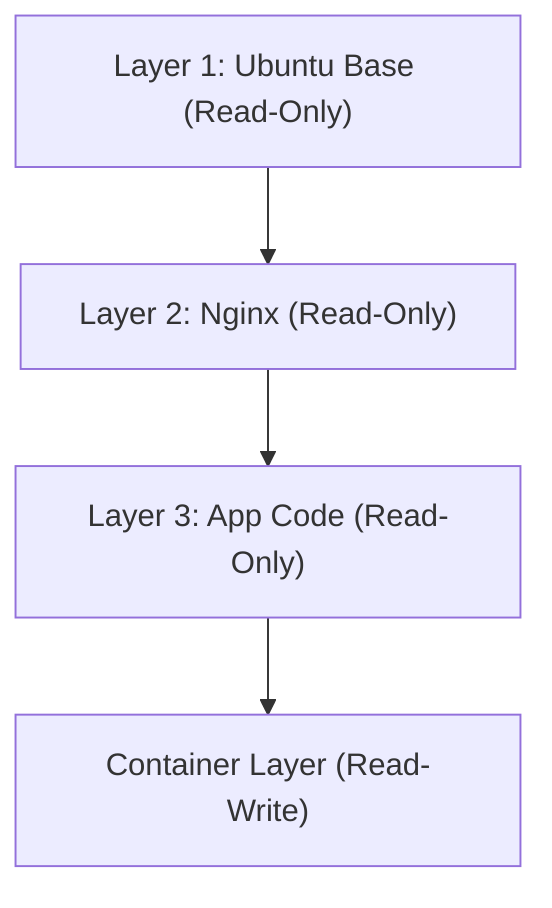

## 1. Einleitung: Die Transportrevolution der physischen Welt und die Containerisierung von Software

In der Welt der Softwareentwicklung hat sich das Wort "Container" längst etabliert, doch um seine wahre Tragweite zu verstehen, müssen wir zunächst einen Blick auf die Geschichte der physischen Welt werfen. In den 1950er Jahren erfand der amerikanische Unternehmer Malcolm McLean den "intermodalen Container" (Seecontainer), der die globale Logistik und damit die Weltwirtschaft selbst grundlegend revolutionierte.

Zuvor wurde Fracht wie Fässer, Säcke und Holzkisten in unterschiedlichsten Formen und Größen von Hafenarbeitern manuell auf Schiffe verladen. Dieser als Stückguttransport (Breakbulk) bekannte Prozess war extrem ineffizient und es war nicht ungewöhnlich, dass die Be- und Entladung mehrere Wochen dauerte. Zudem waren die Risiken für Beschädigung und Diebstahl hoch und die Transportkosten enorm.

McLean erfand den "Container", eine standardisierte Stahlbox, und baute ein System auf, bei dem Fracht ohne Umladen direkt zwischen Schiffen, Lkw und Zügen transportiert werden konnte. Dadurch wurde die Umschlagzeit drastisch verkürzt und die Transportkosten sanken auf einen Bruchteil. Diese logistische Revolution ermöglichte den Aufbau globaler Lieferketten und legte den Grundstein für die heutige hoch entwickelte kapitalistische Wirtschaft.

Das Aufkommen von Docker (2013) in der Softwarewelt folgt exakt dem gleichen Muster. Früher erforderte die Bereitstellung (Deployment) von Software den manuellen Aufbau unterschiedlicher Betriebssysteme, Bibliotheken und Abhängigkeiten für Entwicklungs-, Test- und Produktionsumgebungen, bevor die Anwendung platziert werden konnte. Ähnlich dem physischen Stückguttransport führte dies zu Inkonsistenzen zwischen den Umgebungen (das "Bei mir funktioniert es"-Problem) und das Deployment kostete immens viel Zeit und Mühe.

Docker bot einen Mechanismus, um alles, was für die Ausführung einer Anwendung erforderlich ist – Code, Laufzeitumgebung, Systemwerkzeuge, Systembibliotheken, Konfigurationsdateien usw. – in einem einzigen standardisierten "Container-Image" zu verpacken. Dadurch wurde es möglich, Anwendungen zuverlässig und in exakt derselben Umgebung auszuführen, sei es auf dem PC eines Entwicklers, einem lokalen Server (On-Premises) oder in einer Public Cloud. Dies war nicht nur ein technologischer Fortschritt, sondern eine fundamentale Revolution in der "Distribution" von Software.

## 2. Die Evolution der Virtualisierungstechnologie: Von VMs zu Containern

Um die Funktionsweise der Container-Technologie tiefgreifend zu verstehen, müssen wir die Unterschiede zu herkömmlichen virtuellen Maschinen (VMs) klären. Dieser Unterschied beruht auf den abweichenden Philosophien der "Abstraktion" und der "Ressourcenisolation" in der Informatik.

### Die Hardware-Level-Abstraktion von virtuellen Maschinen
VMs nutzen eine Softwareschicht namens Hypervisor (wie VMware ESXi, Hyper-V, KVM), um die Hardware-Ressourcen eines physischen Servers (CPU, Arbeitsspeicher, Speicher, Netzwerkschnittstellen) zu emulieren und mehrere logische virtuelle Hardware-Instanzen zu erstellen. Auf jeder VM wird ein vollständiges Gastbetriebssystem (wie Linux oder Windows) installiert, auf dem die Anwendungen laufen.

Der größte Vorteil dieses Ansatzes ist die "starke Isolation". Da die Emulation auf Hardwareebene stattfindet, hat eine Kernel-Panik in einer VM keine Auswirkungen auf die anderen VMs. Es ist auch möglich, verschiedene Betriebssysteme (wie Linux und Windows) gleichzeitig auf demselben physischen Server auszuführen.

Betrachtet man dies jedoch aus der Perspektive der physikalischen "Entropie", so birgt die VM-Architektur eine große Verschwendung in sich. Der Overhead für das Booten des Gastbetriebssystems selbst, die Speicherverwaltung und das Prozess-Scheduling ist unvermeidbar. Ein nicht unerheblicher Teil der Rechenressourcen des gesamten Systems wird nicht für die Ausführung von Anwendungen, sondern für die Aufrechterhaltung des "Betriebssystems für das Betriebssystem" (den Hypervisor) verbraucht.

### Die OS-Level-Abstraktion und Prozessisolation von Containern
Im Gegensatz dazu virtualisiert (bzw. isoliert) die Container-Technologie, vertreten durch Docker, nicht auf Hardware-, sondern auf "Betriebssystemebene" (OS-Level). Container haben kein Gastbetriebssystem. Alle Container teilen sich das einzige Host-Betriebssystem (den Linux-Kernel), das auf dem physischen Server (oder der VM) läuft.

Ein Container ist im Grunde genommen nichts anderes als ein "hochgradig isolierter, einfacher Linux-Prozess". Ermöglicht wird dies durch Funktionen des Linux-Kernels: `namespaces` (Namensräume) und `cgroups` (Kontrollgruppen).

```mermaid
graph TD
    subgraph Physischer Server
        OS[Host-OS/Linux-Kernel]
        subgraph Container 1
            App1[Anwendung A]
            Bin1[Bin/Libs]
        end
        subgraph Container 2
            App2[Anwendung B]
            Bin2[Bin/Libs]
        end
        OS --- Container 1
        OS --- Container 2
    end
```

## 3. Die Magie der Isolation: Namespaces und Cgroups

Wenn man die Container-Technologie technisch seziert, stellt man fest, dass es sich nicht um Magie handelt, sondern um eine clevere Kombination von Funktionen, die sich über Jahre im Linux-Kernel angesammelt haben.

### "Trennung der Weltlinien" durch Namespaces
Ähnlich wie in der Physik verschiedene Dimensionen oder Parallelwelten nicht miteinander interagieren, beschränken die Linux `namespaces` die "Sicht auf Systemressourcen", die ein Prozess wahrnimmt, und schaffen so eine unabhängige, virtuelle Systemumgebung. Zu den wichtigsten Namespaces gehören:

1. **PID namespace**: Isoliert den Raum der Prozess-IDs. Ein Prozess innerhalb eines Containers glaubt, er sei die PID 1 (der erste Prozess im System), während er vom Host-Betriebssystem als normaler Prozess (z. B. PID 14532) gesehen wird.
2. **Mount (mnt) namespace**: Isoliert die Mount-Punkte des Dateisystems. Der Container hat sein eigenes Root-Verzeichnis `/` und kann weder in das Dateisystem des Hosts noch in das anderer Container einsehen. Dies kann als die moderne Weiterentwicklung von UNIX `chroot` aus dem Jahr 1979 betrachtet werden.
3. **Network (net) namespace**: Isoliert Netzwerkschnittstellen, IP-Adressen und Routing-Tabellen. Jedem Container wird ein unabhängiges virtuelles Netzwerkgerät `veth` zugewiesen.
4. **UTS namespace**: Isoliert den Hostnamen (hostname) und den Domainnamen.
5. **IPC namespace**: Isoliert die Interprozesskommunikation (wie Shared Memory).
6. **User namespace**: Isoliert den Raum der Benutzer- und Gruppen-IDs. Die Sicherheit wird drastisch erhöht, indem der Root-Benutzer innerhalb des Containers (UID 0) einem unprivilegierten Benutzer auf dem Host zugeordnet wird.

### "Physikalische Begrenzung von Ressourcen" durch Cgroups
Wenn Namespaces die "Isolation der Sicht" darstellen, dann sind `cgroups` (Control Groups) die "Einschränkung der physikalischen Gesetze". Es handelt sich um eine Kernelfunktion, mit der Obergrenzen für die Nutzung von Systemressourcen (CPU-Zeit, Speichernutzung, Festplatten-I/O-Bandbreite, Netzwerkbandbreite usw.) festgelegt, gemessen und gesteuert werden können.

Diese Funktion, deren Entwicklung 2006 von Google-Ingenieuren (hauptsächlich Paul Menage und Rohit Seth) initiiert wurde, verhindert, dass ein einzelner Container die Ressourcen des gesamten Systems aufbraucht (das "Noisy Neighbor"-Problem). Daraus ergab sich der wirtschaftliche Vorteil, eine große Anzahl von Containern in hoher Dichte auf begrenzten physischen Servern unterbringen zu können (Erhöhung der Packungsdichte).

## 4. Das Union-Dateisystem und die Schichtstruktur von Images

Unter all den Innovationen von Docker ist es der "Mechanismus zur Erstellung und Verteilung von Container-Images", der Ingenieure am meisten fasziniert hat. Hier ist das Konzept des "Union File System" (wie OverlayFS oder Aufs) der Schlüssel.

### Die Ästhetik von Unveränderlichkeit und Differenzverwaltung
Ein Container-Image ist keine einzelne riesige Datei, sondern eine Struktur, in der mehrere "schreibgeschützte (Read-Only) Schichten (Layer)" übereinander gestapelt sind.

Betrachten wir als Beispiel den Aufbau eines Webservers:
1. Schicht 1: Die zugrunde liegende Betriebssystemumgebung (z.B. Ubuntu 22.04)
2. Schicht 2: Installation der erforderlichen Pakete (z.B. apt-get install nginx)
3. Schicht 3: Kopieren des Quellcodes und der Konfigurationsdateien der Anwendung

Diese Schichten werden unabhängig voneinander gespeichert und zwischengespeichert (gecacht). Wenn ein anderer Container dasselbe Ubuntu-Basis-Image verwendet, werden die Daten der Schicht 1 auf der Festplatte geteilt und nicht redundant heruntergeladen oder gespeichert. Dies ist die Umsetzung des DRY-Prinzips (Don't Repeat Yourself) der Softwaretechnik auf Dateisystemebene.



Wenn ein Container gestartet wird, wird ganz oben auf diesen schreibgeschützten Schichten eine sehr dünne, "lese- und schreibbare (Read-Write) Container-Schicht" hinzugefügt. Alle Dateierstellungen, -änderungen und -löschungen, die der Container während seiner Ausführung vornimmt, werden ausschließlich in dieser Read-Write-Schicht aufgezeichnet.

Dies ist die "Copy-on-Write (CoW)"-Strategie. Wenn ein Versuch unternommen wird, eine Datei in einer der unteren Schichten zu ändern, wird diese Datei in die oberste Read-Write-Schicht kopiert und dort geändert. Die ursprüngliche Schicht bleibt unveränderlich (Immutable). Durch diese Architektur ist der Start eines Containers in Millisekunden abgeschlossen; wird der Container zerstört, verschwinden alle Änderungen und man kann immer wieder von einem sauberen Zustand aus neu starten.

## 5. Die Docker-Architektur: Client und Daemon

Die Systemarchitektur von Docker basiert auf einem Client-Server-Modell.

1. **Docker Daemon (dockerd)**: Ein massiver Prozess, der kontinuierlich im Hintergrund auf dem Host-Betriebssystem läuft. Er übernimmt alle schweren Aufgaben wie das Erstellen, Starten und Stoppen von Containern, das Erstellen von Images und die Verwaltung von Netzwerken.
2. **Docker Client (docker CLI)**: Das vom Benutzer bediente Befehlszeilen-Tool. Wenn Befehle wie `docker run` oder `docker build` eingegeben werden, sendet der Client über eine REST-API (Unix-Sockets oder TCP) Anweisungen an den Docker Daemon.
3. **Docker Registry**: Ein Repository für Container-Images. Es gibt öffentliche Registries wie den "Docker Hub", in dem Entwickler weltweit Images teilen, sowie private Registries (Amazon ECR, Google Artifact Registry usw.) zur sicheren Verwaltung von Images innerhalb von Unternehmen.

Dank dieser Trennung kann der Client nicht nur den Daemon auf dem lokalen Rechner, sondern auch Daemons auf Remote-Servern transparent steuern.

## 6. Container-Orchestrierung und die Zukunft verteilter Systeme

Docker war das perfekte Werkzeug, um Container auf einem einzelnen Host auszuführen. Als sich jedoch Microservices-Architekturen verbreiteten und Tausende oder gar Zehntausende von Containern auf Clustern betrieben wurden, die aus Dutzenden oder Hunderten von Servern (Nodes) bestanden, traten Herausforderungen einer neuen Dimension auf.

* "Wenn ein Server ausfällt, wie startet man die darauf befindlichen Container automatisch auf einem anderen Server neu?"
* "Wenn der Datenverkehr zunimmt, wie skaliert man die Anzahl der Webserver-Container automatisch (Scale-Out)?"
* "Wie verbindet man unzählige Container netzwerktechnisch miteinander und wie erfolgt der Lastausgleich (Load Balancing)?"

Zur Lösung dieser komplexen Herausforderungen entstanden die "Container-Orchestrierungs-Tools". Der unangefochtene Sieger wurde **Kubernetes (K8s)**, das als Open Source auf Basis der Erkenntnisse aus Googles internem System "Borg" entwickelt wurde.

Wenn Docker die "Standardisierung der Fracht in Form eines einzelnen Containers" darstellt, dann ist Kubernetes das "Steuerungssystem eines riesigen, automatisierten internationalen Hafenterminals". Kubernetes abstrahiert die gesamte Infrastruktur und stellt sie als programmierbare API zur Verfügung. Entwickler deklarieren lediglich den "gewünschten Zustand" (Desired State: z.B. "es sollen immer 3 Nginx-Container laufen") in einer YAML-Datei (Manifest). Die Control Plane von Kubernetes überwacht dann kontinuierlich den aktuellen Zustand des Systems und passt ihn autonom an (Reconciliation).

## 7. Fazit: Der Paradigmenwechsel durch die Kette von Abstraktionen

Von physikalischen Phänomenen in Transistoren zum Maschinencode, von Assembly zu Hochsprachen, und von physischen Servern zu VMs – die Geschichte der Informatik ist eine Geschichte der "Abstraktion". Die Container-Technologie hat die Ausführungsumgebung von Betriebssystemen vollständig gekapselt und den physischen, mühsamen Bereich der Infrastruktur zu etwas erhoben, das vollständig als Code in Software geschrieben und reproduziert werden kann (Infrastructure as Code).

Heute setzt der Begriff "Cloud Native" die Container-Technologie voraus. Die Welt, die Docker erschlossen und Kubernetes erweitert hat, hat die Reibungsverluste von der Entwicklung bis zum Betrieb auf ein Minimum reduziert und eine Umgebung geschaffen, in der sich Ingenieure weltweit auf ihr eigentliches Ziel konzentrieren können: die "Erschaffung wertvoller Software". Container sind weit mehr als nur ein technisches Werkzeug; sie stellen einen echten Paradigmenwechsel dar, der das wirtschaftliche und organisatorische Ökosystem der Softwareentwicklung grundlegend transformiert hat.
