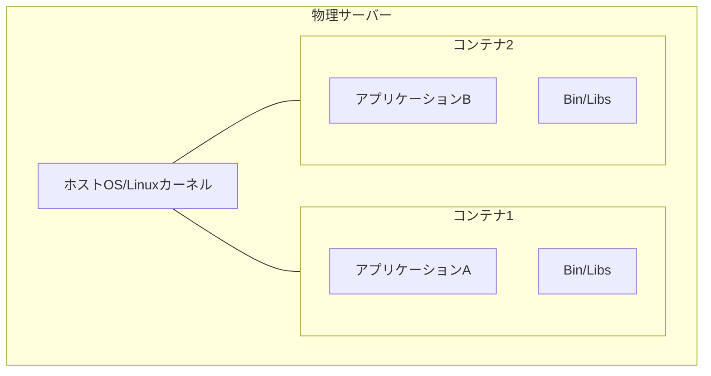
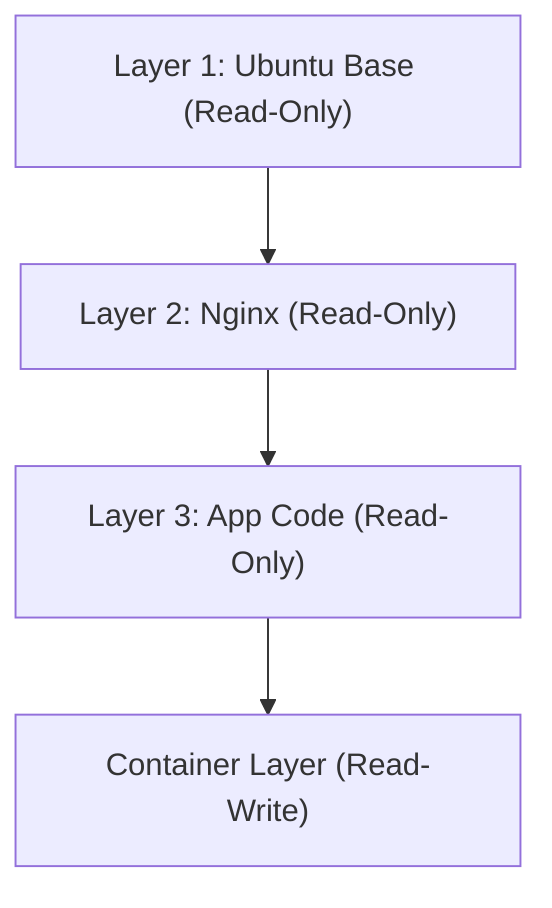

## 1. Introduction: The Transport Revolution in the Physical World and the Containerization of Software

In the world of software development, the term "container" has long been established, but to understand its true impact, we must first look at the history of the physical world. In the 1950s, an American entrepreneur named Malcolm McLean invented the "intermodal container" (shipping container), which fundamentally overturned global logistics and, by extension, the global economy itself.

Until then, freight transportation involved port workers manually loading cargo of various shapes and sizes, such as barrels, bags, and wooden crates, onto ships. This was known as break-bulk shipping, which was highly inefficient and often took weeks for cargo handling. The risks of damage and theft were also high, and transportation costs were enormous.

McLean invented the "container," a standardized steel box, and built a system to move cargo seamlessly between ships, trucks, and trains without having to repack it. This dramatically reduced cargo handling time and slashed transportation costs to a fraction of what they were. This logistics revolution enabled the construction of global supply chains and laid the foundation for today's advanced capitalist economy.

The emergence of Docker in the software world (2013) shares this exact same structure. In the past, deploying software required manually building different operating systems, libraries, and dependencies for development, testing, and production environments before placing the application. Like break-bulk shipping in the physical world, this caused inconsistencies between environments (the "it works on my machine" problem) and demanded an enormous amount of time and effort for deployment.

Docker provided a mechanism to package everything needed to run an application—code, runtime, system tools, system libraries, configuration files, etc.—into a single, standardized "container image." As a result, it became possible to run applications reliably in the exact same environment, whether on a developer's PC, an on-premises server, or a public cloud. This was not just a technical advancement, but a fundamental revolution in the "distribution" of software.

## 2. The Evolution of Virtualization Technology: From VMs to Containers

To deeply understand how container technology works, let us clarify the differences from traditional Virtual Machines (VMs). This difference stems from the philosophical divergence in "abstraction" and "resource isolation" in computer science.

### Hardware-Level Abstraction of Virtual Machines
VMs use a software layer called a hypervisor (such as VMware ESXi, Hyper-V, or KVM) to emulate the hardware resources of a physical server (CPU, memory, storage, network interfaces) and create multiple logical virtual hardware instances. On top of each VM, a full guest OS (like Linux or Windows) is installed, and applications run on top of it.

The biggest advantage of this approach is "strong isolation." Because emulation occurs at the hardware level, a kernel panic in one VM does not affect other VMs. It is also possible to run different operating systems (e.g., Linux and Windows) simultaneously on the same physical server.

However, from the perspective of "entropy" in physics, the VM architecture contains significant waste. This is because the overhead of the guest OS booting up, managing memory, and scheduling processes is unavoidable. A non-trivial percentage of the entire system's computational resources is consumed not by running applications, but by maintaining the "OS to run the OS" (the hypervisor).

### OS-Level Abstraction and Process Isolation of Containers
On the other hand, container technologies like Docker perform virtualization (isolation) at the "OS level" rather than the hardware level. Containers do not have a guest OS. All containers share the single host OS (Linux kernel) running on the physical server (or VM).

A container is essentially nothing more than a "highly isolated Linux process." This is achieved through the Linux kernel features `namespaces` and `cgroups` (control groups).

## 3. The Magic of Isolation: Namespaces and Cgroups

When container technology is technically dissected, it becomes clear that it is not magic, but a clever combination of features that have been accumulated in the Linux kernel over many years.

### Separation of "Worldlines" by Namespaces
Just as different dimensions or parallel worlds do not interfere with each other in physics, Linux `namespaces` restrict the "system resource visibility" perceived by a process, creating an independent virtual system environment. The main namespaces include the following:

1. **PID namespace**: Isolates the process ID space. A process inside a container is under the illusion that it is PID 1 (the first process in the system), but from the host OS, it appears as a regular process (e.g., PID 14532).
2. **Mount (mnt) namespace**: Isolates filesystem mount points. A container has its own dedicated root directory `/` and cannot peek into the host's filesystem or the filesystems of other containers. This can be seen as a modern evolution of the UNIX `chroot` introduced in 1979.
3. **Network (net) namespace**: Isolates network interfaces, IP addresses, and routing tables. Each container is assigned an independent virtual network device `veth`.
4. **UTS namespace**: Isolates the hostname and domain name.
5. **IPC namespace**: Isolates inter-process communication (such as shared memory).
6. **User namespace**: Isolates the user ID and group ID spaces. By mapping the root user (UID 0) inside the container to an unprivileged user on the host, security is dramatically improved.

### "Physical Restrictions" of Resources by Cgroups
If namespaces are the "isolation of visibility," `cgroups` (Control Groups) are the "restriction of physical laws." It is a kernel feature for setting limits, measuring, and controlling the usage of system resources (CPU time, memory usage, disk I/O bandwidth, network bandwidth, etc.).

Development of this feature, which began in 2006 by Google engineers (primarily Paul Menage and Rohit Seth), prevents a single container from exhausting the resources of the entire system (the Noisy Neighbor problem). This created the economic benefit of packing a large number of containers at high density (increasing the integration rate) onto limited physical servers.

## 4. Union File Systems and the Layered Structure of Images

Among Docker's innovations, what fascinated engineers the most was the "mechanism for building and distributing container images." Here, the concept of a "Union File System" such as OverlayFS or Aufs is key.

### The Aesthetics of Immutability and Differential Management
A container image is not a single huge file, but a structure where multiple "Read-Only layers" are stacked on top of each other.

For example, consider building a Web server:
1. Layer 1: Base OS environment (e.g., Ubuntu 22.04)
2. Layer 2: Installation of required packages (e.g., apt-get install nginx)
3. Layer 3: Copying application source code and configuration files

These layers are stored and cached independently of each other. When another container uses the same Ubuntu base image, the data of Layer 1 is shared on the disk and is not downloaded or stored redundantly. This realizes the DRY (Don't Repeat Yourself) principle of software engineering at the file system level.

When a container is started, a very thin "Read-Write container layer" is added to the top of these read-only layers. All file creation, modification, and deletion performed by the container while it is running are recorded exclusively in this Read-Write layer.

This is a strategy known as "Copy-on-Write (CoW)." When attempting to modify a file in a lower layer, the file is copied to the topmost Read-Write layer, where the changes are made. The original layer remains Immutable. Thanks to this architecture, container startup completes in milliseconds, and when the container is destroyed, all changes disappear, allowing it to always start fresh from a clean state.

## 5. Docker Architecture: Client and Daemon

Docker's system configuration adopts a client-server architecture.

1. **Docker Daemon (dockerd)**: A heavy process that continues to run in the background on the host OS. It handles all the heavy lifting, such as creating, starting, and stopping containers, building images, and managing networks.
2. **Docker Client (docker CLI)**: A command-line tool operated by the user. When a command like `docker run` or `docker build` is executed, the client sends instructions to the Docker Daemon via a REST API (Unix socket or TCP).
3. **Docker Registry**: A repository for container images. There are public registries like "Docker Hub" where developers worldwide share images, and private registries (such as Amazon ECR or Google Artifact Registry) to securely manage images within enterprises.

Because of this separation, the client can transparently operate not only the Daemon on the local machine but also Daemons on remote servers.

## 6. Container Orchestration and the Future of Distributed Systems

Docker was the perfect tool for running containers on a single host, but as microservices architectures became popular and organizations began operating thousands or tens of thousands of containers across clusters consisting of dozens or hundreds of servers (nodes), a new dimension of challenges emerged.

* "If a server fails, how can the containers on it be automatically restarted on another server?"
* "If traffic increases, how can the number of Web server containers be automatically scaled out?"
* "How do we connect countless containers across a network and load balance them?"

To solve these complex challenges, "container orchestration tools" emerged. The winner of this space was **Kubernetes (K8s)**, which was open-sourced based on the knowledge of Google's internal system "Borg."

If Docker is the "standardization of cargo into a single container," Kubernetes is the "control system of a massive, automated international port terminal." Kubernetes abstracts the entire infrastructure and provides it as a programmable API. Developers simply declare the "Desired State" (for example, always keeping three Nginx containers running) in a YAML file (manifest), and the Kubernetes control plane continuously monitors the current state of the system and autonomously adjusts it (Reconciliation).

## 7. Conclusion: The Paradigm Shift Driven by the Chain of Abstraction

From the physical phenomena of transistors to machine language, from assembly to high-level languages, and from physical servers to VMs. The history of computer science is a history of "abstraction." Container technology has completely packaged the OS execution environment and elevated the physical, messy domain of infrastructure into something completely described by software code and reproducible (Infrastructure as Code).

Today, the term cloud-native presupposes container technology. The world opened up by Docker and expanded by Kubernetes has reduced friction from development to operations to the absolute minimum, bringing about an environment where engineers worldwide can focus on their original purpose: "creating valuable software." Containers are more than just a technical tool; they are a true paradigm shift that fundamentally transformed the economic and organizational ecosystem of software development.
