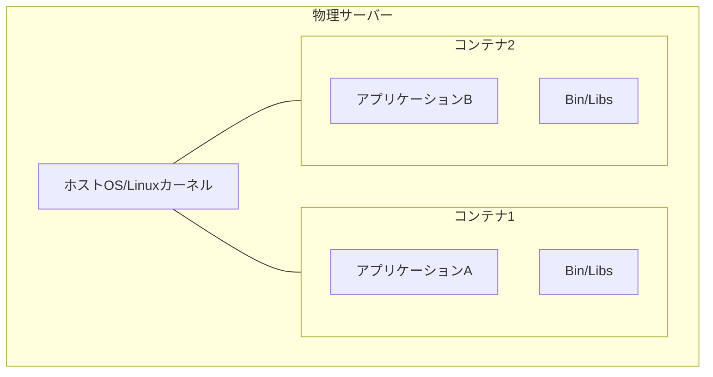
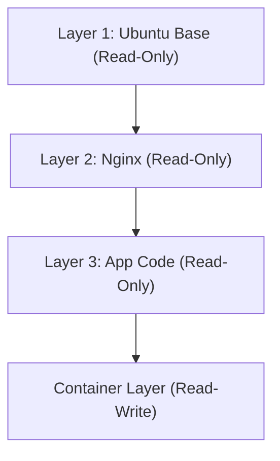

## 1. Introducción: La revolución del transporte en el mundo físico y la contenerización del software

En el mundo del desarrollo de software, hace tiempo que se ha consolidado el término "contenedor", pero para comprender su verdadero impacto, primero debemos mirar hacia la historia del mundo físico. En la década de 1950, el empresario estadounidense Malcom McLean inventó el "contenedor intermodal" (contenedor marítimo), lo cual revolucionó por completo la logística mundial y, por extensión, la economía global.

Antes de esto, el transporte de mercancías consistía en trabajadores portuarios cargando manualmente en los barcos carga de diferentes formas y tamaños, como barriles, sacos y cajas de madera. Esto se conocía como carga fraccionada (break bulk), lo cual era altamente ineficiente, y no era raro que las operaciones de carga y descarga tardaran semanas. Además, los riesgos de daños o robos eran altos, y los costos de transporte eran enormes.

McLean inventó el "contenedor", una caja de acero estandarizada, y creó un sistema para mover mercancías entre barcos, camiones y trenes sin necesidad de reempacar. Como resultado, el tiempo de manipulación de la carga se redujo drásticamente y los costos de transporte cayeron a una fracción de lo que eran. Esta revolución logística permitió la construcción de cadenas de suministro globales, sentando las bases de la avanzada economía capitalista actual.

La aparición de Docker en el mundo del software (en 2013) tiene exactamente el mismo patrón. Antiguamente, el despliegue de software implicaba construir manualmente diferentes sistemas operativos, bibliotecas y dependencias para los entornos de desarrollo, pruebas y producción, y luego desplegar la aplicación. Al igual que el transporte de carga fraccionada en el mundo físico, esto provocaba inconsistencias entre entornos (el infame problema de "en mi máquina funciona"), requiriendo cantidades masivas de tiempo y esfuerzo para el despliegue.

Docker proporcionó un mecanismo para empaquetar el código, el entorno de ejecución, las herramientas del sistema, las bibliotecas del sistema, los archivos de configuración y todo lo necesario para ejecutar una aplicación en una "imagen de contenedor" única y estandarizada. Gracias a esto, se hizo posible ejecutar aplicaciones de manera confiable en exactamente el mismo entorno, ya sea en la PC de un desarrollador, en un servidor local (on-premise) o en la nube pública. Esto no fue simplemente un avance técnico; fue una revolución fundamental en la "distribución" de software.

## 2. La evolución de la tecnología de virtualización: De las VM a los contenedores

Para comprender profundamente los mecanismos de la tecnología de contenedores, debemos aclarar las diferencias con la máquina virtual tradicional (Virtual Machine: VM). Esta diferencia surge de un contraste filosófico en la "abstracción" y el "aislamiento de recursos" dentro de la ingeniería de la información.

### Abstracción a nivel de hardware en máquinas virtuales

Las VM utilizan una capa de software llamada hipervisor (como VMware ESXi, Hyper-V o KVM) para emular los recursos de hardware de un servidor físico (CPU, memoria, almacenamiento, interfaces de red) y crear múltiples hardware virtuales lógicos. Sobre cada VM se instala un sistema operativo invitado completo (Guest OS, como Linux o Windows), sobre el cual se ejecutan las aplicaciones.

La mayor ventaja de este enfoque es el "fuerte aislamiento". Dado que la emulación ocurre a nivel de hardware, si ocurre un kernel panic en una VM, no afectará a las otras VM. También es posible ejecutar diferentes sistemas operativos (como Linux y Windows) simultáneamente en el mismo servidor físico.

Sin embargo, desde la perspectiva de la "entropía" en la física, existe un gran desperdicio en la arquitectura de las VM. Esto se debe a que la sobrecarga del SO invitado al iniciarse, administrar la memoria y programar los procesos es inevitable. Una proporción no despreciable de los recursos computacionales de todo el sistema se consume no en ejecutar la aplicación, sino en mantener el "sistema operativo para ejecutar sistemas operativos" (hipervisor).

### Abstracción a nivel de SO y aislamiento de procesos en contenedores

Por otro lado, la tecnología de contenedores representada por Docker realiza la virtualización (aislamiento) a "nivel de SO" en lugar de a nivel de hardware. Los contenedores no tienen un SO invitado. Un solo SO anfitrión (kernel de Linux) que se ejecuta en el servidor físico (o VM) es compartido por todos los contenedores.

Un contenedor es, en esencia, simplemente "un proceso de Linux altamente aislado". Esto se logra a través de las funciones del kernel de Linux: `namespaces` (espacios de nombres) y `cgroups` (grupos de control).

## 3. La magia de la separación: Namespaces y Cgroups

Al diseccionar técnicamente la tecnología de contenedores, nos damos cuenta de que no es magia, sino una ingeniosa combinación de características que se han acumulado en el kernel de Linux durante muchos años.

### "Separación de líneas temporales (mundos)" mediante Namespaces

Al igual que en la física las diferentes dimensiones o mundos paralelos no interfieren entre sí, los `namespaces` de Linux restringen la "visibilidad de los recursos del sistema" que reconoce un proceso, creando un entorno de sistema virtual e independiente. Los principales namespaces incluyen los siguientes:

1. **PID namespace**: Aísla el espacio de ID de procesos. Un proceso dentro de un contenedor tiene la ilusión de ser el PID 1 (el primer proceso del sistema), pero desde la perspectiva del SO anfitrión, se ve como un proceso normal (por ejemplo, PID 14532).
2. **Mount (mnt) namespace**: Aísla los puntos de montaje del sistema de archivos. El contenedor tiene su propio directorio raíz exclusivo `/` y no puede echar un vistazo al sistema de archivos del anfitrión ni a los de otros contenedores. Esto puede considerarse una evolución moderna del comando `chroot` de UNIX, que apareció en 1979.
3. **Network (net) namespace**: Aísla las interfaces de red, las direcciones IP y las tablas de enrutamiento. A cada contenedor se le asigna un dispositivo de red virtual independiente llamado `veth`.
4. **UTS namespace**: Aísla el nombre del host (hostname) y el nombre de dominio.
5. **IPC namespace**: Aísla la comunicación entre procesos (como la memoria compartida).
6. **User namespace**: Aísla el espacio de los ID de usuario y los ID de grupo. Mejora drásticamente la seguridad al mapear al usuario root dentro del contenedor (UID 0) a un usuario sin privilegios en el anfitrión.

### "Límites físicos de recursos" mediante Cgroups

Si los namespaces son el "aislamiento de la visibilidad", los `cgroups` (Control Groups) son las "restricciones de las leyes de la física". Es una función del kernel para establecer límites, medir y controlar el uso de los recursos del sistema (tiempo de CPU, uso de memoria, ancho de banda de E/S de disco, ancho de banda de red, etc.).

Esta característica, cuyo desarrollo fue iniciado por ingenieros de Google (principalmente Paul Menage y Rohit Seth) en 2006, evita que un solo contenedor consuma todos los recursos del sistema (el problema del "Vecino Ruidoso" o Noisy Neighbor). A través de esto, se generó el beneficio económico de poder empaquetar una gran cantidad de contenedores con alta densidad (aumentar la tasa de consolidación) en un servidor físico limitado.

## 4. Union File System y la estructura de capas de las imágenes

Entre las innovaciones de Docker, lo que más fascinó a los ingenieros fue "el mecanismo para la construcción y distribución de imágenes de contenedores". Aquí, el concepto clave es el "Union File System" (sistema de archivos de unión), como OverlayFS y Aufs.

### La estética de la inmutabilidad y la gestión de diferencias (deltas)

Una imagen de contenedor no es un archivo único y monolítico, sino que tiene una estructura donde se apilan múltiples "capas de solo lectura" (Read-Only layers).

Por ejemplo, consideremos el caso de construir un servidor web.
1. Primera capa: El entorno de SO base (ej. Ubuntu 22.04)
2. Segunda capa: La instalación de los paquetes necesarios (ej. apt-get install nginx)
3. Tercera capa: La copia del código fuente de la aplicación y de los archivos de configuración

Estas capas se almacenan y se almacenan en caché de forma independiente unas de otras. Si se utiliza la misma imagen base de Ubuntu en otro contenedor, los datos de la primera capa se comparten en el disco y no se descargan ni se guardan por duplicado. Esto es la realización del principio DRY (Don't Repeat Yourself, "No te repitas") en la ingeniería de software a nivel del sistema de archivos.

Al iniciar un contenedor, se añade una "capa de contenedor de lectura y escritura" (Read-Write layer) muy delgada en la parte superior de estas capas de solo lectura. Toda la creación, modificación y eliminación de archivos que el contenedor realiza mientras se ejecuta se registra únicamente en esta capa de lectura y escritura.

Esta es una estrategia llamada "Copiar al escribir" (Copy-on-Write: CoW). Cuando se intenta modificar un archivo en las capas inferiores, ese archivo se copia a la capa de lectura y escritura en la parte superior, donde se realiza el cambio. La capa original se mantiene inmutable (Immutable). Gracias a esta arquitectura, el inicio de un contenedor se completa en milisegundos y, si el contenedor se destruye, todos los cambios desaparecen, permitiendo siempre un reinicio desde un estado limpio.

## 5. La arquitectura de Docker: Cliente y Demonio (Daemon)

La configuración del sistema de Docker adopta una arquitectura cliente-servidor.

1. **Docker Daemon (dockerd)**: Es un proceso robusto que se ejecuta de forma continua en segundo plano en el SO anfitrión. Se encarga de todo el trabajo pesado, como la creación, inicio y detención de contenedores, la construcción de imágenes y la gestión de redes.
2. **Docker Client (docker CLI)**: Es la herramienta de línea de comandos operada por el usuario. Cuando se escriben comandos como `docker run` o `docker build`, el cliente envía instrucciones al Docker Daemon a través de una API REST (sockets Unix o TCP).
3. **Docker Registry**: Es el repositorio o almacén de las imágenes de contenedores. Existen registros públicos como "Docker Hub", donde desarrolladores de todo el mundo comparten imágenes, y registros privados (como Amazon ECR, Google Artifact Registry, etc.) que gestionan las imágenes de forma segura dentro de las empresas.

Gracias a esta separación, el cliente puede operar de manera transparente no solo el Daemon en la máquina local, sino también Daemons alojados en servidores remotos.

## 6. La orquestación de contenedores y el futuro de los sistemas distribuidos

Docker era la herramienta perfecta para ejecutar contenedores en un solo host, pero a medida que la arquitectura de microservicios se popularizó y comenzaron a operarse miles o decenas de miles de contenedores sobre un clúster compuesto por docenas o cientos de servidores (nodos), surgieron desafíos de una nueva dimensión.

* "¿Cómo reiniciar automáticamente los contenedores en otro servidor si un servidor falla?"
* "¿Cómo escalar horizontalmente (scale out) automáticamente el número de contenedores del servidor web si aumenta el tráfico?"
* "¿Cómo conectar en red innumerables contenedores entre sí y distribuir la carga (balanceo de carga)?"

Para resolver estos problemas complejos, surgieron las "herramientas de orquestación de contenedores". El líder indiscutible en este ámbito se convirtió en **Kubernetes (K8s)**, el cual se hizo de código abierto basándose en el conocimiento del sistema interno de Google llamado "Borg".

Si Docker es "la estandarización de la carga como un solo contenedor", Kubernetes es "el sistema de control de una gigantesca terminal portuaria internacional automatizada". Kubernetes abstrae toda la infraestructura y la proporciona como una API programable. Los desarrolladores simplemente declaran el "Estado Deseado" (Desired State, por ejemplo: mantener siempre 3 contenedores de Nginx en ejecución) en un archivo YAML (manifiesto), y el plano de control (control plane) de Kubernetes monitoreará continuamente el estado actual del sistema y ajustará de manera autónoma el estado (Reconciliación o Reconciliation).

## 7. Conclusión: El cambio de paradigma liderado por una cadena de abstracciones

De los fenómenos físicos de los transistores al lenguaje de máquina, del ensamblador a los lenguajes de alto nivel, y de los servidores físicos a las VM; la historia de la informática es la historia de la "abstracción". La tecnología de contenedores ha empaquetado completamente el entorno de ejecución del SO y ha elevado el dominio físico y engorroso de la infraestructura a algo que puede escribirse completamente en código como software y de manera reproducible (Infrastructure as Code).

Hoy en día, el término "nativo de la nube" (cloud native) presupone el uso de la tecnología de contenedores. Este mundo, abierto por Docker y expandido por Kubernetes, ha reducido al mínimo la fricción desde el desarrollo hasta la operación, y ha brindado un entorno donde los ingenieros de todo el mundo pueden centrarse en su verdadero propósito: "la creación de software de valor". Los contenedores van más allá de ser una mera herramienta técnica; representan un verdadero cambio de paradigma que ha transformado radicalmente el ecosistema económico y organizativo del desarrollo de software.
