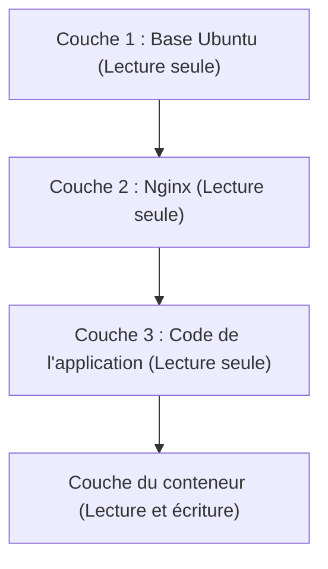

## 1. Introduction : La révolution du transport dans le monde physique et la conteneurisation des logiciels

Dans le monde du développement logiciel, le terme « conteneur » est établi depuis longtemps, mais pour comprendre son véritable impact, il faut d'abord se tourner vers l'histoire du monde physique. Dans les années 1950, l'entrepreneur américain Malcolm McLean a inventé le « conteneur intermodal » (conteneur maritime), qui a fondamentalement bouleversé la logistique mondiale et, par extension, l'économie mondiale elle-même.

Jusqu'alors, le transport de marchandises reposait sur des dockers qui chargeaient manuellement des cargaisons de formes et de tailles diverses (tonneaux, sacs, caisses en bois) sur des navires. Connu sous le nom de transport de marchandises diverses (breakbulk), ce processus était extrêmement inefficace, et il n'était pas rare que les opérations de manutention prennent plusieurs semaines. De plus, les risques de dommages et de vols étaient élevés, et les coûts de transport étaient astronomiques.

McLean a inventé le « conteneur », une boîte en acier standardisée, et a mis en place un système permettant de déplacer la cargaison sans la transborder entre les navires, les camions et les trains. En conséquence, le temps de manutention a été considérablement réduit et les coûts de transport ont chuté de façon spectaculaire. Cette révolution logistique a permis la construction de chaînes d'approvisionnement mondiales et a jeté les bases de l'économie capitaliste avancée d'aujourd'hui.

L'avènement de Docker (2013) dans le monde logiciel présente exactement la même structure. Autrefois, le déploiement de logiciels nécessitait de configurer manuellement différents systèmes d'exploitation, bibliothèques et dépendances pour les environnements de développement, de test et de production, avant d'y placer l'application. Tout comme le transport de marchandises diverses dans le monde physique, cela provoquait des incohérences entre les environnements (le fameux problème du « ça marchait sur ma machine ») et nécessitait énormément de temps et d'efforts pour le déploiement.

Docker a fourni un mécanisme permettant d'empaqueter tout ce qui est nécessaire à l'exécution d'une application (code, runtime, outils système, bibliothèques système, fichiers de configuration, etc.) dans une seule « image de conteneur » standardisée. Grâce à cela, il est devenu possible de faire fonctionner des applications de manière fiable dans un environnement strictement identique, que ce soit sur le PC du développeur, sur un serveur sur site (on-premise) ou sur un cloud public. Il ne s'agissait pas seulement d'une avancée technique, mais d'une révolution fondamentale dans la « distribution » des logiciels.

## 2. Théorie de l'évolution des technologies de virtualisation : des machines virtuelles (VM) aux conteneurs

Pour comprendre en profondeur le fonctionnement de la technologie des conteneurs, clarifions d'abord ses différences avec les machines virtuelles (VM) traditionnelles. Cette différence découle des philosophies divergentes d'« abstraction » et d'« isolation des ressources » en informatique.

### Abstraction au niveau matériel des machines virtuelles
Une VM utilise une couche logicielle appelée hyperviseur (VMware ESXi, Hyper-V, KVM, etc.) pour émuler les ressources matérielles d'un serveur physique (CPU, mémoire, stockage, interfaces réseau) et créer plusieurs matériels virtuels logiques. Sur chaque VM, un système d'exploitation invité (Guest OS) complet (comme Linux ou Windows) est installé, sur lequel les applications s'exécutent.

Le principal avantage de cette approche est sa « forte isolation » (Isolation). L'émulation se produisant au niveau matériel, une panique du noyau (kernel panic) sur une VM n'affecte pas les autres. Il est également possible de faire fonctionner simultanément différents systèmes d'exploitation (par exemple, Linux et Windows) sur le même serveur physique.

Cependant, du point de vue de l'« entropie » en physique, l'architecture des VM présente un gaspillage important. L'OS invité doit lui-même démarrer, gérer la mémoire et planifier les processus, ce qui génère une surcharge (overhead) inévitable. Une proportion non négligeable des ressources de calcul du système global est consommée non pas pour l'exécution d'applications, mais pour maintenir « un OS afin de faire tourner un OS » (l'hyperviseur).

### Abstraction au niveau de l'OS et isolation des processus des conteneurs
D'autre part, la technologie des conteneurs, représentée par Docker, effectue la virtualisation (isolation) non pas au niveau matériel, mais au niveau de l'« OS ». Les conteneurs n'ont pas d'OS invité. Tous les conteneurs partagent un seul et unique OS hôte (le noyau Linux) fonctionnant sur le serveur physique (ou sur une VM).

Un conteneur n'est fondamentalement rien d'autre qu'« un simple processus Linux hautement isolé ». Ceci est rendu possible par les fonctionnalités du noyau Linux appelées `namespaces` (espaces de noms) et `cgroups` (groupes de contrôle).

```mermaid
graph TD
    subgraph Serveur physique
        OS["OS hôte / Noyau Linux"]
        subgraph Conteneur 1
            App1["Application A"]
            Bin1["Bin/Libs"]
        end
        subgraph Conteneur 2
            App2["Application B"]
            Bin2["Bin/Libs"]
        end
        OS --- Conteneur 1
        OS --- Conteneur 2
    end
```

## 3. La magie de la séparation : Namespaces et Cgroups

En décortiquant techniquement la technologie des conteneurs, on s'aperçoit qu'il ne s'agit pas de magie, mais d'une combinaison ingénieuse de fonctionnalités accumulées pendant de nombreuses années dans le noyau Linux.

### Namespaces : la « séparation des lignes d'univers »
Tout comme en physique où différentes dimensions ou mondes parallèles n'interfèrent pas entre eux, les `namespaces` de Linux limitent le « champ de vision des ressources système » perçu par les processus, créant ainsi des environnements système virtuels indépendants. Les principaux namespaces incluent :

1. **PID namespace** : Isole l'espace des identifiants de processus. Un processus à l'intérieur d'un conteneur a l'illusion d'être le PID 1 (le premier processus du système), mais vu depuis l'OS hôte, il apparaît comme un processus ordinaire (par exemple, PID 14532).
2. **Mount (mnt) namespace** : Isole les points de montage du système de fichiers. Chaque conteneur possède son propre répertoire racine `/` et ne peut pas examiner le système de fichiers de l'hôte ni celui des autres conteneurs. On peut y voir l'évolution moderne du `chroot` d'UNIX apparu en 1979.
3. **Network (net) namespace** : Isole les interfaces réseau, les adresses IP et les tables de routage. Chaque conteneur se voit attribuer un périphérique réseau virtuel indépendant, `veth`.
4. **UTS namespace** : Isole le nom d'hôte (hostname) et le nom de domaine.
5. **IPC namespace** : Isole la communication inter-processus (comme la mémoire partagée).
6. **User namespace** : Isole l'espace des identifiants d'utilisateurs (UID) et de groupes (GID). Il améliore considérablement la sécurité en mappant l'utilisateur root (UID 0) à l'intérieur du conteneur à un utilisateur non privilégié sur l'hôte.

### Cgroups : la « limitation physique des ressources »
Si les namespaces représentent une « isolation de la vision », les `cgroups` (Control Groups) sont une « limitation des lois de la physique ». Il s'agit d'une fonctionnalité du noyau qui permet de définir des limites, de mesurer et de contrôler l'utilisation des ressources système (temps CPU, utilisation de la mémoire, bande passante des E/S disque, bande passante réseau, etc.).

Le développement de cette fonctionnalité, initié en 2006 par des ingénieurs de Google (principalement Paul Menage et Rohit Seth), empêche un seul conteneur de monopoliser les ressources de tout le système (le problème du voisin bruyant ou "Noisy Neighbor"). Cela a généré un avantage économique en permettant de regrouper un grand nombre de conteneurs à haute densité (augmentation du taux d'intégration) sur des serveurs physiques limités.

## 4. Union File System et structure en couches des images

Parmi les innovations de Docker, ce qui a le plus fasciné les ingénieurs est « le mécanisme de construction et de distribution des images de conteneurs ». Le concept de « système de fichiers en union » (Union File System) tel que OverlayFS ou Aufs est ici essentiel.

### L'esthétique de l'immuabilité et de la gestion des différences
Une image de conteneur n'est pas un fichier unique et massif, mais possède une structure où s'empilent de multiples « couches en lecture seule » (Read-Only).

Prenons l'exemple de la construction d'un serveur Web :
1. Couche 1 : L'environnement de l'OS de base (ex. : Ubuntu 22.04)
2. Couche 2 : L'installation des paquets nécessaires (ex. : apt-get install nginx)
3. Couche 3 : La copie du code source de l'application et des fichiers de configuration

Ces couches sont enregistrées et mises en cache indépendamment les unes des autres. Si un autre conteneur utilise la même image de base Ubuntu, les données de la première couche sont partagées sur le disque, évitant ainsi un téléchargement ou un stockage redondant. C'est la concrétisation du principe DRY (Don't Repeat Yourself) de l'ingénierie logicielle au niveau du système de fichiers.



Lorsqu'un conteneur est lancé, une très fine « couche de conteneur en lecture et écriture » (Read-Write) est ajoutée au sommet de ces couches en lecture seule. Toutes les créations, modifications et suppressions de fichiers effectuées par le conteneur en cours d'exécution sont enregistrées uniquement dans cette couche Read-Write.

Il s'agit de la stratégie du « Copy-on-Write » (CoW). Lorsque l'on tente de modifier un fichier d'une couche inférieure, ce fichier est copié vers la couche Read-Write supérieure, où la modification est appliquée. La couche d'origine reste immuable (Immutable). Grâce à cette architecture, le démarrage d'un conteneur s'effectue en quelques millisecondes ; si le conteneur est détruit, toutes les modifications disparaissent, permettant de toujours repartir d'un état propre.

## 5. Architecture de Docker : Client et Démon

L'architecture du système Docker repose sur un modèle client-serveur.

1. **Docker Daemon (dockerd)** : Un processus lourd qui fonctionne en permanence en arrière-plan sur l'OS hôte. Il prend en charge toutes les tâches lourdes telles que la création, le démarrage, l'arrêt des conteneurs, la construction des images et la gestion du réseau.
2. **Docker Client (docker CLI)** : L'outil en ligne de commande utilisé par les utilisateurs. Lorsque l'on tape des commandes telles que `docker run` ou `docker build`, le client envoie des instructions au Docker Daemon via une API REST (sockets Unix ou TCP).
3. **Docker Registry** : L'entrepôt des images de conteneurs. Il existe des registres publics où les développeurs du monde entier partagent des images, comme « Docker Hub », et des registres privés (Amazon ECR, Google Artifact Registry, etc.) permettant de gérer les images en toute sécurité au sein des entreprises.

Cette séparation permet au client de manipuler de manière transparente non seulement le démon de la machine locale, mais aussi les démons situés sur des serveurs distants.

## 6. Orchestration de conteneurs et avenir des systèmes distribués

Si Docker était l'outil parfait pour faire tourner des conteneurs sur un seul hôte, la popularisation de l'architecture microservices et la nécessité de gérer des milliers, voire des dizaines de milliers de conteneurs sur des clusters composés de dizaines ou centaines de serveurs (nœuds) ont fait émerger de nouveaux défis majeurs.

* « Si un serveur tombe en panne, comment redémarrer automatiquement ses conteneurs sur un autre serveur ? »
* « En cas de pic de trafic, comment augmenter automatiquement (scale-out) le nombre de conteneurs du serveur Web ? »
* « Comment connecter sur le réseau ces innombrables conteneurs entre eux et équilibrer la charge (load balancing) ? »

Pour résoudre ces problèmes complexes, les « outils d'orchestration de conteneurs » sont apparus. Le champion incontesté dans ce domaine est devenu **Kubernetes (K8s)**, rendu open source à partir de l'expertise acquise par le système interne de Google, « Borg ».

Si Docker représente la « standardisation du fret sous forme d'un conteneur unique », Kubernetes est le « système de contrôle massif et automatisé d'un terminal portuaire international ». Kubernetes abstrait l'ensemble de l'infrastructure et l'expose via des API programmables. Les développeurs n'ont qu'à déclarer l'« état souhaité » (Desired State : par exemple, maintenir en permanence 3 conteneurs Nginx en cours d'exécution) dans un fichier YAML (manifeste), et le plan de contrôle (Control Plane) de Kubernetes surveille en continu l'état actuel du système, procédant de manière autonome à des ajustements (Reconciliation).

## 7. Conclusion : Le changement de paradigme induit par une chaîne d'abstractions

Des phénomènes physiques des transistors au langage machine, de l'assembleur aux langages de haut niveau, et des serveurs physiques aux VM. L'histoire de l'informatique est une histoire d'« abstraction ». La technologie des conteneurs a complètement encapsulé l'environnement d'exécution de l'OS, sublimant le domaine physique et laborieux de l'infrastructure pour en faire un environnement entièrement descriptible sous forme de code logiciel, le rendant ainsi reproductible (Infrastructure as Code).

Aujourd'hui, l'expression « Cloud Native » présuppose l'utilisation de la technologie des conteneurs. Ce monde ouvert par Docker et étendu par Kubernetes a réduit au minimum les frictions entre le développement et l'exploitation, offrant un environnement où les ingénieurs du monde entier peuvent se concentrer sur leur véritable objectif : « créer des logiciels de valeur ». Les conteneurs sont bien plus qu'un simple outil technologique ; ils constituent un véritable changement de paradigme qui a fondamentalement transformé l'écosystème économique et organisationnel du développement logiciel.
