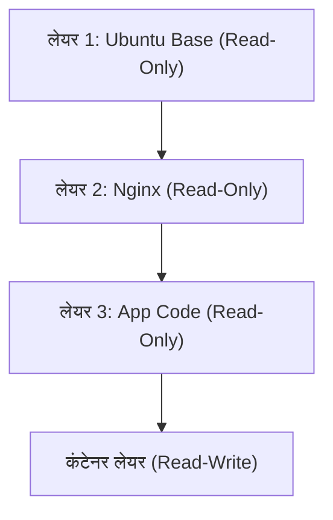

## 1. परिचय: भौतिक दुनिया की परिवहन क्रांति और सॉफ्टवेयर का कंटेनरीकरण

सॉफ्टवेयर विकास की दुनिया में, 'कंटेनर' शब्द काफी समय से स्थापित है, लेकिन इसके वास्तविक प्रभाव को समझने के लिए, हमें सबसे पहले भौतिक दुनिया के इतिहास पर नज़र डालने की आवश्यकता है। 1950 के दशक में, मैल्कम मैकलीन नामक एक अमेरिकी व्यवसायी द्वारा आविष्कृत 'इंटरमोडल कंटेनर (समुद्री कंटेनर)' ने वैश्विक लॉजिस्टिक्स, और अंततः पूरी वैश्विक अर्थव्यवस्था को मौलिक रूप से बदल दिया।

उस समय तक माल ढुलाई में, बंदरगाह के कर्मचारी मैन्युअल रूप से बैरल, बैग और लकड़ी के बक्से जैसे विभिन्न आकार और साइज़ के माल को जहाजों पर लोड करते थे। इसे ब्रेकबल्क शिपिंग कहा जाता था, जो अत्यधिक अक्षम था, और लोडिंग तथा अनलोडिंग कार्यों में कई सप्ताह लगना असामान्य नहीं था। इसके अलावा, क्षति और चोरी का जोखिम भी अधिक था, और परिवहन लागत बहुत अधिक थी।

मैकलीन ने 'कंटेनर' का आविष्कार किया, जो एक मानकीकृत लोहे का बॉक्स था, और एक ऐसी प्रणाली का निर्माण किया जो जहाज, ट्रक और ट्रेन के बीच माल को बिना फिर से पैक किए स्थानांतरित करने की अनुमति देती थी। परिणामस्वरूप, कार्गो हैंडलिंग का समय नाटकीय रूप से कम हो गया और परिवहन लागत घटकर पहले के मुकाबले काफी कम हो गई। इस लॉजिस्टिक्स क्रांति ने वैश्विक आपूर्ति श्रृंखला के निर्माण को संभव बनाया, और आज की उन्नत पूंजीवादी अर्थव्यवस्था की नींव रखी।

सॉफ्टवेयर की दुनिया में Docker का आगमन (2013 में) बिल्कुल इसी पैटर्न का अनुसरण करता है। अतीत में सॉफ्टवेयर की तैनाती में, विकास परिवेश, परीक्षण परिवेश, और उत्पादन परिवेश को मैन्युअल रूप से अलग-अलग OS, लाइब्रेरी और निर्भरताओं के साथ कॉन्फ़िगर किया जाता था, और एप्लिकेशन तैनात किए जाते थे। भौतिक दुनिया के ब्रेकबल्क शिपिंग की तरह, इससे वातावरण के बीच विसंगतियां पैदा हुईं ('यह मेरी मशीन पर काम कर रहा था' समस्या), और तैनाती में भारी मात्रा में समय और प्रयास की आवश्यकता होती थी।

Docker ने एक ऐसा तंत्र प्रदान किया जो एप्लिकेशन को चलाने के लिए आवश्यक कोड, रनटाइम, सिस्टम टूल, सिस्टम लाइब्रेरी और कॉन्फ़िगरेशन फ़ाइलों जैसी सभी चीजों को एक मानकीकृत 'कंटेनर इमेज' में पैकेज करता है। इसके साथ, एप्लिकेशंस को बिल्कुल उसी वातावरण में विश्वसनीय रूप से चलाना संभव हो गया, चाहे वह डेवलपर के पीसी पर हो, ऑन-प्रिमाइसेस सर्वर पर हो, या सार्वजनिक क्लाउड पर हो। यह केवल एक तकनीकी प्रगति नहीं थी, बल्कि सॉफ्टवेयर के 'वितरण' में एक मौलिक क्रांति थी।

## 2. वर्चुअलाइजेशन तकनीक का विकास: VM से कंटेनर तक

कंटेनर तकनीक के तंत्र को गहराई से समझने के लिए, आइए हम पारंपरिक वर्चुअल मशीन (Virtual Machine: VM) के साथ इसके अंतर को स्पष्ट करें। यह अंतर सूचना इंजीनियरिंग में 'अमूर्तीकरण' (Abstraction) और 'संसाधन अलगाव' (Resource Isolation) के दर्शन के अंतर से उत्पन्न होता है।

### वर्चुअल मशीन का हार्डवेयर-स्तरीय अमूर्तीकरण

VM, हाइपरवाइज़र (जैसे VMware ESXi, Hyper-V, KVM) नामक सॉफ़्टवेयर की एक परत का उपयोग करके, भौतिक सर्वर के हार्डवेयर संसाधनों (CPU, मेमोरी, स्टोरेज, नेटवर्क इंटरफेस) का अनुकरण (Emulate) करता है, और कई तार्किक वर्चुअल हार्डवेयर बनाता है। प्रत्येक VM के ऊपर, एक पूर्ण गेस्ट OS (जैसे लिनक्स या विंडोज़) स्थापित होता है, और उस पर एप्लिकेशन चलता है।

इस दृष्टिकोण का सबसे बड़ा लाभ 'मजबूत अलगाव (Isolation)' है। चूँकि अनुकरण हार्डवेयर स्तर पर किया जाता है, एक VM में होने वाला कर्नेल पैनिक (Kernel Panic) अन्य VM को प्रभावित नहीं करता है। एक ही भौतिक सर्वर पर एक साथ विभिन्न OS (जैसे लिनक्स और विंडोज़) चलाना भी संभव है।

हालांकि, भौतिकी में 'एन्ट्रोपी' के दृष्टिकोण से देखा जाए, तो VM आर्किटेक्चर में एक महत्वपूर्ण बर्बादी मौजूद है। ऐसा इसलिए है क्योंकि गेस्ट OS के स्वयं के बूट होने, मेमोरी प्रबंधित करने, और प्रक्रियाओं को शेड्यूल करने का ओवरहेड अपरिहार्य है। पूरे सिस्टम के कम्प्यूटेशनल संसाधनों का एक बड़ा हिस्सा एप्लिकेशनों को निष्पादित करने के बजाय 'OS को चलाने वाले OS (हाइपरवाइज़र)' को बनाए रखने में खपत हो जाता है।

### कंटेनर का OS-स्तरीय अमूर्तीकरण और प्रक्रिया अलगाव

दूसरी ओर, Docker द्वारा प्रतिनिधित्व की जाने वाली कंटेनर तकनीक, हार्डवेयर स्तर के बजाय 'OS स्तर' पर वर्चुअलाइजेशन (अलगाव) करती है। कंटेनर में कोई गेस्ट OS नहीं होता है। भौतिक सर्वर (या VM) पर चल रहे एकमात्र होस्ट OS (लिनक्स कर्नेल) को सभी कंटेनरों द्वारा साझा किया जाता है।

कंटेनर अनिवार्य रूप से केवल एक 'अत्यधिक पृथक लिनक्स प्रक्रिया' है। इसे लिनक्स कर्नेल की विशेषताओं, `namespaces` (नेमस्पेस) और `cgroups` (कंट्रोल ग्रुप्स) के माध्यम से प्राप्त किया जाता है।

```mermaid
graph TD
    subgraph भौतिक सर्वर
        OS["होस्ट OS/लिनक्स कर्नेल"]
        subgraph कंटेनर 1
            App1["एप्लिकेशन A"]
            Bin1["Bin/Libs"]
        end
        subgraph कंटेनर 2
            App2["एप्लिकेशन B"]
            Bin2["Bin/Libs"]
        end
        OS --- कंटेनर 1
        OS --- कंटेनर 2
    end
```

## 3. अलगाव का जादू: Namespaces और Cgroups

यदि हम तकनीकी दृष्टिकोण से कंटेनर तकनीक का विश्लेषण करें, तो हम पाएंगे कि यह कोई जादू नहीं है, बल्कि यह लिनक्स कर्नेल में वर्षों से संचित सुविधाओं का एक चतुर संयोजन है।

### Namespaces के माध्यम से 'विश्व रेखाओं (Worldlines) का पृथक्करण'

भौतिकी में, जैसे विभिन्न आयाम और समानांतर दुनिया एक-दूसरे के साथ हस्तक्षेप नहीं करते हैं, वैसे ही लिनक्स के `namespaces` उस 'सिस्टम संसाधनों की दृश्यता' को सीमित करते हैं जिसे कोई प्रक्रिया पहचान सकती है, और एक स्वतंत्र आभासी सिस्टम वातावरण बनाते हैं। मुख्य namespaces में निम्नलिखित शामिल हैं:

1. **PID namespace**: यह प्रोसेस आईडी स्पेस को पृथक करता है। कंटेनर के भीतर की प्रक्रिया को यह भ्रम होता है कि वह PID 1 (सिस्टम की पहली प्रक्रिया) है, लेकिन होस्ट OS से यह एक सामान्य प्रक्रिया (उदाहरण के लिए, PID 14532) के रूप में दिखाई देती है।
2. **Mount (mnt) namespace**: यह फ़ाइल सिस्टम के माउंट पॉइंट्स को पृथक करता है। कंटेनर की अपनी विशिष्ट रूट डायरेक्टरी `/` होती है, और यह होस्ट के फ़ाइल सिस्टम या अन्य कंटेनरों के फ़ाइल सिस्टम में नहीं झांक सकता। इसे 1979 में पेश किए गए UNIX के `chroot` का आधुनिक विकास कहा जा सकता है।
3. **Network (net) namespace**: यह नेटवर्क इंटरफेस, आईपी एड्रेस और रूटिंग टेबल को पृथक करता है। प्रत्येक कंटेनर को एक स्वतंत्र वर्चुअल नेटवर्क डिवाइस `veth` असाइन किया जाता है।
4. **UTS namespace**: यह होस्टनेम (hostname) और डोमेन नाम को पृथक करता है।
5. **IPC namespace**: यह इंटर-प्रोसेस संचार (जैसे शेयर्ड मेमोरी) को पृथक करता है।
6. **User namespace**: यह यूजर आईडी और ग्रुप आईडी के स्पेस को पृथक करता है। कंटेनर के भीतर रूट यूजर (UID 0) को होस्ट पर एक गैर-विशेषाधिकार प्राप्त यूजर के साथ मैप करके, यह सुरक्षा में उल्लेखनीय रूप से सुधार करता है।

### Cgroups के माध्यम से 'संसाधनों का भौतिक प्रतिबंध'

यदि namespaces 'दृष्टि का अलगाव' हैं, तो `cgroups` (Control Groups) 'भौतिकी के नियमों का प्रतिबंध' हैं। यह सिस्टम संसाधनों (CPU समय, मेमोरी उपयोग, डिस्क I/O बैंडविड्थ, नेटवर्क बैंडविड्थ, आदि) के उपयोग पर सीमाएं निर्धारित करने, मापने और नियंत्रित करने के लिए एक कर्नेल सुविधा है।

2006 में Google के इंजीनियरों (मुख्य रूप से पॉल मेनज और रोहित सेठ) द्वारा विकसित की गई यह सुविधा किसी एक कंटेनर को पूरे सिस्टम के संसाधनों का उपभोग करने (नॉइज़ी नेबर (Noisy Neighbor) समस्या) से रोकती है। इससे एक सीमित भौतिक सर्वर पर उच्च घनत्व के साथ बड़ी संख्या में कंटेनरों को पैक करने (एकीकरण दर बढ़ाने) का आर्थिक लाभ उत्पन्न हुआ।

## 4. यूनियन फ़ाइल सिस्टम और इमेज लेयर संरचना

Docker के नवाचारों में से, जिस चीज ने इंजीनियरों को सबसे ज्यादा आकर्षित किया, वह 'कंटेनर इमेज बनाने और वितरित करने का तंत्र' है। यहाँ, 'यूनियन फ़ाइल सिस्टम (Union File System)' जैसे OverlayFS और Aufs की अवधारणा महत्वपूर्ण है।

### अपरिवर्तनीयता (Immutability) और विभेदक प्रबंधन (Differential Management) का सौंदर्यशास्त्र

कंटेनर इमेज एक विशाल फ़ाइल नहीं है, बल्कि कई 'रीड-ओनली (Read-Only) लेयर्स' की स्टैक्ड संरचना है।

उदाहरण के लिए, मान लें कि आप एक वेब सर्वर बना रहे हैं:
1. लेयर 1: बेस OS वातावरण (उदाहरण: Ubuntu 22.04)
2. लेयर 2: आवश्यक पैकेजों की स्थापना (उदाहरण: apt-get install nginx)
3. लेयर 3: एप्लिकेशन का सोर्स कोड और कॉन्फ़िगरेशन फ़ाइलों की प्रतिलिपि

ये लेयर्स एक-दूसरे से स्वतंत्र रूप से संग्रहीत और कैश की जाती हैं। जब कोई अन्य कंटेनर उसी Ubuntu बेस इमेज का उपयोग करता है, तो लेयर 1 के डेटा को डिस्क पर साझा किया जाता है, और इसे डुप्लिकेट के रूप में डाउनलोड या सहेजा नहीं जाता है। यह फ़ाइल सिस्टम स्तर पर सॉफ़्टवेयर इंजीनियरिंग में DRY (Don't Repeat Yourself) सिद्धांत की प्राप्ति है।



जब आप किसी कंटेनर को शुरू करते हैं, तो इन रीड-ओनली लेयर्स के शीर्ष पर एक बहुत पतली 'रीड-राइट (Read-Write) कंटेनर लेयर' जोड़ी जाती है। कंटेनर के चलते समय होने वाले सभी फ़ाइल निर्माण, संशोधन और विलोपन केवल इसी रीड-राइट लेयर में दर्ज किए जाते हैं।

यह 'कॉपी-ऑन-राइट (Copy-on-Write: CoW)' नामक एक रणनीति है। जब आप निचली लेयर में किसी फ़ाइल को संशोधित करने का प्रयास करते हैं, तो वह फ़ाइल शीर्ष रीड-राइट लेयर में कॉपी हो जाती है, और वहाँ परिवर्तन किए जाते हैं। मूल लेयर अपरिवर्तनीय (Immutable) रहती है। इस आर्किटेक्चर के कारण, कंटेनर का स्टार्टअप मिलीसेकंड में पूरा हो जाता है, और यदि कंटेनर को नष्ट कर दिया जाता है, तो सभी परिवर्तन गायब हो जाते हैं, जिससे आप हमेशा एक स्वच्छ अवस्था (Clean State) से फिर से शुरुआत कर सकते हैं।

## 5. Docker आर्किटेक्चर: क्लाइंट और डेमन

Docker का सिस्टम कॉन्फ़िगरेशन क्लाइंट-सर्वर आर्किटेक्चर को अपनाता है।

1. **Docker Daemon (dockerd)**: यह एक भारी प्रक्रिया है जो होस्ट OS पर बैकग्राउंड में लगातार चलती रहती है। यह कंटेनर बनाने, शुरू करने, रोकने, इमेज बनाने और नेटवर्क प्रबंधित करने जैसे सभी भारी कार्यों को संभालती है।
2. **Docker Client (docker CLI)**: यह उपयोगकर्ता द्वारा संचालित एक कमांड-लाइन टूल है। जब आप `docker run` या `docker build` जैसी कमांड टाइप करते हैं, तो क्लाइंट REST API (Unix सॉकेट या TCP) के माध्यम से Docker Daemon को निर्देश भेजता है।
3. **Docker Registry**: यह कंटेनर इमेज का रिपॉजिटरी (Repository) है। इसमें 'Docker Hub' जैसी सार्वजनिक रजिस्ट्रियां शामिल हैं जहाँ दुनिया भर के डेवलपर्स इमेज साझा करते हैं, और निजी रजिस्ट्रियां (जैसे Amazon ECR, Google Artifact Registry) जहाँ कंपनियाँ सुरक्षित रूप से अपनी इमेज प्रबंधित करती हैं।

इस पृथक्करण के कारण, क्लाइंट न केवल लोकल मशीन पर डेमन को पारदर्शी रूप से संचालित कर सकता है, बल्कि रिमोट सर्वर पर मौजूद डेमन को भी संचालित कर सकता है।

## 6. कंटेनर ऑर्केस्ट्रेशन और वितरित प्रणालियों (Distributed Systems) का भविष्य

Docker एकल होस्ट पर कंटेनर चलाने के लिए एक आदर्श उपकरण था, लेकिन जैसे-जैसे माइक्रो-सर्विसेज़ आर्किटेक्चर लोकप्रिय हुआ और हम दर्जनों या सैकड़ों सर्वरों (नोड्स) के क्लस्टर पर हजारों या लाखों कंटेनरों का संचालन करने लगे, एक नए आयाम की चुनौतियाँ सामने आईं।

* "यदि कोई सर्वर विफल हो जाता है, तो उस पर मौजूद कंटेनरों को स्वचालित रूप से दूसरे सर्वर पर कैसे पुनरारंभ किया जाए?"
* "यदि ट्रैफ़िक बढ़ता है, तो वेब सर्वर के कंटेनरों की संख्या को स्वचालित रूप से कैसे स्केल आउट (Scale-out) किया जाए?"
* "हम अनगिनत कंटेनरों को नेटवर्क के माध्यम से एक-दूसरे से कैसे जोड़ें और लोड संतुलन (Load Balancing) कैसे करें?"

इन जटिल चुनौतियों को हल करने के लिए 'कंटेनर ऑर्केस्ट्रेशन टूल' उभरे। इनमें विजेता **Kubernetes (K8s)** था, जो Google के आंतरिक सिस्टम 'Borg' के ज्ञान के आधार पर ओपन-सोर्स किया गया था।

यदि Docker 'एकल कंटेनर के रूप में माल का मानकीकरण' है, तो Kubernetes एक 'विशाल, स्वचालित अंतर्राष्ट्रीय बंदरगाह टर्मिनल की नियंत्रण प्रणाली' है। Kubernetes संपूर्ण इंफ्रास्ट्रक्चर को अमूर्त (Abstract) करता है और इसे प्रोग्राम योग्य API के रूप में प्रदान करता है। डेवलपर्स को केवल YAML फ़ाइल (मेनिफेस्ट) में अपनी 'वांछित स्थिति (Desired State: उदाहरण के लिए, हमेशा 3 Nginx कंटेनर चालू रखना)' की घोषणा करनी होती है, और Kubernetes कंट्रोल प्लेन लगातार सिस्टम की वर्तमान स्थिति की निगरानी करता है और स्वायत्त रूप से स्थिति को समायोजित (Reconciliation) करता रहता है।

## 7. निष्कर्ष: अमूर्तीकरण की श्रृंखला के कारण होने वाला प्रतिमान बदलाव (Paradigm Shift)

ट्रांजिस्टर की भौतिक घटनाओं से मशीन भाषा तक, असेंबली से उच्च-स्तरीय भाषा तक, और भौतिक सर्वर से VM तक। कंप्यूटर विज्ञान का इतिहास 'अमूर्तीकरण' का इतिहास है। कंटेनर तकनीक ने OS निष्पादन वातावरण को पूरी तरह से पैकेज कर दिया, और इंफ्रास्ट्रक्चर के भौतिक, कठिन क्षेत्र को पूरी तरह से सॉफ़्टवेयर के रूप में कोड के साथ वर्णन करने योग्य और पुनरुत्पादन योग्य (Infrastructure as Code) चीज़ में उन्नत कर दिया।

आज, 'क्लाउड नेटिव (Cloud Native)' शब्द कंटेनर तकनीक को पूर्व शर्त मानता है। Docker द्वारा अग्रणी और Kubernetes द्वारा विस्तारित इस दुनिया ने विकास (Development) से लेकर संचालन (Operations) तक के घर्षण को न्यूनतम कर दिया है, और ऐसा वातावरण प्रदान किया है जहाँ दुनिया भर के इंजीनियर अपने मुख्य उद्देश्य, 'मूल्यवान सॉफ़्टवेयर के निर्माण' पर ध्यान केंद्रित कर सकते हैं। कंटेनर केवल एक तकनीकी उपकरण से कहीं आगे बढ़कर, एक वास्तविक प्रतिमान बदलाव (Paradigm Shift) हैं जिसने सॉफ्टवेयर विकास के आर्थिक और संगठनात्मक पारिस्थितिकी तंत्र को मौलिक रूप से बदल दिया है।
