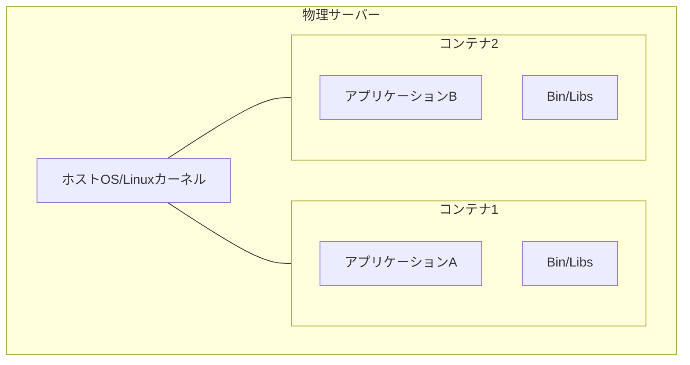
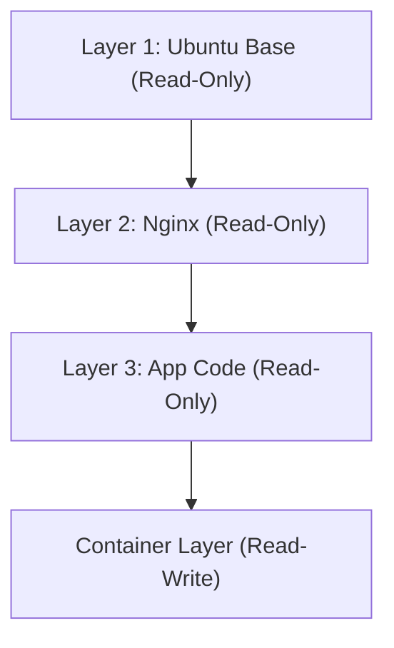

## 1. Pengantar: Revolusi Transportasi di Dunia Fisik dan Kontainerisasi Perangkat Lunak

Di dunia pengembangan perangkat lunak, kata "kontainer" telah lama melekat, namun untuk memahami dampak sebenarnya, kita perlu menengok kembali sejarah dunia fisik. Pada tahun 1950-an, seorang pengusaha Amerika bernama Malcom McLean menemukan "kontainer antarmoda (kontainer maritim)", yang merevolusi logistik global dan pada gilirannya ekonomi dunia secara mendasar.

Sebelumnya, transportasi kargo melibatkan pekerja pelabuhan yang memuat barang-barang dengan berbagai bentuk dan ukuran—seperti tong, karung, dan peti kayu—secara manual ke atas kapal. Ini dikenal sebagai transportasi break-bulk, yang sangat tidak efisien; tidak jarang operasi bongkar muat memakan waktu berminggu-minggu. Selain itu, risiko kerusakan dan pencurian sangat tinggi, dan biaya transportasinya sangat besar.

McLean menemukan "kontainer", sebuah kotak besi terstandardisasi, dan membangun sistem di mana barang dapat dipindahkan antara kapal, truk, dan kereta api tanpa perlu dikemas ulang. Hasilnya, waktu bongkar muat berkurang secara drastis, dan biaya transportasi anjlok hingga sepersekian dari sebelumnya. Revolusi logistik ini memungkinkan pembangunan rantai pasok global dan meletakkan dasar bagi ekonomi kapitalis maju saat ini.

Kemunculan Docker di dunia perangkat lunak (2013) memiliki pola yang persis sama. Di masa lalu, penerapan (deployment) perangkat lunak melibatkan pengaturan manual sistem operasi (OS), pustaka, dan dependensi yang berbeda untuk lingkungan pengembangan, pengujian, dan produksi sebelum menempatkan aplikasi. Sama seperti transportasi break-bulk di dunia fisik, ini menyebabkan inkonsistensi antar lingkungan (masalah "di mesin saya jalan, kok") serta membutuhkan waktu dan tenaga yang sangat besar untuk penerapan.

Docker menyediakan mekanisme untuk mengemas semua yang diperlukan untuk menjalankan aplikasi—kode, runtime, alat sistem, pustaka sistem, dan file konfigurasi—ke dalam sebuah "image kontainer" yang terstandardisasi. Hal ini memungkinkan aplikasi berjalan dengan andal di lingkungan yang sama persis, baik itu di PC pengembang, server on-premise, maupun di cloud publik. Ini bukan sekadar kemajuan teknis, melainkan revolusi mendasar dalam "distribusi" perangkat lunak.

## 2. Teori Evolusi Teknologi Virtualisasi: Dari VM ke Kontainer

Untuk memahami secara mendalam cara kerja teknologi kontainer, mari kita perjelas perbedaannya dengan Mesin Virtual (Virtual Machine atau VM) tradisional. Perbedaan ini bermula dari perbedaan filosofi "abstraksi" dan "isolasi sumber daya" dalam teknik informatika.

### Abstraksi Tingkat Perangkat Keras dari Mesin Virtual

VM menggunakan lapisan perangkat lunak yang disebut hypervisor (seperti VMware ESXi, Hyper-V, KVM) untuk mengemulasi sumber daya perangkat keras server fisik (CPU, memori, penyimpanan, antarmuka jaringan) dan menciptakan beberapa perangkat keras virtual logis. Di atas setiap VM, diinstal OS tamu (Guest OS) yang lengkap (seperti Linux atau Windows), dan di atasnya aplikasi berjalan.

Keuntungan terbesar dari pendekatan ini adalah "isolasi yang kuat". Karena emulasi dilakukan di tingkat perangkat keras, meskipun kernel panic terjadi pada satu VM, hal itu tidak akan memengaruhi VM lainnya. Selain itu, memungkinkan juga untuk menjalankan OS yang berbeda (seperti Linux dan Windows) secara bersamaan pada server fisik yang sama.

Namun, dari sudut pandang "entropi" dalam fisika, terdapat pemborosan besar dalam arsitektur VM. Overhead tidak dapat dihindari karena OS tamu itu sendiri harus booting, mengelola memori, dan menjadwalkan proses. Sebagian besar sumber daya komputasi sistem secara keseluruhan dihabiskan untuk memelihara "OS untuk menjalankan OS (hypervisor)" alih-alih untuk menjalankan aplikasi.

### Abstraksi Tingkat OS dan Isolasi Proses pada Kontainer

Di sisi lain, teknologi kontainer yang direpresentasikan oleh Docker melakukan virtualisasi (isolasi) pada "tingkat OS", bukan perangkat keras. Kontainer tidak memiliki OS tamu. Semua kontainer berbagi satu OS host (kernel Linux) yang berjalan di server fisik (atau VM).

Pada intinya, sebuah kontainer hanyalah "proses Linux yang diisolasi dengan ketat". Hal ini diwujudkan melalui fitur kernel Linux yaitu `namespaces` dan `cgroups` (control groups).

## 3. Keajaiban Isolasi: Namespaces dan Cgroups

Jika kita membedah teknologi kontainer secara teknis, kita akan melihat bahwa itu bukanlah sihir, melainkan kombinasi cerdik dari fitur-fitur yang telah lama terakumulasi di kernel Linux.

### "Pemisahan Garis Dunia" oleh Namespaces

Sama seperti dimensi yang berbeda atau dunia paralel dalam fisika yang tidak saling mengganggu, `namespaces` Linux membatasi "visibilitas sumber daya sistem" yang dikenali oleh sebuah proses dan menciptakan lingkungan sistem virtual yang independen. Berikut adalah namespaces utama yang ada:

1. **PID namespace**: Mengisolasi ruang ID proses. Proses di dalam kontainer akan mendapat ilusi bahwa ia adalah PID 1 (proses pertama dalam sistem), namun dari OS host, ia terlihat sebagai proses biasa (misalnya PID 14532).
2. **Mount (mnt) namespace**: Mengisolasi titik pemasangan (mount points) sistem file. Kontainer memiliki direktori root `/` -nya sendiri dan tidak dapat mengintip sistem file host atau sistem file kontainer lainnya. Ini dapat dikatakan sebagai evolusi modern dari `chroot` UNIX yang muncul pada tahun 1979.
3. **Network (net) namespace**: Mengisolasi antarmuka jaringan, alamat IP, dan tabel perutean (routing table). Perangkat jaringan virtual independen `veth` ditetapkan untuk setiap kontainer.
4. **UTS namespace**: Mengisolasi nama host (hostname) dan nama domain.
5. **IPC namespace**: Mengisolasi komunikasi antar proses (seperti memori bersama).
6. **User namespace**: Mengisolasi ruang ID pengguna dan ID grup. Dengan memetakan pengguna root (UID 0) di dalam kontainer ke pengguna non-privilese (non-privileged user) di host, keamanan dapat ditingkatkan secara drastis.

### "Pembatasan Fisik Sumber Daya" oleh Cgroups

Jika namespaces adalah "isolasi visibilitas", maka `cgroups` (Control Groups) adalah "pembatasan hukum fisika". Ini adalah fitur kernel untuk menetapkan batas atas, mengukur, dan mengontrol penggunaan sumber daya sistem (waktu CPU, penggunaan memori, bandwidth I/O disk, bandwidth jaringan, dll.).

Fungsi ini, yang pengembangannya diprakarsai oleh insinyur Google (terutama Paul Menage dan Rohit Seth) pada tahun 2006, mencegah satu kontainer menghabiskan seluruh sumber daya sistem (masalah Noisy Neighbor). Hal ini menciptakan keuntungan ekonomi dengan menjejalkan sejumlah besar kontainer ke dalam server fisik yang terbatas dengan kepadatan tinggi (meningkatkan rasio integrasi).

## 4. Sistem File Union dan Struktur Lapisan Image

Di antara inovasi Docker, hal yang paling memikat para insinyur adalah "mekanisme pembangunan dan distribusi image kontainer". Di sini, konsep "Sistem File Union (Union File System)" seperti OverlayFS atau Aufs menjadi kuncinya.

### Estetika Imutabilitas dan Manajemen Diferensial

Image kontainer bukanlah sebuah file raksasa tunggal, melainkan memiliki struktur tumpukan beberapa "lapisan hanya-baca (Read-Only layer)".

Sebagai contoh, mari kita pertimbangkan kasus membangun server Web.
1. Lapisan 1: Lingkungan OS dasar (contoh: Ubuntu 22.04)
2. Lapisan 2: Instalasi paket yang diperlukan (contoh: apt-get install nginx)
3. Lapisan 3: Salinan kode sumber aplikasi dan file konfigurasi

Lapisan-lapisan ini disimpan secara independen satu sama lain dan disimpan dalam cache (cached). Saat menggunakan image dasar Ubuntu yang sama di kontainer lain, data lapisan pertama dibagikan pada disk dan tidak diunduh atau disimpan berulang kali. Ini adalah perwujudan prinsip DRY (Don't Repeat Yourself) dalam rekayasa perangkat lunak di tingkat sistem file.

Saat sebuah kontainer dijalankan, sebuah "lapisan kontainer yang dapat dibaca-tulis (Read-Write layer)" yang sangat tipis ditambahkan ke bagian paling atas dari lapisan-lapisan hanya-baca ini. Semua pembuatan, modifikasi, dan penghapusan file yang dilakukan oleh kontainer saat berjalan hanya dicatat dalam lapisan Read-Write ini.

Ini adalah strategi "Copy-on-Write (CoW)". Jika Anda mencoba memodifikasi file pada lapisan bawah, file tersebut akan disalin ke lapisan Read-Write paling atas, dan modifikasi dilakukan di sana. Lapisan aslinya tetap tidak berubah (Immutable). Dengan arsitektur ini, waktu booting kontainer selesai dalam hitungan milidetik, dan jika kontainer dihancurkan, semua perubahan akan hilang, memungkinkan Anda untuk selalu memulai dari awal dalam keadaan bersih.

## 5. Arsitektur Docker: Klien dan Daemon

Konfigurasi sistem Docker mengadopsi arsitektur model klien-server.

1. **Docker Daemon (dockerd)**: Proses berat yang terus berjalan di latar belakang pada OS host. Ini memikul semua tugas berat, seperti pembuatan, pengaktifan, dan penghentian kontainer, serta pembuatan image dan pengelolaan jaringan.
2. **Docker Client (docker CLI)**: Alat baris perintah yang dioperasikan pengguna. Saat pengguna mengetik perintah seperti `docker run` atau `docker build`, klien mengirimkan instruksi ke Docker Daemon melalui REST API (soket Unix atau TCP).
3. **Docker Registry**: Repositori (penyimpanan) image kontainer. Terdapat "Docker Hub", yakni registri publik tempat para pengembang di seluruh dunia berbagi image, dan registri pribadi tempat perusahaan mengelola image dengan aman secara internal (seperti Amazon ECR, Google Artifact Registry).

Berkat pemisahan ini, klien dapat secara transparan mengoperasikan tidak hanya Daemon pada mesin lokal, tetapi juga Daemon pada server jarak jauh.

## 6. Orkestrasi Kontainer dan Masa Depan Sistem Terdistribusi

Docker adalah alat yang sempurna untuk menjalankan kontainer pada host tunggal. Namun, seiring dengan memasyarakatnya arsitektur microservices dan orang-orang mulai mengoperasikan ribuan hingga puluhan ribu kontainer pada klaster yang terdiri dari puluhan atau ratusan server (node), dimensi tantangan baru pun muncul.

* "Jika suatu server rusak, bagaimana cara otomatis merestart kontainer-kontainer di atasnya ke server lain?"
* "Jika lalu lintas (traffic) meningkat, bagaimana cara menskalakan (scale out) jumlah kontainer server Web secara otomatis?"
* "Bagaimana cara menghubungkan kontainer yang jumlahnya tak terhitung ini melalui jaringan dan melakukan penyeimbangan beban (load balancing)?"

Untuk memecahkan tantangan-tantangan kompleks ini, lahirlah "alat orkestrasi kontainer". Sang pemenang di ranah ini adalah **Kubernetes (K8s)**, yang dijadikan sumber terbuka (open source) berdasarkan wawasan dari sistem internal Google, yaitu "Borg".

Jika Docker adalah "standardisasi kargo berupa kontainer tunggal", maka Kubernetes adalah "sistem kontrol terminal pelabuhan internasional raksasa yang diotomatisasi". Kubernetes mengabstraksi seluruh infrastruktur dan menyediakannya sebagai API yang dapat diprogram. Pengembang cukup mendeklarasikan "kondisi yang diinginkan (Desired State: misalnya, selalu menjaga 3 kontainer Nginx agar tetap berjalan)" dalam file YAML (manifes), dan bidang kontrol (control plane) Kubernetes akan terus memantau status sistem saat ini dan secara mandiri terus menyesuaikan keadaan (Reconciliation).

## 7. Penutup: Pergeseran Paradigma yang Didorong oleh Rantai Abstraksi

Dari fenomena fisik transistor ke bahasa mesin, dari assembly ke bahasa tingkat tinggi, dan dari server fisik ke VM. Sejarah ilmu komputer adalah sejarah "abstraksi". Teknologi kontainer sepenuhnya mengemas lingkungan eksekusi OS, dan menyublimasikan wilayah infrastruktur yang fisik dan berantakan menjadi sesuatu yang sepenuhnya dideskripsikan sebagai kode (Infrastructure as Code) perangkat lunak dan dapat direproduksi.

Hari ini, istilah cloud-native merujuk pada teknologi kontainer sebagai prasyaratnya. Dunia yang dirintis oleh Docker dan diperluas oleh Kubernetes ini telah mengurangi friksi (hambatan) dari pengembangan hingga pengoperasian ke tingkat yang ekstrem, menghadirkan lingkungan di mana para insinyur di seluruh dunia dapat fokus pada tujuan utama mereka: "menciptakan perangkat lunak yang berharga". Kontainer lebih dari sekadar alat teknis; ia adalah pergeseran paradigma sejati yang secara mendasar telah mengubah ekosistem ekonomi dan organisasi pengembangan perangkat lunak.
