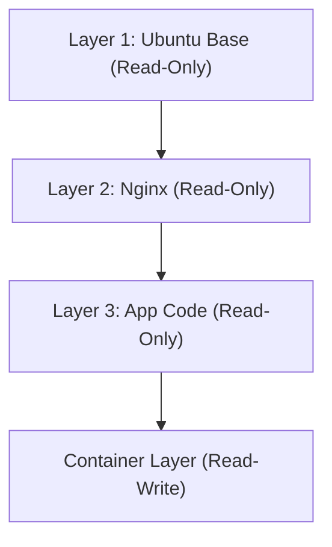

## 1. 도입: 물리적 세계의 운송 혁명과 소프트웨어의 컨테이너화

소프트웨어 개발 세계에서 '컨테이너'라는 단어가 정착한 지 오래되었지만, 그 진정한 파급력을 이해하기 위해서는 먼저 물리적 세계의 역사에 주목할 필요가 있습니다. 1950년대, 말콤 맥린(Malcom McLean)이라는 미국의 사업가가 발명한 '인터모달 컨테이너(해상 컨테이너)'는 세계의 물류, 나아가 세계 경제 자체를 근본적으로 뒤바꿔 놓았습니다.

그 이전의 화물 운송은 통이나 자루, 나무 상자 등 모양과 크기가 제각각인 화물들을 항만 노동자들이 수작업으로 배에 실어야 했습니다. 이를 브레이크 벌크(Break bulk) 운송이라 불렀으며, 매우 비효율적이어서 하역 작업에 수 주가 걸리는 일도 흔했습니다. 또한 파손이나 도난의 위험도 높았고, 운송 비용은 막대했습니다.

맥린은 규격화된 철제 상자인 '컨테이너'를 발명하여 배, 트럭, 철도 사이에서 화물을 다시 포장할 필요 없이 그대로 이동시키는 시스템을 구축했습니다. 이로 인해 하역 시간은 극적으로 단축되었고, 운송 비용은 수십 분의 일로 격감했습니다. 이 물류 혁명이 글로벌 공급망 구축을 가능하게 했고, 오늘날의 고도화된 자본주의 경제의 기초를 다진 것입니다.

소프트웨어 세계에서 Docker의 등장(2013년) 또한 이와 완전히 동일한 구도를 띠고 있습니다. 과거의 소프트웨어 배포는 개발 환경, 테스트 환경, 운영 환경 등 각각 다른 OS와 라이브러리, 의존성을 수작업으로 구축하고 애플리케이션을 배치했습니다. 이는 물리적 세계의 브레이크 벌크 운송과 마찬가지로, 환경 간의 불일치('내 PC에서는 실행되는데' 문제)를 야기했으며, 배포에는 막대한 시간과 노력이 소요되었습니다.

Docker는 애플리케이션 실행에 필요한 코드, 런타임, 시스템 도구, 시스템 라이브러리, 설정 파일 등 모든 것을 하나의 규격화된 '컨테이너 이미지'로 패키징하는 메커니즘을 제공했습니다. 이로 인해 개발자의 PC에서도, 온프레미스 서버에서도, 퍼블릭 클라우드에서도 완전히 동일한 환경으로 애플리케이션을 확실하게 동작시킬 수 있게 되었습니다. 이는 단순한 기술적 진보가 아니라 소프트웨어의 '유통'에 있어 근본적인 혁명이었습니다.

## 2. 가상화 기술의 진화론: VM에서 컨테이너로

컨테이너 기술의 원리를 깊이 이해하기 위해, 기존의 가상 머신(Virtual Machine: VM)과의 차이점을 명확히 해둡시다. 이 차이는 정보공학의 '추상화(Abstraction)'와 '리소스 격리(Isolation)'에 대한 철학의 차이에서 기인합니다.

### 가상 머신의 하드웨어 수준 추상화
VM은 하이퍼바이저(VMware ESXi, Hyper-V, KVM 등)라 불리는 소프트웨어 계층을 사용하여 물리 서버의 하드웨어 리소스(CPU, 메모리, 스토리지, 네트워크 인터페이스)를 에뮬레이트하고, 논리적인 가상 하드웨어를 여러 개 생성합니다. 각각의 VM 위에는 완전한 게스트 OS(Linux나 Windows 등)가 설치되며, 그 위에서 애플리케이션이 동작합니다.

이 접근 방식의 최대 장점은 '강력한 격리성(Isolation)'입니다. 하드웨어 수준에서 에뮬레이션이 이루어지기 때문에 하나의 VM에서 커널 패닉이 발생해도 다른 VM에는 영향을 주지 않습니다. 서로 다른 OS(Linux와 Windows 등)를 동일한 물리 서버 위에서 동시에 실행하는 것도 가능합니다.

하지만 물리학의 '엔트로피' 관점에서 보면, VM의 아키텍처에는 큰 낭비가 존재합니다. 게스트 OS 자체가 부팅되고, 메모리를 관리하며, 프로세스를 스케줄링하기 위한 오버헤드를 피할 수 없기 때문입니다. 시스템 전체 계산 자원의 적지 않은 비율이 애플리케이션의 실행이 아니라 'OS를 구동하기 위한 OS(하이퍼바이저)'를 유지하는 데 소비됩니다.

### 컨테이너의 OS 수준 추상화와 프로세스 격리
반면 Docker로 대표되는 컨테이너 기술은 하드웨어가 아닌 'OS 수준'에서 가상화(격리)를 수행합니다. 컨테이너는 게스트 OS를 가지지 않습니다. 물리 서버(또는 VM) 위에서 동작하는 단 하나의 호스트 OS(Linux 커널)를 모든 컨테이너가 공유합니다.

컨테이너란 본질적으로 '고도로 격리된 단순한 Linux 프로세스'에 불과합니다. 이를 실현하는 것이 바로 Linux 커널의 기능인 `namespaces`(네임스페이스)와 `cgroups`(컨트롤 그룹)입니다.

```mermaid
graph TD
    subgraph 물리 서버
        OS[호스트 OS/Linux 커널]
        subgraph 컨테이너 1
            App1[애플리케이션 A]
            Bin1[Bin/Libs]
        end
        subgraph 컨테이너 2
            App2[애플리케이션 B]
            Bin2[Bin/Libs]
        end
        OS --- 컨테이너 1
        OS --- 컨테이너 2
    end
```

## 3. 분리의 마법: Namespaces와 Cgroups

컨테이너 기술을 기술적으로 해부해 보면, 그것은 마법이 아니라 Linux 커널에 오랜 시간 축적되어 온 기능들의 정교한 조합임을 알 수 있습니다.

### Namespaces를 통한 '세계선의 분리'
물리학에서 서로 다른 차원이나 평행 세계가 서로 간섭하지 않는 것처럼, Linux의 `namespaces`는 프로세스가 인식하는 '시스템 리소스의 시야'를 제한하여 독립적인 가상 시스템 환경을 만들어 냅니다. 주요 namespaces는 다음과 같습니다.

1. **PID namespace**: 프로세스 ID 공간을 격리합니다. 컨테이너 내부의 프로세스는 자기 자신이 PID 1(시스템의 첫 번째 프로세스)이라고 착각하지만, 호스트 OS에서는 일반적인 프로세스(예: PID 14532)로 보입니다.
2. **Mount (mnt) namespace**: 파일 시스템의 마운트 지점을 격리합니다. 컨테이너는 자신만의 루트 디렉터리 `/`를 가지며, 호스트의 파일 시스템이나 다른 컨테이너의 파일 시스템을 들여다볼 수 없습니다. 이는 1979년에 등장한 UNIX의 `chroot`가 현대적으로 진화한 형태라 할 수 있습니다.
3. **Network (net) namespace**: 네트워크 인터페이스, IP 주소, 라우팅 테이블을 격리합니다. 컨테이너마다 독립적인 가상 네트워크 장치인 `veth`가 할당됩니다.
4. **UTS namespace**: 호스트명(hostname)과 도메인명을 격리합니다.
5. **IPC namespace**: 프로세스 간 통신(공유 메모리 등)을 격리합니다.
6. **User namespace**: 사용자 ID와 그룹 ID 공간을 격리합니다. 컨테이너 내부의 root 사용자(UID 0)를 호스트의 비특권 사용자로 매핑함으로써 보안을 극적으로 향상시킵니다.

### Cgroups를 통한 '리소스의 물리적 제한'
namespaces가 '시야의 격리'라면, `cgroups`(Control Groups)는 '물리 법칙의 제한'입니다. 시스템 리소스(CPU 시간, 메모리 사용량, 디스크 I/O 대역폭, 네트워크 대역폭 등)의 사용량에 상한을 설정하고, 측정하며, 제어하기 위한 커널 기능입니다.

2006년 Google 엔지니어들(주로 Paul Menage와 Rohit Seth)에 의해 개발이 시작된 이 기능은, 단일 컨테이너가 시스템 전체의 리소스를 고갈시키는(Noisy Neighbor) 문제를 방지합니다. 이를 통해 제한된 물리 서버 상에 다수의 컨테이너를 고밀도로 채워 넣는(집적도를 높이는) 경제적 이점이 창출되었습니다.

## 4. 유니온 파일 시스템과 이미지의 레이어 구조

Docker의 혁신성 중 엔지니어들을 가장 매료시킨 것은 '컨테이너 이미지의 빌드 및 배포 메커니즘'입니다. 여기서는 OverlayFS나 Aufs와 같은 '유니온 파일 시스템(Union File System)' 개념이 핵심 역할을 합니다.

### 불변성과 차분 관리의 미학
컨테이너 이미지는 단일한 거대 파일이 아니라, 여러 개의 '읽기 전용(Read-Only) 레이어'가 쌓여 있는 구조로 되어 있습니다.

예를 들어 Web 서버를 구축하는 경우를 생각해 봅시다.
1. 제1레이어: 기본이 되는 OS 환경 (예: Ubuntu 22.04)
2. 제2레이어: 필요한 패키지 설치 (예: apt-get install nginx)
3. 제3레이어: 애플리케이션의 소스 코드나 설정 파일 복사

이들 레이어는 서로 독립적으로 저장되고 캐시됩니다. 다른 컨테이너에서 동일한 Ubuntu 베이스 이미지를 사용할 경우, 제1레이어의 데이터는 디스크 상에서 공유되며 중복해서 다운로드하거나 저장되지 않습니다. 이는 소프트웨어 공학의 DRY(Don't Repeat Yourself) 원칙을 파일 시스템 수준에서 구현한 것입니다.



컨테이너를 시작하면, 이들 읽기 전용 레이어의 최상단에 매우 얇은 '읽기/쓰기 가능(Read-Write)한 컨테이너 레이어'가 하나 추가됩니다. 컨테이너가 실행 중 수행하는 모든 파일의 생성, 수정, 삭제는 이 Read-Write 레이어에만 기록됩니다.

이는 '기록 중 복사(Copy-on-Write: CoW)'라는 전략입니다. 하위 레이어의 파일을 수정하려고 하면, 해당 파일이 최상단의 Read-Write 레이어로 복사되고 그곳에서 변경이 가해집니다. 원래의 레이어는 불변(Immutable) 상태로 유지됩니다. 이 아키텍처 덕분에 컨테이너의 시작은 밀리초 단위로 완료되며, 컨테이너를 파기하면 변경 사항은 모두 사라지고 언제나 깨끗한 상태에서 다시 시작할 수 있습니다.

## 5. Docker의 아키텍처: 클라이언트와 데몬

Docker의 시스템 구성은 클라이언트-서버형 아키텍처를 채택하고 있습니다.

1. **Docker Daemon (dockerd)**: 호스트 OS 위에서 백그라운드로 계속 가동되는 무거운 프로세스입니다. 컨테이너의 생성, 시작, 중지, 이미지 빌드, 네트워크 관리 등 모든 힘든 작업을 담당합니다.
2. **Docker Client (docker CLI)**: 사용자가 조작하는 명령줄 도구입니다. `docker run`이나 `docker build`와 같은 명령을 입력하면, 클라이언트는 REST API(Unix 소켓이나 TCP)를 통해 Docker Daemon에 명령을 전송합니다.
3. **Docker Registry**: 컨테이너 이미지 보관소입니다. 전 세계 개발자가 이미지를 공유하는 퍼블릭 레지스트리인 'Docker Hub'나 기업 내에서 안전하게 이미지를 관리하는 프라이빗 레지스트리(Amazon ECR, Google Artifact Registry 등)가 있습니다.

이러한 분리를 통해 클라이언트는 로컬 머신의 Daemon뿐만 아니라 원격 서버에 있는 Daemon도 투명하게 조작할 수 있게 되었습니다.

## 6. 컨테이너 오케스트레이션과 분산 시스템의 미래

Docker는 단일 호스트 위에서 컨테이너를 실행하기에는 완벽한 도구였지만, 마이크로서비스 아키텍처가 보급되고 수십, 수백 대의 서버(노드)로 구성된 클러스터 위에서 수천, 수만 개의 컨테이너를 운영하게 되면서 새로운 차원의 과제가 부상했습니다.

* "어떤 서버가 고장 났을 때, 그 위의 컨테이너를 다른 서버에서 자동으로 다시 시작하려면?"
* "트래픽이 증가했을 때, Web 서버의 컨테이너 수를 자동으로 스케일 아웃하려면?"
* "수없이 많은 컨테이너들을 어떻게 네트워크로 연결하고 부하 분산(Load Balancing)을 할 것인가?"

이러한 복잡한 과제를 해결하기 위해 등장한 것이 '컨테이너 오케스트레이션 도구'입니다. 그 패권자가 된 것이 바로 Google의 사내 시스템 'Borg'의 노하우를 바탕으로 오픈 소스화된 **Kubernetes (K8s)**입니다.

Docker가 '단일 컨테이너라는 화물의 표준화'라면, Kubernetes는 '거대한 자동화된 국제 항만 터미널의 제어 시스템'입니다. Kubernetes는 인프라스트럭처 전체를 추상화하여 프로그래밍 가능한 API로 제공합니다. 개발자는 '바람직한 상태(Desired State: 예를 들어, Nginx 컨테이너를 항상 3개 가동해 둘 것)'를 YAML 파일(매니페스트)로 선언하기만 하면, Kubernetes의 컨트롤 플레인이 지속적으로 시스템의 현재 상태를 감시하고 자율적으로 상태를 조정(Reconciliation)해 나갑니다.

## 7. 맺음말: 추상화의 연쇄가 이끄는 패러다임 시프트

트랜지스터의 물리 현상에서 기계어로, 어셈블리에서 고급 언어로, 그리고 물리 서버에서 VM으로. 컴퓨터 과학의 역사는 '추상화'의 역사입니다. 컨테이너 기술은 OS의 실행 환경을 완전히 패키지화하고, 인프라스트럭처라는 물리적이고 수고스러운 영역을 온전히 소프트웨어로서 코드로 기술하여 재현 가능한 것(Infrastructure as Code)으로 승화시켰습니다.

오늘날 클라우드 네이티브라는 말은 컨테이너 기술을 전제로 하고 있습니다. Docker가 개척하고 Kubernetes가 확장한 이 세계는 개발부터 운영까지의 마찰을 극한으로 줄이고, 전 세계의 엔지니어가 본연의 목적인 '가치 있는 소프트웨어의 창조'에 집중할 수 있는 환경을 가져다주었습니다. 컨테이너는 단순한 기술적 도구를 넘어, 소프트웨어 개발의 경제적, 조직적 생태계를 근본적으로 변혁시킨 진정한 패러다임 시프트인 것입니다.
