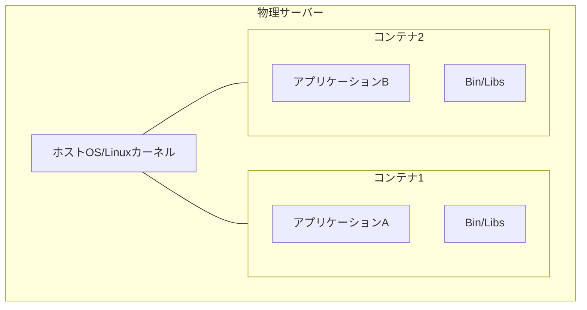
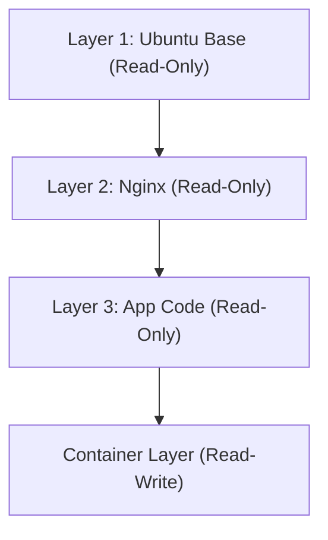

## 1. 導入：物理世界の輸送革命とソフトウェアのコンテナ化

ソフトウェア開発の世界において、「コンテナ」という言葉が定着して久しいですが、その真のインパクトを理解するためには、まずは物理世界の歴史に目を向ける必要があります。1950年代、マルコム・マクリーンというアメリカの実業家が発明した「インターモーダル・コンテナ（海上コンテナ）」は、世界の物流、ひいては世界経済そのものを根底から覆しました。

それまでの貨物輸送は、樽や袋、木箱など、形も大きさも異なる荷物を港湾労働者が手作業で船に積み込んでいました。これはブレイクバルク輸送と呼ばれ、非常に非効率で、荷役作業に数週間を要することも珍しくありませんでした。また、破損や盗難のリスクも高く、輸送コストは莫大なものでした。

マクリーンは、規格化された鉄の箱である「コンテナ」を発明し、船、トラック、鉄道の間で荷物を詰め替えることなく、そのまま移動させるシステムを構築しました。これにより、荷役時間は劇的に短縮され、輸送コストは数十分の一に激減しました。この物流革命が、グローバル・サプライチェーンの構築を可能にし、今日の高度な資本主義経済の基礎を築いたのです。

ソフトウェアの世界におけるDockerの登場（2013年）も、これと全く同じ構図を持っています。かつてのソフトウェアのデプロイは、開発環境、テスト環境、本番環境と、それぞれ異なるOSやライブラリ、依存関係を手作業で構築し、アプリケーションを配置していました。これは物理世界のブレイクバルク輸送と同じく、環境間の不整合（「私の環境では動いたのに」問題）を引き起こし、デプロイには膨大な時間と労力がかかっていました。

Dockerは、アプリケーションの実行に必要なコード、ランタイム、システムツール、システムライブラリ、設定ファイルなどすべてを、一つの規格化された「コンテナイメージ」にパッケージングする仕組みを提供しました。これにより、開発者のPC上でも、オンプレミスのサーバーでも、パブリッククラウド上でも、全く同じ環境でアプリケーションを確実に動作させることができるようになったのです。これは単なる技術的な進歩ではなく、ソフトウェアの「流通」における根本的な革命でした。

## 2. 仮想化技術の進化論：VMからコンテナへ

コンテナ技術の仕組みを深く理解するために、従来の仮想マシン（Virtual Machine：VM）との違いを明確にしておきましょう。この違いは、情報工学における「抽象化」と「リソースの隔離」の哲学の違いに起因します。

### 仮想マシンのハードウェアレベルの抽象化
VMは、ハイパーバイザー（VMware ESXi、Hyper-V、KVMなど）と呼ばれるソフトウェアの層を用いて、物理サーバーのハードウェアリソース（CPU、メモリ、ストレージ、ネットワークインターフェース）をエミュレートし、論理的な仮想ハードウェアを複数作成します。それぞれのVMの上には、完全なゲストOS（LinuxやWindowsなど）がインストールされ、その上でアプリケーションが動作します。

このアプローチの最大の利点は「強力な隔離性（Isolation）」です。ハードウェアレベルでエミュレーションが行われるため、一つのVMでカーネルパニックが起きても、他のVMには影響を与えません。異なるOS（LinuxとWindowsなど）を同じ物理サーバー上で同時に動かすことも可能です。

しかし、物理学における「エントロピー」の観点から見ると、VMのアーキテクチャには大きな無駄が存在します。ゲストOS自身が起動し、メモリを管理し、プロセスをスケジューリングするためのオーバーヘッドが避けられないからです。システム全体の計算資源の少なからぬ割合が、アプリケーションの実行ではなく、「OSを動かすためのOS（ハイパーバイザー）」の維持に消費されてしまいます。

### コンテナのOSレベルの抽象化とプロセス隔離
一方、Dockerに代表されるコンテナ技術は、ハードウェアではなく「OSレベル」で仮想化（隔離）を行います。コンテナはゲストOSを持ちません。物理サーバー（またはVM）上で動いているただ一つのホストOS（Linuxカーネル）を、すべてのコンテナが共有します。

コンテナとは、本質的には「高度に隔離された単なるLinuxプロセス」に過ぎません。これを実現しているのが、Linuxカーネルの機能である `namespaces`（名前空間）と `cgroups`（コントロールグループ）です。

## 3. 分離の魔法：NamespacesとCgroups

コンテナ技術を技術的に解剖すると、それは魔法ではなく、Linuxカーネルに長年蓄積されてきた機能の巧妙な組み合わせであることがわかります。

### Namespacesによる「世界線の分離」
物理学において、異なる次元や平行世界が互いに干渉しないように、Linuxの `namespaces` は、プロセスが認識する「システムリソースの視界」を制限し、独立した仮想的なシステム環境を作り出します。主なnamespacesには以下のものがあります。

1. **PID namespace**: プロセスIDの空間を隔離します。コンテナ内のプロセスは、自分自身がPID 1（システムの最初のプロセス）であると錯覚しますが、ホストOSからは通常のプロセス（例えばPID 14532）として見えます。
2. **Mount (mnt) namespace**: ファイルシステムのマウントポイントを隔離します。コンテナは自分専用のルートディレクトリ `/` を持ち、ホストのファイルシステムや他のコンテナのファイルシステムを覗き見ることはできません。これは1979年に登場したUNIXの `chroot` の現代的な進化形と言えます。
3. **Network (net) namespace**: ネットワークインターフェース、IPアドレス、ルーティングテーブルを隔離します。コンテナごとに独立した仮想的なネットワークデバイス `veth` が割り当てられます。
4. **UTS namespace**: ホスト名（hostname）とドメイン名を隔離します。
5. **IPC namespace**: プロセス間通信（共有メモリなど）を隔離します。
6. **User namespace**: ユーザーIDとグループIDの空間を隔離します。コンテナ内のrootユーザー（UID 0）を、ホスト上の非特権ユーザーにマッピングすることで、セキュリティを劇的に向上させます。

### Cgroupsによる「リソースの物理的制限」
namespacesが「視界の隔離」であるならば、`cgroups`（Control Groups）は「物理法則の制限」です。システムリソース（CPU時間、メモリ使用量、ディスクI/O帯域、ネットワーク帯域など）の使用量に上限を設け、計測し、制御するためのカーネル機能です。

2006年にGoogleのエンジニア（主にPaul MenageとRohit Seth）によって開発が開始されたこの機能は、単一のコンテナがシステム全体のリソースを食いつぶす（Noisy Neighbor問題）のを防ぎます。これにより、限られた物理サーバー上に、多数のコンテナを高密度で詰め込む（集積率を上げる）という経済的なメリットが生み出されました。

## 4. ユニオンファイルシステムとイメージのレイヤー構造

Dockerの革新性の中で、最もエンジニアを魅了したのは「コンテナイメージの構築と配布の仕組み」です。ここでは、OverlayFSやAufsといった「ユニオンファイルシステム（Union File System）」の概念が鍵となります。

### 不変性と差分管理の美学
コンテナイメージは、単一の巨大なファイルではなく、複数の「読み取り専用（Read-Only）レイヤー」が積み重なった構造をしています。

例えば、Webサーバーを構築する場合を考えてみましょう。
1. 第1レイヤー：ベースとなるOS環境（例：Ubuntu 22.04）
2. 第2レイヤー：必要なパッケージのインストール（例：apt-get install nginx）
3. 第3レイヤー：アプリケーションのソースコードや設定ファイルのコピー

これらのレイヤーは、互いに独立して保存され、キャッシュされます。別のコンテナで同じUbuntuベースイメージを使用する場合、第1レイヤーのデータはディスク上で共有され、重複してダウンロードや保存されることはありません。これは、ソフトウェア工学におけるDRY（Don't Repeat Yourself）の原則をファイルシステムレベルで実現したものです。

コンテナを起動すると、これらの読み取り専用レイヤーの最上部に、非常に薄い「読み書き可能（Read-Write）なコンテナレイヤー」が一つ追加されます。コンテナが実行中に行うすべてのファイルの作成、変更、削除は、このRead-Writeレイヤーにのみ記録されます。

これは「コピー・オン・ライト（Copy-on-Write: CoW）」という戦略です。下層のレイヤーのファイルを変更しようとすると、そのファイルが最上部のRead-Writeレイヤーにコピーされ、そこで変更が加えられます。元のレイヤーは不変（Immutable）のまま保たれます。このアーキテクチャにより、コンテナの起動はミリ秒単位で完了し、コンテナを破棄すれば、変更はすべて消え去り、常にクリーンな状態から再出発できるのです。

## 5. Dockerのアーキテクチャ：クライアントとデーモン

Dockerのシステム構成は、クライアント・サーバー型のアーキテクチャを採用しています。

1. **Docker Daemon (dockerd)**: ホストOS上でバックグラウンドで稼働し続ける重厚なプロセスです。コンテナの作成、起動、停止、イメージのビルド、ネットワークの管理など、すべての重労働を担います。
2. **Docker Client (docker CLI)**: ユーザーが操作するコマンドラインツールです。`docker run` や `docker build` といったコマンドを打つと、クライアントはREST API（UnixソケットやTCP）を通じてDocker Daemonに命令を送信します。
3. **Docker Registry**: コンテナイメージの保管庫です。世界中の開発者がイメージを共有する公開レジストリである「Docker Hub」や、企業内で安全にイメージを管理するプライベートレジストリ（Amazon ECR、Google Artifact Registryなど）があります。

この分離により、クライアントはローカルマシンのDaemonだけでなく、リモートのサーバー上にあるDaemonも透過的に操作できるようになっています。

## 6. コンテナオーケストレーションと分散システムの未来

Dockerは単一のホスト上でコンテナを動かすには完璧なツールでしたが、マイクロサービス・アーキテクチャが普及し、数十、数百というサーバー（ノード）で構成されるクラスタ上で、数千、数万のコンテナを運用するようになると、新たな次元の課題が浮上しました。

* 「あるサーバーが故障したら、その上のコンテナを別のサーバーで自動的に再起動するには？」
* 「トラフィックが増加したら、Webサーバーのコンテナ数を自動でスケールアウトするには？」
* 「無数にあるコンテナ同士をどうやってネットワーク的につなぎ、負荷分散（ロードバランシング）するのか？」

これらの複雑な課題を解決するために登場したのが、「コンテナオーケストレーション・ツール」です。その覇者となったのが、Googleの社内システム「Borg」の知見を元にオープンソース化された **Kubernetes (K8s)** です。

Dockerが「単一のコンテナという貨物の標準化」だとすれば、Kubernetesは「巨大な自動化された国際港湾ターミナルの制御システム」です。Kubernetesは、インフラストラクチャ全体を抽象化し、プログラマブルなAPIとして提供します。開発者は「望ましい状態（Desired State：例えば、Nginxのコンテナを常に3つ稼働させておくこと）」をYAMLファイル（マニフェスト）で宣言するだけで、Kubernetesのコントロールプレーンが継続的にシステムの現状を監視し、自律的に状態を調整（Reconciliation）し続けます。

## 7. おわりに：抽象化の連鎖が導くパラダイムシフト

トランジスタの物理現象から機械語へ、アセンブリから高級言語へ、そして物理サーバーからVMへ。計算機科学の歴史は「抽象化」の歴史です。コンテナ技術は、OSの実行環境を完全にパッケージ化し、インフラストラクチャという物理的・泥臭い領域を、完全にソフトウェアとしてコードで記述し、再現可能なもの（Infrastructure as Code）へと昇華させました。

今日、クラウドネイティブという言葉はコンテナ技術を前提としています。Dockerが切り拓き、Kubernetesが拡張したこの世界は、開発から運用までの摩擦を極限まで減らし、世界中のエンジニアが本来の目的である「価値あるソフトウェアの創造」に集中できる環境をもたらしました。コンテナは単なる技術的なツールを越えて、ソフトウェア開発の経済的、組織的なエコシステムを根本から変革した、真のパラダイムシフトなのです。
