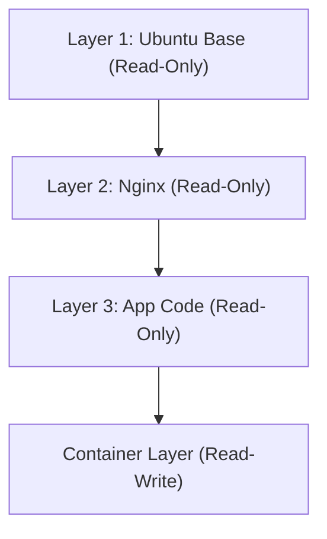

## 1. Introdução: A Revolução do Transporte no Mundo Físico e a Conteinerização de Software

No mundo do desenvolvimento de software, o termo "contêiner" já se consolidou há muito tempo, mas para entender seu verdadeiro impacto, é necessário primeiro olhar para a história do mundo físico. Na década de 1950, o "contêiner intermodal (contêiner marítimo)", inventado por um empresário americano chamado Malcolm McLean, revolucionou fundamentalmente a logística global e, por extensão, a própria economia mundial.

O transporte de cargas até então envolvia estivadores carregando manualmente navios com mercadorias de diferentes formas e tamanhos, como barris, sacos e caixas de madeira. Isso era chamado de transporte de carga fracionada (break bulk), sendo extremamente ineficiente, e não era incomum que as operações de movimentação de carga levassem várias semanas. Além disso, o risco de danos e roubo era alto, e os custos de transporte eram enormes.

McLean inventou o "contêiner", uma caixa de aço padronizada, e construiu um sistema no qual a carga poderia ser movida diretamente entre navios, caminhões e trens sem a necessidade de reembalagem. Com isso, o tempo de movimentação de carga foi drasticamente reduzido, e os custos de transporte despencaram para uma fração do que eram. Essa revolução logística possibilitou a construção de cadeias de suprimentos globais e lançou as bases para a avançada economia capitalista de hoje.

O surgimento do Docker no mundo do software (2013) possui exatamente a mesma estrutura. Antigamente, a implantação (deploy) de software exigia a construção manual de diferentes sistemas operacionais (SOs), bibliotecas e dependências para os ambientes de desenvolvimento, teste e produção, a fim de implantar as aplicações. Assim como o transporte de carga fracionada no mundo físico, isso causava inconsistências entre os ambientes (o famoso problema "na minha máquina funciona") e exigia enormes quantidades de tempo e esforço para o deploy.

O Docker forneceu um mecanismo para empacotar todo o código, tempo de execução (runtime), ferramentas de sistema, bibliotecas de sistema, arquivos de configuração e tudo o mais necessário para executar uma aplicação em uma única "imagem de contêiner" padronizada. Como resultado, tornou-se possível executar a aplicação de forma confiável em exatamente no mesmo ambiente, seja no PC do desenvolvedor, em servidores locais (on-premises) ou na nuvem pública. Este não foi um mero avanço tecnológico, mas sim uma revolução fundamental na "distribuição" de software.

## 2. A Teoria da Evolução da Tecnologia de Virtualização: Das VMs aos Contêineres

Para compreender profundamente a mecânica da tecnologia de contêineres, vamos esclarecer as diferenças em relação às Máquinas Virtuais (VMs) tradicionais. Essa diferença se origina da distinção na filosofia de "abstração" e "isolamento de recursos" na engenharia da informação.

### A Abstração no Nível de Hardware das Máquinas Virtuais
As VMs utilizam uma camada de software chamada hypervisor (como VMware ESXi, Hyper-V, KVM) para emular os recursos de hardware de um servidor físico (CPU, memória, armazenamento, interfaces de rede) e criar múltiplos hardwares virtuais lógicos. No topo de cada VM, um SO convidado completo (Guest OS, como Linux ou Windows) é instalado, sobre o qual as aplicações são executadas.

A maior vantagem dessa abordagem é seu "forte isolamento". Como a emulação ocorre no nível de hardware, mesmo que um kernel panic aconteça em uma VM, as outras VMs não são afetadas. Também é possível executar diferentes sistemas operacionais (como Linux e Windows) simultaneamente no mesmo servidor físico.

No entanto, da perspectiva da "entropia" na física, existe um enorme desperdício na arquitetura das VMs. Isso ocorre porque os recursos consumidos pelo próprio SO convidado para iniciar, gerenciar a memória e agendar processos (overhead) são inevitáveis. Uma parcela considerável dos recursos computacionais de todo o sistema é consumida não pela execução de aplicações, mas pela manutenção do "SO para executar o SO (hypervisor)".

### A Abstração no Nível de SO dos Contêineres e o Isolamento de Processos
Por outro lado, a tecnologia de contêineres, representada pelo Docker, realiza a virtualização (isolamento) no "nível do SO" em vez do hardware. Os contêineres não possuem um SO convidado. Todos os contêineres compartilham o único SO hospedeiro (kernel do Linux) em execução no servidor físico (ou VM).

Em essência, um contêiner é apenas um "processo Linux altamente isolado". Isso é alcançado por meio das funcionalidades do kernel do Linux conhecidas como `namespaces` (espaços de nomes) e `cgroups` (grupos de controle).

```mermaid
graph TD
    subgraph Servidor Físico
        OS[SO Hospedeiro/Kernel Linux]
        subgraph Contêiner 1
            App1[Aplicação A]
            Bin1[Bin/Libs]
        end
        subgraph Contêiner 2
            App2[Aplicação B]
            Bin2[Bin/Libs]
        end
        OS --- Contêiner 1
        OS --- Contêiner 2
    end
```

## 3. A Magia da Separação: Namespaces e Cgroups

Ao dissecar tecnicamente a tecnologia de contêineres, percebe-se que não é magia, mas sim uma combinação engenhosa de funcionalidades que se acumularam no kernel do Linux ao longo de muitos anos.

### A Separação das "Linhas de Mundo" através dos Namespaces
Assim como na física, onde dimensões diferentes ou mundos paralelos não interferem uns com os outros, os `namespaces` do Linux restringem o "campo de visão dos recursos do sistema" percebido por um processo, criando um ambiente de sistema virtual independente. Os principais namespaces incluem:

1. **PID namespace**: Isola o espaço de IDs de processos. Os processos dentro do contêiner têm a ilusão de que são o PID 1 (o primeiro processo do sistema), mas vistos pelo SO hospedeiro, eles aparecem como processos normais (por exemplo, PID 14532).
2. **Mount (mnt) namespace**: Isola os pontos de montagem do sistema de arquivos. Um contêiner possui seu próprio diretório raiz `/` dedicado e não pode espiar o sistema de arquivos do hospedeiro ou o sistema de arquivos de outros contêineres. Isso pode ser considerado uma evolução moderna do `chroot` do UNIX, introduzido em 1979.
3. **Network (net) namespace**: Isola interfaces de rede, endereços IP e tabelas de roteamento. A cada contêiner é atribuído um dispositivo de rede virtual independente chamado `veth`.
4. **UTS namespace**: Isola o nome do host (hostname) e o nome do domínio.
5. **IPC namespace**: Isola a comunicação entre processos (como memória compartilhada).
6. **User namespace**: Isola o espaço de IDs de usuário e IDs de grupo. Ele mapeia o usuário root (UID 0) dentro do contêiner para um usuário sem privilégios no hospedeiro, melhorando dramaticamente a segurança.

### "Restrição das Leis da Física" pelos Cgroups
Se os namespaces representam o "isolamento do campo de visão", os `cgroups` (Control Groups) representam a "restrição das leis da física". É um recurso do kernel usado para definir limites superiores, medir e controlar a quantidade de recursos do sistema usados (tempo de CPU, uso de memória, largura de banda de I/O de disco, largura de banda de rede, etc.).

Este recurso, cujo desenvolvimento foi iniciado por engenheiros do Google (principalmente Paul Menage e Rohit Seth) em 2006, evita que um único contêiner esgote os recursos de todo o sistema (o problema do "Vizinho Barulhento" ou Noisy Neighbor). Isso gerou a vantagem econômica de poder empacotar um grande número de contêineres com alta densidade (aumentando a taxa de integração) em servidores físicos limitados.

## 4. Union File System e a Estrutura de Camadas das Imagens

Entre as inovações do Docker, a que mais fascinou os engenheiros foi o "mecanismo para construir e distribuir imagens de contêineres". Aqui, o conceito de "Union File System", como OverlayFS e Aufs, é fundamental.

### A Estética da Imutabilidade e do Gerenciamento de Diferenças
Uma imagem de contêiner não é um arquivo único e massivo, mas possui uma estrutura na qual múltiplas "camadas somente leitura" (Read-Only layers) são empilhadas umas sobre as outras.

Por exemplo, considere o caso de construir um servidor web:
1. Camada 1: O ambiente do SO base (ex: Ubuntu 22.04)
2. Camada 2: A instalação dos pacotes necessários (ex: apt-get install nginx)
3. Camada 3: A cópia do código-fonte da aplicação e dos arquivos de configuração

Essas camadas são armazenadas de forma independente umas das outras e armazenadas em cache. Ao usar a mesma imagem base do Ubuntu em outro contêiner, os dados da primeira camada são compartilhados no disco e não são baixados ou armazenados duplicadamente. Essa é uma realização do princípio DRY (Don't Repeat Yourself) na engenharia de software no nível do sistema de arquivos.



Ao iniciar um contêiner, uma camada "Leitura/Escrita (Read-Write) de contêiner" muito fina é adicionada ao topo dessas camadas somente leitura. Todas as criações, modificações e exclusões de arquivos feitas pelo contêiner enquanto ele está em execução são registradas apenas nesta camada Read-Write.

Esta é uma estratégia chamada "Copy-on-Write (CoW)". Quando há uma tentativa de modificar um arquivo de uma camada inferior, esse arquivo é copiado para a camada Read-Write superior, e a modificação é feita lá. A camada original permanece inalterada (Imutável). Graças a essa arquitetura, a inicialização do contêiner é concluída em milissegundos, e se o contêiner for destruído, todas as alterações desaparecerão, permitindo que você sempre reinicie a partir de um estado limpo.

## 5. A Arquitetura do Docker: Cliente e Daemon

A configuração do sistema do Docker adota uma arquitetura cliente-servidor.

1. **Docker Daemon (dockerd)**: É um processo pesado que continua sendo executado em segundo plano no SO hospedeiro. Ele lida com todo o trabalho pesado, como criar, iniciar e parar contêineres, construir imagens e gerenciar redes.
2. **Docker Client (docker CLI)**: É a ferramenta de linha de comando operada pelos usuários. Ao digitar comandos como `docker run` ou `docker build`, o cliente envia instruções ao Docker Daemon através de uma API REST (Unix sockets ou TCP).
3. **Docker Registry**: É o repositório para imagens de contêineres. Existem registros públicos, como o "Docker Hub", onde desenvolvedores de todo o mundo compartilham imagens, e registros privados (como Amazon ECR, Google Artifact Registry) que gerenciam imagens com segurança dentro de empresas.

Esta separação permite que o cliente opere não apenas o Daemon na máquina local, mas também os Daemons em servidores remotos de forma transparente.

## 6. A Orquestração de Contêineres e o Futuro dos Sistemas Distribuídos

O Docker era uma ferramenta perfeita para executar contêineres em um único host, mas com a popularização da arquitetura de microsserviços e a operação de milhares ou dezenas de milhares de contêineres em clusters compostos por dezenas ou centenas de servidores (nós), surgiu um novo nível de desafios.

* "Se um servidor falhar, como reiniciar automaticamente os contêineres contidos nele em outro servidor?"
* "Se o tráfego aumentar, como escalar automaticamente o número de contêineres do servidor web (scale-out)?"
* "Como conectar inúmeros contêineres em uma rede e equilibrar a carga entre eles (load balancing)?"

Para resolver esses problemas complexos, surgiram as "ferramentas de orquestração de contêineres". O campeão indiscutível entre elas foi o **Kubernetes (K8s)**, de código aberto, baseado no conhecimento do sistema interno "Borg" do Google.

Se o Docker é a "padronização de carga em um único contêiner", o Kubernetes é o "sistema de controle de um terminal portuário internacional enorme e automatizado". O Kubernetes abstrai toda a infraestrutura e a disponibiliza como uma API programável. Os desenvolvedores só precisam declarar o "estado desejado" (Desired State: por exemplo, ter sempre três contêineres Nginx em execução) em um arquivo YAML (manifesto), e o painel de controle (control plane) do Kubernetes monitorará continuamente o estado atual do sistema e o ajustará autonomamente (Reconciliation) para manter esse estado.

## 7. Conclusão: A Cadeia de Abstrações Liderando uma Mudança de Paradigma

Dos fenômenos físicos dos transistores à linguagem de máquina, do assembly às linguagens de alto nível, e dos servidores físicos às VMs. A história da ciência da computação é uma história de "abstração". A tecnologia de contêineres empacotou completamente o ambiente de execução do SO, sublimando o domínio físico e rudimentar da infraestrutura em algo que pode ser descrito inteiramente em software como código, tornando-o reproduzível (Infrastructure as Code).

Hoje, o termo "cloud-native" (nativo da nuvem) pressupõe a tecnologia de contêineres. Esse mundo, aberto pelo Docker e expandido pelo Kubernetes, reduziu drasticamente o atrito desde o desenvolvimento até as operações, proporcionando um ambiente onde engenheiros de todo o mundo podem se concentrar em seu verdadeiro propósito: a "criação de software de valor". Os contêineres vão muito além de meras ferramentas tecnológicas; eles representam uma verdadeira mudança de paradigma que transformou fundamentalmente o ecossistema econômico e organizacional do desenvolvimento de software.
