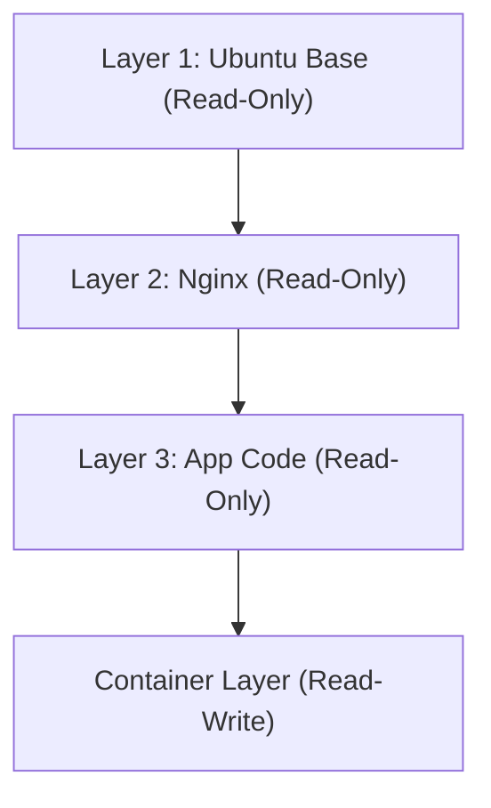

## 1. Введение: Транспортная революция в физическом мире и контейнеризация программного обеспечения

В мире разработки программного обеспечения слово «контейнер» укоренилось уже давно, но чтобы понять его истинное влияние, необходимо сначала взглянуть на историю физического мира. В 1950-х годах «интермодальный контейнер» (морской контейнер), изобретенный американским предпринимателем Малкольмом Маклином, в корне изменил мировую логистику и, как следствие, саму мировую экономику.

До этого времени грузоперевозки осуществлялись в бочках, мешках, деревянных ящиках — грузы различных форм и размеров загружались на корабли портовыми рабочими вручную. Это называлось брейк-балк (перевозка штучных грузов) и было крайне неэффективно; погрузочно-разгрузочные работы нередко занимали недели. Риски повреждения и кражи также были высоки, а транспортные расходы — огромны.

Маклин изобрел стандартизированный железный ящик — «контейнер» — и создал систему, при которой грузы можно было перемещать между судами, грузовиками и поездами без необходимости перегружать само содержимое. Благодаря этому время погрузки и разгрузки резко сократилось, а транспортные расходы упали в десятки раз. Эта логистическая революция позволила построить глобальные цепочки поставок и заложила основу современной высокоразвитой капиталистической экономики.

Появление Docker в мире программного обеспечения (2013 год) имеет абсолютно ту же структуру. Раньше развертывание программного обеспечения требовало ручной настройки различных ОС, библиотек и зависимостей для сред разработки, тестирования и продакшена, после чего уже размещалось приложение. Подобно физическим перевозкам штучных грузов, это приводило к несоответствиям между средами (проблема «у меня на компьютере всё работает») и требовало огромного количества времени и усилий для деплоя.

Docker предложил механизм упаковки кода, среды выполнения, системных инструментов, системных библиотек, файлов конфигурации и всего остального, необходимого для запуска приложения, в единый стандартизированный «образ контейнера». Это позволило надежно запускать приложение в абсолютно идентичной среде как на ПК разработчика, так и на локальных серверах (on-premise) или в публичных облаках. Это был не просто технический прогресс, а фундаментальная революция в «дистрибуции» программного обеспечения.

## 2. Эволюция технологий виртуализации: от ВМ к контейнерам

Чтобы глубже понять механизмы контейнерных технологий, давайте четко определим их отличия от традиционных виртуальных машин (Virtual Machine: VM). Эти различия проистекают из разницы в философии «абстракции» и «изоляции ресурсов» в информатике.

### Аппаратный уровень абстракции виртуальных машин
ВМ используют слой программного обеспечения, называемый гипервизором (VMware ESXi, Hyper-V, KVM и др.), для эмуляции аппаратных ресурсов физического сервера (ЦП, память, хранилище, сетевые интерфейсы) и создания множества логических виртуальных аппаратных сред. На каждую ВМ устанавливается полноценная гостевая ОС (Linux, Windows и т.д.), поверх которой работают приложения.

Главное преимущество этого подхода — «строгая изоляция» (Isolation). Поскольку эмуляция происходит на аппаратном уровне, сбой ядра (kernel panic) в одной ВМ не влияет на другие. На одном физическом сервере также можно одновременно запускать разные ОС (например, Linux и Windows).

Однако с точки зрения «энтропии» в физике в архитектуре ВМ кроется огромная потеря ресурсов. Накладные расходы на запуск самой гостевой ОС, управление памятью и планирование процессов неизбежны. Значительная часть вычислительных ресурсов всей системы расходуется не на выполнение приложений, а на поддержание «ОС для работы ОС» (гипервизора).

### Абстракция уровня ОС и изоляция процессов в контейнерах
С другой стороны, контейнерные технологии, ярким представителем которых является Docker, осуществляют виртуализацию (изоляцию) не на аппаратном уровне, а на «уровне ОС». Контейнеры не имеют гостевой ОС. Все контейнеры совместно используют единственную хост-ОС (ядро Linux), работающую на физическом сервере (или ВМ).

Контейнер по своей сути — это не более чем «строго изолированный процесс Linux». Это реализуется с помощью функций ядра Linux: `namespaces` (пространства имен) и `cgroups` (контрольные группы).

```mermaid
graph TD
    subgraph Физический сервер
        OS[Хост-ОС/Ядро Linux]
        subgraph Контейнер 1
            App1[Приложение A]
            Bin1[Bin/Libs]
        end
        subgraph Контейнер 2
            App2[Приложение B]
            Bin2[Bin/Libs]
        end
        OS --- Контейнер 1
        OS --- Контейнер 2
    end
```

## 3. Магия разделения: Namespaces и Cgroups

Анатомируя контейнерную технологию, мы обнаружим, что это не магия, а хитроумная комбинация функций, годами накапливавшихся в ядре Linux.

### «Разделение мировых линий» с помощью Namespaces
Подобно тому, как в физике разные измерения или параллельные миры не взаимодействуют друг с другом, `namespaces` в Linux ограничивают «область видимости системных ресурсов» для процессов и создают независимые виртуальные системные среды. Основные namespaces включают:

1. **PID namespace**: изолирует пространство идентификаторов процессов. Процесс внутри контейнера ошибочно считает себя процессом с PID 1 (первым процессом в системе), хотя для хост-ОС он выглядит как обычный процесс (например, PID 14532).
2. **Mount (mnt) namespace**: изолирует точки монтирования файловой системы. Контейнер имеет собственную выделенную корневую директорию `/` и не может заглядывать в файловую систему хоста или файловые системы других контейнеров. Это можно назвать современной эволюцией команды `chroot` из UNIX, появившейся в 1979 году.
3. **Network (net) namespace**: изолирует сетевые интерфейсы, IP-адреса и таблицы маршрутизации. Каждому контейнеру назначается независимое виртуальное сетевое устройство `veth`.
4. **UTS namespace**: изолирует имя хоста (hostname) и доменное имя.
5. **IPC namespace**: изолирует межпроцессное взаимодействие (например, разделяемую память).
6. **User namespace**: изолирует пространство идентификаторов пользователей (UID) и групп (GID). Сопоставление root-пользователя в контейнере (UID 0) с непривилегированным пользователем на хосте кардинально повышает безопасность.

### «Физические ограничения ресурсов» с помощью Cgroups
Если namespaces — это «изоляция видимости», то `cgroups` (Control Groups) — это «ограничение законов физики». Это функция ядра для установки верхних пределов, измерения и контроля использования системных ресурсов (процессорное время, использование памяти, пропускная способность дискового ввода-вывода, пропускная способность сети и т. д.).

Эта функция, разработка которой была начата инженерами Google (в основном Полом Менаджем и Рохитом Сетом) в 2006 году, предотвращает поглощение всех системных ресурсов одним контейнером (проблема «шумного соседа»). Это создало экономическое преимущество за счет возможности с высокой плотностью размещать множество контейнеров на ограниченном количестве физических серверов (повышение коэффициента консолидации).

## 4. Каскадно-объединенные файловые системы и слоистая структура образов

Среди всех инноваций Docker больше всего инженеров привлекла «система создания и распространения образов контейнеров». Ключом здесь является концепция «каскадно-объединенной файловой системы» (Union File System), такой как OverlayFS или AuFS.

### Эстетика неизменяемости и управления различиями
Образ контейнера представляет собой не единый огромный файл, а структуру, состоящую из множества наложенных друг на друга «слоев только для чтения» (Read-Only).

Рассмотрим, например, настройку веб-сервера.
1. Первый слой: базовая среда ОС (например, Ubuntu 22.04)
2. Второй слой: установка необходимых пакетов (например, `apt-get install nginx`)
3. Третий слой: копирование исходного кода приложения и конфигурационных файлов

Эти слои сохраняются и кэшируются независимо друг от друга. При использовании одного и того же базового образа Ubuntu в другом контейнере данные первого слоя на диске используются совместно, исключая дублирование загрузок или сохранения. Это реализация принципа DRY (Don't Repeat Yourself) из программной инженерии на уровне файловой системы.



При запуске контейнера поверх этих слоев «только для чтения» добавляется один очень тонкий «слой, доступный для чтения и записи» (Read-Write container layer). Любое создание, изменение или удаление файлов, выполняемое работающим контейнером, фиксируется исключительно в этом Read-Write слое.

Это стратегия «копирование при записи» (Copy-on-Write: CoW). При попытке изменить файл на нижележащем слое он копируется в самый верхний слой Read-Write, где и вносятся изменения. Исходные слои остаются неизменными (Immutable). Благодаря такой архитектуре запуск контейнеров занимает миллисекунды, а после уничтожения контейнера все изменения исчезают, позволяя всегда перезапускаться из совершенно чистого состояния.

## 5. Архитектура Docker: клиент и демон

Системная конфигурация Docker использует архитектуру клиент-сервер.

1. **Docker Daemon (dockerd)**: тяжелый процесс, который постоянно работает в фоновом режиме на хост-ОС. Он берет на себя всю тяжелую работу, такую как создание, запуск, остановка контейнеров, сборка образов и управление сетью.
2. **Docker Client (docker CLI)**: инструмент командной строки, используемый пользователем. При вводе команд вроде `docker run` или `docker build` клиент отправляет инструкции Docker Daemon через REST API (Unix-сокет или TCP).
3. **Docker Registry**: хранилище образов контейнеров. Существуют публичные реестры, такие как "Docker Hub", где разработчики со всего мира делятся образами, а также приватные реестры (Amazon ECR, Google Artifact Registry и т.д.) для безопасного управления образами внутри компаний.

Благодаря этому разделению клиент может прозрачно управлять не только демоном на локальной машине, но и демонами на удаленных серверах.

## 6. Оркестрация контейнеров и будущее распределенных систем

Docker был идеальным инструментом для запуска контейнеров на одном хосте, но с распространением микросервисной архитектуры и эксплуатацией тысяч и десятков тысяч контейнеров в кластерах из десятков и сотен серверов (узлов) возникли проблемы нового уровня.

* «Если один сервер выйдет из строя, как автоматически перезапустить контейнеры с него на другом сервере?»
* «При увеличении трафика, как автоматически масштабировать (scale out) количество контейнеров веб-сервера?»
* «Как связать бесчисленные контейнеры по сети и распределять между ними нагрузку (load balancing)?»

Для решения этих сложных задач появились инструменты «оркестрации контейнеров». Безусловным лидером среди них стал **Kubernetes (K8s)**, инструмент с открытым исходным кодом, созданный на основе опыта работы с внутренней системой Google «Borg».

Если Docker — это «стандартизация груза в виде отдельного контейнера», то Kubernetes — это «система управления огромным автоматизированным международным портовым терминалом». Kubernetes абстрагирует всю инфраструктуру и предоставляет её в виде программируемого API. Разработчику достаточно лишь заявить «желаемое состояние» (Desired State: например, всегда поддерживать работу трех контейнеров Nginx) в YAML-файле (манифесте), и панель управления (Control Plane) Kubernetes будет непрерывно следить за текущим состоянием системы и автономно корректировать его (Reconciliation).

## 7. Заключение: парадигмальный сдвиг через цепочку абстракций

От физического явления транзисторов к машинному коду, от ассемблера к языкам высокого уровня, а затем от физических серверов к ВМ. История информатики — это история «абстракций». Контейнерные технологии полностью упаковали среду выполнения ОС и возвысили инфраструктуру, когда-то бывшую физической и приземленной сферой, до того, что можно полностью описать программным кодом и сделать воспроизводимой (Infrastructure as Code).

Сегодня термин «облачно-ориентированный» (cloud-native) уже подразумевает использование контейнерных технологий. Мир, открытый Docker и расширенный Kubernetes, до предела снизил трения на всех этапах — от разработки до эксплуатации — и создал среду, в которой инженеры по всему миру могут сосредоточиться на своей истинной цели: «создании ценного программного обеспечения». Контейнеры вышли за рамки простого технического инструмента и стали подлинным сдвигом парадигмы, в корне трансформировавшим экономическую и организационную экосистему разработки ПО.
