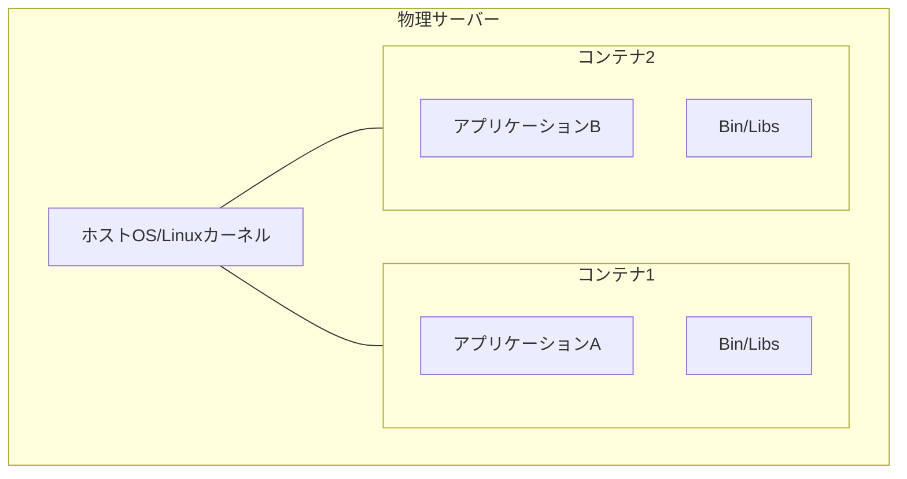
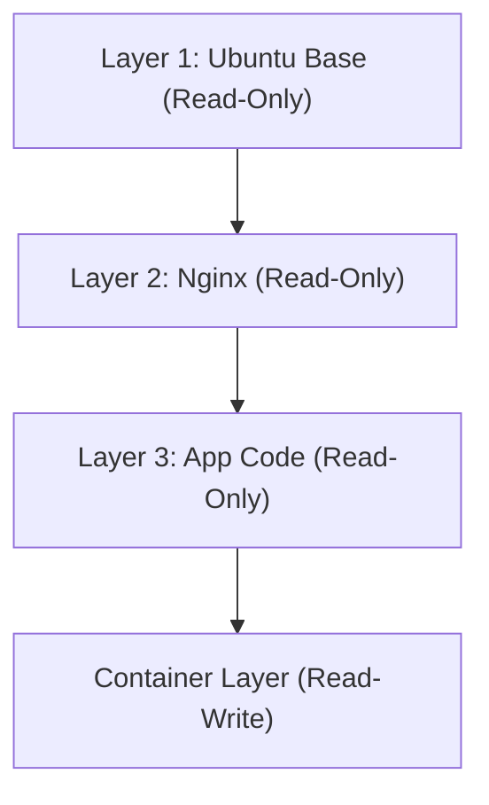

## 1. 引言：物理世界的运输革命与软件的容器化

在软件开发的世界里，“容器”一词早已深入人心，但为了理解其真正的冲击力，我们首先需要回顾物理世界的历史。20世纪50年代，美国企业家马尔科姆·麦克莱恩（Malcolm McLean）发明的“多式联运容器（海运集装箱）”，从根本上颠覆了全球物流，进而颠覆了全球经济本身。

在此之前的货物运输，无论形状和大小如何不同的桶、袋、木箱等货物，都需要港口工人手工装载到船上。这被称为件杂货运输（Breakbulk cargo），效率极低，装卸作业通常需要耗费数周时间。此外，破损和被盗的风险也很高，运输成本极其庞大。

麦克莱恩发明了标准化的铁箱——“集装箱”，并构建了一套系统，使得货物在船只、卡车和铁路之间无需重新装箱即可直接移动。由此，装卸时间被大幅缩短，运输成本骤降至几十分之一。这场物流革命使得构建全球供应链成为可能，并为今天高度发达的资本主义经济奠定了基础。

2013年软件世界中Docker的出现，与此有着完全相同的格局。过去的软件部署，需要在开发环境、测试环境和生产环境中，分别手工构建不同的操作系统、库和依赖关系，然后再部署应用程序。这就像物理世界的件杂货运输一样，会导致环境之间的不一致（“在我的机器上明明是可以运行的”问题），部署过程耗费了大量的时间和精力。

Docker提供了一种机制，将应用程序运行所需的所有代码、运行时、系统工具、系统库和配置文件等，全部打包到一个标准化的“容器镜像”中。通过这种方式，无论是在开发者的个人电脑上、本地服务器上，还是在公共云上，应用程序都能在完全相同的环境中稳定运行。这不仅仅是技术上的进步，更是软件“流通”领域的一场根本性革命。

## 2. 虚拟化技术的进化论：从VM到容器

为了深入理解容器技术的机制，让我们明确其与传统虚拟机（Virtual Machine：VM）的区别。这种区别源于信息工程中“抽象化”和“资源隔离”的哲学差异。

### 虚拟机在硬件层面的抽象化
VM使用被称为Hypervisor（如VMware ESXi、Hyper-V、KVM等）的软件层，来模拟物理服务器的硬件资源（CPU、内存、存储和网络接口），并创建多个逻辑上的虚拟硬件。在每个VM之上，会安装完整的客户操作系统（如Linux或Windows），应用程序则运行在其上。

这种方法最大的优势在于“强大的隔离性（Isolation）”。由于是在硬件层面进行模拟，即使一个VM发生了内核崩溃（Kernel Panic），也不会影响其他的VM。在同一台物理服务器上同时运行不同的操作系统（如Linux和Windows）也是可能的。

然而，从物理学中“熵”的角度来看，VM的架构存在巨大的浪费。因为客户操作系统自身的启动、内存管理和进程调度等开销是不可避免的。系统整体计算资源中相当大的一部分，并没有用于执行应用程序，而是被消耗在了维持“为了运行操作系统的操作系统（Hypervisor）”上。

### 容器在操作系统层面的抽象化与进程隔离
另一方面，以Docker为代表的容器技术，并非在硬件层面，而是在“操作系统层面”进行虚拟化（隔离）。容器没有客户操作系统。所有的容器共享运行在物理服务器（或VM）上的唯一一个宿主操作系统（Linux内核）。

容器在本质上仅仅是“高度隔离的Linux进程”。实现这一点的是Linux内核的功能：`namespaces`（命名空间）和 `cgroups`（控制组）。

## 3. 隔离的魔法：Namespaces与Cgroups

从技术上剖析容器技术，我们会发现它并非魔法，而是Linux内核多年积累的功能的巧妙组合。

### 通过Namespaces实现的“世界线分离”
就像物理学中不同的维度或平行世界互不干涉一样，Linux的 `namespaces` 限制了进程所能识别的“系统资源视野”，创造出独立的虚拟系统环境。主要的namespaces包括以下几种：

1. **PID namespace**: 隔离进程ID空间。容器内的进程会产生一种错觉，认为自己是PID 1（系统的第一个进程），但在宿主操作系统看来，它只是一个普通的进程（例如PID 14532）。
2. **Mount (mnt) namespace**: 隔离文件系统的挂载点。容器拥有专属的根目录 `/`，无法窥探宿主文件系统或其他容器的文件系统。这可以说是在1979年出现的UNIX `chroot` 的现代进化版。
3. **Network (net) namespace**: 隔离网络接口、IP地址和路由表。每个容器都会被分配一个独立的虚拟网络设备 `veth`。
4. **UTS namespace**: 隔离主机名（hostname）和域名。
5. **IPC namespace**: 隔离进程间通信（如共享内存）。
6. **User namespace**: 隔离用户ID和组ID空间。通过将容器内的root用户（UID 0）映射为宿主上的非特权用户，可以极大地提升安全性。

### 通过Cgroups实现的“资源物理限制”
如果说namespaces是“视野的隔离”，那么 `cgroups`（Control Groups）就是“物理法则的限制”。它是用于对系统资源（CPU时间、内存使用量、磁盘I/O带宽、网络带宽等）的使用量设置上限、进行测量和控制的内核功能。

这项功能于2006年由Google工程师（主要是Paul Menage和Rohit Seth）开始开发，它防止了单个容器耗尽整个系统的资源（吵闹的邻居问题，Noisy Neighbor）。这带来了经济上的好处：可以在有限的物理服务器上高密度地塞入大量容器（提高集成度）。

## 4. 联合文件系统与镜像的层级结构

在Docker的创新之中，最令工程师着迷的莫过于“容器镜像的构建与分发机制”。这里的关键是 OverlayFS 和 Aufs 等“联合文件系统（Union File System）”的概念。

### 不可变性与差异管理的差异美学
容器镜像并非一个单一的庞大文件，而是由多个“只读（Read-Only）层”堆叠而成的结构。

例如，考虑构建一个Web服务器的情况。
1. 第1层：基础操作系统环境（例：Ubuntu 22.04）
2. 第2层：安装必需的软件包（例：apt-get install nginx）
3. 第3层：复制应用程序的源代码和配置文件

这些层是相互独立保存并缓存的。当另一个容器使用相同的Ubuntu基础镜像时，第1层的数据会在磁盘上共享，而不会被重复下载或保存。这是在文件系统层面实现了软件工程中的DRY（Don't Repeat Yourself）原则。

当容器启动时，会在这些只读层的最上方，添加一个非常薄的“可读写（Read-Write）容器层”。容器运行期间进行的所有文件的创建、修改和删除，都只记录在这个Read-Write层中。

这是一种被称为“写时复制（Copy-on-Write: CoW）”的策略。当试图修改下层的只读文件时，该文件会被复制到最上方的Read-Write层中，并在那里进行修改。原有的层保持不可变（Immutable）状态。得益于这种架构，容器的启动可以在毫秒级完成，而一旦销毁容器，所有的修改都会消失，随时可以从干净的状态重新出发。

## 5. Docker架构：客户端与守护进程

Docker的系统构成采用了客户端-服务器（Client-Server）架构。

1. **Docker Daemon (dockerd)**: 在宿主操作系统上以后台模式持续运行的重量级进程。它承担了所有繁重的工作，包括容器的创建、启动、停止、镜像的构建以及网络的管理等。
2. **Docker Client (docker CLI)**: 用户操作的命令行工具。当输入 `docker run` 或 `docker build` 等命令时，客户端会通过REST API（Unix套接字或TCP）向Docker Daemon发送指令。
3. **Docker Registry**: 容器镜像的仓库。其中包括全球开发者共享镜像的公共注册中心“Docker Hub”，以及在企业内部安全管理镜像的私有注册中心（如Amazon ECR、Google Artifact Registry等）。

通过这种分离，客户端不仅可以操作本地机器上的Daemon，还可以透明地操作远程服务器上的Daemon。

## 6. 容器编排与分布式系统的未来

对于在单台主机上运行容器，Docker堪称完美的工具。然而，随着微服务架构的普及，在由数十甚至数百台服务器（节点）组成的集群上，需要运维数以千计、万计的容器时，全新的挑战浮出水面。

* “如果某台服务器发生故障，如何将其上的容器自动在另一台服务器上重启？”
* “当流量增加时，如何自动扩展（Scale Out）Web服务器的容器数量？”
* “如何将无数的容器在网络层面上连接起来，并进行负载均衡（Load Balancing）？”

为了解决这些复杂的难题，“容器编排工具（Container Orchestration Tools）”应运而生。最终脱颖而出成为霸主的是 **Kubernetes (K8s)**，它是基于Google内部系统“Borg”的经验开源而来的。

如果说Docker是“单一集装箱货物的标准化”，那么Kubernetes就是“巨大的自动化国际港口码头控制系统”。Kubernetes抽象了整个基础设施，并将其作为可编程的API提供。开发者只需通过YAML文件（清单）声明“期望状态（Desired State：例如，始终保持3个Nginx容器处于运行状态）”，Kubernetes的控制平面就会持续监控系统的当前状态，并自主地不断进行状态调整（Reconciliation）。

## 7. 结语：抽象化的链条所引发的范式转移

从晶体管的物理现象到机器语言，从汇编语言到高级语言，再从物理服务器到虚拟机。计算机科学的历史就是一部“抽象化”的历史。容器技术将操作系统的运行环境完全打包，将基础设施这个物理的、繁琐的领域，完全升华为可以用软件代码描述和可重现的事物（Infrastructure as Code，基础设施即代码）。

如今，云原生（Cloud Native）一词正是以容器技术为前提的。Docker开辟、Kubernetes扩展的这个世界，极大地减少了从开发到运维的摩擦，为全球工程师提供了一个能够专注于其根本目标——“创造有价值的软件”的环境。容器已经超越了单纯的技术工具，它从根本上变革了软件开发的经济和组织生态系统，是一场真正的范式转移（Paradigm Shift）。
