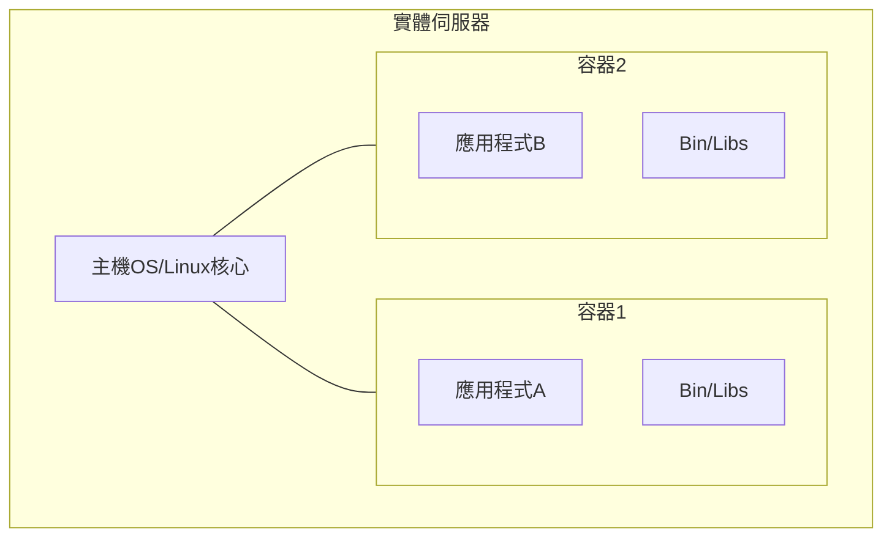
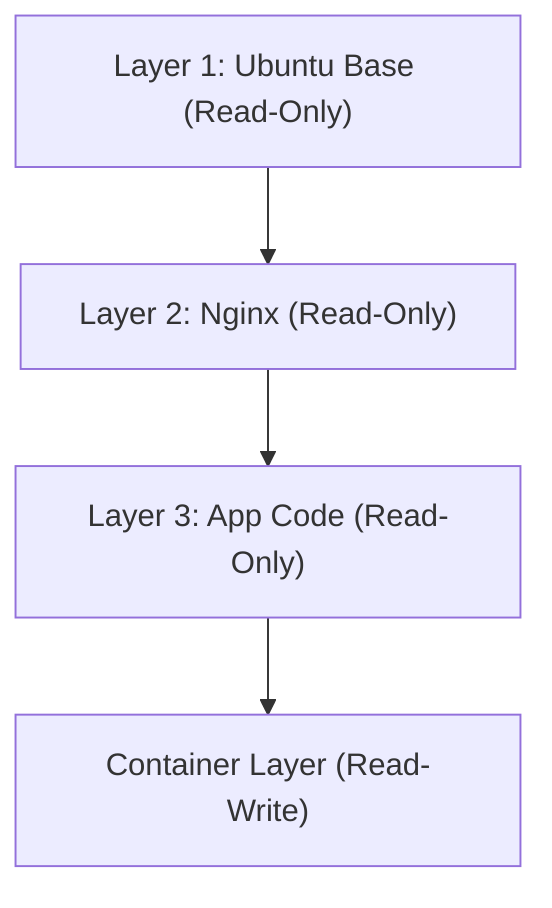

## 1. 導入：物理世界的運輸革命與軟體的容器化

在軟體開發的世界中，「容器」一詞已根深蒂固，但要理解其真正的影響力，我們必須先將目光轉向物理世界的歷史。在 1950 年代，美國企業家馬爾科姆·麥克林 (Malcolm McLean) 發明的「多式聯運容器 (海運貨櫃)」，徹底顛覆了全球物流，進而從根本上改變了世界經濟。

在過去，貨物運輸是將形狀、大小不一的貨物（如木桶、袋子、木箱）由碼頭工人手工搬運上船。這被稱為散貨運輸 (Breakbulk cargo)，效率極低，裝卸作業耗費數週也不足為奇。此外，損壞和遭竊的風險很高，運輸成本極為龐大。

麥克林發明了標準化的鐵箱，即「貨櫃 (Container)」，並建立了一套系統，使貨物在船舶、卡車和鐵路之間移動時無需重新包裝，直接進行轉運。這使得裝卸時間大幅縮短，運輸成本驟降至原來的數十分之一。這場物流革命使全球供應鏈的建立成為可能，並奠定了當今高度資本主義經濟的基礎。

Docker 於 2013 年在軟體世界的登場，與這段歷史有著完全相同的架構。過去軟體的部署，必須在開發環境、測試環境和正式環境中，手動建置不同的作業系統、函式庫和依賴關係，然後再配置應用程式。這就像物理世界的散貨運輸一樣，會引起環境之間的不一致（「在我的機器上會動」的問題），導致部署耗費大量的時間與心力。

Docker 提供了一種機制，將應用程式執行所需的所有程式碼、執行環境 (runtime)、系統工具、系統函式庫、設定檔等，全部打包到一個標準化的「容器映像檔 (Container Image)」中。如此一來，無論是在開發者的個人電腦、地端的伺服器，還是公有雲上，都能確保應用程式在完全相同的環境中運作。這不僅僅是技術上的進步，更是軟體「流通」上的一場根本性革命。

## 2. 虛擬化技術的演化論：從 VM 到容器

為了深入理解容器技術的機制，讓我們先明確其與傳統虛擬機器 (Virtual Machine, VM) 的不同之處。這個差異源於資訊工程中「抽象化 (Abstraction)」與「資源隔離 (Isolation)」理念的不同。

### 虛擬機器的硬體層級抽象化
VM 使用被稱為 Hypervisor (如 VMware ESXi、Hyper-V、KVM) 的軟體層，模擬實體伺服器的硬體資源 (CPU、記憶體、儲存空間、網路介面)，並建立多個邏輯虛擬硬體。在每個 VM 之上，會安裝完整的客體作業系統 (Guest OS，如 Linux 或 Windows)，然後在其上執行應用程式。

這種方法最大的優點是「強大的隔離性 (Isolation)」。由於是在硬體層級進行模擬，即使一個 VM 發生核心恐慌 (Kernel Panic)，也不會影響其他的 VM。此外，也可以在同一台實體伺服器上同時執行不同的作業系統 (如 Linux 與 Windows)。

然而，從物理學中的「熵 (Entropy)」觀點來看，VM 的架構存在著巨大的浪費。因為客體作業系統自身需要啟動、管理記憶體和排程程序，這些開銷是無可避免的。整個系統有不小比例的運算資源，不是被用來執行應用程式，而是被消耗在維持「為了執行 OS 而存在的 OS (Hypervisor)」上。

### 容器的 OS 層級抽象化與程序隔離
另一方面，以 Docker 為代表的容器技術，並非在硬體層級，而是在「OS 層級」進行虛擬化 (隔離)。容器沒有客體作業系統。實體伺服器 (或 VM) 上執行的唯一一個主機作業系統 (Host OS，通常是 Linux 核心)，會被所有容器共享。

容器本質上只不過是「高度隔離的單純 Linux 程序」。實現這一點的，是 Linux 核心的功能：`namespaces` (命名空間) 和 `cgroups` (控制組)。

## 3. 分離的魔法：Namespaces 與 Cgroups

將容器技術進行技術解剖後，我們會發現它並非魔法，而是 Linux 核心長年累積功能的巧妙結合。

### 透過 Namespaces 實現的「世界線分離」
就像物理學中不同的維度或平行世界不會互相干涉一樣，Linux 的 `namespaces` 限制了程序所能感知的「系統資源視野」，創造出獨立的虛擬系統環境。主要的 namespaces 包括：

1. **PID namespace**: 隔離程序 ID (PID) 的空間。容器內的程序會錯覺自己是 PID 1 (系統的第一個程序)，但從主機 OS 來看，它只是一個普通的程序 (例如 PID 14532)。
2. **Mount (mnt) namespace**: 隔離檔案系統的掛載點。容器擁有自己專屬的根目錄 `/`，無法窺視主機的檔案系統或其他容器的檔案系統。可以說它是 1979 年出現的 UNIX `chroot` 的現代演化版。
3. **Network (net) namespace**: 隔離網路介面、IP 位址和路由表。每個容器都會被分配獨立的虛擬網路設備 `veth`。
4. **UTS namespace**: 隔離主機名稱 (hostname) 與網域名稱。
5. **IPC namespace**: 隔離程序間通訊 (Inter-Process Communication，如共享記憶體)。
6. **User namespace**: 隔離使用者 ID 和群組 ID 的空間。將容器內的 root 使用者 (UID 0) 映射為主機上的非特權使用者，能大幅提升安全性。

### 透過 Cgroups 實現的「資源物理限制」
如果說 namespaces 是「視野的隔離」，那麼 `cgroups` (Control Groups) 就是「物理法則的限制」。這是為系統資源 (CPU 時間、記憶體使用量、磁碟 I/O 頻寬、網路頻寬等) 設置上限、進行測量與控制的核心功能。

這項功能於 2006 年由 Google 工程師 (主要是 Paul Menage 和 Rohit Seth) 開始開發，防止了單一容器耗盡整個系統的資源 (吵鬧的鄰居 (Noisy Neighbor) 問題)。這帶來了一項經濟優勢，使得在有限的實體伺服器上，能夠高密度地塞入大量容器 (提高整合率)。

## 4. 聯合檔案系統與映像檔的層狀結構

在 Docker 的創新中，最令工程師著迷的莫過於「容器映像檔的建置與發布機制」。在此，OverlayFS 或 Aufs 等「聯合檔案系統 (Union File System)」的概念是關鍵。

### 不變性與差異管理的技術美學
容器映像檔並不是單一的巨大檔案，而是由多個「唯讀 (Read-Only) 層」堆疊而成的結構。

例如，考慮建置一個 Web 伺服器的情況：
1. 第 1 層：基礎 OS 環境 (例：Ubuntu 22.04)
2. 第 2 層：安裝必要的套件 (例：apt-get install nginx)
3. 第 3 層：複製應用程式的原始碼與設定檔

這些層 (layers) 是各自獨立儲存並被快取的。如果另一個容器使用了相同的 Ubuntu 基礎映像檔，第 1 層的資料在磁碟上會被共享，而不會重複下載或儲存。這是在檔案系統層級實現了軟體工程中的 DRY (Don't Repeat Yourself) 原則。

啟動容器時，會在這些唯讀層的最頂端，添加一個極薄的「可讀寫 (Read-Write) 容器層」。容器在執行過程中所進行的所有檔案建立、修改和刪除，都只會記錄在這個 Read-Write 層中。

這是一種「寫入時複製 (Copy-on-Write: CoW)」的策略。當試圖修改底層的檔案時，該檔案會被複製到最頂端的 Read-Write 層，然後在那裡進行修改。原本的底層則保持不變 (Immutable)。藉由這種架構，容器的啟動可在毫秒級別完成；而一旦銷毀容器，所有的變更就會煙消雲散，隨時都能從乾淨的狀態重新出發。

## 5. Docker 的架構：用戶端與守護行程

Docker 的系統配置採用了主從式架構 (Client-Server Architecture)。

1. **Docker Daemon (dockerd)**: 是一個在主機 OS 上持續在背景運作的重量級程序。它負責建立、啟動、停止容器，建置映像檔，管理網路等所有的粗重工作。
2. **Docker Client (docker CLI)**: 使用者操作的命令列工具。當輸入 `docker run` 或 `docker build` 等指令時，用戶端會透過 REST API (Unix socket 或 TCP) 將命令傳送給 Docker Daemon。
3. **Docker Registry**: 容器映像檔的儲存庫。有全球開發者共享映像檔的公開儲存庫「Docker Hub」，以及在企業內部安全管理映像檔的私有儲存庫 (如 Amazon ECR、Google Artifact Registry 等)。

這種分離架構，使得用戶端不僅可以操作本機的 Daemon，還能以透明的方式操作遠端伺服器上的 Daemon。

## 6. 容器編排與分散式系統的未來

雖然 Docker 在單一主機上執行容器是個完美的工具，但隨著微服務架構 (Microservices Architecture) 的普及，當我們需要在由數十甚至數百台伺服器 (節點) 組成的叢集上，維運數千到數萬個容器時，就浮現了新維度的挑戰。

* 「如果某台伺服器故障了，如何自動在其他伺服器上重新啟動其上的容器？」
* 「當流量增加時，如何自動水平擴展 (Scale-out) Web 伺服器的容器數量？」
* 「如何將無數個容器透過網路連接起來，並進行負載平衡 (Load Balancing)？」

為了解決這些複雜的挑戰，應運而生的便是「容器編排工具 (Container Orchestration Tools)」。其中脫穎而出的霸主，就是基於 Google 內部系統「Borg」的經驗所開源的 **Kubernetes (K8s)**。

如果說 Docker 是「單一容器的貨物標準化」，那麼 Kubernetes 就是「龐大且自動化的國際港口航廈控制系統」。Kubernetes 將整個基礎設施抽象化，並提供可程式化的 API。開發者只需要透過 YAML 檔案 (Manifest) 宣告「期望狀態 (Desired State：例如，隨時保持 3 個 Nginx 容器在執行)」，Kubernetes 的控制平面 (Control Plane) 就會持續監控系統的現狀，並自主地不斷調整狀態 (Reconciliation)。

## 7. 結語：抽象化連鎖帶來的典範轉移

從電晶體的物理現象到機器語言，從組合語言到高階語言，再從實體伺服器到 VM。計算機科學的歷史，就是一部「抽象化」的歷史。容器技術將 OS 的執行環境完全打包，把基礎設施這個充滿物理與繁雜泥濘的領域，昇華為完全可以作為軟體由程式碼描述、且具備重現性的事物 (Infrastructure as Code)。

時至今日，雲端原生 (Cloud Native) 一詞已將容器技術視為前提。由 Docker 開拓、Kubernetes 擴展的這個世界，將從開發到維運的摩擦降至最低，為全球工程師帶來了一個能專注於真正目的——「創造有價值的軟體」的環境。容器不僅超越了單純技術工具的範疇，更是從根本上變革了軟體開發的經濟與組織生態系的，真正的典範轉移 (Paradigm Shift)。
