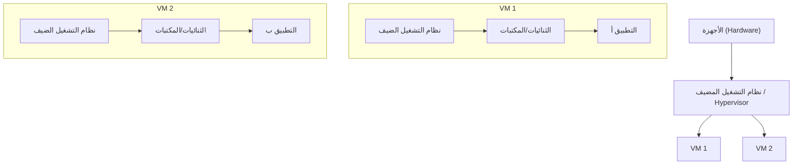
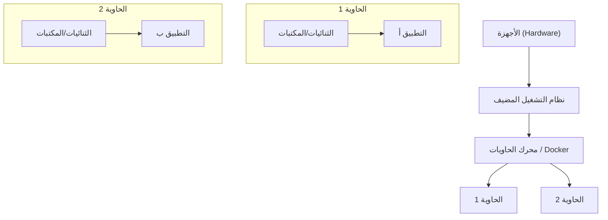
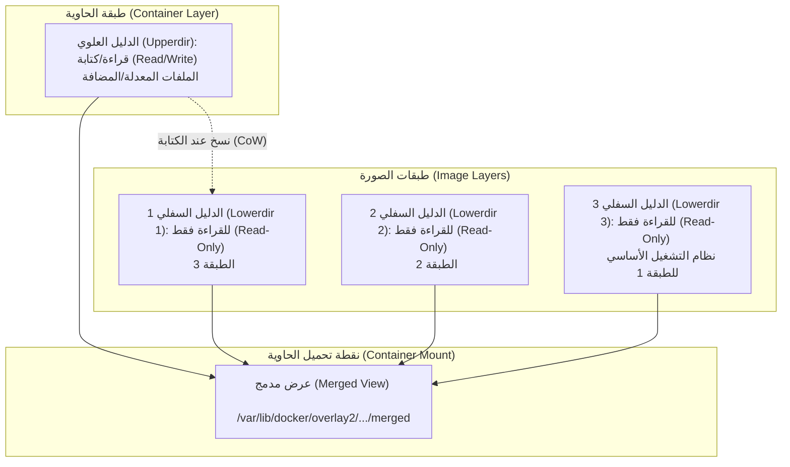
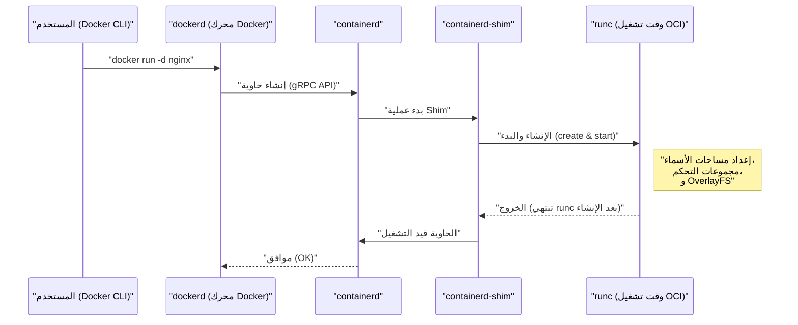
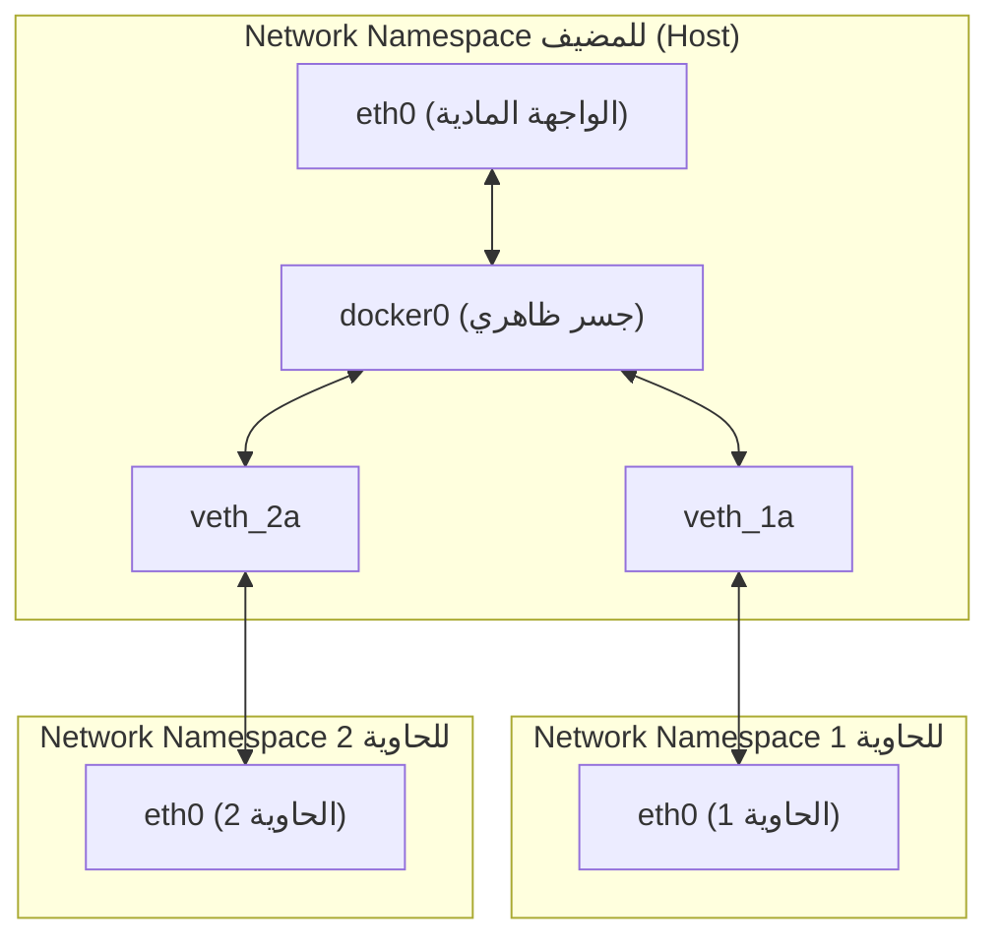

## 1. مقدمة: ما هي تقنية الحاويات؟

بالنسبة للعديد من المطورين، يُعرف Docker بأنه "أداة مفيدة لبناء ومشاركة بيئات العمل بسهولة". ولكن، قد يكون من المفاجئ أن قلة من الناس يفهمون بعمق ما يحدث خلف الكواليس في Docker، ولماذا يعمل بوزن خفيف وسرعة فائقة.

في هذا المقال، سنتجاوز الاستخدام السطحي لأوامر Docker لنتعمق في **جوهر تقنية الحاويات** . بالتحديد، سنقوم بتحليل شامل للوظائف الأساسية لنواة Linux التي تحقق هذه الحاويات، وهي **مساحة الاسم (Namespace)** ، و **مجموعات التحكم (cgroups)** ، والآلية التي تشكل نظام الملفات **OverlayFS** .

من خلال امتلاك هذه المعرفة، ستتمكن من تحسين الأداء، تعزيز الأمان، وحل المشكلات بشكل أكثر دقة.

## 2. الفرق الحاسم بين الأجهزة الظاهرية (VM) والحاويات

لفهم الحاويات، يجب أولاً توضيح الاختلافات بينها وبين الأجهزة الظاهرية التقليدية (Virtual Machine).

### بنية الأجهزة الظاهرية

تضع الأجهزة الظاهرية برنامج Hypervisor (مثل VMware ESXi، KVM، Hyper-V) على خادم فعلي، وتقوم بتشغيل عدة أنظمة تشغيل ضيفة (Virtual Machine) فوقه.



يوفر نهج الجهاز الظاهري بيئة معزولة تمامًا من خلال المحاكاة من مستوى الأجهزة. ولكن، نظرًا لضرورة تشغيل نواة مستقلة (نظام تشغيل ضيف) لكل جهاز ظاهري، فإنه يواجه تحديات مثل بطء بدء التشغيل ووجود عبء إضافي (overhead) كبير على الذاكرة والمعالج.

### بنية الحاويات

من ناحية أخرى، **تشارك الحاويات نواة نظام التشغيل المضيف** .



في الواقع، الحاوية هي مجرد "عملية Linux معزولة". وبما أنه ليست هناك حاجة لعملية تشغيل النواة، فإنها تبدأ في غضون أجزاء من الألف من الثانية وتقلل العبء الإضافي إلى الحد الأدنى.

إن السحر الذي يحقق "عزل العملية كما لو كانت نظام تشغيل مستقلًا" يتم تحقيقه بواسطة **مساحة الاسم (Namespace)** و **مجموعات التحكم (cgroups)** اللتين سنشرحهما في الفصل التالي.

---

## 3. "مساحة الاسم (Namespace)" التي تحقق عزل الحاوية

تُعد **مساحة الاسم (Namespace)** في نواة Linux ميزة توفر عرضًا معزولًا لموارد النظام للعملية. يمكن للعملية داخل مساحة اسم معينة رؤية الموارد الموجودة داخل مساحة الاسم نفسها فقط. يتيح ذلك تشغيل عمليات متعددة على نفس النظام دون التداخل مع بعضها البعض.

توفر نواة Linux بشكل أساسي الأنواع الستة التالية من مساحات الأسماء:

### 3.1 PID Namespace (عزل معرف العملية)

في أنظمة Linux، يبدأ `init` أو `systemd` بمعرف العملية PID 1 عند بدء التشغيل، ويتم تعيين PID متسلسل للعمليات اللاحقة.
عند استخدام PID Namespace، يتم تعيين PID 1 مرة أخرى للعملية الأولى التي يتم تشغيلها داخل مساحة الاسم الجديدة.

إذا دخلت إلى الحاوية ونفذت الأمر `ps aux`، فسترى فقط العمليات قيد التشغيل داخل الحاوية ولن ترى عمليات المضيف. ويرجع ذلك إلى PID Namespace.

### 3.2 Mount Namespace (عزل نظام الملفات)

تعزل نقطة التحميل (Mount Point) للعملية. بفضل هذه الميزة، يمكن أن يكون لكل حاوية دليل جذر مستقل ( `/` ) الخاص بها. يمكنك بناء شجرة نظام ملفات منفصلة عن نظام ملفات المضيف وإجراء عمليات التحميل وإلغاء التحميل دون التأثير على مساحات الأسماء الأخرى.

### 3.3 Network Namespace (عزل الشبكة)

تعزل واجهات الشبكة، عناوين IP، جداول التوجيه، وقواعد iptables وما إلى ذلك. بفضل Network Namespace، تمتلك كل حاوية عنوان IP خاص بها (مثل: `172.17.0.2` ) ويمكنها التواصل بشكل مستقل عن إعدادات شبكة المضيف.

### 3.4 UTS Namespace (عزل اسم المضيف واسم المجال)

تعزل اسم المضيف واسم مجال NIS. يتيح ذلك لكل حاوية الحصول على اسم مضيف خاص بها (القيمة التي يمكن التحقق منها باستخدام الأمر `hostname` ).

### 3.5 IPC Namespace (عزل الاتصال بين العمليات)

تعزل كائنات System V IPC (الاتصال بين العمليات) وقوائم رسائل POSIX. تمنع العمليات من الحاويات المختلفة من الوصول إلى الذاكرة المشتركة عن طريق الخطأ.

### 3.6 User Namespace (عزل المستخدم والمجموعة)

تعزل مساحة معرف المستخدم (UID) ومعرف المجموعة (GID). يتيح ذلك تعيين عملية تعمل كـ **الجذر (root (UID 0))** داخل الحاوية لتتم معاملتها كـ **مستخدم عادي (مستخدم غير مميز)** على المضيف. إنها ميزة بالغة الأهمية من منظور الأمان.

### 💡 تدريب عملي: إنشاء مساحة اسم (Namespace) يدويًا

باستخدام الأمر `unshare` في Linux، يمكنك إنشاء مساحة اسم يدويًا وتنفيذ عملية داخلها. دعونا نستشعر أساسيات الحاويات دون استخدام Docker.

```bash
# إنشاء PID, UTS, و Mount Namespace جديدة، وتشغيل bash
$ sudo unshare --pid --uts --mount --fork --mount-proc /bin/bash

# التحقق من إمكانية تغيير اسم المضيف (بفضل UTS Namespace)
root@host# hostname container-test
root@container-test# hostname
container-test

# التحقق من قائمة العمليات (بفضل PID Namespace و Mount Namespace)
root@container-test# ps aux
USER         PID %CPU %MEM    VSZ   RSS TTY      STAT START   TIME COMMAND
root           1  0.0  0.0   7236  4160 pts/0    S    10:00   0:00 /bin/bash
root          15  0.0  0.0   8892  3280 pts/0    R+   10:01   0:00 ps aux
```

كما نرى، حتى عند تشغيل `ps aux`، فإن عمليات المضيف تكون غير مرئية، ويتضح أن `/bin/bash` يعمل برقم PID 1. هذه هي الهوية الأساسية للحاوية.

---

## 4. "مجموعات التحكم (cgroups)" لتقييد موارد الحاوية

بينما تتولى مساحة الاسم (Namespace) مسؤولية "عزل المساحة"، تتولى **مجموعات التحكم (cgroups - Control Groups)** مسؤولية "تقييد الموارد".

إذا خرجت إحدى الحاويات عن السيطرة واستهلكت جميع موارد المعالج أو الذاكرة الخاصة بالمضيف، فستتعطل الحاويات الأخرى أو النظام المضيف نفسه (مشكلة الجار المزعج - Noisy Neighbor). لمنع ذلك، يتمثل دور cgroups في وضع حدود لاستخدام الموارد (المعالج، الذاكرة، إدخال/إخراج القرص، عرض النطاق الترددي للشبكة، وما إلى ذلك) لمجموعات العمليات.

### الأنظمة الفرعية الرئيسية لـ cgroups

- **cpu** : تتحكم في جدولة المعالج (نسبة أو الحد الأقصى لوقت الاستخدام).
- **memory** : تعين الحد الأقصى لاستخدام الذاكرة، وتتحكم في السلوك عند الوصول إلى هذا الحد (مثل إنهاء العملية بواسطة OOM Killer).
- **blkio** : تقيد عرض النطاق الترددي للإدخال/الإخراج للأجهزة الكتلية (الأقراص).
- **pids** : تقيد عدد العمليات (الخيوط) التي يمكن إنشاؤها داخل مجموعة cgroup، وتمنع الهجمات مثل قنبلة التفريع (Fork Bomb).

### 💡 تدريب عملي: إعداد cgroups يدويًا

دعونا ننشئ مجموعة cgroup تطبق قيودًا على الذاكرة (مثال من cgroups v1).

```bash
# إنشاء مجموعة لتقييد الذاكرة
$ sudo mkdir /sys/fs/cgroup/memory/test_group

# تعيين الحد الأقصى للذاكرة إلى 50 ميغابايت
$ echo 50000000 | sudo tee /sys/fs/cgroup/memory/test_group/memory.limit_in_bytes

# إضافة العملية الحالية (الغلاف - shell) إلى هذه المجموعة
$ echo $$ | sudo tee /sys/fs/cgroup/memory/test_group/tasks

# إذا قمت بتشغيل عملية تستهلك قدرًا كبيرًا من الذاكرة في هذه الحالة، فستصل إلى الحد وتُقتل العملية (Killed)
```

عند استخدام Docker، يتم تحويل الخيارات التي يتم تمريرها إلى أمر `docker run` في الخلفية إلى إعدادات cgroups هذه.

```bash
# مثال لتقييد الذاكرة والمعالج في Docker
$ docker run -d --name web --memory="256m" --cpus="0.5" nginx
```

---

## 5. نظام ملفات الحاوية و OverlayFS (طبقات الصور)

إحدى ميزات الحاوية هي "البنية الطبقية للصورة". صورة Docker ليست ملفًا واحدًا ضخمًا، بل تتكون من تداخل طبقات (Layers) متعددة. يتم تحقيق ذلك بواسطة **نظام الملفات الموحد (Union File System - UnionFS)** ، وتحديدًا **OverlayFS** الذي يُستخدم بشكل قياسي في إصدارات Linux الحديثة.

### آلية OverlayFS

تعتبر OverlayFS تقنية تدمج بين أدلة (directories) مختلفة (سفلية وعلوية) وتظهرها كنظام ملفات واحد موحد.



1. **الدليل السفلي (Lowerdir)** : يقابل كل طبقة من طبقات صورة Docker. يتم التعامل مع هذه الأدلة كملفات **للقراءة فقط (Read-Only)** . عندما تستخدم عدة حاويات نفس الصورة، فإنها تشارك هذا الدليل السفلي، مما يوفر مساحة القرص بشكل كبير.
2. **الدليل العلوي (Upperdir)** : هذه طبقة **للقراءة/الكتابة (Read/Write)** مخصصة للحاوية وتُضاف عند بدء تشغيلها. يتم كتابة كل إنشاء أو تعديل للملفات داخل الحاوية في هذه الطبقة العلوية فقط.
3. **العرض المدمج (Merged View)** : يدمج الدليلين السفلي والعلوي لتوفير نظام ملفات واحد يُرى من داخل الحاوية.

### استراتيجية النسخ عند الكتابة (Copy-on-Write - CoW)

عند محاولة تعديل ملف موجود (ملف في الطبقة السفلية) من داخل الحاوية، يقوم OverlayFS تلقائيًا بنسخ الملف المستهدف إلى الطبقة العلوية (Upperdir) ويطبق التعديلات على تلك النسخة. يُطلق على هذه العملية اسم **النسخ عند الكتابة (Copy-on-Write)** . لا يتم تغيير الملف في الطبقة السفلية أبدًا.

ونتيجة لذلك، إذا دمرت الحاوية، فسيتم حذف Upperdir وتفقد البيانات. أما البيانات التي تتطلب الاستمرارية، فيتم حلها باستخدام **حجم Docker (Docker Volume مثل ربط التحميل - bind mount)** لتحميل دليل من المضيف مباشرة إلى داخل الحاوية.

### العلاقة بين Dockerfile والطبقات

يولد كل أمر في `Dockerfile` (مثل `FROM` ، `RUN` ، `COPY` ، إلخ) طبقة جديدة (Lowerdir).

```dockerfile
# الطبقة 1: نظام التشغيل الأساسي
FROM ubuntu:22.04

# الطبقة 2: تثبيت الحزم
RUN apt-get update && apt-get install -y python3

# الطبقة 3: نسخ كود المصدر
COPY . /app

# إعداد البيانات الوصفية (لا يتم إنشاء طبقة)
CMD ["python3", "/app/main.py"]
```

لتقليل عدد الطبقات، غالبًا ما تُستخدم تقنية ربط عدة أوامر `RUN` باستخدام `&&` ، وهذا تحسين لمنع زيادة عمق طبقات OverlayFS بشكل مفرط ولإبقاء حجم الصورة صغيرًا.

---

## 6. بنية Docker (أجزاء Docker Engine، containerd، runc)

في البداية، كانت بنية Docker متجانسة بالكامل (Monolithic - كتلة واحدة ضخمة)، ولكن في الوقت الحاضر تم تقسيم الوظائف وتوحيدها (OCI: Open Container Initiative). تعتمد دورة حياة الحاوية الحالية على التعاون بين المكونات التالية.



1. **Docker CLI** : أداة سطر الأوامر التي يستخدمها المستخدم.
2. **dockerd (Docker Daemon)** : يوفر وظائف عالية المستوى مثل بناء الصور، إدارة الشبكات، وإدارة الأحجام.
3. **containerd** : عفريت (Daemon) متخصص في إدارة دورة حياة الحاويات (سحب الصور، تشغيل وإيقاف الحاويات). إنه مكوّن قياسي يُستخدم أيضًا في أدوات مثل [Kubernetes](https://kenji.blog/ar/p/kubernetes-k8s-architecture-pod-service-ingress/).
4. **runc** : وقت تشغيل حاويات منخفض المستوى متوافق مع معيار OCI (Open Container Initiative). يتولى مسؤولية إعداد Namespace و cgroups المذكورة أعلاه في النواة (Kernel)، وبدء تشغيل العملية. بمجرد اكتمال بدء التشغيل، تنتهي عملية `runc` نفسها.
5. **containerd-shim** : تصبح هذه العملية الأصل (PID 1) لعملية الحاوية، وتدير الإدخال/الإخراج القياسي للحاوية، وتبلغ `containerd` بحالة خروج الحاوية. هذا يضمن أنه حتى إذا تمت إعادة تشغيل `dockerd` أو `containerd` ، ستستمر الحاوية في العمل.

---

## 7. شبكات الحاويات المتقدمة

أخيرًا، دعونا نتطرق إلى آلية الاتصال بين Network Namespace والحاويات.

نموذج الشبكة الافتراضي في Docker هو **شبكة الجسر (Bridge)** .



- **veth pair (Virtual Ethernet Pair)** : هو زوج من واجهات الشبكة الافتراضية؛ فعند وضع الحزم في إحداهما، تخرج من الأخرى.
- عند إنشاء حاوية، يُنشئ Docker مساحة اسم شبكة (Network Namespace) جديدة، ويضع أحد طرفي veth pair داخل الحاوية (عادةً ما يُسمى `eth0` ) ويضع الطرف الآخر على المضيف (مثل `vethXXXX` ).
- يتم توصيل واجهة veth الموجودة على المضيف بمحول افتراضي (Virtual Switch) وهو **`docker0` (جهاز الجسر)** .
- وبذلك، يمكن للحاويات المختلفة التواصل مع بعضها البعض عبر `docker0` ، ومن خلال إعدادات توجيه المضيف (NAPT / IP Masquerade)، يمكنها أيضًا الاتصال بالإنترنت الخارجي.

---

## 8. التطبيق العملي: تحسين Dockerfile

بناءً على المعرفة المكتسبة حتى الآن، سنشرح كيفية كتابة `Dockerfile` لتعزيز الأداء والأمان في بيئة التشغيل الفعلية.

### 8.1 الاستفادة من البناء متعدد المراحل (Multi-stage build)

من خلال فصل بيئة البناء عن بيئة التشغيل، يمكن تقليل الحجم النهائي للصورة بشكل كبير. هذا فعال بشكل خاص مع لغات الترجمة (Compiled languages) مثل [Go](https://kenji.blog/ar/p/programming-languages-history-paradigm-evolution/) و Rust و [Java](https://kenji.blog/ar/p/programming-languages-history-paradigm-evolution/).

```dockerfile
# --- المرحلة 1: بيئة البناء (Build) ---
FROM golang:1.21 AS builder
WORKDIR /app
COPY go.mod go.sum ./
RUN go mod download
COPY . .
# بناء ملف تنفيذي مرتبط بشكل ثابت
RUN CGO_ENABLED=0 GOOS=linux go build -o main .

# --- المرحلة 2: بيئة التشغيل (Runtime) ---
# استخدام صور خفيفة الوزن كـ alpine أو scratch كصورة أساسية
FROM alpine:3.18
WORKDIR /app
# نسخ الملف التنفيذي المبني فقط من مرحلة builder
COPY --from=builder /app/main .

# إنشاء مستخدم غير مميز للتشغيل (لتعزيز الأمان)
RUN addgroup -S appgroup && adduser -S appuser -G appgroup
USER appuser

EXPOSE 8080
CMD ["./main"]
```

### 8.2 كفاءة ذاكرة التخزين المؤقت للطبقات (Layer Cache)

يعيد Docker استخدام الطبقات كذاكرة تخزين مؤقت بالترتيب من الأعلى إلى الأسفل أثناء البناء. من خلال تأخير عملية `COPY` للملفات التي تتغير بشكل متكرر (كود المصدر)، يمكن زيادة معدل الاستفادة من ذاكرة التخزين المؤقت وتقليل وقت البناء.

### 8.3 اختيار أصغر صورة أساسية (Base Image)

- **ubuntu/debian** : صور متعددة الاستخدامات لكنها كبيرة الحجم.
- **alpine** : صورة خفيفة جدًا (بضعة ميغابايتات)، ولكن بما أن مكتبة C القياسية هي `musl` وليست `glibc` ، قد تحدث بعض مشكلات التوافق في بعض الثنائيات (مثل وحدات C الممتدة لـ Python).
- **distroless** : صورة توفرها Google، تحتوي فقط على الحد الأدنى من التبعيات اللازمة لتشغيل التطبيق. لا تحتوي حتى على واجهة أوامر (Shell مثل `/bin/sh` )، لذا فهي آمنة جدًا (حتى لو تمكن المهاجم من اختراق الحاوية، فلن يتمكن من تنفيذ الأوامر).

---

## 9. منظور رياضي: نموذج تحسين تخصيص الموارد

لزيادة كثافة تجميع الحاويات، يصبح السؤال حول كيفية توزيع عدد $n$ من الحاويات على موارد الجهاز المضيف (المعالج $C$ ، والذاكرة $M$ ) تحديًا مهمًا. يمكن صياغة هذا المشهد بنموذج يُعرف بـ **مشكلة تعبئة الصناديق (Bin Packing Problem)** .

لنفترض أن المعالج الذي تطلبه الحاوية $i$ هو $c_i$ ، والذاكرة هي $m_i$ ، وسعة المضيف $j$ هي $C_j, M_j$ .
إذا تم تعيين الحاوية $i$ للمضيف $j$ ، فإن $x_{ij} = 1$ (وإلا $0$ )، وإذا كان المضيف $j$ مستخدمًا، فإن $y_j = 1$ . يمكن التعبير عن مشكلة تعيين الحاويات بأقل عدد ممكن من المضيفين على النحو التالي:

$$
\min \sum_{j=1}^{m} y_j \\\\
\text{بشرط} \\\\
\sum_{i=1}^{n} c_i x_{ij} \le C_j y_j, \quad \forall j \\\\
\sum_{i=1}^{n} m_i x_{ij} \le M_j y_j, \quad \forall j \\\\
\sum_{j=1}^{m} x_{ij} = 1, \quad \forall i
$$

يقوم المجدول (Scheduler) في أدوات التنظيم والتنسيق (Orchestrators) مثل [Kubernetes](https://kenji.blog/ar/p/kubernetes-k8s-architecture-pod-service-ingress/) داخليًا بحل مسائل استيفاء الشروط المماثلة هذه (من خلال التقدير الاستدلالي بالنقاط - Heuristic Scoring) لتخصيص الحاويات للعقد (Nodes) المناسبة.

---

## 10. الخلاصة

في هذا المقال، استكشفنا أعماق تقنية الحاويات التي تعمل خلف كواليس Docker.

1. "عزل المساحة" للعمليات، والشبكات، ونظام الملفات بواسطة **مساحة الاسم (Namespace)** .
2. "تقييد الموارد" كالمعالج والذاكرة بواسطة **مجموعات التحكم (cgroups)** .
3. إدارة فعالة لنظام الملفات باستخدام بنية الطبقات وميزة "النسخ عند الكتابة" من خلال **OverlayFS** .
4. البنية المعيارية المستندة إلى معايير OCI والتي تديرها مكونات مثل `containerd` و `runc` .
5. تكوين الشبكة باستخدام الجسر الافتراضي و veth pair.

إن الحاويات ليست مجرد صندوق سحري، بل هي **"طريقة معقدة ومتطورة لإدارة العمليات"** تم تحقيقها من خلال دمج الوظائف القوية والمتينة لنواة Linux. من خلال فهم هذا الأساس العميق، ستتعزز قدرتك على تحسين Dockerfile، وحل المشكلات، وفهم أدوات التنسيق المتقدمة مثل [Kubernetes](https://kenji.blog/ar/p/kubernetes-k8s-architecture-pod-service-ingress/) بشكل أعمق.

في المرة القادمة التي تقوم فيها بإنشاء حاوية، جرب تنفيذ الأوامر وأنت تتخيل أنه "يتم الآن إنشاء Namespace وتركيب OverlayFS في الخلفية". بالتأكيد ستصبح تجربة التطوير الخاصة بك أكثر ثراءً ووعيًا.
