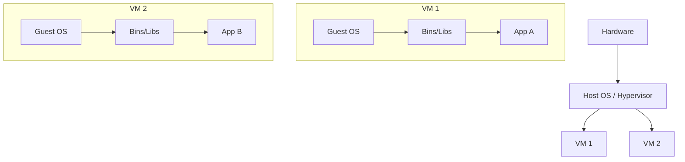
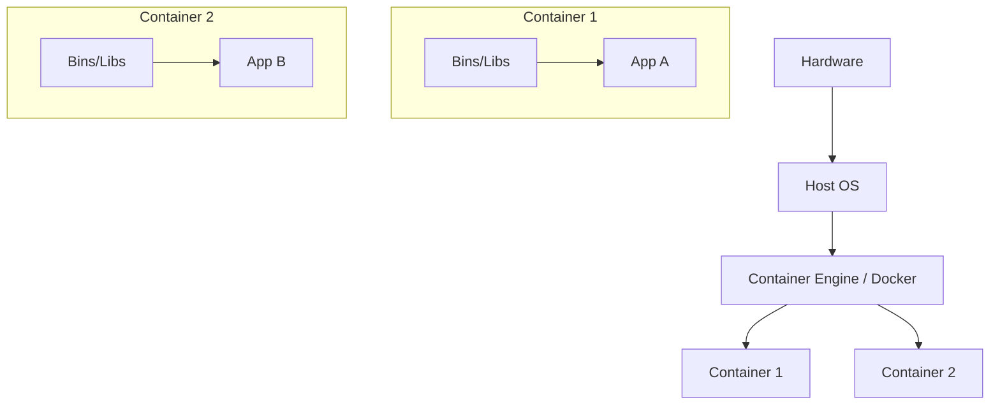
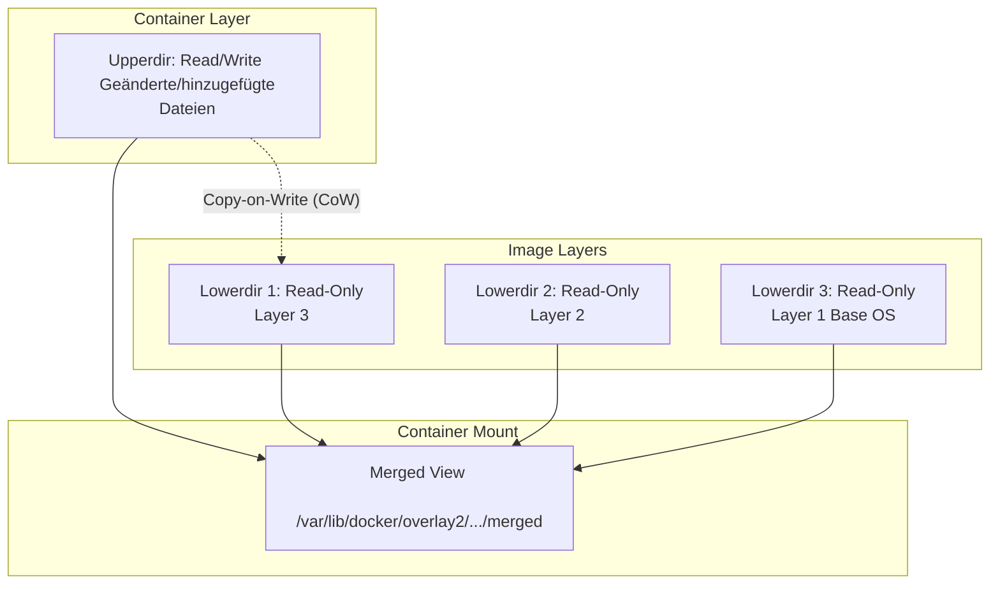
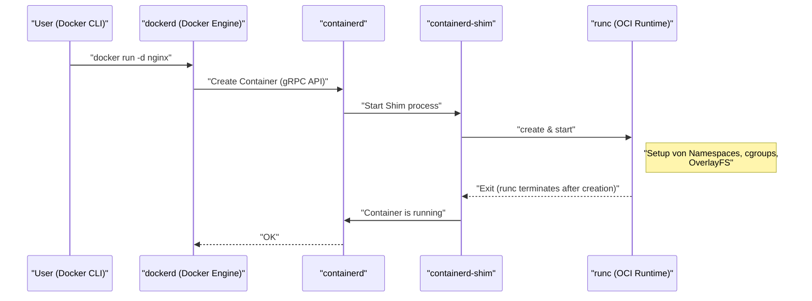
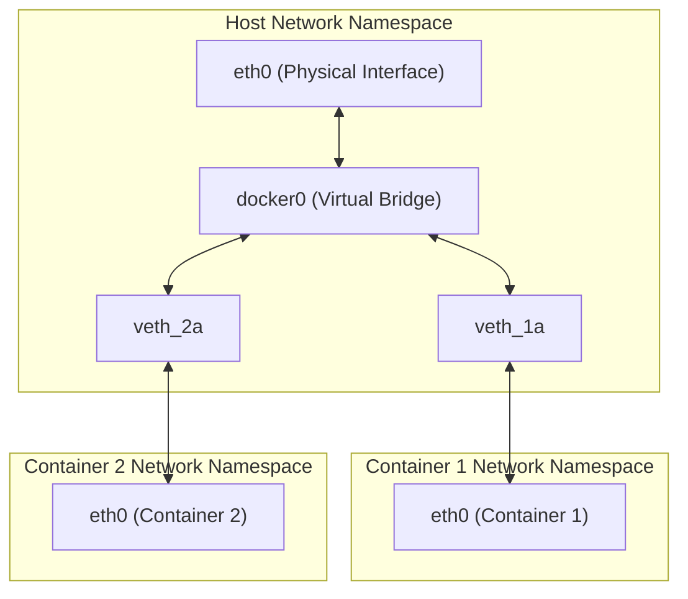

## 1. Einführung: Was ist Container-Technologie?

Viele Entwickler kennen Docker als „praktisches Werkzeug zum einfachen Erstellen und Teilen von Umgebungen“. Es gibt jedoch überraschend wenige, die wirklich tiefgehend verstehen, was hinter den Kulissen von Docker passiert und warum es so ressourcenschonend und schnell läuft.

In diesem Artikel gehen wir einen Schritt über die oberflächliche Nutzung von Docker-Befehlen hinaus und dringen zum **Kern der Container-Technologie** vor. Konkret analysieren wir gründlich die Kernfunktionen des Linux-Kernels, die Container ermöglichen: **Namespace**, **cgroups** und Mechanismen wie **OverlayFS**, das das Dateisystem bildet.

Mit diesem Wissen können Sie Leistungsoptimierungen, Sicherheitsverbesserungen und Fehlerbehebungen wesentlich zielgerichteter durchführen.

## 2. Der entscheidende Unterschied zwischen Virtuellen Maschinen (VM) und Containern

Um Container zu verstehen, sollten wir zunächst den Unterschied zur traditionellen Virtuellen Maschine (Virtual Machine) klären.

### Architektur der Virtuellen Maschine

Bei einer Virtuellen Maschine wird ein Hypervisor (wie VMware ESXi, KVM, Hyper-V usw.) auf einem physischen Server bereitgestellt, auf dem dann mehrere Gast-Betriebssysteme (Virtual Machines) laufen.



Der VM-Ansatz bietet eine vollständige Isolationsumgebung, da er ab der Hardware-Ebene emuliert wird. Die Herausforderung besteht jedoch darin, dass für jede VM ein eigener Kernel (Guest OS) gestartet werden muss, was zu langsamen Startzeiten und einem hohen Overhead bei Arbeitsspeicher und CPU führt.

### Architektur von Containern

Auf der anderen Seite **teilen Container sich den Kernel des Host-Betriebssystems**.



In Wirklichkeit sind Container nichts anderes als „nur isolierte Linux-Prozesse“. Da kein Prozess zum Starten eines Kernels erforderlich ist, starten sie im Millisekundenbereich und der Overhead bleibt minimal.

Die Magie, die diesen „Prozess isoliert und ihn wie ein eigenständiges Betriebssystem erscheinen lässt“, wird durch **Namespace** und **cgroups** ermöglicht, die im nächsten Kapitel erläutert werden.

---

## 3. „Namespace“ für die Container-Isolation

Der **Namespace (Namensraum)** des Linux-Kernels bietet Prozessen eine isolierte Sicht auf die Systemressourcen. Ein Prozess innerhalb eines bestimmten Namespaces sieht nur die Ressourcen desselben Namespaces. Dadurch wird es möglich, dass mehrere Prozesse ohne gegenseitige Beeinflussung auf demselben System laufen.

Der Linux-Kernel bietet hauptsächlich die folgenden sechs Arten von Namespaces:

### 3.1 PID Namespace (Isolierung der Prozess-IDs)

In einem Linux-System startet beim Booten `init` oder `systemd` als PID (Process ID) 1, und nachfolgenden Prozessen werden fortlaufende PIDs zugewiesen.
Wenn der PID Namespace verwendet wird, wird dem ersten Prozess, der in einem neuen Namespace gestartet wird, wieder die PID 1 zugewiesen.

Wenn Sie in einen Container hineingehen und den Befehl `ps aux` ausführen, sehen Sie nur die Prozesse, die im Container ausgeführt werden, und nicht die Prozesse auf der Host-Seite. Dies ist dem PID Namespace zu verdanken.

### 3.2 Mount Namespace (Isolierung des Dateisystems)

Er isoliert die Mount-Punkte der Prozesse. Dass jeder Container ein eigenes Root-Verzeichnis (`/`) haben kann, ist dieser Funktion zu verdanken. Er baut einen Dateisystembaum unabhängig vom Host-Dateisystem auf und kann Mount- und Unmount-Vorgänge durchführen, ohne andere Namespaces zu beeinflussen.

### 3.3 Network Namespace (Isolierung des Netzwerks)

Er isoliert Netzwerkschnittstellen, IP-Adressen, Routing-Tabellen, iptables-Regeln usw. Dem Network Namespace ist es zu verdanken, dass jeder Container seine eigene IP-Adresse (z. B. `172.17.0.2`) hat und unabhängig von den Netzwerkeinstellungen des Hosts kommunizieren kann.

### 3.4 UTS Namespace (Isolierung von Hostnamen und Domainnamen)

Er isoliert Hostnamen und NIS-Domainnamen. Dadurch kann jeder Container seinen eigenen Hostnamen haben (den Wert, der mit dem Befehl `hostname` überprüft werden kann).

### 3.5 IPC Namespace (Isolierung der Interprozesskommunikation)

Er isoliert System V IPC (Inter-Process Communication) Objekte und POSIX-Message-Queues. Er verhindert, dass Prozesse in verschiedenen Containern versehentlich auf gemeinsam genutzten Speicher zugreifen.

### 3.6 User Namespace (Isolierung von Benutzern und Gruppen)

Er isoliert den Raum der Benutzer-IDs (UID) und Gruppen-IDs (GID). Dies ermöglicht es, dass ein Prozess, der innerhalb des Containers als **root (UID 0)** läuft, auf dem Host als **allgemeiner Benutzer (nicht-privilegierter Benutzer)** gemappt wird. Aus Sicherheitsperspektive eine extrem wichtige Funktion.

### 💡 Hands-on: Manuelle Erstellung eines Namespaces

Mit dem Linux-Befehl `unshare` können Sie einen Namespace manuell erstellen und Prozesse darin ausführen. Erleben Sie die Grundlagen von Containern, ohne Docker zu verwenden.

```bash
# Einen neuen PID-, UTS- und Mount-Namespace erstellen und bash ausführen
$ sudo unshare --pid --uts --mount --fork --mount-proc /bin/bash

# Überprüfen, ob der Hostname geändert werden kann (Vorteil des UTS-Namespace)
root@host# hostname container-test
root@container-test# hostname
container-test

# Prozessliste überprüfen (Vorteil von PID-Namespace und Mount-Namespace)
root@container-test# ps aux
USER         PID %CPU %MEM    VSZ   RSS TTY      STAT START   TIME COMMAND
root           1  0.0  0.0   7236  4160 pts/0    S    10:00   0:00 /bin/bash
root          15  0.0  0.0   8892  3280 pts/0    R+   10:01   0:00 ps aux
```

Wie Sie sehen, sind die Host-Prozesse bei Ausführung von `ps aux` nicht sichtbar, und `/bin/bash` läuft als PID 1. Das ist das grundlegende Wesen eines Containers.

---

## 4. „cgroups“ zur Begrenzung von Container-Ressourcen

Während Namespace für die „Isolierung des Raums“ zuständig ist, sind **cgroups (Control Groups)** für die „Begrenzung der Ressourcen“ verantwortlich.

Wenn ein Container außer Kontrolle gerät und die CPU oder den Arbeitsspeicher des Hosts aufbraucht, würden andere Container oder das Host-System selbst abstürzen (Noisy Neighbor-Problem). Um dies zu verhindern, ist es die Aufgabe von cgroups, Obergrenzen für die Nutzung von Ressourcen (CPU, Arbeitsspeicher, Festplatten-I/O, Netzwerkbandbreite usw.) für Prozessgruppen festzulegen.

### Wichtige cgroups-Subsysteme

- **cpu**: Steuert das CPU-Scheduling (Prozentsatz der Nutzungszeit oder Obergrenze).
- **memory**: Legt eine Obergrenze für die Speichernutzung fest und steuert das Verhalten (z.B. Prozessbeendigung durch den OOM Killer), wenn das Limit erreicht wird.
- **blkio**: Begrenzt die I/O-Bandbreite zu Blockgeräten (Festplatten).
- **pids**: Begrenzt die Anzahl der Prozesse (Threads), die in einer cgroup erstellt werden können, und verhindert so Angriffe wie Fork-Bomben (Fork Bomb).

### 💡 Hands-on: Manuelle Konfiguration von cgroups

Lassen Sie uns tatsächlich eine cgroup erstellen, die eine Speicherbegrenzung anwendet (Beispiel für cgroups v1).

```bash
# Eine Gruppe zur Speicherbegrenzung erstellen
$ sudo mkdir /sys/fs/cgroup/memory/test_group

# Das Speicherlimit auf 50MB setzen
$ echo 50000000 | sudo tee /sys/fs/cgroup/memory/test_group/memory.limit_in_bytes

# Den aktuellen Prozess (Shell) zu dieser Gruppe hinzufügen
$ echo $$ | sudo tee /sys/fs/cgroup/memory/test_group/tasks

# Wenn in diesem Zustand ein Vorgang ausgeführt wird, der viel Speicher verbraucht, wird das Limit erreicht und der Prozess wird beendet (gekillt)
```

Wenn Sie Docker verwenden, werden die Optionen, die an den `docker run` Befehl übergeben werden, im Hintergrund in diese cgroups-Einstellungen umgewandelt.

```bash
# Beispiel für Speicher- und CPU-Begrenzung mit Docker
$ docker run -d --name web --memory="256m" --cpus="0.5" nginx
```

---

## 5. Das Container-Dateisystem und OverlayFS (Image-Schichten)

Eines der Merkmale von Containern ist die „Schichtenstruktur (Layer-Struktur) von Images“. Ein Docker-Image ist keine einzelne riesige Datei, sondern besteht aus mehreren übereinanderliegenden Schichten. Dies wird durch das **Union File System (UnionFS)** ermöglicht, insbesondere durch **OverlayFS**, das standardmäßig in modernen Linux-Systemen verwendet wird.

### Funktionsweise von OverlayFS

OverlayFS ist eine Technologie, die verschiedene Verzeichnisse (untere und obere Schichten) zusammenführt und als ein einziges, integriertes Dateisystem präsentiert.



1. **Lowerdir (Unteres Verzeichnis)**: Entspricht den einzelnen Schichten (Layers) des Docker-Images. Diese werden als **Read-Only (Schreibgeschützt)** behandelt. Wenn mehrere Container dasselbe Image verwenden, teilen sie sich dieses untere Verzeichnis, was erheblich Speicherplatz spart.
2. **Upperdir (Oberes Verzeichnis)**: Eine dedizierte **Read/Write (Lese-/Schreibzugriff)**-Schicht für den Container, die beim Start des Containers hinzugefügt wird. Wenn Sie Dateien innerhalb des Containers erstellen oder ändern, werden alle in diese obere Schicht geschrieben.
3. **Merged View**: Integriert Lowerdir und Upperdir und stellt sie dem Container als ein einziges Dateisystem zur Verfügung.

### Copy-on-Write (CoW) Strategie

Wenn ein Versuch unternommen wird, eine vorhandene Datei (in der unteren Schicht) im Container zu bearbeiten, kopiert OverlayFS die Zieldatei automatisch in die obere Schicht (Upperdir) und wendet die Änderungen auf diese Kopie an. Dies wird als **Copy-on-Write (CoW)** bezeichnet. Die untere Datei selbst wird niemals verändert.

Dadurch wird, wenn der Container zerstört wird, auch das Upperdir gelöscht und die Daten gehen verloren. Daten, die persistent gespeichert werden müssen, werden gelöst, indem Host-Verzeichnisse über **Docker Volumes (Bind Mounts etc.)** direkt in den Container gemountet werden.

### Die Beziehung zwischen Dockerfile und Layern

Jeder Befehl in einem `Dockerfile` (`FROM`, `RUN`, `COPY` usw.) generiert eine neue Schicht (Lowerdir).

```dockerfile
# Layer 1: Basis-OS
FROM ubuntu:22.04

# Layer 2: Installation von Paketen
RUN apt-get update && apt-get install -y python3

# Layer 3: Kopieren des Quellcodes
COPY . /app

# Metadaten-Konfiguration (Es wird kein Layer generiert)
CMD ["python3", "/app/main.py"]
```

Um die Anzahl der Layer zu reduzieren, wird häufig die Technik verwendet, mehrere `RUN`-Befehle mit `&&` zu verknüpfen. Dies ist eine Optimierung, um zu verhindern, dass die OverlayFS-Schichten zu tief werden, und um die Image-Größe gering zu halten.

---

## 6. Die Architektur von Docker (Docker Engine, containerd, runc)

Das frühe Docker war in einem monolithischen (riesigen, zusammenhängenden) Design aufgebaut, aber heute sind die Funktionen aufgeteilt und die Standardisierung (OCI: Open Container Initiative) ist vorangeschritten. Der aktuelle Container-Lebenszyklus basiert auf der Zusammenarbeit der folgenden Komponenten.



1. **Docker CLI**: Das Befehlszeilenwerkzeug, das vom Benutzer bedient wird.
2. **dockerd (Docker Daemon)**: Bietet übergeordnete Funktionen wie Image-Erstellung, Netzwerkmanagement, Volumenmanagement usw.
3. **containerd**: Ein Daemon, der auf die Verwaltung des Container-Lebenszyklus (Image Pull, Starten und Stoppen von Containern) spezialisiert ist. Es ist eine Standardkomponente, die auch in [Kubernetes](https://kenji.blog/de/p/kubernetes-k8s-architecture-pod-service-ingress/) und anderen Systemen verwendet wird.
4. **runc**: Eine Low-Level-Container-Laufzeitumgebung (Runtime), die dem OCI (Open Container Initiative) Standard entspricht. Sie ist dafür verantwortlich, die zuvor erwähnten Namespace- und cgroups-Einstellungen tatsächlich auf den Kernel anzuwenden und den Prozess zu starten. Nach Abschluss des Startvorgangs wird `runc` selbst beendet.
5. **containerd-shim**: Wird zum übergeordneten Prozess des Containerprozesses (PID 1), verwaltet die Standardein- und -ausgabe des Containers und meldet den Status an `containerd`, wenn der Container beendet wird. Dadurch kann der Container selbst weiterlaufen, selbst wenn `dockerd` oder `containerd` neu gestartet werden.

---

## 7. Fortgeschrittene Container-Netzwerke

Lassen Sie uns abschließend auf den Network Namespace und den Mechanismus der Kommunikation zwischen Containern eingehen.

Das Standard-Netzwerkmodell von Docker ist das **Bridge-Netzwerk**.



- **veth pair (Virtual Ethernet Pair)**: Ein Paar aus zwei virtuellen Schnittstellen; wenn ein Paket in die eine eingeht, kommt es aus der anderen heraus.
- Wenn Docker einen Container erstellt, wird ein neuer Network Namespace erstellt, ein Ende des veth pairs im Container (normalerweise als `eth0` benannt) und das andere Ende auf der Host-Seite (z. B. `vethXXXX`) platziert.
- Das veth auf der Host-Seite wird mit **`docker0` (Bridge-Gerät)**, einem virtuellen Switch, verbunden.
- Dadurch können verschiedene Container über `docker0` miteinander kommunizieren und aufgrund der Routing-Einstellungen des Hosts (NAPT / IP-Masquerading) auch mit dem externen Internet kommunizieren.

---

## 8. Praxis: Optimierung des Dockerfiles

Aufbauend auf dem bisherigen Wissen erklären wir, wie man `Dockerfile`s schreibt, um Leistung und Sicherheit in realen Betriebsumgebungen zu verbessern.

### 8.1 Nutzung von Multi-Stage Builds

Durch die Trennung von Build-Umgebung und Laufzeitumgebung kann die endgültige Image-Größe drastisch reduziert werden. Dies ist besonders effektiv bei kompilierten Sprachen wie Go, Rust, Java usw.

```dockerfile
# --- Stage 1: Build-Umgebung ---
FROM golang:1.21 AS builder
WORKDIR /app
COPY go.mod go.sum ./
RUN go mod download
COPY . .
# Statisch gelinkte Binärdatei kompilieren
RUN CGO_ENABLED=0 GOOS=linux go build -o main .

# --- Stage 2: Laufzeitumgebung ---
# Als Basis-Image ein leichtgewichtiges alpine oder scratch verwenden
FROM alpine:3.18
WORKDIR /app
# Nur die kompilierte Binärdatei aus der builder-Stage kopieren
COPY --from=builder /app/main .

# Einen nicht-privilegierten Benutzer erstellen und ausführen (zur Erhöhung der Sicherheit)
RUN addgroup -S appgroup && adduser -S appuser -G appgroup
USER appuser

EXPOSE 8080
CMD ["./main"]
```

### 8.2 Effizienzsteigerung des Layer-Caches

Docker verwendet Layer beim Builden von oben nach unten als Cache wieder. Indem man das `COPY` von Dateien, die sich häufig ändern (wie Quellcode), nach hinten verschiebt, kann die Cache-Trefferquote erhöht und die Build-Zeit verkürzt werden.

### 8.3 Auswahl des kleinsten Basis-Images

- **ubuntu/debian**: Sehr universell, aber groß.
- **alpine**: Extrem leichtgewichtig (einige MB), aber da die Standard-C-Bibliothek `musl` statt `glibc` ist, kann es bei einigen Binärdateien (z. B. Python-C-Erweiterungsmodulen) zu Kompatibilitätsproblemen kommen.
- **distroless**: Ein von Google bereitgestelltes Image, das nur die minimalen Abhängigkeiten enthält, die zum Ausführen der Anwendung erforderlich sind. Da es nicht einmal eine Shell (`/bin/sh`) enthält, ist es extrem sicher (selbst wenn ein Angreifer in den Container eindringt, kann er keine Befehle ausführen).

---

## 9. Mathematische Perspektive: Optimierungsmodell für die Ressourcenzuweisung

Um die Dichte von Containern zu erhöhen, stellt sich die Frage, wie man $n$ Container in Bezug auf die Ressourcen (CPU $C$, Speicher $M$) der Host-Maschine platziert. Dies kann als eine Art **Bin-Packing-Problem (Bin Packing Problem)** formuliert werden.

Angenommen, der von jedem Container $i$ geforderte CPU-Bedarf ist $c_i$ und der Speicher $m_i$, und die Kapazität des Hosts $j$ ist $C_j, M_j$.
Wenn $x_{ij} = 1$ (sonst $0$), wenn Container $i$ auf Host $j$ platziert wird, und $y_j = 1$, wenn Host $j$ verwendet wird, lässt sich das Problem der Platzierung von Containern mit der minimalen Anzahl von Hosts wie folgt darstellen:

$$
\min \sum_{j=1}^{m} y_j \\\\
\text{unter den Nebenbedingungen} \\\\
\sum_{i=1}^{n} c_i x_{ij} \le C_j y_j, \quad \forall j \\\\
\sum_{i=1}^{n} m_i x_{ij} \le M_j y_j, \quad \forall j \\\\
\sum_{j=1}^{m} x_{ij} = 1, \quad \forall i
$$

[Kubernetes](https://kenji.blog/de/p/kubernetes-k8s-architecture-pod-service-ingress/) und andere Orchestrator-Scheduler weisen Container geeigneten Nodes zu, indem sie intern solche Constraint-Satisfaction-Probleme (heuristische Approximationen durch Scoring) lösen.

---

## 10. Zusammenfassung

In diesem Artikel haben wir die Tiefen der Container-Technologie erforscht, die hinter den Kulissen von Docker arbeitet.

1. „Isolierung des Raums“ von Prozessen, Netzwerken, Dateisystemen usw. durch **Namespace**.
2. „Begrenzung von Ressourcen“ wie CPU und Arbeitsspeicher durch **cgroups**.
3. Effizientes Dateisystem-Management durch eine Schichtenstruktur (Layer-Struktur) und Copy-on-Write mittels **OverlayFS**.
4. Eine modulare Architektur mit `containerd` und `runc`, die auf dem OCI-Standard basiert.
5. Netzwerkkonfigurationen durch virtuelle Bridges und veth-Paare.

Container sind keineswegs magische Boxen, sondern eine **„ausgeklügelte Methode des Prozessmanagements“**, die durch eine Kombination robuster Funktionen des Linux-Kernels verwirklicht wird. Ein Verständnis dieses grundlegenden Mechanismus wird Ihr Verständnis für Dockerfile-Optimierungen, Fehlerbehebung und sogar fortgeschrittene Orchestrierungstools wie [Kubernetes](https://kenji.blog/de/p/kubernetes-k8s-architecture-pod-service-ingress/) noch weiter vertiefen.

Wenn Sie das nächste Mal einen Container erstellen, führen Sie die Befehle aus und stellen Sie sich dabei vor: „Jetzt gerade wird im Hintergrund ein Namespace erstellt und OverlayFS gemountet“. Ihre Entwicklungserfahrung wird dadurch mit Sicherheit bereichert werden.
