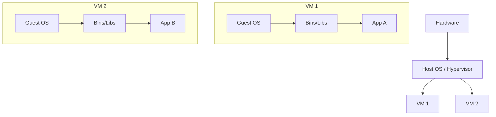
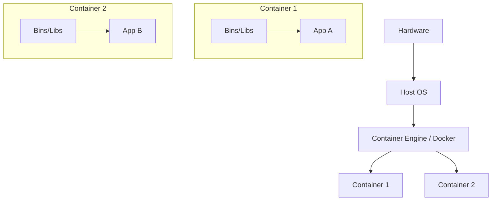
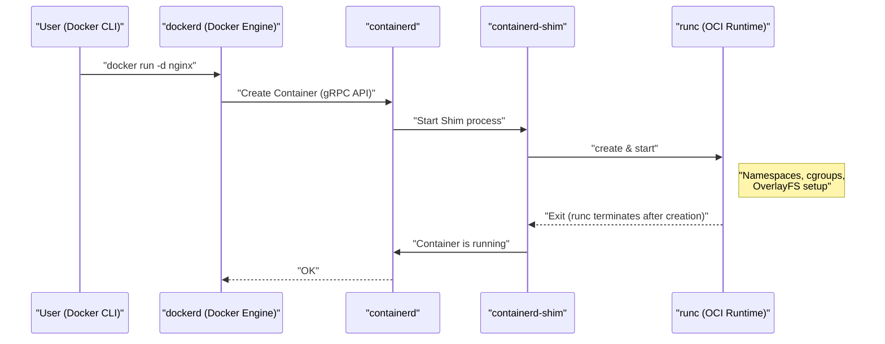
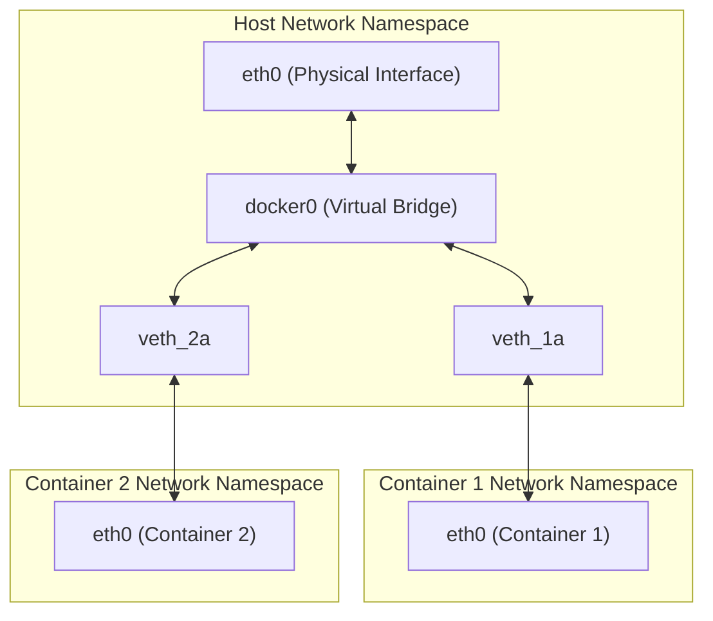

## 1. Introduction: What is Container Technology?

For many developers, Docker is perceived as a "convenient tool to easily build and share environments." However, surprisingly few people deeply understand what is happening behind the scenes of Docker, or why it operates so lightweight and fast.

In this article, we will go a step beyond the superficial usage of Docker commands and approach the **essence of container technology**. Specifically, we will thoroughly dissect the mechanisms of the core Linux kernel features that realize containers: **Namespace**, **cgroups**, and **OverlayFS**, which constructs the file system.

Having this knowledge will enable you to perform performance tuning, security enhancements, and troubleshooting more accurately.

## 2. The Decisive Difference Between Virtual Machines (VMs) and Containers

To understand containers, let's first clarify the difference from traditional Virtual Machines (VMs).

### Architecture of Virtual Machines

A virtual machine places a hypervisor (such as VMware ESXi, KVM, Hyper-V) on a physical server, and runs multiple guest OSes (Virtual Machines) on top of it.



The VM approach provides a completely isolated environment because it emulates from the hardware level. However, since an independent kernel (Guest OS) must be booted for each VM, it has the drawbacks of slow startup and large memory and CPU overhead.

### Architecture of Containers

On the other hand, containers **share the host OS kernel**.



In reality, a container is nothing more than "just an isolated Linux process." Since a process to boot a kernel is not required, it starts up in milliseconds, and the overhead is kept to a minimum.

The magic that "isolates a process as if it were an independent OS" is realized by **Namespace** and **cgroups**, which we will explain in the next section.

---

## 3. "Namespace": Achieving Container Isolation

The **Namespace** of the Linux kernel is a feature that provides a process with an isolated view of system resources. A process within a certain Namespace can only see resources within the same Namespace. This allows multiple processes to operate on the same system without interfering with each other.

The Linux kernel mainly provides the following six types of Namespaces:

### 3.1 PID Namespace (Process ID Isolation)

In a Linux system, `init` or `systemd` starts as PID (Process ID) 1 at boot time, and subsequent processes are assigned PIDs sequentially.
When a PID Namespace is used, the first process started within the new Namespace is again assigned PID 1.

If you go inside a container and run the `ps aux` command, you will only see the processes running inside the container, and not the host-side processes. This is due to the PID Namespace.

### 3.2 Mount Namespace (File System Isolation)

Isolates the mount points of a process. This feature is what allows each container to have an independent root directory (`/`). It can build a separate file system tree from the host's file system, and mount/unmount operations will not affect other Namespaces.

### 3.3 Network Namespace (Network Isolation)

Isolates network interfaces, IP addresses, routing tables, iptables rules, etc. Thanks to the Network Namespace, each container can have its own IP address (e.g., `172.17.0.2`) and communicate independently of the host's network settings.

### 3.4 UTS Namespace (Hostname and Domain Name Isolation)

Isolates the hostname and NIS domain name. This allows each container to have its own hostname (the value that can be checked with the `hostname` command).

### 3.5 IPC Namespace (Inter-Process Communication Isolation)

Isolates System V IPC (Inter-Process Communication) objects and POSIX message queues. This prevents processes in different containers from accidentally accessing shared memory.

### 3.6 User Namespace (User and Group Isolation)

Isolates the space of User IDs (UIDs) and Group IDs (GIDs). This allows a process running as **root (UID 0)** inside the container to be mapped and treated as a **general user (unprivileged user)** on the host. This is a very important feature from a security perspective.

### 💡 Hands-on: Manually Creating a Namespace

By using the Linux `unshare` command, you can manually create a Namespace and run a process within it. Let's experience the basics of containers without using Docker.

```bash
# Create new PID, UTS, and Mount Namespaces, and run bash
$ sudo unshare --pid --uts --mount --fork --mount-proc /bin/bash

# Check if the hostname can be changed (Benefit of UTS Namespace)
root@host# hostname container-test
root@container-test# hostname
container-test

# Check the process list (Benefit of PID and Mount Namespaces)
root@container-test# ps aux
USER         PID %CPU %MEM    VSZ   RSS TTY      STAT START   TIME COMMAND
root           1  0.0  0.0   7236  4160 pts/0    S    10:00   0:00 /bin/bash
root          15  0.0  0.0   8892  3280 pts/0    R+   10:01   0:00 ps aux
```

As you can see, even if you run `ps aux`, you cannot see the host processes, and `/bin/bash` is operating as PID 1. This is the fundamental true nature of a container.

---

## 4. "cgroups": Performing Resource Limitation for Containers

While Namespace is in charge of "space isolation," **cgroups (Control Groups)** is in charge of "resource limitation."

If a certain container goes out of control and exhausts the host's CPU or memory, other containers and the host system itself will go down (the Noisy Neighbor problem). The role of cgroups is to set usage limits on resources (CPU, memory, disk I/O, network bandwidth, etc.) for process groups to prevent this.

### Major cgroups Subsystems

- **cpu**: Controls CPU scheduling (ratio or upper limit of usage time).
- **memory**: Sets the upper limit of memory usage and controls the behavior when the limit is reached (such as terminating the process by the OOM Killer).
- **blkio**: Limits the I/O bandwidth to block devices (disks).
- **pids**: Limits the number of processes (threads) that can be created within a cgroup, preventing attacks such as a Fork Bomb.

### 💡 Hands-on: Manually Configuring cgroups

Let's actually create a cgroup that applies a memory limit (example of cgroups v1).

```bash
# Create a group for memory limitation
$ sudo mkdir /sys/fs/cgroup/memory/test_group

# Set the memory limit to 50MB
$ echo 50000000 | sudo tee /sys/fs/cgroup/memory/test_group/memory.limit_in_bytes

# Add the current process (shell) to this group
$ echo $$ | sudo tee /sys/fs/cgroup/memory/test_group/tasks

# If you execute a process that consumes a large amount of memory in this state, it will reach the limit and be Killed
```

When using Docker, the options passed to the `docker run` command are converted into these cgroups settings behind the scenes.

```bash
# Example of memory and CPU limitation in Docker
$ docker run -d --name web --memory="256m" --cpus="0.5" nginx
```

---

## 5. Container File System and OverlayFS (Image Layers)

One of the characteristics of containers is the "image layer structure." A Docker image is not a single giant file, but is composed of multiple overlapping layers. This is realized by **Union File System (UnionFS)**, especially **OverlayFS**, which is standardly used in recent Linux systems.

### How OverlayFS Works

OverlayFS is a technology that merges different directories (lower and upper layers) and presents them as a single unified file system.

```mermaid
graph TD
    subgraph "Container Mount"
        Merge["Merged View <br> /var/lib/docker/overlay2/.../merged"]
    end
    
    subgraph "Container Layer"
        Upper["Upperdir: Read/Write <br> Modified/added files"]
    end
    
    subgraph "Image Layers"
        Lower1["Lowerdir 1: Read-Only <br> Layer 3"]
        Lower2["Lowerdir 2: Read-Only <br> Layer 2"]
        Lower3["Lowerdir 3: Read-Only <br> Layer 1 Base OS"]
    end
    
    Upper --> Merge
    Lower1 --> Merge
    Lower2 --> Merge
    Lower3 --> Merge
    
    Upper -.->|"Copy-on-Write (CoW)"| Lower1
```



1. **Lowerdir (Lower Directory)**: Corresponds to each layer of the Docker image. These are treated as **Read-Only**. When multiple containers use the same image, they share this lower directory, which can significantly save disk space.
2. **Upperdir (Upper Directory)**: A **Read/Write** layer exclusive to that container, which is added when the container starts. When files are created or modified inside the container, everything is written to this upper layer.
3. **Merged View**: Integrates the Lowerdir and Upperdir, and provides them as a single file system visible from the container.

### Copy-on-Write (CoW) Strategy

When trying to edit an existing file (a file in the lower layer) inside a container, OverlayFS automatically copies the target file to the upper layer (Upperdir) and applies changes to that copy. This is called **Copy-on-Write (CoW)**. The lower file itself is never modified.

As a result, when a container is destroyed, the Upperdir is also deleted, and the data disappears. Data that requires persistence is solved by directly mounting the host's directory inside the container using **Docker Volumes (such as bind mounts)**.

### Relationship Between Dockerfile and Layers

Each instruction (such as `FROM`, `RUN`, `COPY`) in a `Dockerfile` generates one new layer (Lowerdir).

```dockerfile
# Layer 1: Base OS
FROM ubuntu:22.04

# Layer 2: Package installation
RUN apt-get update && apt-get install -y python3

# Layer 3: Copy source code
COPY . /app

# Metadata settings (layers are not generated)
CMD ["python3", "/app/main.py"]
```

To reduce the number of layers, the technique of chaining multiple `RUN` commands with `&&` is often used. This is an optimization to prevent the OverlayFS layers from becoming too deep and to keep the image size small.

---

## 6. Docker Architecture (Docker Engine, containerd, runc)

Early Docker had an entirely monolithic (a single giant block) design, but today, its features are divided, and standardization (OCI: Open Container Initiative) is progressing. The current lifecycle of a container consists of the collaboration of the following components.



1. **Docker CLI**: A command-line tool operated by the user.
2. **dockerd (Docker Daemon)**: Provides high-level features such as image building, network management, and volume management.
3. **containerd**: A daemon specialized in container lifecycle management (pulling images, starting and stopping containers). It is a standard component that is also used in [Kubernetes](https://kenji.blog/en/p/kubernetes-k8s-architecture-pod-service-ingress/) and others.
4. **runc**: A low-level container runtime compliant with the OCI (Open Container Initiative) standard. It takes on the role of actually applying the aforementioned Namespace and cgroups settings to the kernel and starting the process. After the startup is complete, `runc` itself terminates.
5. **containerd-shim**: Becomes the parent process of the container process (PID 1), manages the standard I/O of the container, and reports the status upon container termination to `containerd`. This allows the container itself to continue running even if `dockerd` or `containerd` is restarted.

---

## 7. Advanced Container Networking

Finally, let's touch on Network Namespace and the mechanism of communication between containers.

The default network model in Docker is the **Bridge network**.



- **veth pair (Virtual Ethernet Pair)**: A pair of two virtual interfaces; when a packet enters one side, it comes out of the other.
- When creating a container, Docker creates a new Network Namespace, places one side of the veth pair inside the container (usually named `eth0`), and the other side on the host side (such as `vethXXXX`).
- The host-side veth is connected to **`docker0` (bridge device)**, which is a virtual switch.
- This allows different containers to communicate with each other via `docker0`, and also enables communication with the external internet through the host's routing settings (NAPT / IP Masquerade).

---

## 8. Practice: Optimizing Dockerfile

Based on the knowledge so far, we will explain how to write a `Dockerfile` to improve performance and security in real-world operations.

### 8.1 Utilizing Multi-stage Builds

By separating the build environment from the execution environment, you can drastically reduce the final image size. This is especially effective in compiled languages such as [Go](https://kenji.blog/en/p/programming-languages-history-paradigm-evolution/), Rust, and [Java](https://kenji.blog/en/p/programming-languages-history-paradigm-evolution/).

```dockerfile
# --- Stage 1: Build environment ---
FROM golang:1.21 AS builder
WORKDIR /app
COPY go.mod go.sum ./
RUN go mod download
COPY . .
# Build statically linked binary
RUN CGO_ENABLED=0 GOOS=linux go build -o main .

# --- Stage 2: Execution environment ---
# Adopt a lightweight alpine or scratch as the base image
FROM alpine:3.18
WORKDIR /app
# Copy only the compiled binary from the builder stage
COPY --from=builder /app/main .

# Create and run as an unprivileged user (for improved security)
RUN addgroup -S appgroup && adduser -S appuser -G appgroup
USER appuser

EXPOSE 8080
CMD ["./main"]
```

### 8.2 Improving Layer Cache Efficiency

During the build, Docker reuses layers from top to bottom as a cache. By delaying the `COPY` of frequently modified files (source code), you can increase the cache hit rate and shorten build times.

### 8.3 Selecting the Smallest Base Image

- **ubuntu/debian**: Versatile but large in size.
- **alpine**: Extremely lightweight (a few MB), but because the standard C library is `musl` instead of `glibc`, compatibility issues may arise with some binaries (such as Python C extension modules).
- **distroless**: Provided by Google, these images contain only the minimum dependencies necessary to run the application. Since it doesn't even contain a shell (`/bin/sh`), it is extremely secure (even if an attacker invades the container, they cannot execute commands).

---

## 9. Mathematical Perspective: Optimization Model for Resource Allocation

When increasing container density, how to allocate $n$ containers against the host machine's resources (CPU $C$, Memory $M$) becomes a challenge. This can be formulated as a type of **Bin Packing Problem**.

Let the CPU and memory required by each container $i$ be $c_i$ and $m_i$, respectively, and let the capacity of host $j$ be $C_j, M_j$.
If $x_{ij} = 1$ when container $i$ is placed on host $j$ (and $0$ otherwise), and $y_j = 1$ when host $j$ is used, the problem of placing containers with the minimum number of hosts can be expressed as follows.

$$
\min \sum_{j=1}^{m} y_j \\\\
\text{subject to} \\\\
\sum_{i=1}^{n} c_i x_{ij} \le C_j y_j, \quad \forall j \\\\
\sum_{i=1}^{n} m_i x_{ij} \le M_j y_j, \quad \forall j \\\\
\sum_{j=1}^{m} x_{ij} = 1, \quad \forall i
$$

The schedulers of orchestrators like [Kubernetes](https://kenji.blog/en/p/kubernetes-k8s-architecture-pod-service-ingress/) assign containers to appropriate nodes while internally solving such constraint satisfaction problems (heuristic approximation by scoring).

---

## 10. Conclusion

In this article, we explored the depths of the container technology running behind Docker.

1. "Space isolation" such as processes, networks, and file systems by **Namespace**.
2. "Resource limitation" such as CPU and memory by **cgroups**.
3. Efficient file system management through layer structure and Copy-on-Write by **OverlayFS**.
4. Modular architecture by `containerd` and `runc` based on the OCI standard.
5. Network configuration via virtual bridges and veth pairs.

Containers are by no means magic boxes, but a **"sophisticated process management method"** realized by combining the robust features of the Linux kernel. By understanding this fundamental mechanism, your understanding of optimizing Dockerfiles, troubleshooting, and advanced orchestration tools like [Kubernetes](https://kenji.blog/en/p/kubernetes-k8s-architecture-pod-service-ingress/) will deepen even further.

The next time you build a container, try running the commands while imagining, "Right now, a Namespace is being created behind the scenes, and OverlayFS is being mounted." Your development experience will surely become much richer.
