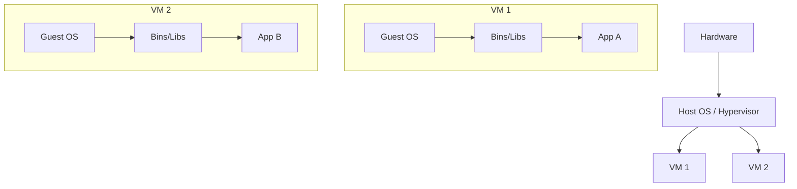
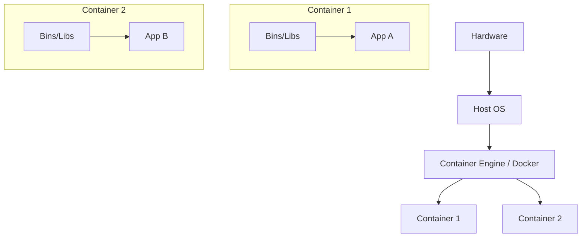
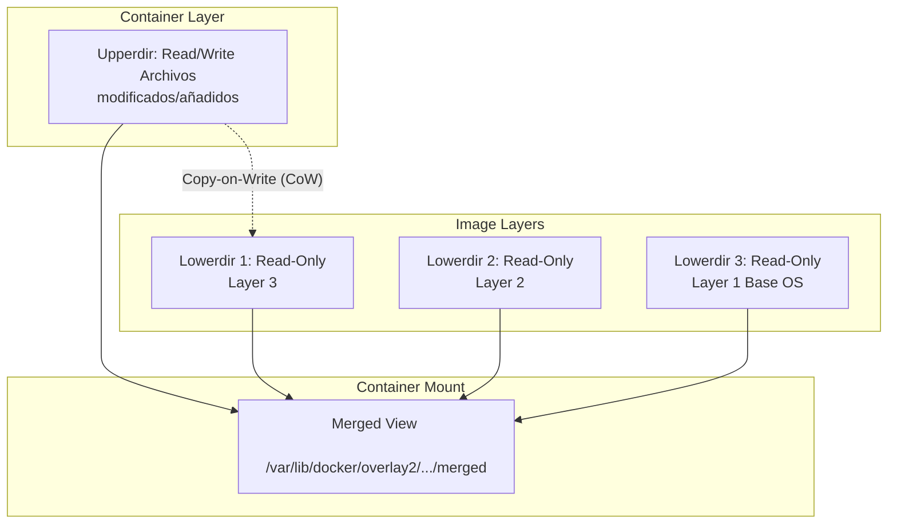
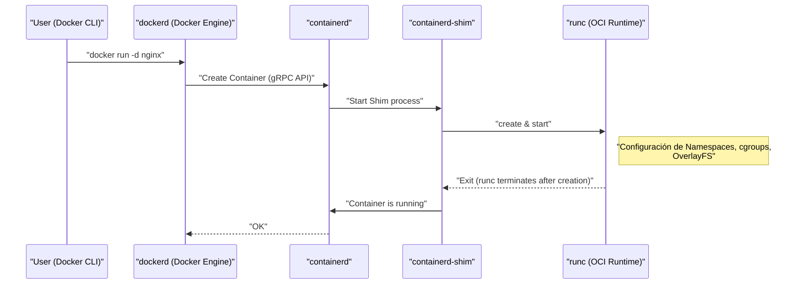
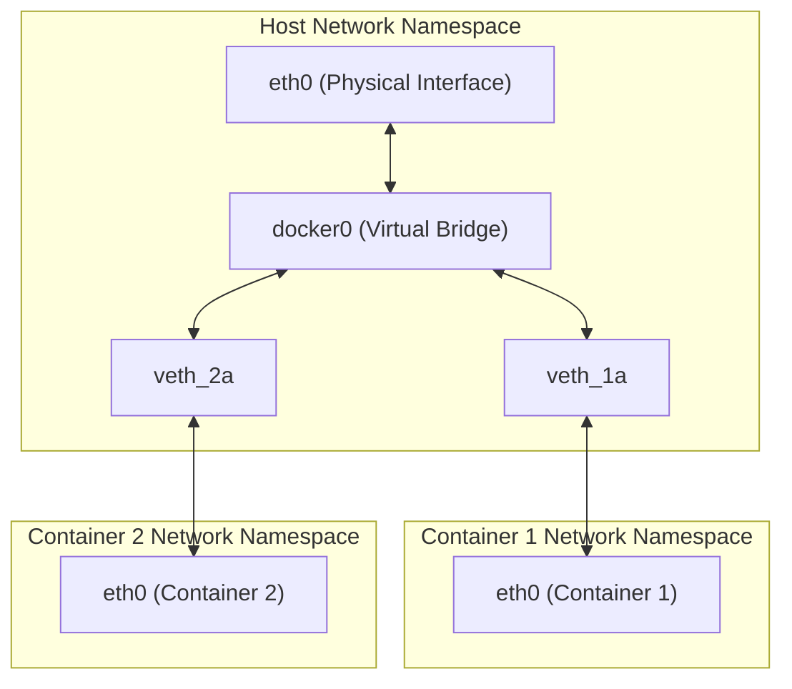

## 1. Introducción: ¿Qué es la tecnología de contenedores?

Para muchos desarrolladores, Docker es reconocido como "una herramienta conveniente para construir y compartir entornos fácilmente". Sin embargo, sorprendentemente, pocas personas comprenden profundamente qué sucede detrás de Docker y por qué funciona de manera tan ligera y rápida.

En este artículo, daremos un paso más allá del uso superficial de los comandos de Docker y nos acercaremos a la **esencia de la tecnología de contenedores**. Específicamente, analizaremos a fondo los mecanismos clave del kernel de Linux que hacen posibles los contenedores, como **Namespace**, **cgroups** y **OverlayFS**, que constituye el sistema de archivos.

Tener este conocimiento le permitirá realizar ajustes de rendimiento, mejorar la seguridad y solucionar problemas de manera más precisa.

## 2. La diferencia decisiva entre las máquinas virtuales (VM) y los contenedores

Para entender los contenedores, primero aclaremos las diferencias con las máquinas virtuales (Virtual Machine) tradicionales.

### Arquitectura de la máquina virtual

Las máquinas virtuales colocan un hipervisor (VMware ESXi, KVM, Hyper-V, etc.) sobre un servidor físico, y sobre él se ejecutan múltiples sistemas operativos invitados (Virtual Machine).



El enfoque de las VM proporciona un entorno de aislamiento completo porque emula desde el nivel de hardware. Sin embargo, como requiere iniciar un kernel independiente (Guest OS) para cada VM, tiene el problema de un inicio lento y una gran sobrecarga (overhead) de memoria y CPU.

### Arquitectura de contenedores

Por otro lado, los contenedores **comparten el kernel del sistema operativo host**.



En realidad, un contenedor no es más que "un simple proceso de Linux aislado". Dado que no se necesita un proceso para iniciar el kernel, se inician en milisegundos y la sobrecarga se mantiene al mínimo.

La magia que logra "aislar un proceso como si fuera un sistema operativo independiente" se realiza a través de **Namespace** y **cgroups**, que explicaremos en el siguiente capítulo.

---

## 3. "Namespace" que realiza el aislamiento de contenedores

El **Namespace (espacio de nombres)** del kernel de Linux es una función que proporciona una vista separada de los recursos del sistema a los procesos. Desde un proceso dentro de un Namespace, solo son visibles los recursos dentro del mismo Namespace. Esto permite que múltiples procesos se ejecuten en el mismo sistema sin interferir entre sí.

El kernel de Linux proporciona principalmente los siguientes 6 tipos de Namespace.

### 3.1 PID Namespace (Aislamiento del ID de proceso)

En los sistemas Linux, al inicio, `init` o `systemd` se inicia como PID (Process ID) 1, y los procesos posteriores reciben PIDs secuenciales.
Cuando se utiliza un PID Namespace, al primer proceso que se inicia dentro del nuevo Namespace se le vuelve a asignar el PID 1.

Si entra en un contenedor y ejecuta el comando `ps aux`, solo verá los procesos que se ejecutan dentro del contenedor y no los procesos del host. Esto se debe al PID Namespace.

### 3.2 Mount Namespace (Aislamiento del sistema de archivos)

Aísla los puntos de montaje de los procesos. Gracias a esta función, cada contenedor puede tener su propio directorio raíz (`/`) independiente. Se construye un árbol del sistema de archivos diferente al del host, permitiendo montar y desmontar sin afectar a otros Namespaces.

### 3.3 Network Namespace (Aislamiento de la red)

Aísla las interfaces de red, direcciones IP, tablas de enrutamiento, reglas de iptables, etc. Gracias al Network Namespace, cada contenedor tiene su propia dirección IP (ej. `172.17.0.2`) y puede comunicarse de manera independiente de la configuración de red del host.

### 3.4 UTS Namespace (Aislamiento del nombre de host y nombre de dominio)

Aísla el nombre de host y el nombre de dominio NIS. Esto permite que cada contenedor tenga su propio nombre de host (el valor que se puede verificar con el comando `hostname`).

### 3.5 IPC Namespace (Aislamiento de la comunicación entre procesos)

Aísla los objetos System V IPC (Inter-Process Communication) y las colas de mensajes POSIX. Evita que procesos de diferentes contenedores accedan accidentalmente a la memoria compartida.

### 3.6 User Namespace (Aislamiento de usuarios y grupos)

Aísla el espacio de los ID de usuario (UID) e ID de grupo (GID). Esto permite que un proceso que opera como **root (UID 0)** dentro del contenedor sea mapeado y tratado como un **usuario general (usuario sin privilegios)** en el host. Es una función muy importante desde la perspectiva de la seguridad.

### 💡 Hands-on: Intentando crear un Namespace manualmente

Usando el comando `unshare` de Linux, puede crear un Namespace manualmente y ejecutar un proceso dentro de él. Experimentemos la base de los contenedores sin usar Docker.

```bash
# Crear un nuevo PID, UTS, y Mount Namespace, y ejecutar bash
$ sudo unshare --pid --uts --mount --fork --mount-proc /bin/bash

# Comprobar si se puede cambiar el nombre de host (beneficio de UTS Namespace)
root@host# hostname container-test
root@container-test# hostname
container-test

# Comprobar la lista de procesos (beneficio de PID Namespace y Mount Namespace)
root@container-test# ps aux
USER         PID %CPU %MEM    VSZ   RSS TTY      STAT START   TIME COMMAND
root           1  0.0  0.0   7236  4160 pts/0    S    10:00   0:00 /bin/bash
root          15  0.0  0.0   8892  3280 pts/0    R+   10:01   0:00 ps aux
```

De esta manera, incluso si ejecuta `ps aux`, no verá los procesos del host y podrá ver que `/bin/bash` se está ejecutando como PID 1. Esta es la verdadera identidad básica de un contenedor.

---

## 4. "cgroups" que realiza la restricción de recursos de los contenedores

Mientras que Namespace se encarga del "aislamiento del espacio", **cgroups (Control Groups)** se encarga de la "restricción de recursos".

Si un contenedor se descontrola y agota la CPU o la memoria del host, otros contenedores o el propio sistema host se colapsarían (problema de Noisy Neighbor / Vecino Ruidoso). Para evitar esto, el papel de cgroups es establecer un límite superior de uso de recursos (CPU, memoria, I/O de disco, ancho de banda de red, etc.) para los grupos de procesos.

### Subsistemas principales de cgroups

- **cpu**: Controla la programación de la CPU (porcentaje de tiempo de uso y límite superior).
- **memory**: Establece el límite superior de uso de memoria y controla el comportamiento cuando se alcanza el límite (como la terminación del proceso por parte de OOM Killer).
- **blkio**: Restringe el ancho de banda de I/O a dispositivos de bloque (discos).
- **pids**: Limita el número de procesos (hilos) que se pueden crear dentro de un cgroup, previniendo ataques como bombas fork (Fork Bomb).

### 💡 Hands-on: Intentando configurar cgroups manualmente

Vamos a crear un cgroup que realmente restrinja la memoria (ejemplo de cgroups v1).

```bash
# Crear un grupo para restringir la memoria
$ sudo mkdir /sys/fs/cgroup/memory/test_group

# Establecer el límite superior de memoria a 50MB
$ echo 50000000 | sudo tee /sys/fs/cgroup/memory/test_group/memory.limit_in_bytes

# Añadir el proceso actual (shell) a este grupo
$ echo $$ | sudo tee /sys/fs/cgroup/memory/test_group/tasks

# Si ejecuta un proceso que consuma una gran cantidad de memoria en este estado, alcanzará el límite y será matado (Killed)
```

Al usar Docker, las opciones pasadas al comando `docker run` se convierten internamente en estas configuraciones de cgroups.

```bash
# Ejemplo de restricción de memoria y CPU en Docker
$ docker run -d --name web --memory="256m" --cpus="0.5" nginx
```

---

## 5. El sistema de archivos del contenedor y OverlayFS (Capas de imagen)

Una de las características de los contenedores es la "estructura de capas de la imagen". Una imagen de Docker no es un único archivo gigante, sino que está compuesta por múltiples capas (layers) superpuestas. Esto se logra mediante **Union File System (UnionFS)**, y especialmente **OverlayFS**, que se utiliza como estándar en los sistemas Linux recientes.

### Cómo funciona OverlayFS

OverlayFS es una tecnología que fusiona diferentes directorios (capa inferior y capa superior) y los muestra como un único sistema de archivos integrado.



1. **Lowerdir (Directorio inferior)**: Corresponde a cada capa de la imagen de Docker. Estas son tratadas como **Read-Only (Solo lectura)**. Si varios contenedores utilizan la misma imagen, comparten este directorio inferior, lo que ahorra una cantidad significativa de espacio en el disco.
2. **Upperdir (Directorio superior)**: Es la capa dedicada a ese contenedor, **Read/Write (Lectura/Escritura)**, que se añade cuando se inicia el contenedor. Cuando se crean o modifican archivos dentro del contenedor, todo se escribe en esta capa superior.
3. **Merged View**: Integra Lowerdir y Upperdir y proporciona un único sistema de archivos visible desde el contenedor.

### Estrategia Copy-on-Write (CoW)

Si intenta editar un archivo existente (un archivo en la capa inferior) dentro del contenedor, OverlayFS copiará automáticamente el archivo objetivo a la capa superior (Upperdir) y aplicará los cambios a esa copia. Esto se llama **Copy-on-Write (CoW)**. El archivo en la capa inferior en sí nunca se modifica.

Gracias a esto, si destruye el contenedor, el Upperdir también se eliminará y los datos desaparecerán. Los datos que necesitan persistir se solucionan utilizando **Docker Volume (como bind mounts)** para montar un directorio del host directamente dentro del contenedor.

### Relación entre Dockerfile y las capas

Cada instrucción (como `FROM`, `RUN`, `COPY`) en un `Dockerfile` genera una nueva capa (Lowerdir).

```dockerfile
# Layer 1: OS base
FROM ubuntu:22.04

# Layer 2: Instalación de paquetes
RUN apt-get update && apt-get install -y python3

# Layer 3: Copia del código fuente
COPY . /app

# Configuración de metadatos (no se genera una capa)
CMD ["python3", "/app/main.py"]
```

Para reducir el número de capas, a menudo se usa la técnica de concatenar múltiples comandos `RUN` con `&&`; esto es una optimización para evitar que las capas de OverlayFS sean demasiado profundas y para mantener pequeño el tamaño de la imagen.

---

## 6. Arquitectura de Docker (Docker Engine, containerd, runc)

En sus inicios, todo el diseño de Docker era monolítico (un bloque gigante único), pero ahora las funciones se han dividido y la estandarización (OCI: Open Container Initiative) ha avanzado. El ciclo de vida de los contenedores actuales se basa en la cooperación de los siguientes componentes.



1. **Docker CLI**: Herramienta de línea de comandos operada por el usuario.
2. **dockerd (Docker Daemon)**: Proporciona funciones de alto nivel como la construcción de imágenes, gestión de red y gestión de volúmenes.
3. **containerd**: Un demonio especializado en la gestión del ciclo de vida del contenedor (extraer imágenes, iniciar y detener contenedores). Es un componente estándar utilizado también en [Kubernetes](https://kenji.blog/es/p/kubernetes-k8s-architecture-pod-service-ingress/).
4. **runc**: Un entorno de ejecución (runtime) de contenedores de bajo nivel que cumple con el estándar OCI (Open Container Initiative). Tiene la función de aplicar las configuraciones de Namespace y cgroups mencionadas anteriormente al kernel y lanzar los procesos. Tras completar el inicio, `runc` termina.
5. **containerd-shim**: Se convierte en el proceso padre del proceso del contenedor (PID 1), gestiona la entrada/salida estándar del contenedor e informa el estado de salida del contenedor a `containerd`. Esto permite que el contenedor en sí siga funcionando incluso si se reinician `dockerd` o `containerd`.

---

## 7. Redes de contenedores avanzadas

Finalmente, mencionaremos el mecanismo del Network Namespace y la comunicación entre contenedores.

El modelo de red predeterminado de Docker es la **Red Bridge**.



- **veth pair (Virtual Ethernet Pair)**: Un par de interfaces virtuales, donde los paquetes que entran por un lado salen por el otro.
- Cuando Docker crea un contenedor, crea un nuevo Network Namespace, coloca un lado del veth pair dentro del contenedor (generalmente llamado `eth0`), y el otro lado en el host (como `vethXXXX`).
- El veth del lado del host se conecta a **`docker0` (dispositivo puente)**, que es un interruptor virtual.
- Esto permite que diferentes contenedores se comuniquen entre sí a través de `docker0`, y también que se comuniquen con el Internet externo mediante la configuración de enrutamiento del host (NAPT / IP Masquerade).

---

## 8. Práctica: Optimización del Dockerfile

Basándonos en los conocimientos adquiridos, explicaremos cómo escribir un `Dockerfile` para mejorar el rendimiento y la seguridad en operaciones del mundo real.

### 8.1 Uso de construcciones de múltiples etapas (Multi-stage build)

Al separar el entorno de construcción (build) del entorno de ejecución, puede reducir drásticamente el tamaño final de la imagen. Esto es especialmente efectivo en lenguajes compilados como [Go](https://kenji.blog/es/p/programming-languages-history-paradigm-evolution/), Rust y [Java](https://kenji.blog/es/p/programming-languages-history-paradigm-evolution/).

```dockerfile
# --- Stage 1: Entorno de construcción ---
FROM golang:1.21 AS builder
WORKDIR /app
COPY go.mod go.sum ./
RUN go mod download
COPY . .
# Construir un binario enlazado estáticamente
RUN CGO_ENABLED=0 GOOS=linux go build -o main .

# --- Stage 2: Entorno de ejecución ---
# Adoptar una imagen base ligera como alpine o scratch
FROM alpine:3.18
WORKDIR /app
# Copiar solo el binario preconstruido desde la etapa builder
COPY --from=builder /app/main .

# Crear y ejecutar como un usuario sin privilegios (para mejorar la seguridad)
RUN addgroup -S appgroup && adduser -S appuser -G appgroup
USER appuser

EXPOSE 8080
CMD ["./main"]
```

### 8.2 Eficiencia de la caché de capas

Al compilar, Docker reutiliza las capas de arriba a abajo como caché. Posponer el comando `COPY` para los archivos que cambian con frecuencia (código fuente) aumenta la tasa de aciertos de la caché y puede acortar el tiempo de construcción.

### 8.3 Selección de la imagen base mínima

- **ubuntu/debian**: De propósito general, pero de gran tamaño.
- **alpine**: Muy ligera (unos pocos MB), pero debido a que la biblioteca C estándar es `musl` en lugar de `glibc`, pueden surgir problemas de compatibilidad en algunos binarios (como módulos de extensión C de Python).
- **distroless**: Imágenes proporcionadas por Google que contienen solo las dependencias mínimas necesarias para ejecutar aplicaciones. Como ni siquiera incluyen un shell (`/bin/sh`), son extremadamente seguras (incluso si un atacante penetra en el contenedor, no puede ejecutar comandos).

---

## 9. Perspectiva matemática: Modelo de optimización de asignación de recursos

Al aumentar la densidad de los contenedores, el desafío es cómo asignar $n$ contenedores a los recursos del host (CPU $C$, Memoria $M$). Esto se puede formular como una especie de **Problema de Empaquetado (Bin Packing Problem)**.

Supongamos que la CPU requerida por cada contenedor $i$ es $c_i$, la memoria es $m_i$, y la capacidad del host $j$ es $C_j, M_j$.
Si $x_{ij} = 1$ (de lo contrario $0$) cuando el contenedor $i$ se asigna al host $j$, y $y_j = 1$ cuando se utiliza el host $j$, el problema de asignar contenedores con el número mínimo de hosts se puede expresar como:

$$
\min \sum_{j=1}^{m} y_j \\\\
\text{sujeto a} \\\\
\sum_{i=1}^{n} c_i x_{ij} \le C_j y_j, \quad \forall j \\\\
\sum_{i=1}^{n} m_i x_{ij} \le M_j y_j, \quad \forall j \\\\
\sum_{j=1}^{m} x_{ij} = 1, \quad \forall i
$$

Los programadores de orquestadores como [Kubernetes](https://kenji.blog/es/p/kubernetes-k8s-architecture-pod-service-ingress/) internamente resuelven este tipo de problemas de satisfacción de restricciones (aproximaciones heurísticas mediante puntuación) y asignan contenedores a los nodos apropiados.

---

## 10. Resumen

En este artículo, hemos explorado el abismo de la tecnología de contenedores que se ejecuta detrás de Docker.

1. "Aislamiento del espacio" para procesos, redes y sistemas de archivos mediante **Namespace**.
2. "Restricción de recursos" como CPU y memoria mediante **cgroups**.
3. Estructura de capas y gestión eficiente del sistema de archivos mediante Copy-on-Write a través de **OverlayFS**.
4. Arquitectura modular basada en el estándar OCI, utilizando `containerd` y `runc`.
5. Configuración de red con puente virtual y veth pair.

Los contenedores no son de ninguna manera una caja mágica, sino un **"método refinado de gestión de procesos"** logrado combinando las funciones robustas del kernel de Linux. Al comprender este mecanismo fundamental, su comprensión sobre la optimización de Dockerfiles, la solución de problemas e incluso las herramientas avanzadas de orquestación como [Kubernetes](https://kenji.blog/es/p/kubernetes-k8s-architecture-pod-service-ingress/) se profundizará aún más.

La próxima vez que construya un contenedor, asegúrese de ejecutar comandos imaginando, "Ah, justo ahora se está creando un Namespace y montando un OverlayFS detrás de escena". Hará que su experiencia de desarrollo sea mucho más rica.
