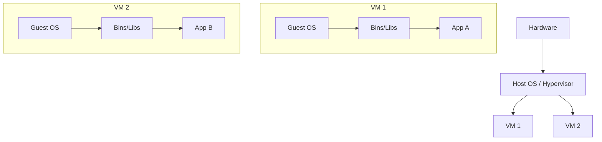
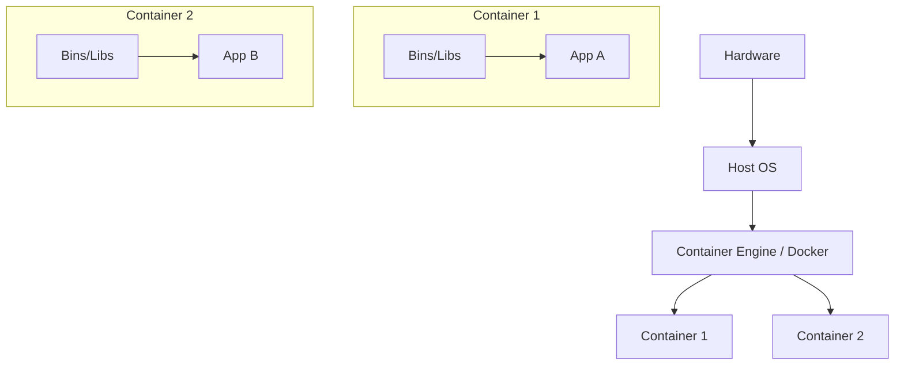
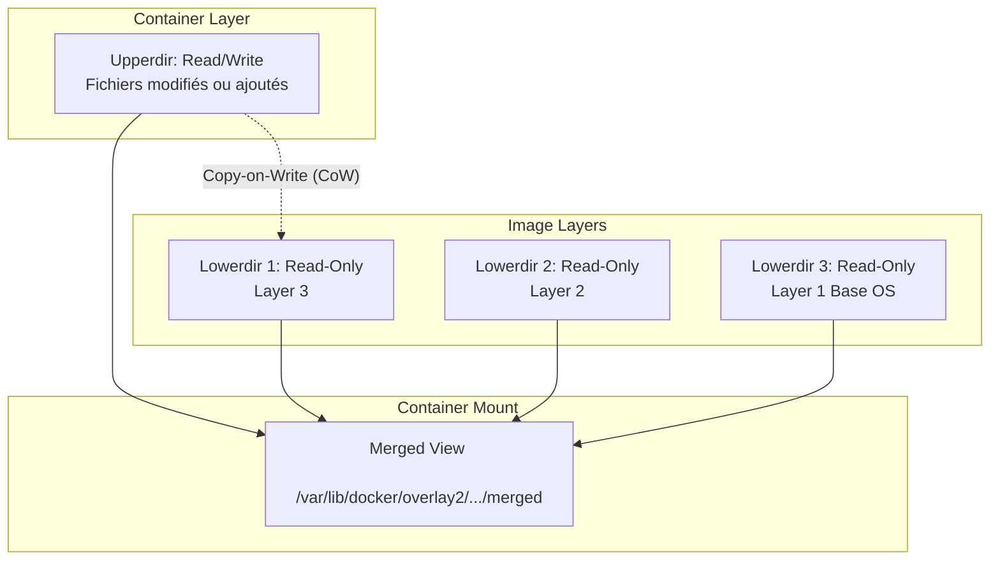
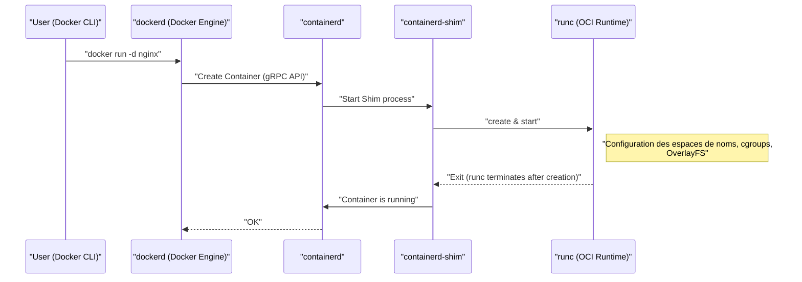
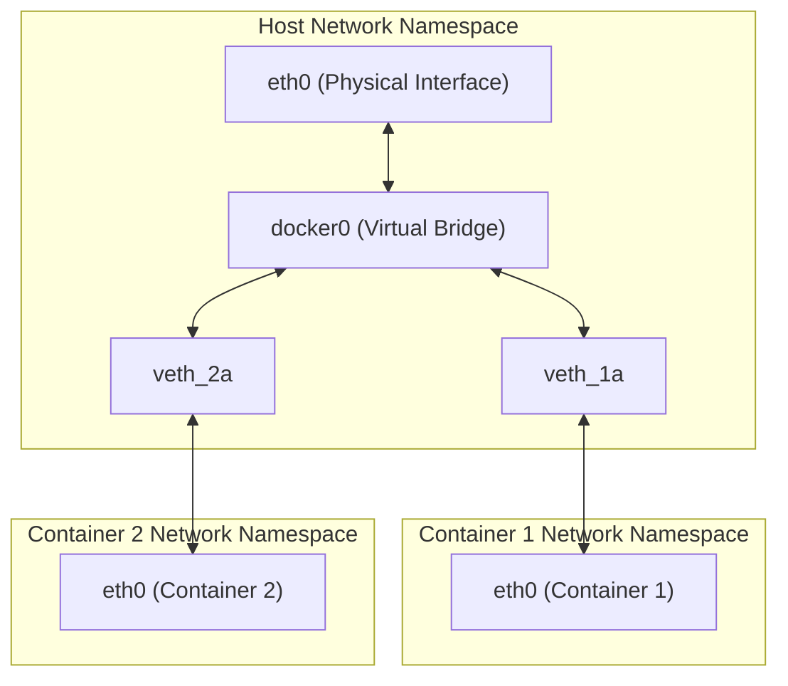

## 1. Introduction : Qu'est-ce que la technologie des conteneurs ?

Pour de nombreux développeurs, Docker est perçu comme un « outil pratique pour construire et partager facilement des environnements ». Cependant, peu de personnes comprennent vraiment ce qui se passe sous le capot de Docker et pourquoi il fonctionne de manière si légère et rapide.

Dans cet article, nous irons au-delà de l'utilisation superficielle des commandes Docker pour plonger dans **l'essence de la technologie des conteneurs**. Plus précisément, nous allons disséquer en profondeur les fonctionnalités de base du noyau Linux qui rendent les conteneurs possibles, telles que les **espaces de noms (Namespace)**, les **cgroups** et **OverlayFS** qui constitue le système de fichiers.

En acquérant ces connaissances, vous serez en mesure d'effectuer un réglage des performances, de renforcer la sécurité et de résoudre les problèmes de manière plus précise.

## 2. La différence cruciale entre une machine virtuelle (VM) et un conteneur

Pour comprendre les conteneurs, clarifions d'abord la différence avec les machines virtuelles (Virtual Machine) traditionnelles.

### Architecture d'une machine virtuelle

Une machine virtuelle déploie un hyperviseur (VMware ESXi, KVM, Hyper-V, etc.) sur un serveur physique, sur lequel plusieurs systèmes d'exploitation invités (Virtual Machine) sont exécutés.

L'approche VM offre un environnement d'isolement complet car elle émule à partir du niveau matériel. Cependant, parce qu'il faut démarrer un noyau indépendant (Guest OS) pour chaque VM, cela présente l'inconvénient d'un démarrage lent et d'une surcharge (overhead) importante du processeur et de la mémoire.

### Architecture d'un conteneur

D'un autre côté, les conteneurs **partagent le noyau du système d'exploitation hôte**.

Un conteneur n'est en réalité qu'un « processus Linux isolé ». Puisqu'il n'est pas nécessaire d'avoir un processus pour démarrer le noyau, il démarre en quelques millisecondes et la surcharge est minimisée.

La magie qui réalise cette « isolation d'un processus comme s'il s'agissait d'un système d'exploitation indépendant » est accomplie par les **espaces de noms (Namespace)** et les **cgroups**, que nous expliquerons dans la section suivante.

---

## 3. « Namespace » pour réaliser l'isolement des conteneurs

Les **espaces de noms (Namespace)** du noyau Linux sont une fonctionnalité qui fournit aux processus une vue isolée des ressources du système. À partir d'un processus au sein d'un Namespace donné, seules les ressources de ce même Namespace sont visibles. Cela permet à plusieurs processus de s'exécuter sur le même système sans interférer les uns avec les autres.

Le noyau Linux fournit principalement les 6 types de Namespace suivants.

### 3.1 PID Namespace (Isolement des identifiants de processus)

Dans un système Linux, au démarrage, `init` ou `systemd` est lancé avec le PID (Process ID) 1, et des PID séquentiels sont attribués aux processus suivants.
En utilisant le PID Namespace, le processus démarré en premier dans le nouveau Namespace se verra à nouveau attribuer le PID 1.

Si vous entrez dans un conteneur et exécutez la commande `ps aux`, vous ne verrez que les processus en cours d'exécution dans le conteneur et non les processus de l'hôte. C'est grâce au PID Namespace.

### 3.2 Mount Namespace (Isolement du système de fichiers)

Il isole les points de montage d'un processus. C'est grâce à cette fonctionnalité que chaque conteneur peut avoir un répertoire racine indépendant (`/`). Vous pouvez construire une arborescence de système de fichiers distincte de celle de l'hôte et effectuer des montages/démontages sans affecter les autres espaces de noms.

### 3.3 Network Namespace (Isolement du réseau)

Il isole les interfaces réseau, les adresses IP, les tables de routage, les règles iptables, etc. Chaque conteneur a sa propre adresse IP (par exemple : `172.17.0.2`) et peut communiquer indépendamment des paramètres réseau de l'hôte grâce au Network Namespace.

### 3.4 UTS Namespace (Isolement du nom d'hôte et du nom de domaine)

Il isole le nom d'hôte et le nom de domaine NIS. Cela permet à chaque conteneur d'avoir son propre nom d'hôte (la valeur vérifiable par la commande `hostname`).

### 3.5 IPC Namespace (Isolement de la communication inter-processus)

Il isole les objets System V IPC (Inter-Process Communication) et les files d'attente de messages POSIX. Cela empêche les processus de différents conteneurs d'accéder par erreur à la mémoire partagée.

### 3.6 User Namespace (Isolement des utilisateurs et des groupes)

Il isole l'espace des identifiants d'utilisateur (UID) et des identifiants de groupe (GID). Cela permet de mapper un processus fonctionnant en tant que **root (UID 0)** à l'intérieur du conteneur pour qu'il soit traité comme un **utilisateur standard (utilisateur non privilégié)** sur l'hôte. C'est une fonctionnalité extrêmement importante du point de vue de la sécurité.

### 💡 Hands-on : Créer un Namespace manuellement

En utilisant la commande `unshare` sous Linux, vous pouvez créer manuellement un Namespace et y exécuter des processus. Faisons l'expérience des bases des conteneurs sans utiliser Docker.

`ash
# Créer de nouveaux espaces de noms PID, UTS et Mount, et exécuter bash
$ sudo unshare --pid --uts --mount --fork --mount-proc /bin/bash

# Vérifier si le nom d'hôte peut être modifié (Avantage de l'UTS Namespace)
root@host# hostname container-test
root@container-test# hostname
container-test

# Vérifier la liste des processus (Avantages du PID Namespace et du Mount Namespace)
root@container-test# ps aux
USER         PID %CPU %MEM    VSZ   RSS TTY      STAT START   TIME COMMAND
root           1  0.0  0.0   7236  4160 pts/0    S    10:00   0:00 /bin/bash
root          15  0.0  0.0   8892  3280 pts/0    R+   10:01   0:00 ps aux
`

Ainsi, même si vous exécutez `ps aux`, les processus de l'hôte ne sont pas visibles, et on voit que `/bin/bash` fonctionne avec le PID 1. C'est la véritable nature d'un conteneur.

---

## 4. « cgroups » pour limiter les ressources des conteneurs

Alors que le Namespace est responsable de « l'isolement de l'espace », les **cgroups (Control Groups)** sont responsables de la « limitation des ressources ».

Si un conteneur s'emballe et épuise le CPU ou la mémoire de l'hôte, les autres conteneurs ou le système hôte lui-même s'effondreront (le problème du voisin bruyant - Noisy Neighbor). Pour éviter cela, le rôle des cgroups est de définir des limites supérieures d'utilisation des ressources (CPU, mémoire, E/S disque, bande passante réseau, etc.) pour des groupes de processus.

### Principaux sous-systèmes cgroups

- **cpu** : Contrôle la planification du CPU (ratio de temps d'utilisation et limites supérieures).
- **memory** : Fixe la limite supérieure de l'utilisation de la mémoire et contrôle le comportement lorsque cette limite est atteinte (comme la fin du processus par OOM Killer).
- **blkio** : Limite la bande passante d'entrée/sortie vers les périphériques de type bloc (disques).
- **pids** : Limite le nombre de processus (threads) pouvant être créés au sein d'un cgroup, empêchant les attaques telles que les bombes de processus (Fork Bomb).

### 💡 Hands-on : Configurer manuellement les cgroups

Créons concrètement un cgroup pour limiter la mémoire (exemple avec cgroups v1).

`ash
# Créer un groupe pour la limitation de mémoire
$ sudo mkdir /sys/fs/cgroup/memory/test_group

# Définir la limite de mémoire à 50 Mo
$ echo 50000000 | sudo tee /sys/fs/cgroup/memory/test_group/memory.limit_in_bytes

# Ajouter le processus actuel (shell) à ce groupe
$ echo  | sudo tee /sys/fs/cgroup/memory/test_group/tasks

# Si vous exécutez un traitement consommant beaucoup de mémoire dans cet état, la limite sera atteinte et le processus sera tué (Kill)
`

Lors de l'utilisation de Docker, les options transmises à la commande `docker run` sont converties en ces paramètres cgroups en arrière-plan.

`ash
# Exemple de limitation de mémoire et de CPU avec Docker
$ docker run -d --name web --memory="256m" --cpus="0.5" nginx
`

---

## 5. Système de fichiers des conteneurs et OverlayFS (Couches d'images)

L'une des caractéristiques des conteneurs est leur « structure en couches d'images ». Une image Docker n'est pas un seul gros fichier, mais est composée de multiples couches superposées. Cela est rendu possible par le **Union File System (UnionFS)**, et en particulier **OverlayFS**, qui est couramment utilisé par défaut dans les versions récentes de Linux.

### Le fonctionnement d'OverlayFS

OverlayFS est une technologie qui fusionne différents répertoires (couche inférieure et couche supérieure) pour les présenter comme un seul système de fichiers unifié.

1. **Lowerdir (Répertoire inférieur)** : Correspond à chaque couche d'une image Docker. Celles-ci sont traitées en tant que **Read-Only (Lecture seule)**. Lorsque plusieurs conteneurs utilisent la même image, ils partagent ce répertoire inférieur, ce qui permet d'économiser considérablement de l'espace disque.
2. **Upperdir (Répertoire supérieur)** : C'est la couche **Read/Write (Lecture/Écriture)** exclusive à ce conteneur, qui est ajoutée au moment de son démarrage. Lorsque vous créez ou modifiez des fichiers à l'intérieur du conteneur, tout est écrit dans cette couche supérieure.
3. **Merged View (Vue fusionnée)** : Elle intègre le Lowerdir et le Upperdir, et les présente comme un seul système de fichiers visible par le conteneur.

### Stratégie Copy-on-Write (CoW)

Lorsque vous essayez de modifier un fichier existant (situé dans la couche inférieure) à l'intérieur du conteneur, OverlayFS copie automatiquement le fichier ciblé vers la couche supérieure (Upperdir) et applique les modifications à cette copie. Cela s'appelle **Copy-on-Write (CoW)**. Le fichier de la couche inférieure n'est jamais modifié en lui-même.

Ainsi, si vous détruisez le conteneur, l'Upperdir sera également supprimé, et les données disparaîtront. Les données qui nécessitent d'être persistantes sont conservées en utilisant des **Docker Volumes (comme bind mount)** pour monter directement le répertoire de l'hôte dans le conteneur.

### La relation entre Dockerfile et les couches

Chaque instruction d'un `Dockerfile` (`FROM`, `RUN`, `COPY`, etc.) génère une nouvelle couche (Lowerdir).

`dockerfile
# Layer 1 : OS de base
FROM ubuntu:22.04

# Layer 2 : Installation de paquets
RUN apt-get update && apt-get install -y python3

# Layer 3 : Copie du code source
COPY . /app

# Configuration des métadonnées (ne génère pas de couche)
CMD ["python3", "/app/main.py"]
`

Pour réduire le nombre de couches, on utilise souvent la technique consistant à relier plusieurs commandes `RUN` par `&&`. Il s'agit d'une optimisation pour empêcher les couches OverlayFS de devenir trop profondes et maintenir la taille de l'image réduite.

---

## 6. Architecture de Docker (Docker Engine, containerd, runc)

Les premières versions de Docker avaient une conception monolithique (un seul gros bloc) pour tout, mais de nos jours, les fonctionnalités ont été divisées et la standardisation (OCI : Open Container Initiative) a progressé. Le cycle de vie actuel des conteneurs est constitué de la collaboration des composants suivants.

1. **Docker CLI** : L'outil en ligne de commande manipulé par l'utilisateur.
2. **dockerd (Docker Daemon)** : Fournit des fonctionnalités de haut niveau telles que la construction d'images, la gestion des réseaux et la gestion des volumes.
3. **containerd** : Un démon spécialisé dans la gestion du cycle de vie des conteneurs (récupération (pull) d'images, démarrage et arrêt de conteneurs). C'est un composant standard également utilisé par Kubernetes.
4. **runc** : Un runtime de conteneur de bas niveau conforme aux normes OCI (Open Container Initiative). Son rôle est de configurer réellement les Namespaces et les cgroups mentionnés précédemment dans le noyau et de démarrer le processus. Une fois le démarrage terminé, `runc` lui-même s'arrête.
5. **containerd-shim** : Agit comme le processus parent du processus de conteneur (PID 1), gère les entrées/sorties standard du conteneur et rapporte l'état du conteneur à `containerd` lors de sa fermeture. Grâce à cela, même si `dockerd` ou `containerd` redémarrent, le conteneur lui-même peut continuer à fonctionner.

---

## 7. Réseaux de conteneurs avancés

Enfin, abordons le Network Namespace et les mécanismes de communication entre conteneurs.

Le modèle réseau par défaut de Docker est le **réseau Bridge (pont)**.

- **veth pair (Virtual Ethernet Pair)** : Une paire de deux interfaces virtuelles. Si un paquet entre d'un côté, il ressort de l'autre.
- Lors de la création d'un conteneur, Docker crée un nouveau Network Namespace, place un côté du veth pair à l'intérieur du conteneur (généralement nommé `eth0`), et l'autre côté sur l'hôte (tel que `vethXXXX`).
- Le veth côté hôte est connecté au **`docker0` (périphérique pont)**, qui est un commutateur (switch) virtuel.
- Ainsi, différents conteneurs peuvent communiquer entre eux via `docker0`, et peuvent également communiquer avec l'Internet externe grâce aux paramètres de routage de l'hôte (NAPT / IP Masquerade).

---

## 8. Pratique : Optimisation du Dockerfile

En se basant sur les connaissances acquises jusqu'ici, nous allons expliquer comment écrire des `Dockerfile` pour améliorer les performances et la sécurité dans les opérations du monde réel.

### 8.1 Utilisation du build multi-étapes (Multi-stage build)

En séparant l'environnement de construction (build) de l'environnement d'exécution, vous pouvez réduire considérablement la taille de l'image finale. Ceci est particulièrement efficace pour les langages compilés tels que Go, Rust et Java.

`dockerfile
# --- Stage 1: Environnement de Build ---
FROM golang:1.21 AS builder
WORKDIR /app
COPY go.mod go.sum ./
RUN go mod download
COPY . .
# Construire le binaire avec lien statique
RUN CGO_ENABLED=0 GOOS=linux go build -o main .

# --- Stage 2: Environnement d'exécution ---
# Adopter un alpine ou scratch léger comme image de base
FROM alpine:3.18
WORKDIR /app
# Copier uniquement le binaire compilé à partir de l'étape builder
COPY --from=builder /app/main .

# Créer un utilisateur non privilégié pour l'exécution (pour améliorer la sécurité)
RUN addgroup -S appgroup && adduser -S appuser -G appgroup
USER appuser

EXPOSE 8080
CMD ["./main"]
`

### 8.2 Efficacité du cache des couches

Pendant le build, Docker réutilise les couches de haut en bas en tant que cache. En reportant à plus tard la commande `COPY` des fichiers (code source) susceptibles d'être modifiés, vous pouvez augmenter le taux de réussite (hit rate) du cache et réduire le temps de build.

### 8.3 Sélection d'une image de base minimale

- **ubuntu/debian** : Polyvalent mais de grande taille.
- **alpine** : Très léger (quelques Mo), mais la bibliothèque C standard est `musl` au lieu de `glibc`, ce qui peut causer des problèmes de compatibilité avec certains binaires (tels que les modules d'extension C de Python).
- **distroless** : Une image fournie par Google qui ne contient que les dépendances minimales nécessaires à l'exécution de l'application. Comme elle ne contient même pas de shell (`/bin/sh`), elle est extrêmement sécurisée (même si un attaquant envahit le conteneur, il ne peut pas exécuter de commandes).

---

## 9. Perspective mathématique : Modèle d'optimisation de l'allocation des ressources

Afin d'augmenter la densité des conteneurs, le défi est de savoir comment placer $n$ conteneurs par rapport aux ressources (CPU $C$, mémoire $M$) de la machine hôte. Ceci peut être formulé comme une forme de **problème de bin packing (Bin Packing Problem)**.

Soit la demande en CPU de chaque conteneur $i$ $c_i$, la mémoire $m_i$, et la capacité de l'hôte $j$ $C_j, M_j$.
Si $x_{ij} = 1$ lorsque le conteneur $i$ est placé sur l'hôte $j$ (sinon $0$), et $y_j = 1$ lorsque l'hôte $j$ est utilisé, le problème de placement des conteneurs avec le nombre minimum d'hôtes peut être exprimé de la manière suivante.

\min \sum_{j=1}^{m} y_j \\\\
\text{sous réserve de} \\\\
\sum_{i=1}^{n} c_i x_{ij} \le C_j y_j, \quad \forall j \\\\
\sum_{i=1}^{n} m_i x_{ij} \le M_j y_j, \quad \forall j \\\\
\sum_{j=1}^{m} x_{ij} = 1, \quad \forall i

Les ordonnanceurs d'orchestrateurs tels que Kubernetes assignent les conteneurs à des nœuds appropriés en résolvant en interne de tels problèmes de satisfaction de contraintes (approximation heuristique par un système de score).

---

## 10. Conclusion

Dans cet article, nous avons exploré les profondeurs de la technologie des conteneurs fonctionnant sous le capot de Docker.

1. « L'isolement de l'espace » tel que les processus, le réseau et le système de fichiers par **Namespace**.
2. La « limitation des ressources » comme le CPU et la mémoire par **cgroups**.
3. La structure en couches par **OverlayFS** et une gestion efficace du système de fichiers par le Copy-on-Write.
4. Une architecture modulaire via `containerd` et `runc`, basée sur les normes OCI.
5. Une configuration réseau avec un pont virtuel et un veth pair.

Un conteneur n'est en aucun cas une boîte magique, mais une **« méthode de gestion de processus sophistiquée »** réalisée par une combinaison de fonctionnalités robustes du noyau Linux. Comprendre ces mécanismes fondamentaux approfondira sans aucun doute votre compréhension de l'optimisation des Dockerfile, du dépannage, ainsi que des outils d'orchestration avancés comme [Kubernetes](https://kenji.blog/fr/p/kubernetes-k8s-architecture-pod-service-ingress/).

La prochaine fois que vous construirez un conteneur, essayez d'exécuter la commande en imaginant : « En ce moment, un Namespace est en train d'être créé en arrière-plan, et OverlayFS est monté ». Votre expérience de développement en sera d'autant plus enrichissante.