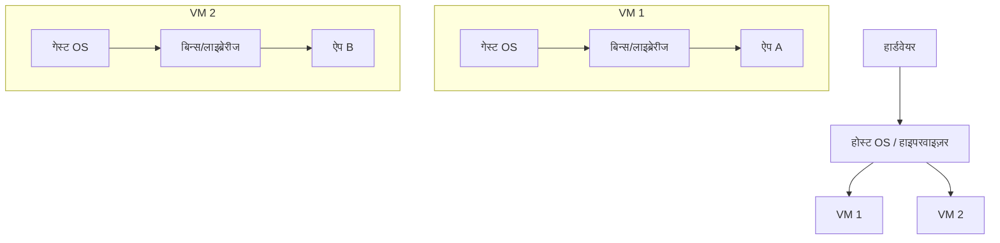
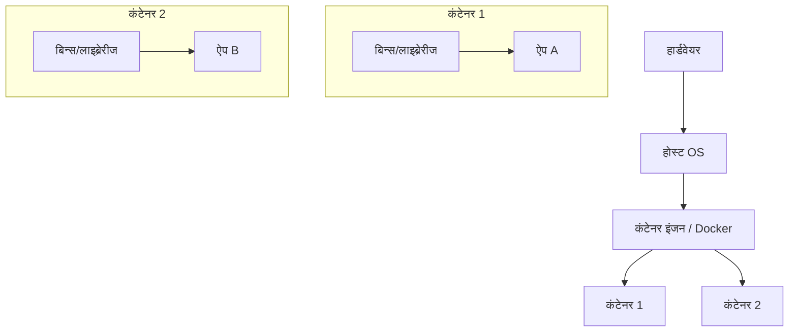
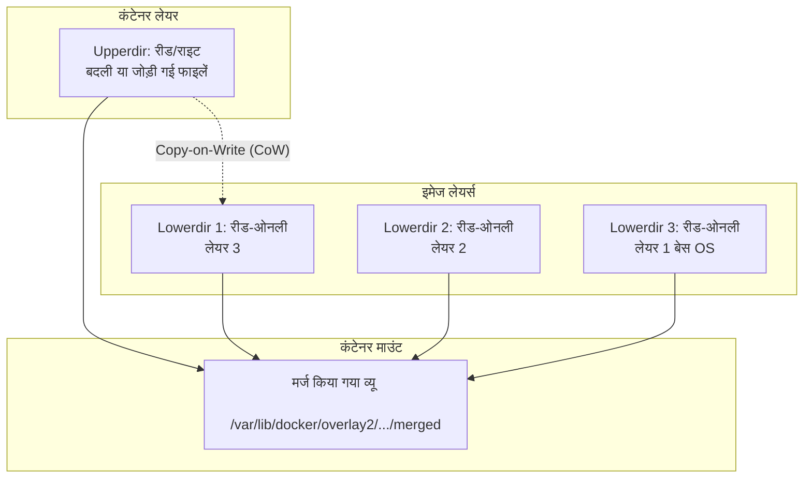
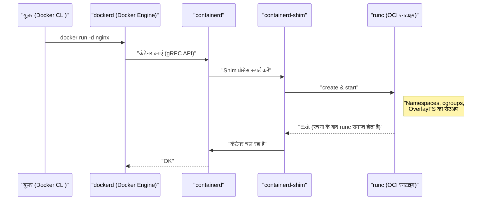
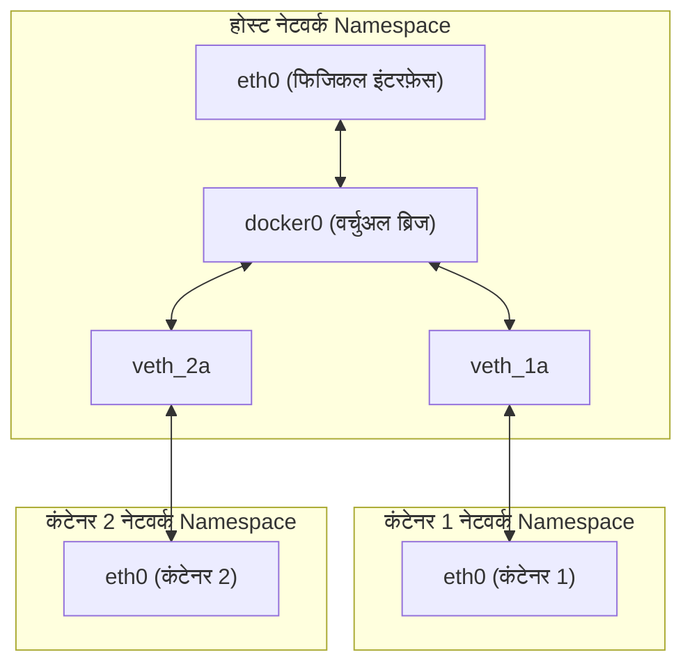

## 1. परिचय: कंटेनर तकनीक क्या है?

कई डेवलपर्स के लिए, Docker को "एक सुविधाजनक टूल जो आसानी से वातावरण को बनाने और साझा करने की अनुमति देता है" के रूप में पहचाना जाता है। हालाँकि, अप्रत्याशित रूप से कम लोग गहराई से समझते हैं कि Docker के पीछे क्या हो रहा है और यह इतनी तेजी से और हल्के तरीके से क्यों काम करता है।

इस लेख में, हम Docker कमांड के सतही उपयोग से एक कदम आगे बढ़ेंगे और **कंटेनर तकनीक के मूल** में जाएंगे। विशेष रूप से, हम लिनक्स कर्नेल के मुख्य कार्यों का गहराई से विश्लेषण करेंगे जो कंटेनरों को संभव बनाते हैं: **Namespace** , **cgroups** , और **OverlayFS** जो फ़ाइल सिस्टम बनाता है।

इस ज्ञान के साथ, आप प्रदर्शन ट्यूनिंग, सुरक्षा सुदृढ़ीकरण और समस्या निवारण को अधिक सटीक रूप से करने में सक्षम होंगे।

## 2. वर्चुअल मशीन (VM) और कंटेनर के बीच महत्वपूर्ण अंतर

कंटेनरों को समझने के लिए, आइए पहले पारंपरिक वर्चुअल मशीनों (VM) के साथ अंतर स्पष्ट करें।

### वर्चुअल मशीन आर्किटेक्चर

वर्चुअल मशीन एक भौतिक सर्वर पर एक हाइपरवाइज़र (VMware ESXi, KVM, Hyper-V, आदि) रखती है और उस पर कई गेस्ट OS (Virtual Machine) चलाती है।



VM का दृष्टिकोण हार्डवेयर स्तर से एमुलेट करता है, इसलिए यह पूरी तरह से पृथक वातावरण प्रदान करता है। हालाँकि, चूंकि प्रत्येक VM के लिए एक स्वतंत्र कर्नेल (Guest OS) शुरू करना आवश्यक है, इसलिए इसमें स्टार्टअप धीमा होने और मेमोरी और CPU का ओवरहेड बड़ा होने की समस्या है।

### कंटेनर आर्किटेक्चर

दूसरी ओर, कंटेनर **होस्ट OS के कर्नेल को साझा** करते हैं।



कंटेनर वास्तव में केवल "पृथक किए गए लिनक्स प्रोसेस" हैं। चूंकि कर्नेल शुरू करने के लिए किसी प्रोसेस की आवश्यकता नहीं होती है, वे मिलीसेकंड में शुरू होते हैं और ओवरहेड को कम से कम रखा जाता है।

इस "प्रोसेस को एक स्वतंत्र OS की तरह अलग करने" के जादू को संभव बनाने वाले **Namespace** और **cgroups** को अगले अध्याय में समझाया जाएगा।

---

## 3. कंटेनर आइसोलेशन को सक्षम करने वाले "Namespace"

लिनक्स कर्नेल का **Namespace (नेमस्पेस)** एक विशेषता है जो प्रोसेस को सिस्टम संसाधनों का एक अलग दृश्य प्रदान करता है। एक Namespace के भीतर एक प्रोसेस केवल उसी Namespace के भीतर संसाधनों को देख सकता है। यह कई प्रक्रियाओं को एक ही सिस्टम पर एक-दूसरे के साथ हस्तक्षेप किए बिना चलने की अनुमति देता है।

लिनक्स कर्नेल मुख्य रूप से निम्नलिखित 6 प्रकार के Namespace प्रदान करता है।

### 3.1 PID Namespace (प्रोसेस ID का पृथक्करण)

लिनक्स सिस्टम में, बूटिंग के समय `init` या `systemd` PID (Process ID) 1 के रूप में शुरू होता है, और उसके बाद की प्रक्रियाओं को क्रमिक रूप से PID असाइन किया जाता है।
PID Namespace का उपयोग करके, नए Namespace में शुरू होने वाली पहली प्रोसेस को फिर से PID 1 असाइन किया जाएगा।

यदि आप कंटेनर के अंदर जाते हैं और `ps aux` कमांड चलाते हैं, तो आप केवल कंटेनर के अंदर चलने वाली प्रक्रियाओं को देख सकते हैं, न कि होस्ट पर प्रक्रियाओं को। यह PID Namespace के कारण है।

### 3.2 Mount Namespace (फ़ाइल सिस्टम का पृथक्करण)

यह प्रक्रियाओं के माउंट पॉइंट को अलग करता है। यह इस सुविधा के कारण है कि प्रत्येक कंटेनर की अपनी रूट डायरेक्टरी ( `/` ) हो सकती है। आप होस्ट के फ़ाइल सिस्टम से अलग एक फ़ाइल सिस्टम ट्री बना सकते हैं और अन्य Namespace को प्रभावित किए बिना माउंट और अनमाउंट कर सकते हैं।

### 3.3 Network Namespace (नेटवर्क का पृथक्करण)

यह नेटवर्क इंटरफेस, IP एड्रेस, रूटिंग टेबल, iptables नियम आदि को अलग करता है। प्रत्येक कंटेनर का अपना IP एड्रेस (उदा: `172.17.0.2` ) होता है और यह Network Namespace की बदौलत होस्ट की नेटवर्क सेटिंग्स से स्वतंत्र रूप से संचार कर सकता है।

### 3.4 UTS Namespace (होस्टनाम और डोमेन नाम का पृथक्करण)

यह होस्टनाम और NIS डोमेन नाम को अलग करता है। यह प्रत्येक कंटेनर को अपना स्वयं का होस्टनाम (मान जो `hostname` कमांड के साथ चेक किया जा सकता है) रखने की अनुमति देता है।

### 3.5 IPC Namespace (इंटर-प्रोसेस संचार का पृथक्करण)

System V IPC (Inter-Process Communication) ऑब्जेक्ट्स और POSIX मैसेज कतारों को अलग करता है। यह अलग-अलग कंटेनरों की प्रक्रियाओं को गलती से साझा मेमोरी तक पहुंचने से रोकता है।

### 3.6 User Namespace (उपयोगकर्ताओं और समूहों का पृथक्करण)

यूजर ID (UID) और ग्रुप ID (GID) के स्पेस को अलग करता है। यह कंटेनर के अंदर **root (UID 0)** के रूप में चलने वाली प्रक्रिया को होस्ट पर **सामान्य उपयोगकर्ता (गैर-विशेषाधिकार प्राप्त उपयोगकर्ता)** के रूप में मैप करने की अनुमति देता है। सुरक्षा के दृष्टिकोण से यह बहुत महत्वपूर्ण विशेषता है।

### 💡 Hands-on: मैन्युअली Namespace बनाना

आप मैन्युअली Namespace बनाने और उसमें प्रक्रियाओं को निष्पादित करने के लिए लिनक्स के `unshare` कमांड का उपयोग कर सकते हैं। आइए Docker के बिना कंटेनरों की मूल बातें अनुभव करें।

```bash
# एक नया PID, UTS, और Mount Namespace बनाएं, और bash चलाएं
$ sudo unshare --pid --uts --mount --fork --mount-proc /bin/bash

# जांचें कि क्या होस्टनाम बदला जा सकता है (UTS Namespace का लाभ)
root@host# hostname container-test
root@container-test# hostname
container-test

# प्रोसेस सूची जांचें (PID Namespace और Mount Namespace का लाभ)
root@container-test# ps aux
USER         PID %CPU %MEM    VSZ   RSS TTY      STAT START   TIME COMMAND
root           1  0.0  0.0   7236  4160 pts/0    S    10:00   0:00 /bin/bash
root          15  0.0  0.0   8892  3280 pts/0    R+   10:01   0:00 ps aux
```

इस प्रकार, यदि आप `ps aux` चलाते हैं, तो होस्ट प्रक्रियाएँ दिखाई नहीं देती हैं, और आप देख सकते हैं कि `/bin/bash` PID 1 के रूप में चल रहा है। यह कंटेनर की मूल पहचान है।

---

## 4. "cgroups" के साथ कंटेनर संसाधनों को सीमित करना

जबकि Namespace "स्थानों को अलग करने" का प्रभारी है, **cgroups (Control Groups)** "संसाधनों को सीमित करने" का प्रभारी है।

यदि कोई कंटेनर बेकाबू हो जाता है और होस्ट के CPU या मेमोरी का उपभोग कर लेता है, तो अन्य कंटेनर और होस्ट सिस्टम स्वयं डाउन हो जाएंगे (Noisy Neighbor समस्या)। इसे रोकने के लिए, प्रोसेस समूहों के लिए संसाधन (CPU, मेमोरी, डिस्क I/O, नेटवर्क बैंडविड्थ, आदि) के उपयोग की ऊपरी सीमा निर्धारित करना cgroups की भूमिका है।

### प्रमुख cgroups सबसिस्टम

- **cpu** : CPU शेड्यूलिंग (उपयोग समय का प्रतिशत या ऊपरी सीमा) को नियंत्रित करता है।
- **memory** : मेमोरी उपयोग की ऊपरी सीमा निर्धारित करता है और सीमा तक पहुंचने पर व्यवहार (OOM Killer द्वारा प्रोसेस को समाप्त करना, आदि) को नियंत्रित करता है।
- **blkio** : ब्लॉक डिवाइस (डिस्क) के लिए I/O बैंडविड्थ को सीमित करता है।
- **pids** : cgroup के भीतर बनाई जा सकने वाली प्रक्रियाओं (थ्रेड्स) की संख्या को सीमित करता है, और फोर्क बम (Fork Bomb) जैसे हमलों को रोकता है।

### 💡 Hands-on: मैन्युअली cgroups सेट करना

आइए एक cgroup बनाएं जो वास्तव में मेमोरी को सीमित करता है (cgroups v1 का उदाहरण)।

```bash
# मेमोरी लिमिट के लिए एक ग्रुप बनाएं
$ sudo mkdir /sys/fs/cgroup/memory/test_group

# मेमोरी की ऊपरी सीमा 50MB पर सेट करें
$ echo 50000000 | sudo tee /sys/fs/cgroup/memory/test_group/memory.limit_in_bytes

# वर्तमान प्रोसेस (शेल) को इस ग्रुप में जोड़ें
$ echo $$ | sudo tee /sys/fs/cgroup/memory/test_group/tasks

# इस स्थिति में यदि आप बहुत अधिक मेमोरी का उपभोग करने वाली प्रक्रिया निष्पादित करते हैं, तो यह सीमा तक पहुँच जाएगी और किल कर दी जाएगी
```

Docker का उपयोग करते समय, `docker run` कमांड में पास किए गए विकल्प पृष्ठभूमि में इन cgroups सेटिंग्स में परिवर्तित हो जाते हैं।

```bash
# Docker में मेमोरी और CPU सीमा का उदाहरण
$ docker run -d --name web --memory="256m" --cpus="0.5" nginx
```

---

## 5. कंटेनर फ़ाइल सिस्टम और OverlayFS (इमेज लेयर्स)

कंटेनरों की विशेषताओं में से एक "इमेज की लेयर संरचना" है। Docker इमेज एक भी विशाल फ़ाइल नहीं है, बल्कि यह ओवरलैपिंग लेयर्स से बनी है। यह **Union File System (UnionFS)** , विशेष रूप से **OverlayFS** द्वारा महसूस किया जाता है, जो हाल के लिनक्स में मानक के रूप में उपयोग किया जाता है।

### OverlayFS कैसे काम करता है

OverlayFS एक तकनीक है जो विभिन्न डायरेक्टरीज (निचली और ऊपरी परतों) को मिलाती है और उन्हें एक एकीकृत फ़ाइल सिस्टम के रूप में दिखाती है।



1. **Lowerdir (निचली डायरेक्टरी)** : यह Docker इमेज की प्रत्येक लेयर से मेल खाती है। इन्हें **Read-Only (केवल-पढ़ने के लिए)** माना जाता है। जब कई कंटेनर एक ही इमेज का उपयोग करते हैं, तो वे इस निचली डायरेक्टरी को साझा करते हैं, जो डिस्क स्थान को काफी बचाता है।
2. **Upperdir (ऊपरी डायरेक्टरी)** : यह कंटेनर के लिए एक समर्पित **Read/Write (पढ़ने/लिखने योग्य)** लेयर है जो कंटेनर शुरू होने पर जोड़ी जाती है। कंटेनर में जो भी फाइलें बनाई या बदली जाती हैं, वे सभी इस ऊपरी लेयर में लिखी जाती हैं।
3. **Merged View** : कंटेनरों को एक एकल फ़ाइल सिस्टम प्रदान करने के लिए Lowerdir और Upperdir को एकीकृत करता है।

### Copy-on-Write (CoW) रणनीति

यदि आप कंटेनर में किसी मौजूदा फ़ाइल (निचली परत में स्थित फ़ाइल) को संपादित करने का प्रयास करते हैं, तो OverlayFS स्वचालित रूप से लक्षित फ़ाइल को ऊपरी परत (Upperdir) में कॉपी करता है और उस कॉपी में संशोधन करता है। इसे **Copy-on-Write (CoW)** कहा जाता है। निचली परत की फाइलें खुद कभी नहीं बदली जाती हैं।

परिणामस्वरूप, यदि आप कंटेनर को नष्ट करते हैं, तो Upperdir भी हटा दिया जाएगा और डेटा खो जाएगा। जिस डेटा को स्थायी रूप से सहेजे जाने की आवश्यकता है, उसे होस्ट की डायरेक्टरी को सीधे कंटेनर में माउंट करने के लिए **Docker Volume (जैसे बाइंड माउंट)** का उपयोग करके हल किया जाता है।

### Dockerfile और लेयर्स के बीच संबंध

`Dockerfile` में प्रत्येक निर्देश ( `FROM` , `RUN` , `COPY` , आदि) एक नई लेयर (Lowerdir) बनाता है।

```dockerfile
# Layer 1: बेस OS
FROM ubuntu:22.04

# Layer 2: पैकेज इंस्टालेशन
RUN apt-get update && apt-get install -y python3

# Layer 3: सोर्स कोड कॉपी करना
COPY . /app

# मेटाडेटा सेटिंग (कोई लेयर नहीं बनाई गई)
CMD ["python3", "/app/main.py"]
```

लेयर्स की संख्या को कम करने के लिए, कई `RUN` कमांड्स को `&&` के साथ जोड़ने की तकनीक अक्सर उपयोग की जाती है। यह OverlayFS लेयर्स को बहुत अधिक गहरा होने से रोकने और इमेज के आकार को छोटा रखने के लिए एक अनुकूलन है।

---

## 6. Docker आर्किटेक्चर (Docker Engine, containerd, runc)

प्रारंभिक Docker सब कुछ एक मोनोलिथिक (विशाल एकल ब्लॉक) डिज़ाइन में था, लेकिन अब कार्यों को विभाजित कर दिया गया है और मानकीकरण (OCI: Open Container Initiative) आगे बढ़ रहा है। वर्तमान कंटेनर जीवनचक्र निम्नलिखित घटकों के सहयोग से बना है।



1. **Docker CLI** : कमांड-लाइन टूल जिसे उपयोगकर्ता संचालित करता है।
2. **dockerd (Docker Daemon)** : इमेज बिल्डिंग, नेटवर्क प्रबंधन और वॉल्यूम प्रबंधन जैसी उच्च-स्तरीय सुविधाएँ प्रदान करता है।
3. **containerd** : कंटेनर के जीवनचक्र प्रबंधन (इमेज को पुल करना, कंटेनर को शुरू करना/रोकना) के लिए एक समर्पित डेमन। यह कुबेरनेट्स ([Kubernetes](https://kenji.blog/hi/p/kubernetes-k8s-architecture-pod-service-ingress/)) आदि में भी उपयोग किया जाने वाला एक मानक घटक है।
4. **runc** : OCI (Open Container Initiative) मानक के अनुरूप एक निम्न-स्तरीय कंटेनर रनटाइम। यह ऊपर उल्लिखित Namespace और cgroups को वास्तव में कर्नेल पर सेट करने और प्रक्रिया शुरू करने के लिए जिम्मेदार है। एक बार स्टार्ट पूरा हो जाने के बाद, `runc` खुद समाप्त हो जाता है।
5. **containerd-shim** : यह कंटेनर प्रक्रिया (PID 1) का पैरेंट प्रोसेस बन जाता है, कंटेनर के मानक इनपुट/आउटपुट का प्रबंधन करता है, और कंटेनर समाप्त होने पर स्थिति `containerd` को रिपोर्ट करता है। इससे कंटेनर को तब भी चालू रहने की अनुमति मिलती है जब `dockerd` या `containerd` को पुनरारंभ किया जाता है।

---

## 7. उन्नत कंटेनर नेटवर्किंग

अंत में, आइए Network Namespace और कंटेनरों के बीच संचार के तंत्र को छुएं।

Docker का डिफ़ॉल्ट नेटवर्क मॉडल **Bridge नेटवर्क** है।



- **veth pair (Virtual Ethernet Pair)** : 2 वर्चुअल इंटरफेस की एक जोड़ी, यदि आप एक में पैकेट डालते हैं, तो यह दूसरे से बाहर आता है।
- कंटेनर बनाते समय, Docker एक नया Network Namespace बनाता है, veth पेयर के एक हिस्से को कंटेनर (आमतौर पर `eth0` नाम) में रखता है, और दूसरे हिस्से को होस्ट साइड (जैसे `vethXXXX` ) पर रखता है।
- होस्ट की ओर का veth वर्चुअल स्विच **`docker0` (ब्रिज डिवाइस)** से जुड़ा होता है।
- यह विभिन्न कंटेनरों को `docker0` के माध्यम से एक-दूसरे के साथ संवाद करने की अनुमति देता है, और होस्ट की रूटिंग सेटिंग्स (NAPT / IP Masquerade) बाहरी इंटरनेट के साथ संचार करने की अनुमति देती हैं।

---

## 8. अभ्यास: Dockerfile का अनुकूलन

अब तक के ज्ञान के आधार पर, हम समझाएंगे कि वास्तविक दुनिया के संचालन में प्रदर्शन और सुरक्षा में सुधार के लिए `Dockerfile` कैसे लिखें।

### 8.1 मल्टी-स्टेज बिल्ड (Multi-stage build) का लाभ उठाना

बिल्ड वातावरण को निष्पादन वातावरण से अलग करके, अंतिम इमेज के आकार को काफी कम किया जा सकता है। यह Go, Rust और Java जैसी संकलित (compiled) भाषाओं के लिए विशेष रूप से प्रभावी है।

```dockerfile
# --- Stage 1: Build पर्यावरण ---
FROM golang:1.21 AS builder
WORKDIR /app
COPY go.mod go.sum ./
RUN go mod download
COPY . .
# स्टेटिक रूप से लिंक्ड बाइनरी बिल्ड करें
RUN CGO_ENABLED=0 GOOS=linux go build -o main .

# --- Stage 2: निष्पादन पर्यावरण ---
# बेस इमेज के रूप में हल्के alpine या scratch को अपनाएं
FROM alpine:3.18
WORKDIR /app
# builder स्टेज से केवल बिल्ड की गई बाइनरी कॉपी करें
COPY --from=builder /app/main .

# एक गैर-विशेषाधिकार प्राप्त उपयोगकर्ता बनाएं और निष्पादित करें (सुरक्षा में सुधार के लिए)
RUN addgroup -S appgroup && adduser -S appuser -G appgroup
USER appuser

EXPOSE 8080
CMD ["./main"]
```

### 8.2 लेयर कैश को सुव्यवस्थित करना

Docker बिल्ड करते समय ऊपर से क्रम में लेयर्स का कैश के रूप में पुन: उपयोग करता है। उन फ़ाइलों (सोर्स कोड) के `COPY` को स्थगित करके, जो बार-बार बदलने की संभावना रखते हैं, आप कैश हिट दर बढ़ा सकते हैं और बिल्ड समय कम कर सकते हैं।

### 8.3 न्यूनतम बेस इमेज का चयन

- **ubuntu/debian** : सामान्य प्रयोजन लेकिन आकार में बड़ा।
- **alpine** : बहुत हल्का (कुछ MB), लेकिन चूंकि मानक C लाइब्रेरी `glibc` के बजाय `musl` है, इसलिए कुछ बाइनरीज़ (जैसे Python के C एक्सटेंशन मॉड्यूल) के साथ संगतता समस्याएँ हो सकती हैं।
- **distroless** : Google द्वारा प्रदान की गई एक इमेज जिसमें एप्लिकेशन चलाने के लिए केवल न्यूनतम आवश्यक निर्भरताएँ हैं। चूंकि इसमें शेल ( `/bin/sh` ) भी शामिल नहीं है, इसलिए यह बेहद सुरक्षित है (भले ही कोई हमलावर कंटेनर में घुस जाए, वे कमांड नहीं चला सकते)।

---

## 9. गणितीय परिप्रेक्ष्य: संसाधन आवंटन का अनुकूलन मॉडल

कंटेनरों के घनत्व को बढ़ाते समय, यह एक चुनौती है कि होस्ट मशीन के संसाधनों (CPU $C$ , मेमोरी $M$ ) के सापेक्ष $n$ कंटेनरों को कैसे आवंटित किया जाए। इसे एक प्रकार की **बिन-पैकिंग समस्या (Bin Packing Problem)** के रूप में तैयार किया जा सकता है।

मान लें कि प्रत्येक कंटेनर $i$ के लिए आवश्यक CPU $c_i$ और मेमोरी $m_i$ है, और होस्ट $j$ की क्षमता $C_j, M_j$ है।
यदि कंटेनर $i$ को होस्ट $j$ पर रखा गया है, तो $x_{ij} = 1$ (अन्यथा $0$ ), और यदि होस्ट $j$ का उपयोग किया जाता है, तो $y_j = 1$ , कंटेनरों को कम से कम होस्ट्स के साथ आवंटित करने की समस्या इस प्रकार व्यक्त की जा सकती है।

$$
\min \sum_{j=1}^{m} y_j \\\\
\text{शर्तें} \\\\
\sum_{i=1}^{n} c_i x_{ij} \le C_j y_j, \quad \forall j \\\\
\sum_{i=1}^{n} m_i x_{ij} \le M_j y_j, \quad \forall j \\\\
\sum_{j=1}^{m} x_{ij} = 1, \quad \forall i
$$

[Kubernetes](https://kenji.blog/hi/p/kubernetes-k8s-architecture-pod-service-ingress/) जैसे ऑर्केस्ट्रेटर्स के शेड्यूलर उपयुक्त नोड्स को कंटेनर असाइन करते हैं, जबकि आंतरिक रूप से ऐसी बाधा संतुष्टि समस्याओं (स्कोरिंग द्वारा हेयुरिस्टिक सन्निकटन) को हल करते हैं।

---

## 10. निष्कर्ष

इस लेख में, हमने कंटेनर तकनीक की गहराई का पता लगाया जो Docker के पीछे काम कर रही है।

1. **Namespace** द्वारा प्रोसेस, नेटवर्क और फ़ाइल सिस्टम जैसे "स्थानों का पृथक्करण"।
2. **cgroups** द्वारा CPU और मेमोरी जैसे "संसाधनों की सीमा"।
3. **OverlayFS** द्वारा लेयर संरचना और Copy-on-Write के माध्यम से कुशल फ़ाइल सिस्टम प्रबंधन।
4. OCI मानकों के आधार पर, `containerd` और `runc` का उपयोग करते हुए मॉड्यूलर आर्किटेक्चर।
5. वर्चुअल ब्रिज और veth पेयर का उपयोग करके नेटवर्क कॉन्फ़िगरेशन।

कंटेनर कोई जादुई बक्से नहीं हैं, बल्कि यह लिनक्स कर्नेल की मजबूत विशेषताओं को जोड़कर हासिल की गई **"परिष्कृत प्रोसेस प्रबंधन विधि"** है। इस मूलभूत तंत्र को समझकर, Dockerfile को अनुकूलित करने, समस्या निवारण करने, और [Kubernetes](https://kenji.blog/hi/p/kubernetes-k8s-architecture-pod-service-ingress/) जैसे उन्नत ऑर्केस्ट्रेशन टूल को समझने की आपकी क्षमता और गहरी हो जाएगी।

अगली बार जब आप कंटेनर का निर्माण करें, तो कृपया कमांड को यह कल्पना करते हुए टाइप करें कि "अभी, पृष्ठभूमि में Namespace बनाया जा रहा है और OverlayFS माउंट किया जा रहा है।" आपका विकास अनुभव बहुत अधिक समृद्ध होगा।
