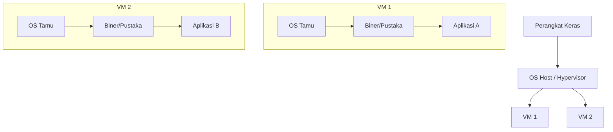
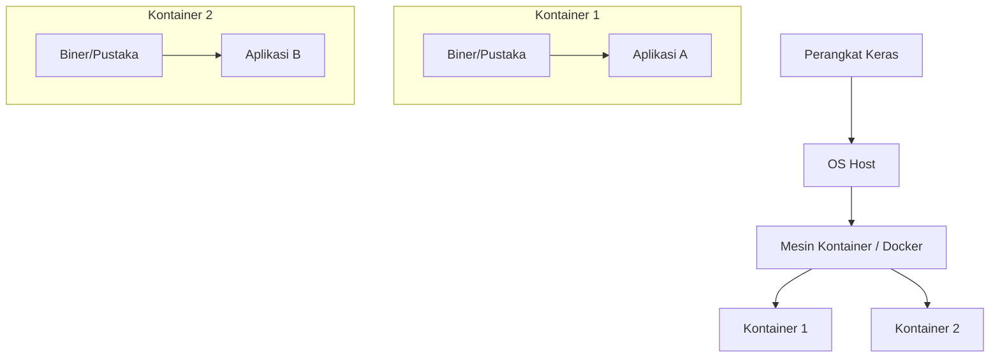
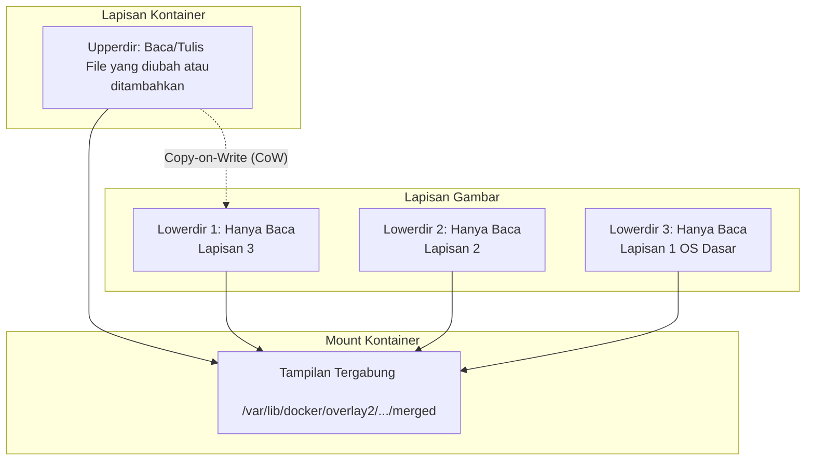
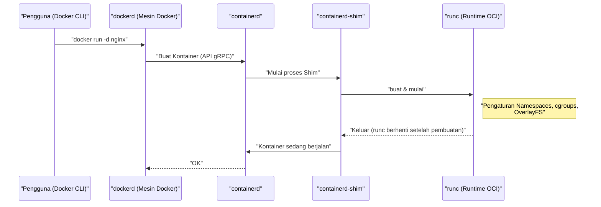
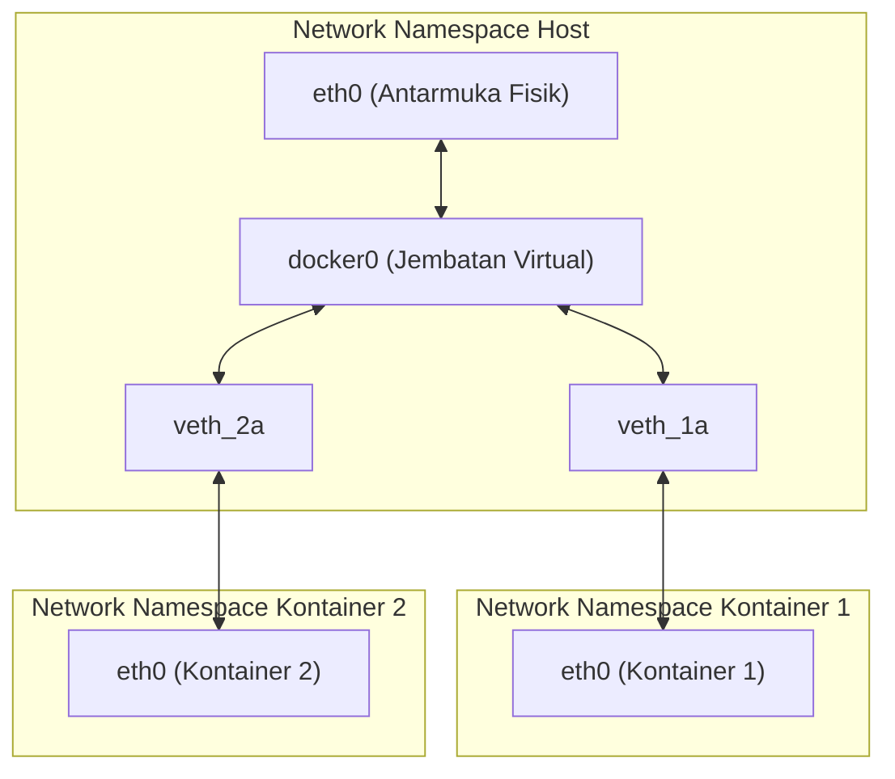

## 1. Pendahuluan: Apa itu Teknologi Kontainer?

Bagi banyak pengembang, Docker diakui sebagai "alat yang praktis untuk membangun dan berbagi lingkungan dengan mudah". Namun, di balik Docker, apa yang sebenarnya terjadi, dan mengapa ia bisa beroperasi dengan sangat ringan dan cepat mungkin belum dipahami secara mendalam oleh banyak orang.

Dalam artikel ini, kita akan melangkah lebih jauh dari sekadar penggunaan dangkal perintah Docker dan mendekati **esensi teknologi kontainer**. Secara khusus, kita akan membedah secara menyeluruh mekanisme inti kernel Linux yang mewujudkan kontainer, seperti **Namespace**, **cgroups**, dan **OverlayFS** yang membentuk sistem file.

Dengan memiliki pengetahuan ini, Anda akan dapat melakukan penyetelan kinerja, peningkatan keamanan, dan pemecahan masalah dengan lebih tepat.

## 2. Perbedaan Krusial antara Mesin Virtual (VM) dan Kontainer

Dalam memahami kontainer, pertama-tama mari kita perjelas perbedaannya dengan Mesin Virtual (Virtual Machine) konvensional.

### Arsitektur Mesin Virtual

Mesin virtual menempatkan hypervisor (VMware ESXi, KVM, Hyper-V, dll.) di atas server fisik, dan menjalankan beberapa OS tamu (Virtual Machine) di atasnya.



Pendekatan VM menyediakan lingkungan terisolasi sepenuhnya karena meniru dari tingkat perangkat keras. Namun, karena perlu menjalankan kernel (OS Tamu) independen untuk setiap VM, ada masalah seperti waktu startup yang lambat serta overhead memori dan CPU yang besar.

### Arsitektur Kontainer

Di sisi lain, kontainer **berbagi kernel OS host**.



Sebenarnya, kontainer hanyalah "proses Linux biasa yang terisolasi". Karena tidak memerlukan proses untuk memulai kernel, ia dapat dimulai dalam hitungan milidetik dan overhead-nya juga dapat ditekan seminimal mungkin.

Keajaiban "mengisolasi proses seolah-olah merupakan OS independen" ini diwujudkan oleh **Namespace** dan **cgroups** yang akan dijelaskan pada bab berikutnya.

---

## 3. "Namespace" yang Mewujudkan Isolasi Kontainer

**Namespace (Ruang Nama)** pada kernel Linux adalah fitur yang menyediakan tampilan sumber daya sistem yang terpisah untuk suatu proses. Proses di dalam Namespace tertentu hanya dapat melihat sumber daya di dalam Namespace yang sama. Hal ini memungkinkan beberapa proses berjalan di sistem yang sama tanpa saling mengganggu.

Kernel Linux pada dasarnya menyediakan 6 jenis Namespace berikut:

### 3.1 PID Namespace (Isolasi ID Proses)

Dalam sistem Linux, saat booting, `init` atau `systemd` dimulai sebagai PID (Process ID) 1, dan proses selanjutnya diberi PID secara berurutan.
Jika menggunakan PID Namespace, proses pertama yang dimulai di Namespace baru akan kembali diberi PID 1.

Jika Anda masuk ke dalam kontainer dan menjalankan perintah `ps aux`, Anda hanya akan melihat proses yang berjalan di dalam kontainer, dan bukan proses di sisi host. Ini berkat PID Namespace.

### 3.2 Mount Namespace (Isolasi Sistem File)

Mengisolasi titik pemasangan (mount point) proses. Setiap kontainer dapat memiliki direktori root (`/`) independen berkat fitur ini. Ini membangun pohon sistem file yang terpisah dari sistem file host, dan memungkinkan proses pemasangan atau pelepasan tanpa memengaruhi Namespace lain.

### 3.3 Network Namespace (Isolasi Jaringan)

Mengisolasi antarmuka jaringan, alamat IP, tabel perutean, aturan iptables, dll. Setiap kontainer dapat memiliki alamat IP sendiri (misal: `172.17.0.2`) dan dapat berkomunikasi terlepas dari pengaturan jaringan host berkat Network Namespace.

### 3.4 UTS Namespace (Isolasi Nama Host dan Nama Domain)

Mengisolasi nama host dan nama domain NIS. Hal ini memungkinkan setiap kontainer memiliki nama host sendiri (nilai yang dapat dikonfirmasi dengan perintah `hostname`).

### 3.5 IPC Namespace (Isolasi Komunikasi Antar Proses)

Mengisolasi objek System V IPC (Inter-Process Communication) dan antrean pesan POSIX. Ini mencegah proses dari kontainer yang berbeda mengakses memori bersama secara tidak sengaja.

### 3.6 User Namespace (Isolasi Pengguna dan Grup)

Mengisolasi ruang ID Pengguna (UID) dan ID Grup (GID). Hal ini memungkinkan proses yang berjalan sebagai **root (UID 0)** di dalam kontainer untuk dipetakan agar diperlakukan sebagai **pengguna umum (pengguna tak berhak istimewa)** di host. Ini adalah fitur yang sangat penting dari sudut pandang keamanan.

### 💡 Hands-on: Mencoba Membuat Namespace Secara Manual

Dengan menggunakan perintah `unshare` di Linux, Anda dapat membuat Namespace secara manual dan menjalankan proses di dalamnya. Mari rasakan dasar-dasar kontainer tanpa menggunakan Docker.

```bash
# Membuat PID, UTS, Mount Namespace baru dan menjalankan bash
$ sudo unshare --pid --uts --mount --fork --mount-proc /bin/bash

# Memeriksa apakah nama host dapat diubah (Manfaat dari UTS Namespace)
root@host# hostname container-test
root@container-test# hostname
container-test

# Memeriksa daftar proses (Manfaat dari PID Namespace dan Mount Namespace)
root@container-test# ps aux
USER         PID %CPU %MEM    VSZ   RSS TTY      STAT START   TIME COMMAND
root           1  0.0  0.0   7236  4160 pts/0    S    10:00   0:00 /bin/bash
root          15  0.0  0.0   8892  3280 pts/0    R+   10:01   0:00 ps aux
```

Dengan cara ini, meskipun Anda menjalankan `ps aux`, proses host tidak akan terlihat, dan Anda dapat melihat bahwa `/bin/bash` beroperasi sebagai PID 1. Inilah identitas dasar dari sebuah kontainer.

---

## 4. "cgroups" untuk Membatasi Sumber Daya Kontainer

Sementara Namespace bertanggung jawab atas "isolasi ruang", **cgroups (Control Groups)** bertanggung jawab atas "pembatasan sumber daya".

Jika suatu kontainer berjalan di luar kendali dan menghabiskan CPU atau memori host, kontainer lain atau sistem host itu sendiri akan tumbang (masalah Noisy Neighbor). Untuk mencegah hal ini, peran cgroups adalah menetapkan batas atas penggunaan sumber daya (CPU, memori, I/O disk, bandwidth jaringan, dll.) untuk kelompok proses.

### Subsistem cgroups Utama

- **cpu**: Mengontrol penjadwalan CPU (rasio waktu penggunaan dan batas atas).
- **memory**: Menetapkan batas atas penggunaan memori, dan mengontrol perilaku (seperti penghentian proses oleh OOM Killer) jika mencapai batas atas.
- **blkio**: Membatasi bandwidth I/O ke perangkat blok (disk).
- **pids**: Membatasi jumlah proses (utas) yang dapat dibuat di dalam cgroup, mencegah serangan seperti bom garpu (Fork Bomb).

### 💡 Hands-on: Mencoba Mengatur cgroups Secara Manual

Mari kita benar-benar membuat cgroup yang membatasi memori (contoh menggunakan cgroups v1).

```bash
# Membuat grup untuk membatasi memori
$ sudo mkdir /sys/fs/cgroup/memory/test_group

# Mengatur batas atas memori menjadi 50MB
$ echo 50000000 | sudo tee /sys/fs/cgroup/memory/test_group/memory.limit_in_bytes

# Menambahkan proses saat ini (shell) ke grup ini
$ echo $$ | sudo tee /sys/fs/cgroup/memory/test_group/tasks

# Jika Anda menjalankan proses yang memakan banyak memori dalam keadaan ini, proses akan mencapai batas dan di-kill (dihentikan)
```

Saat menggunakan Docker, opsi yang diberikan pada perintah `docker run` diubah menjadi pengaturan cgroups ini di latar belakang.

```bash
# Contoh pembatasan memori dan CPU dengan Docker
$ docker run -d --name web --memory="256m" --cpus="0.5" nginx
```

---

## 5. Sistem File Kontainer dan OverlayFS (Lapisan Gambar)

Salah satu fitur kontainer adalah "struktur lapisan gambar". Gambar Docker bukan merupakan satu file tunggal yang besar, melainkan terdiri dari beberapa lapisan yang tumpang tindih. Ini diwujudkan oleh **Union File System (UnionFS)**, dan khususnya **OverlayFS** yang umum digunakan secara standar pada Linux modern.

### Mekanisme OverlayFS

OverlayFS adalah teknologi yang menggabungkan direktori berbeda (lapisan bawah dan lapisan atas) dan menampilkannya sebagai satu sistem file terpadu.



1. **Lowerdir (Direktori Bawah)**: Ini sesuai dengan setiap lapisan gambar Docker. Ini diperlakukan sebagai **Hanya Baca (Read-Only)**. Jika beberapa kontainer menggunakan gambar yang sama, direktori bawah ini akan dibagikan, sehingga dapat menghemat ruang disk secara signifikan.
2. **Upperdir (Direktori Atas)**: Ini adalah lapisan **Baca/Tulis (Read/Write)** khusus untuk kontainer tersebut yang ditambahkan saat kontainer dimulai. Semua file yang dibuat atau diubah di dalam kontainer akan ditulis di lapisan atas ini.
3. **Tampilan Tergabung (Merged View)**: Menyatukan Lowerdir dan Upperdir, dan menyediakannya sebagai satu sistem file yang terlihat dari dalam kontainer.

### Strategi Copy-on-Write (CoW)

Jika Anda mencoba mengedit file yang sudah ada (file di lapisan bawah) di dalam kontainer, OverlayFS secara otomatis menyalin file target ke lapisan atas (Upperdir) dan menerapkan perubahan pada salinan tersebut. Hal ini disebut **Copy-on-Write (CoW)**. File lapisan bawah itu sendiri tidak akan pernah diubah.

Dengan demikian, jika kontainer dihapus, Upperdir juga akan terhapus, dan datanya akan hilang. Data yang perlu dipertahankan dapat diselesaikan dengan memasang direktori host secara langsung ke dalam kontainer menggunakan **Docker Volume (seperti bind mount)**.

### Hubungan antara Dockerfile dan Lapisan

Setiap perintah di dalam `Dockerfile` (seperti `FROM`, `RUN`, `COPY`) akan menghasilkan satu lapisan baru (Lowerdir).

```dockerfile
# Lapisan 1: OS Dasar
FROM ubuntu:22.04

# Lapisan 2: Instalasi paket
RUN apt-get update && apt-get install -y python3

# Lapisan 3: Menyalin kode sumber
COPY . /app

# Pengaturan metadata (Lapisan tidak dihasilkan)
CMD ["python3", "/app/main.py"]
```

Untuk mengurangi jumlah lapisan, teknik menggabungkan beberapa perintah `RUN` dengan `&&` sering digunakan. Ini adalah optimasi untuk mencegah lapisan OverlayFS menjadi terlalu dalam, serta untuk menjaga ukuran gambar tetap kecil.

---

## 6. Arsitektur Docker (Mesin Docker, containerd, runc)

Awalnya, desain Docker semuanya bersifat monolitik (satu kesatuan besar), tetapi kini fitur-fiturnya telah dipisahkan, dan standardisasi (OCI: Open Container Initiative) terus berkembang. Siklus hidup kontainer saat ini diwujudkan melalui interaksi berbagai komponen sebagai berikut.



1. **Docker CLI**: Alat baris perintah yang dioperasikan pengguna.
2. **dockerd (Daemon Docker)**: Menyediakan fungsi tingkat tinggi seperti pembuatan gambar, manajemen jaringan, dan manajemen volume.
3. **containerd**: Daemon yang khusus mengelola siklus hidup kontainer (mengunduh gambar, memulai/menghentikan kontainer). Ini adalah komponen standar yang juga digunakan di [Kubernetes](https://kenji.blog/id/p/kubernetes-k8s-architecture-pod-service-ingress/) dan lainnya.
4. **runc**: Runtime kontainer tingkat rendah yang sesuai dengan standar OCI (Open Container Initiative). Berperan melakukan pengaturan Namespace dan cgroups seperti disebutkan sebelumnya langsung ke kernel untuk menjalankan proses. Setelah selesai melakukan proses mulai (booting), `runc` itu sendiri akan dihentikan.
5. **containerd-shim**: Menjadi proses induk dari proses kontainer (PID 1), mengelola input/output standar dari kontainer, dan melaporkan status ke `containerd` saat kontainer dihentikan. Berkat hal ini, kontainer itu sendiri dapat terus berjalan meskipun `dockerd` atau `containerd` dimulai ulang.

---

## 7. Jaringan Kontainer Tingkat Lanjut

Terakhir, mari kita bahas mekanisme Network Namespace dan komunikasi antar kontainer.

Model jaringan default untuk Docker adalah jaringan **Bridge (Jembatan)**.



- **veth pair (Pasangan Ethernet Virtual)**: Sepasang antarmuka virtual. Jika Anda memasukkan paket ke salah satunya, paket akan keluar dari yang lainnya.
- Saat Docker membuat kontainer, ia akan membuat Network Namespace baru, lalu menempatkan salah satu sisi dari veth pair di dalam kontainer (biasanya dinamakan `eth0`), dan menempatkan sisi lainnya di bagian host (seperti `vethXXXX`).
- veth di sisi host terhubung ke **`docker0` (perangkat jembatan)**, yang merupakan sakelar virtual.
- Hasilnya, kontainer yang berbeda dapat berkomunikasi satu sama lain melalui `docker0`, dan dengan memanfaatkan pengaturan perutean host (NAPT / IP Masquerade), kontainer juga dapat terhubung dan berkomunikasi dengan internet eksternal.

---

## 8. Praktik: Mengoptimalkan Dockerfile

Berdasarkan pengetahuan yang telah kita pelajari sejauh ini, mari kita bahas cara menulis `Dockerfile` untuk meningkatkan performa dan keamanan pada penerapan di dunia nyata.

### 8.1 Memanfaatkan Pembuatan Multi-tahap (Multi-stage build)

Dengan memisahkan lingkungan build (pembuatan) dan lingkungan jalankan (eksekusi), Anda dapat secara drastis mengurangi ukuran gambar akhir. Ini sangat efektif untuk bahasa yang dikompilasi seperti [Go](https://kenji.blog/id/p/programming-languages-history-paradigm-evolution/), Rust, atau [Java](https://kenji.blog/id/p/programming-languages-history-paradigm-evolution/).

```dockerfile
# --- Tahap 1: Lingkungan Build ---
FROM golang:1.21 AS builder
WORKDIR /app
COPY go.mod go.sum ./
RUN go mod download
COPY . .
# Membuat biner yang ditautkan secara statis
RUN CGO_ENABLED=0 GOOS=linux go build -o main .

# --- Tahap 2: Lingkungan Eksekusi ---
# Menggunakan alpine atau scratch yang ringan sebagai gambar dasar
FROM alpine:3.18
WORKDIR /app
# Menyalin hanya biner yang sudah dibuat dari tahap builder
COPY --from=builder /app/main .

# Membuat dan menjalankan dengan pengguna tak berhak istimewa (demi peningkatan keamanan)
RUN addgroup -S appgroup && adduser -S appuser -G appgroup
USER appuser

EXPOSE 8080
CMD ["./main"]
```

### 8.2 Efisiensi Cache Lapisan

Docker menggunakan kembali setiap lapisan dari atas ke bawah sebagai cache saat proses build. Dengan menunda perintah `COPY` untuk file yang mudah berubah (seperti kode sumber), Anda dapat meningkatkan rasio hit cache dan mengurangi waktu pembuatan (build time).

### 8.3 Memilih Gambar Dasar Terkecil

- **ubuntu/debian**: Serbaguna tetapi ukurannya besar.
- **alpine**: Sangat ringan (hanya beberapa MB), tetapi menggunakan `musl` sebagai pustaka C standar, alih-alih `glibc`. Ini mungkin menimbulkan masalah kompatibilitas pada beberapa biner (seperti modul ekstensi C dari Python).
- **distroless**: Gambar yang disediakan Google yang hanya memuat dependensi minimum yang dibutuhkan untuk menjalankan aplikasi. Bahkan tidak memuat shell (`/bin/sh`), menjadikannya sangat aman (penyerang tidak dapat menjalankan perintah meskipun menyusup ke dalam kontainer).

---

## 9. Perspektif Matematis: Model Optimasi Alokasi Sumber Daya

Dalam meningkatkan kepadatan kontainer, pertanyaannya adalah bagaimana menempatkan $n$ buah kontainer berdasarkan sumber daya mesin host (CPU $C$, Memori $M$). Hal ini bisa diformulasikan sebagai semacam **Masalah Pengepakan Keranjang (Bin Packing Problem)**.

Misalkan CPU yang dibutuhkan oleh setiap kontainer $i$ adalah $c_i$, memori yang dibutuhkan adalah $m_i$, dan kapasitas dari host $j$ adalah $C_j, M_j$.
Jika $x_{ij} = 1$ saat kontainer $i$ ditempatkan di host $j$ (selebihnya $0$), dan $y_j = 1$ ketika host $j$ digunakan, maka permasalahan mengalokasikan kontainer dengan jumlah host minimum dapat dinyatakan sebagai berikut.

$$
\min \sum_{j=1}^{m} y_j \\\\
\text{dengan syarat} \\\\
\sum_{i=1}^{n} c_i x_{ij} \le C_j y_j, \quad \forall j \\\\
\sum_{i=1}^{n} m_i x_{ij} \le M_j y_j, \quad \forall j \\\\
\sum_{j=1}^{m} x_{ij} = 1, \quad \forall i
$$

Penjadwal orkestrator seperti [Kubernetes](https://kenji.blog/id/p/kubernetes-k8s-architecture-pod-service-ingress/) secara internal memecahkan masalah pemenuhan kendala (penaksiran heuristik melalui penilaian) semacam ini sambil mengalokasikan kontainer ke simpul yang sesuai.

---

## 10. Kesimpulan

Dalam artikel ini, kita menjelajahi kedalaman teknologi kontainer yang berjalan di balik Docker.

1. "Isolasi ruang" untuk proses, jaringan, sistem file, dll. dengan **Namespace**.
2. "Pembatasan sumber daya" seperti CPU dan memori melalui **cgroups**.
3. Struktur lapisan dan manajemen sistem file yang efisien melalui Copy-on-Write menggunakan **OverlayFS**.
4. Arsitektur modular dengan `containerd` dan `runc` berdasarkan standar OCI.
5. Konfigurasi jaringan dengan jembatan virtual (virtual bridge) dan veth pair.

Kontainer bukanlah sekadar kotak ajaib, melainkan **"metode manajemen proses yang mutakhir"** yang diwujudkan melalui kombinasi fitur-fitur kernel Linux yang tangguh. Dengan memahami mekanisme fundamental ini, pemahaman Anda terhadap optimasi Dockerfile, pemecahan masalah, bahkan alat orkestrasi canggih seperti [Kubernetes](https://kenji.blog/id/p/kubernetes-k8s-architecture-pod-service-ingress/), akan semakin mendalam.

Saat membuat kontainer berikutnya, cobalah jalankan perintah tersebut sembari membayangkan, "Ah, sekarang Namespace sedang dibuat dan OverlayFS sedang dipasang di balik layar." Pengalaman pengembangan Anda niscaya akan menjadi jauh lebih bermakna.
